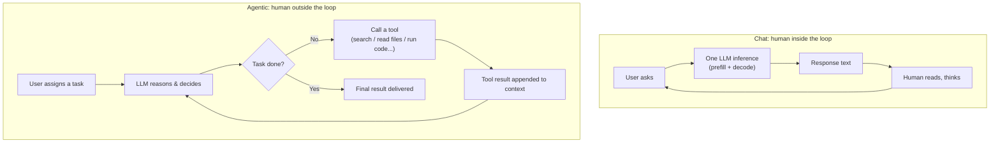
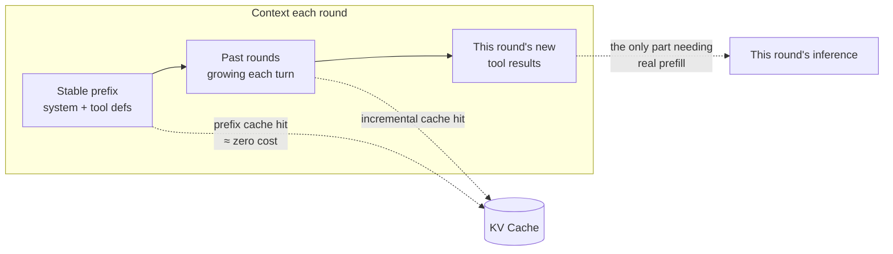

# Chat vs. Agentic: When the Human Leaves the Loop, Inference Economics Gets Rewritten

> The first two articles in this series dissected the physical layer — what happens in one inference request, and how the KV cache works. This one moves up to the usage-paradigm layer: same model, same prefill and decode, but switch from Chat-style usage to Agentic-style usage and the workload shape, cost structure, and latency bottlenecks all transform.
>
> Understand this shift and two things become obvious: why API providers race to cut cached-input prices, and why agent products suddenly took off after 2024.

---

## 1. The One-Sentence Difference

**Chat: the human is part of the loop.** The model stops after every output, waiting for the human to read and reply. Question, answer, question, answer.

**Agentic: the model runs the loop itself.** Given a task, it decides autonomously — call a tool, observe the result, decide again — looping dozens or hundreds of times, returning to the human only when the task is done.



The core difference is a single substitution: in Chat, the node closing the loop is **a human**; in Agentic, it's **the environment** (tool execution results). The human has been moved out of the inner loop and appears only at the task's entrance and exit.

The ChatGPT web app and customer-service bots typify the former; Claude Code, Deep Research, Computer Use, and automated workflows typify the latter.

---

## 2. Dimension-by-Dimension Comparison

| Dimension | Chat | Agentic |
|---|---|---|
| Unit of interaction | One turn (Q→A) | One task, containing dozens–hundreds of inferences |
| Who closes the loop | Human reads, then replies | Tool results fed back automatically, no human |
| Nature of output | Text for humans to read | Mostly **actions** (structured tool calls); prose only at the end |
| Context growth | Slow — at human typing speed | Fast and violent — tool outputs pile up to tens of thousands of tokens |
| Input:output token ratio | Roughly 1:1 to 5:1 | Commonly 20:1, even 100:1 — **input utterly dominates** |
| Latency metric | TTFT + per-token speed | End-to-end task time (dozens of serial inferences summed) |
| Cost of an error | Human corrects it on the spot | Errors **compound** step over step |
| What the model needs | Language quality, knowledge | Planning, tool use, long-horizon consistency, self-correction |

Three of these dimensions deserve a closer look.

### The output changes nature: from text to action

In Chat, the model's output is the endpoint — the human reads it and the exchange ends. In Agentic mode, most output tokens aren't for humans at all; they're structured tool calls:

```json
{"tool": "run_command", "input": {"cmd": "pytest tests/ -x"}}
```

The framework parses this JSON and actually executes it, and the result — tests passed, or a stack trace — is appended back into the context to inform the next decision. **The model's output stops being "content" and becomes a link in a causal chain**: it genuinely changes the state of the environment, and the environment changes what the model sees next.

### Context growth changes regime: from linear to explosive

Chat context grows at typing speed — tens to hundreds of tokens per turn. Every agentic iteration can append an entire file, a page of search results, or a few thousand lines of error logs. A moderately complex coding task running 50 iterations easily pushes past 100K tokens of context — and all of it must be **re-sent verbatim every single round**.

### The error model changes: from isolated to compounding

In Chat, a wrong answer gets corrected immediately by the human; errors don't propagate. In an agentic loop, a misunderstanding at step 3 means steps 4 through 20 all work diligently in the wrong direction. Errors don't add — they **multiply**. Hold that thought for the capability-threshold section.

---

## 3. Inference Economics Rewritten: Three Inversions

The conclusions of the first two articles — prefill is cheap, decode is expensive, cache hits are nearly free — don't break under agentic workloads. Their **weights get reordered**.

### Inversion 1: Prefix caching goes from optimization to lifeline

Every agentic iteration re-sends the full history: system prompt + tool definitions + task + all previous rounds. Without prefix caching, each iteration is a full prefill from scratch — by round 30, the time-to-first-token alone is unacceptable, and the cost is a catastrophe.

With cache hits, the picture flips: the stable prefix and past rounds are read straight out of the KV cache, and each round only needs an incremental prefill over the **newly appended tool results**.



API providers pricing cache-hit input at ~1/10th looks like a discount; it's actually the physical cost of agentic workloads — cached tokens aren't computed, just read back. **Without that pricing, agent products would not be economically viable at all.**

### Inversion 2: Cost center moves from output to input

In the Chat era, everyone watched the "output tokens cost 3–5× more" line and saved money by generating less. In the Agentic era, the bill is dominated by input: history is carried repeatedly, so cumulative input grows roughly quadratically with rounds (round *n* re-sends everything from rounds 1 through *n−1*).

The cost battleground becomes **context management**:

- **Compaction** — summarize completed intermediate work into a few sentences, replacing the raw trajectory;
- **Stable prefixes** — keep the system prompt, tool definitions, and large documents at the front, byte-for-byte identical, so the cache hits;
- **Slimming tool results** — truncate and summarize a few thousand lines of logs before they enter context; don't let one `cat` destroy the budget.

### Inversion 3: The latency bottleneck moves to serial round count

One task = dozens of **serial** prefill+decode cycles; the next round can't start until this round's tool result comes back. A 20% faster single inference is barely perceptible in Chat; across a 50-round agent task it's minutes of difference.

This re-ranks the value of several techniques: speculative decoding (attacking per-step latency) becomes far more valuable; routing simple steps to smaller models becomes standard architecture; and a model that can **issue multiple tool calls in parallel** feels a class faster than one that can't.

---

## 4. The Capability Threshold: Why Agents Didn't Take Off Until After 2024

Tool-calling APIs existed for years. Why did agent products only become genuinely usable recently? Because the agentic loop makes three hard demands that Chat never did:

1. **Reliable structured output** — one misplaced bracket in a tool call and the whole loop breaks;
2. **Long-horizon goal keeping** — not forgetting the original task or getting derailed by intermediate results across tens of thousands of tokens of trajectory;
3. **Failure recovery** — when a tool errors, try a different path instead of repeating the same broken action.

All three reduce to the same piece of arithmetic — **multi-step multiplication**:

| Per-step success rate | 20-step task success rate |
|---|---|
| 90% | 12% |
| 95% | 36% |
| 99% | 82% |
| 99.5% | 90% |

A model at 95% per step is more than good enough for Chat (the human backstops every turn) yet completes only a third of 20-step agent tasks. **The leap from Chat to Agentic wasn't the addition of a tool-calling API — it was per-step reliability crossing the threshold where the product of a long chain stays usable.** Small improvements near that line produce a phase transition in task success — "suddenly it works" — which is exactly why the agent explosion looked so abrupt.

---

## 5. Summary

- **Chat**: the model is a question-answering engine; the human drives the loop. Token economics center on output; the game is language quality and knowledge;
- **Agentic**: the model is a task-execution engine; environment feedback drives the loop. Output becomes action, input becomes the cost center; the game is planning, tool use, and long-horizon reliability;
- **For infrastructure**: prefix caching, context management, and serial-latency optimization go from nice-to-have to core competitive advantage;
- **For capability**: the tipping point wasn't a new API but per-step reliability crossing the multi-step multiplication threshold.

One sentence to close the series: **the physical layer never changed — it's still prefill, decode, and the KV cache; what changed is the workload. Chat is retail question-answering; Agentic is wholesale autonomous looping — and the winners of the wholesale era are whoever manages the cache and the context best.**
