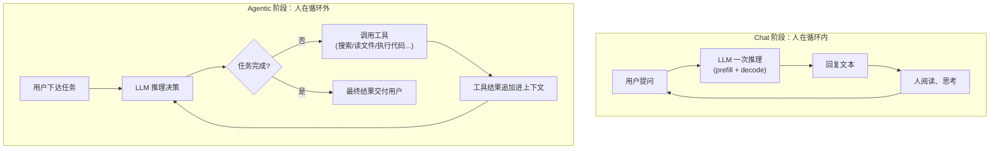
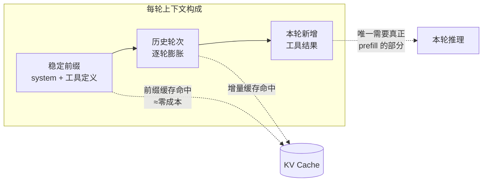

# Chat 阶段 vs Agentic 阶段：当人被移出循环，推理经济学被彻底改写

> 前两篇我们拆解了一次推理的完整过程和 KV Cache 的工作原理——那是"一次请求"视角的物理层。这一篇上升到使用范式层：同样的模型、同样的 prefill 和 decode，从 Chat 用法切换到 Agentic 用法后，负载形态、成本结构、延迟瓶颈全部变了样。
>
> 理解这个转变，你就能看懂两件事：为什么 API 厂商拼命降低缓存输入的价格，以及为什么 2024 年之后 Agent 产品突然爆发。

---

## 一、一句话区别

**Chat 阶段：人是循环的一部分。** 模型每输出一次就停下来，等人读、等人回，一问一答。

**Agentic 阶段：模型自己在循环里跑。** 接到任务后自主决策——调工具、看结果、再决策，循环几十上百轮，直到任务完成才回到人面前。



核心差别就一处：Chat 的循环节点是**人**，Agentic 的循环节点是**环境（工具执行结果）**。人被移出了内循环，只在任务的入口和出口出现。

ChatGPT 网页版、客服机器人是前者的典型；Claude Code、Deep Research、Computer Use、自动化 workflow 是后者的典型。

---

## 二、逐维度对比

| 维度 | Chat 阶段 | Agentic 阶段 |
|---|---|---|
| 交互单位 | 一问一答（turn） | 一个任务（task），内含几十上百次推理 |
| 循环里的角色 | 人读完再发下一条 | 工具结果自动喂回，无人介入 |
| 输出的本质 | 给人看的文本 | 多数是**动作**（结构化工具调用），最后才是给人看的文本 |
| 上下文增长 | 慢，按人打字的速度 | 快且猛，每轮追加工具输出，轻松堆到几万 token |
| 输入:输出 token 比 | 接近 1:1 到 5:1 | 常见 20:1 甚至 100:1，**输入占绝对大头** |
| 延迟指标 | TTFT + 逐字生成速度 | 端到端任务完成时间（几十次串行推理累加） |
| 错误的代价 | 答错一次，人当场纠正 | 错误逐步**复利放大** |
| 对模型的核心要求 | 语言质量、知识 | 规划、工具使用、长程一致性、自我纠错 |

下面挑最有分量的三个维度展开。

### 输出的本质变了：从"文本"到"动作"

Chat 模式下模型的输出是终点——人读完就结束了。Agentic 模式下，模型输出的大多数 token 根本不是给人看的，而是结构化的工具调用：

```json
{"tool": "run_command", "input": {"cmd": "pytest tests/ -x"}}
```

这段 JSON 会被框架解析、真正执行，执行结果（测试通过还是报错栈）再追加回上下文，成为模型下一轮决策的依据。**模型的输出从"内容"变成了"因果链上的一环"**——它会真实地改变环境状态，环境再反过来改变模型接下来看到的东西。

### 上下文增长模式变了：从线性到爆炸

Chat 的上下文按人打字的速度增长，一轮几十几百 token。Agentic 的每一轮都可能追加一整个文件、一页搜索结果、一段几千行的报错日志。一个中等复杂度的编码任务跑 50 轮，上下文轻松突破十万 token——而且这些内容每一轮都要**原样重发**给模型。

### 错误模式变了：从单点到复利

Chat 里答错一次，人当场就纠正了，错误不传播。Agentic 循环里，第 3 步理解偏了方向，第 4 到 20 步全在错误方向上勤奋工作。错误不是叠加，是**乘法**。这一点是理解"能力门槛"一节的钥匙。

---

## 三、推理经济学被改写：三个倒转

前两篇的结论——prefill 便宜、decode 贵、缓存命中近乎免费——在 Agentic 负载下不是失效了，而是**权重被重新排序**。

### 1. 前缀缓存从"优化项"变成"生死线"

Agentic 循环每一轮都要把全部历史（system prompt + 工具定义 + 任务 + 前面所有轮次）重新发给模型。没有 prefix caching，每轮都是一次全量 prefill：第 30 轮时仅首字延迟就不可接受，成本更是灾难。

命中缓存后完全不同：稳定前缀和历史轮次直接从 KV Cache 读出，每轮只需对**新追加的工具结果**做增量 prefill。



API 厂商把缓存命中的输入价格压到 1/10，表面看是让利，实际是 agentic 负载的物理成本就是这么低——命中的部分不用算，只是从缓存里读。**没有这个定价，agent 产品在经济上根本不成立。**

### 2. 成本结构倒转：从盯输出到管输入

Chat 时代大家盯着"输出 token 贵 3~5 倍"，省钱靠少生成。Agentic 时代账单大头是输入：历史被反复携带，输入量随轮数近似平方级累积（第 n 轮要重发前 n-1 轮的全部内容）。

省钱的主战场变成了**上下文管理**：

- **压缩历史（compaction）**：把跑完的中间过程摘要成几句话，替换原始轨迹；
- **稳定前缀**：system prompt、工具定义、大文档放开头且逐字节不变，保证缓存命中；
- **工具结果瘦身**：几千行日志先截取、摘要再入上下文，别让一次 `cat` 毁掉整个预算。

### 3. 延迟瓶颈转移：串行次数成为新大头

一次任务 = 几十次**串行**的 prefill + decode，上一轮的工具结果不出来，下一轮无法开始。单次推理快 20% 在 Chat 里感知不强，在 50 轮的 agent 任务里就是几分钟的差距。

这解释了几件事的价值排序为什么变了：投机解码（压单步延迟）身价倍增；"简单步骤路由给小模型"成为标配架构；能**并行发起多个工具调用**的模型比串行的模型在体感上快出一截。

---

## 四、能力门槛：为什么 Agentic 到 2024 年后才爆发

工具调用 API 早就有了，为什么 agent 产品直到近两年才真正可用？因为 Agentic 循环对模型有三个 Chat 时代不苛求的硬要求：

1. **可靠的结构化输出**：工具调用格式错一个括号，整个循环就断；
2. **长程目标保持**：几万 token 的轨迹里不忘记最初任务、不被中间结果带偏；
3. **失败恢复**：工具报错时换路径重试，而不是复读同一个错误动作。

这三项本质上都是同一个数学问题——**多步乘法**：

| 单步成功率 | 20 步任务成功率 |
|---|---|
| 90% | 12% |
| 95% | 36% |
| 99% | 82% |
| 99.5% | 90% |

单步 95% 的模型做 Chat 绰绰有余（人随时兜底），做 20 步的 agent 任务却只有三分之一的完成率。**Chat 到 Agentic 的跨越，不是加了个工具调用 API，而是单步可靠性跨过了让长链路乘积仍然可用的阈值。** 模型能力在及格线附近的微小提升，会在任务成功率上呈现出"突然能用了"的相变——这就是 agent 爆发看起来很突然的原因。

---

## 五、总结

- **Chat 阶段**：模型是问答引擎，人驱动循环。token 经济以输出为主，比拼语言质量和知识；
- **Agentic 阶段**：模型是任务执行引擎，环境反馈驱动循环。输出变成动作，输入成为成本大头，比拼规划、工具使用和长程可靠性；
- **对基础设施**：prefix caching、上下文管理、串行延迟优化，从锦上添花变成核心竞争力；
- **对能力**：范式切换的引爆点不是新 API，而是单步可靠性跨过多步乘法的可用阈值。

一句话收束整个系列：**物理层没变——还是那套 prefill、decode 和 KV Cache；变的是负载形态。Chat 是零售式的一问一答，Agentic 是批发式的自主循环，而批发时代的赢家，是把缓存和上下文管得最好的那一个。**
