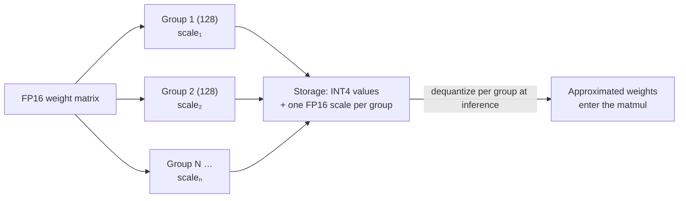

# FP16 and INT4 Quantization: How to Shrink a Model 4× and Still Have It Work

> "8B model = 16 GB" — an equation this series has used repeatedly. But where does the 16 GB come from? Why is the model ollama downloads only 4.5 GB and still runs fine? And why does quantization not just save memory but also make generation nearly 4× faster?
>
> This article takes apart how parameters are *stored*: what FP16 (16-bit floating point) is, how INT4 (4-bit integer) quantization works, why cutting precision to a quarter barely makes the model dumber — and how quantization rewrote the threshold of who can run what.

---

## 1. Foundation: Parameters Are Just Floats, and Storage Format Decides Everything

Every model parameter is a number (say 0.0234 or −1.7052). **How many bits store that one number** directly determines file size, memory footprint, and inference speed:

| Format | Bytes per parameter | 8B model | 70B model |
|---|---|---|---|
| FP32 | 4 | 32 GB | 280 GB |
| **FP16 / BF16** | 2 | 16 GB | 140 GB |
| INT8 | 1 | ~8.5 GB | ~72 GB |
| **INT4** | 0.5 | ~4.5 GB | ~40 GB |

(INT8/INT4 actual sizes run slightly above the raw parameter bytes because scale factors must be stored too — explained below.)

## 2. FP16: The Model's "Factory Precision"

### How floats are encoded in bits

A floating-point number is binary scientific notation: **sign × mantissa × 2^exponent**. Exponent bits determine **how large/small a value can be represented (dynamic range)**; mantissa bits determine **how finely (precision)**:

| Format | Total bits | Sign | Exponent | Mantissa | Character |
|---|---|---|---|---|---|
| FP32 (single precision) | 32 | 1 | 8 | 23 | Scientific-computing standard: big range, high precision |
| **FP16 (half precision)** | 16 | 1 | 5 | 10 | Half the size; max value ±65,504 — **overflows easily** |
| **BF16 (brain float)** | 16 | 1 | 8 | 7 | Same exponent bits as FP32 → same range, trades precision for stability |

### Why LLMs default to 16 bits, not 32

Practice showed that neural networks are **insensitive to parameter fineness** — jiggle the 11th decimal place and behavior barely changes. So the whole industry halved FP32:

- **Training**: BF16 is the mainstream. Gradient magnitudes swing wildly during training; FP16's ±65,504 ceiling overflows constantly (producing inf/NaN and crashing the run), while BF16's FP32-sized exponent buys stability — at the cost of a 7-bit mantissa the model doesn't care about;
- **Release/inference**: weight files ship in FP16 or BF16 by default — hence "8B = 16 GB" (8B × 2 bytes), the baseline for every memory calculation in this series.

**Note: FP16/BF16 is not quantization — it's still floating point, just with fewer bits: the model's factory precision. Quantization is the next jump: from floats to integers.**

## 3. INT4 Quantization: Mapping Floats onto 16 Buckets

### The core idea: range mapping

INT4 has 4 bits — only **16 distinct values** (integers −8 to 7). Quantization **linearly maps** a group of float weights onto those 16 buckets:

```
Quantize:    q = round( w / scale )     # float → integer (this is what's stored)
Dequantize:  w' = q × scale             # integer → approximate float (this is what computes)
```

`scale` = the group's largest absolute value ÷ 7, so the biggest weight lands exactly on the edge bucket.

A concrete example — weights `[0.0234, −1.7052, 0.8801, …]`, max absolute value 1.7052 → scale ≈ 0.2436:

| Original FP16 | ÷ scale, rounded (stored as INT4) | Dequantized | Error |
|---|---|---|---|
| 0.0234 | 0 | 0.0000 | 0.0234 |
| −1.7052 | −7 | −1.7052 | ~0 |
| 0.8801 | 4 | 0.9744 | 0.0943 |

Sixteen buckets obviously can't hold the continuous world of floats — **quantization is lossy compression**: every weight snaps to its nearest bucket.

### Grouping: what makes 16 buckets enough

If a whole matrix shared one scale, a single outlier would stretch it, squeezing every small weight toward zero and exploding the error. The real scheme: **every 32–128 weights form a group with its own scale**:



Those extra scales are why an INT4 8B model is ~4.5 GB rather than exactly 4 GB. Also, the embedding and output layers are most precision-sensitive, so mainstream schemes keep them at higher precision — a quantized model is really **mixed-precision**.

### Why a quarter of the precision still works

Three reasons stack up:

1. **Parameters are inherently redundant**: billions of parameters encode statistical regularities; one parameter's small error averages out across the mass;
2. **Weight distributions are friendly**: trained weights cluster in a narrow band around zero, so within a group, 16 buckets of resolution mostly suffice;
3. **Smart algorithms**: this isn't naive rounding — **GPTQ** (Generative Pre-trained Transformer Quantization) quantizes column by column and compensates each column's error into the next; **AWQ** (Activation-aware Weight Quantization) first identifies the ~1% of weights that matter most to the output and protects them; ollama's **GGUF k-quants** (e.g. `q4_K_M`) mix different bit-widths across layers. All are **PTQ** (Post-Training Quantization): calibrate scales with a few hundred samples, done in hours, no retraining.

The cost is real but small: INT4 typically raises perplexity slightly — occasional broken long reasoning chains, more misses on fringe knowledge. Rules of thumb: **bigger models tolerate quantization better** (70B-INT4 is nearly imperceptible; 1B-INT4 is visibly dumber); INT8 is essentially lossless; INT4 is the sweet spot; below that (2–3 bit) quality collapses fast.

## 4. What Quantization Buys: Memory and Speed, Both

**Memory — rewriting who can run what**: 70B drops from 140 GB (2×A100) to ~40 GB (single card); 8B from 16 GB to ~4.5 GB (MacBook or phone). Every rung of the accessibility ladder from the parameter-scale article moves down one level — **quantization is the number-one reason open models spread to personal devices.**

**Speed — faster while smaller**: as the inference series showed, decode is memory-bandwidth-bound — every token moves the entire weight set once. **Shrink the weights to 1/4 and the transfer time drops to ~1/4**, so tokens/sec roughly quadruples (the dequantize-on-the-fly cost is far smaller than the transfer savings). This is why quantization is unusually profitable on LLMs: for most other workloads, compression saves space but not time.

The same idea applies to the KV cache (INT8/INT4 KV cache) — see [KV Cache Explained](kv-cache.en.md) for that memory math.

## 5. Practical Cheat Sheet

| Situation | Recommendation |
|---|---|
| Choosing ollama tags `q4_K_M` vs `q8_0` | q4_K_M = 4-bit mixed quant (the default sweet spot); q8_0 = 8-bit, near-lossless |
| Tight on memory | Try INT4 first; step up to q5/q6 or INT8 if quality disappoints |
| Small models (≤3B) | Stay at INT8 or above — small models lack the redundancy to survive 4-bit |
| Fine-tuning a big model on a consumer GPU | QLoRA (Quantized Low-Rank Adaptation): freeze the base in INT4 (NF4 format), train only FP16 LoRA deltas — the standard way to fine-tune 70B on one card |

**One sentence to remember: FP16 is the model's factory precision (floating point, 2 bytes per parameter); INT4 quantization is lossy compression that maps each group of ~128 weights onto 16 integer buckets (0.5 bytes per parameter plus a few scales) — trading a nearly imperceptible precision loss for 1/4 the memory, ~4× decode speed, and the very existence of "LLMs on a laptop."**
