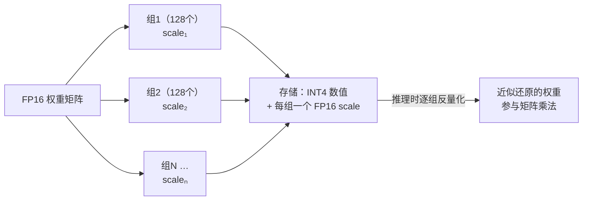

# FP16 与 INT4 量化：把模型压缩 4 倍还能用，靠的是什么

> 「8B 模型 = 16 GB」这笔账我们在前几篇里反复用到——但 16 GB 是怎么算出来的？为什么 ollama 下载的模型只有 4.5 GB 还照样能跑？为什么量化不仅省显存，还让生成速度快了近 4 倍？
>
> 这一篇把参数的「存法」讲透：FP16 是什么、INT4 量化怎么做、为什么砍到 1/4 精度模型几乎不变笨，以及量化如何改写了「谁能跑什么模型」的门槛。

## 缩写对照表

| 缩写 | 英文全称 | 中文 |
|---|---|---|
| FP32 / FP16 | 32-bit / 16-bit Floating Point | 单精度 / 半精度浮点数 |
| BF16 | Brain Floating Point 16 | 脑浮点（Google 设计的 16 位格式） |
| INT8 / INT4 | 8-bit / 4-bit Integer | 8 位 / 4 位整数 |
| PTQ | Post-Training Quantization | 训练后量化 |
| GPTQ | Generative Pre-trained Transformer Quantization | 一种误差补偿式量化算法 |
| AWQ | Activation-aware Weight Quantization | 激活感知权重量化 |
| GGUF | GGML Universal Format | llama.cpp/ollama 使用的模型文件格式 |
| QLoRA | Quantized Low-Rank Adaptation | 量化基座上的低秩微调 |
| OOM | Out Of Memory | 显存溢出 |

---

## 一、前置：参数就是一堆浮点数，存法决定一切

模型的每个参数就是一个数（比如 0.0234、-1.7052）。**用几个比特存这一个数**，直接决定模型文件大小、显存占用和推理速度：

| 格式 | 每参数占用 | 8B 模型体积 | 70B 模型体积 |
|---|---|---|---|
| FP32 | 4 字节 | 32 GB | 280 GB |
| **FP16 / BF16** | 2 字节 | 16 GB | 140 GB |
| INT8 | 1 字节 | ~8.5 GB | ~72 GB |
| **INT4** | 0.5 字节 | ~4.5 GB | ~40 GB |

（INT8/INT4 实际体积略大于纯参数字节数，因为要额外存缩放系数——原因见下文。）

## 二、FP16：模型的「出厂原始精度」

### 浮点数怎么用比特表示

浮点数 = 科学计数法的二进制版：**符号 × 尾数 × 2^指数**。指数位数决定**能表示多大/多小（动态范围）**，尾数位数决定**表示得多精细（精度）**：

| 格式 | 总位数 | 符号 | 指数 | 尾数 | 特点 |
|---|---|---|---|---|---|
| FP32 | 32 | 1 | 8 | 23 | 科学计算标准，范围大精度高 |
| **FP16** | 16 | 1 | 5 | 10 | 体积减半；最大只能表示 ±65504，**容易溢出** |
| **BF16** | 16 | 1 | 8 | 7 | 指数位与 FP32 相同 → 范围同 FP32，牺牲精度换稳定 |

### 为什么大模型默认 16 位而不是 32 位

实践发现：神经网络对参数的**精细度不敏感**——第 11 位小数抖一抖，模型行为几乎不变。于是全行业把 FP32 砍半：

- **训练**：主流用 BF16。训练时梯度数值范围波动极大，FP16 的 ±65504 上限动不动就溢出（变成 inf/NaN，训练崩溃），BF16 用 FP32 同款的 8 位指数换来稳定——代价是尾数只剩 7 位，而这个代价模型不在乎；
- **发布/推理**：权重文件默认 FP16 或 BF16——这就是「8B = 16 GB」（8B × 2 字节）的来历，前几篇所有显存账的基准线。

**注意：FP16/BF16 不叫量化——它仍是浮点数，只是位数少的浮点数，是模型的「出厂原始精度」。量化是下一步：从浮点跳到整数。**

## 三、INT4 量化：把浮点数映射到 16 个格子

### 核心思想：值域映射

INT4 只有 4 个比特，只能表示 **16 个不同的值**（如整数 -8 到 7）。量化就是把一组浮点权重**线性映射**到这 16 个格子上：

```
量化：   q = round( w / scale )     # 浮点 → 整数（存这个）
反量化： w' = q × scale             # 整数 → 近似浮点（计算时用这个）
```

`scale`（缩放系数）= 这组权重的最大绝对值 ÷ 7，让最大的权重恰好落在格子边缘。

具体例子：某组权重 `[0.0234, -1.7052, 0.8801, …]`，最大绝对值 1.7052 → scale ≈ 0.2436：

| 原始 FP16 | ÷ scale 后取整（存 INT4） | 反量化还原 | 误差 |
|---|---|---|---|
| 0.0234 | 0 | 0.0000 | 0.0234 |
| -1.7052 | -7 | -1.7052 | ~0 |
| 0.8801 | 4 | 0.9744 | 0.0943 |

16 个格子当然装不下连续的浮点世界——**量化本质是一次有损压缩**，每个权重都被「吸附」到最近的格子上。

### 分组：让 16 个格子够用的关键

如果整个矩阵共用一个 scale，一个离群大值就会把 scale 撑大，其他小权重全被挤到 0 附近，误差爆炸。实际做法是**每 32~128 个权重一组，各自配一个 scale**：



这些额外的 scale 就是「INT4 的 8B 模型 ≈ 4.5 GB 而不是恰好 4 GB」的原因。另外，词嵌入层和输出层对精度最敏感，主流方案会把它们保留在更高精度——所以量化模型实际是**混合精度**的。

### 为什么砍到 1/4 精度还能用

三个原因叠加：

1. **参数天生冗余**：几十亿个参数存的是统计规律，单个参数的小误差会被海量参数平均掉；
2. **权重分布友好**：训练好的权重大多集中在 0 附近的窄区间，分组后 16 格的分辨率基本够用；
3. **聪明的量化算法**：不是傻乎乎四舍五入——**GPTQ** 逐列量化并把误差补偿到后续列；**AWQ** 先找出对输出影响最大的 ~1% 「重要权重」重点保护；ollama 用的 **GGUF k-quants**（如 `q4_K_M`）对不同层混搭不同位宽。这些都属于 **PTQ（训练后量化）**：拿几百条校准数据调 scale，几小时搞定，不用重新训练。

代价仍然存在：INT4 通常带来轻微的困惑度上升，表现为长推理链偶尔断裂、边缘知识更易出错。经验规律：**模型越大越抗量化**（70B-INT4 几乎无感，1B-INT4 明显变笨）；INT8 基本无损，INT4 是性价比甜点，再往下（2~3 bit）质量快速崩塌。

## 四、量化换来什么：显存与速度的双赢

**显存——改写「谁能跑什么」的门槛**：70B 从 140 GB（需 2×A100）压到 ~40 GB（单卡可跑）；8B 从 16 GB 压到 ~4.5 GB（MacBook/手机可跑）。参数规模篇讲过的「可及性阶梯」，每一级都被量化往下拉了一档——**开源模型能在个人设备上普及，量化是头号功臣**。

**速度——省显存的同时还提速**：推理系列讲过，decode 是内存带宽受限的——每个 token 都要把全部权重搬运一遍。**权重体积减到 1/4，搬运时间就减到约 1/4**，token/s 近似翻 4 倍（计算时反量化的开销远小于搬运的节省）。这是量化在 LLM 上格外划算的根本原因：换别的负载，压缩往往只省空间不提速。

同样的思路也用在 KV Cache 上（INT8/INT4 KV Cache），显存账见 [KV Cache 篇](kv-cache.zh.md)。

## 五、实用速查

| 场景 | 建议 |
|---|---|
| ollama 标签 `q4_K_M` / `q8_0` 怎么选 | q4_K_M = 4bit 混合量化（默认甜点）；q8_0 = 8bit 近无损 |
| 显存紧张 | 先试 INT4；质量不满意升 q5/q6 或 INT8 |
| 小模型（≤3B） | 尽量 INT8 以上——小模型冗余少，经不起 4bit 折腾 |
| 想微调大模型但只有消费级显卡 | QLoRA：基座冻结在 INT4（NF4 格式），只训 FP16 的 LoRA 增量——单卡微调 70B 的标准姿势 |

**一句话总结：FP16 是模型的出厂原始精度（浮点、2 字节/参数）；INT4 量化是把每 128 个权重一组线性映射到 16 个整数格子的有损压缩（0.5 字节/参数 + 少量 scale）——用几乎无感的精度损失，换来显存 1/4、decode 速度 ~4 倍，以及「笔记本跑大模型」这件事本身。**
