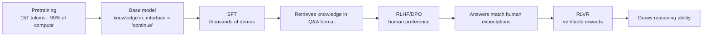

# Completing Text ≠ Being Helpful: Why Post-Training Is the Other Half of an LLM's Soul

> A counterintuitive fact: pretraining — the stage that burns 99% of the compute and 15 trillion tokens — produces a model you cannot actually use. Ask it "What is the capital of France?" and it may reply "What is the capital of Germany? (2 points)".
>
> What turns that "savant who read the whole internet" into the ChatGPT or Claude you know is **post-training**, which costs a rounding error of the compute. This article explains why completing text isn't the same as helping, what SFT (Supervised Fine-Tuning), RLHF (Reinforcement Learning from Human Feedback) / DPO (Direct Preference Optimization), and RLVR (Reinforcement Learning with Verifiable Rewards) each solve — and why pretraining sets a model's ceiling while post-training decides how much of that ceiling you can actually touch.

---

## 1. Why Completing Text Isn't Helping

Pretraining has exactly one objective: predict the next token. The resulting **base model** has no notion of "question" and "answer" in its worldview — only "text" and "its most likely continuation."

Feed a base model:

> What is the capital of France?

It will quite likely continue:

> What is the capital of Germany? What is the capital of Italy? (2 points each)

Not because it doesn't know Paris. In the trillions of tokens it has seen, sentences like "What is the capital of France?" **appear most often in exams and question lists**, where they're followed by more questions, not answers. The model is faithfully doing what it was trained to do: predicting the statistically most likely next text.

**The knowledge is all in the weights — but the interface for retrieving it is wrong.** That's "completing ≠ helping," and everything post-training does is fix this interface.

## 2. SFT: Teaching the Assistant's Format

Supervised Fine-Tuning continues training on tens of thousands to millions of human-written demonstrations:

```
Instruction: What is the capital of France?
Ideal answer: The capital of France is Paris.
```

The training objective is identical to pretraining (still next-token prediction); only the data changes. The model learns a new statistical regularity — **"in this dialogue format, a question is followed by its answer."** From then on, the most likely continuation of "What is the capital of France?" becomes "Paris."

Two key insights:

- **No new knowledge is learned** (Paris was already in the weights). What's learned is a **behavior pattern**: answer when asked, use a conversational register, organize output in the requested format;
- **Format doesn't need massive data.** LIMA ("Less Is More for Alignment," Meta 2023) showed that 1,000 carefully written demonstrations can turn a base model into a passable assistant — because SFT merely activates a retrieval mode for existing capabilities. Quality beats quantity.

But SFT has a structural ceiling: it only learns from "correct demonstrations" and **never sees its own mistakes**. Getting annotators to write perfect answers is slow and expensive; worse, if a demonstration contains knowledge the model's weights don't hold, you're teaching it to *act as if it knows when it doesn't* — mishandled SFT systematically encourages hallucination. These two gaps hand the baton to preference optimization.

## 3. RLHF/DPO: From "Answers" to "Answers Well"

After SFT the model answers, but any question has countless grammatically correct answers: verbose ones, lazy ones, confidently fabricated ones. Which is better? **That can't be written as rules — it must be learned from human preference.** And here lies a crucial economic asymmetry: **writing a perfect answer is hard; judging which of two answers is better is easy.** Judges are ten times cheaper than players, which is what makes preference data scalable.

- **RLHF**: the model generates several answers per prompt → humans rank them → the rankings train a Reward Model (RM) that scores on humans' behalf → reinforcement learning pushes the model toward higher scores. The learning signal comes from **the model's own outputs** — good behaviors get reinforced, bad ones suppressed — which is fundamentally stronger than SFT's imitation of someone else's demonstrations. The cost: four models (policy, reference, reward, value) live in GPU memory simultaneously; expensive and unstable;
- **DPO**: the 2023 simplification — a mathematical proof that the reward model can be skipped and preference written directly into the loss function: *relative to the reference model, raise the probability of the good answer more than the bad one.* Four models become two, the RL loop becomes ordinary gradient descent, and suddenly everyone in the open-source community can afford it. Llama-3's published recipe is exactly SFT → rejection sampling → DPO, iterated.

What this stage injects is **value orientation** — helpful, honest, harmless. Still not knowledge; disposition.

## 4. RLVR: Post-Training's Newest Leap — Reasoning Is Trained, Too

RLHF/DPO's judge is human preference, which has two fatal weaknesses: it can be flattered (the model learns to tell you what you want to hear), and it **cannot judge correctness beyond the annotator's ability**. RLVR replaces the judge with a programmatic verifier: math answers are checked directly, code runs against unit tests — **the reward is objective correctness and cannot be sweet-talked.**

Under this training (the DeepSeek-R1 / o1 generation), models spontaneously grow long-chain thinking: working through the problem before answering, self-checking, backtracking on errors. **Nobody demonstrated these behaviors** — they emerge purely because "thinking longer raises the success rate → gets reinforced." Post-training's role has expanded from *shaping behavior* to *forging capability*: half of a reasoning model's edge is built in post-training.

## 5. Why "Shaping" Is Exactly the Right Word



The classic analogy: pretraining produces a **savant who read the entire internet but has no social graces** — it knows everything, yet when you ask a question it just keeps reciting from wherever your sentence left off. SFT teaches it "when someone asks, answer"; RLHF teaches it "what kind of answer satisfies people"; RLVR sends it to math-olympiad boot camp. **The savant's knowledge never changed — what changed is how it deals with people and problems.** Hence *shaping/alignment*, not *re-education*.

The data-scale comparison proves the point: pretraining consumes ~15T tokens; SFT uses a few million examples, preference data even less. Post-training adjusts the weights' "surface posture," not the body of knowledge. That's also why one base model (say Llama-3-8B-base) spawns dozens of community variants with wildly different personalities — customer-service, role-play, coding — **the same savant, different finishing schools.**

## 6. Why Post-Training Matters: Three Decisive Effects

**1. It decides usability.** Without post-training, a trillion-token asset is a pile of weights with no interface. What set the world on fire wasn't GPT-3's pretraining (available since 2020) but RLHF making it *usable* (ChatGPT, 2022) — the two years in between are exactly the value of post-training.

**2. It decides the gap between same-tier models.** Pretraining recipes among top labs have largely converged; **post-training is now the main battleground of differentiation.** Two models both give "correct" answers, but one explains rigorously, covers edge cases, declines gracefully — the other is thin and perfunctory. The difference is rounds and quality of preference optimization. A large slice of the premium you pay for frontier models buys post-training depth.

**3. It can also ruin a model.** Post-training is double-edged: a reward model with length bias makes the model ever more verbose; annotators who favor agreeable answers teach it sycophancy (echoing your mistakes back at you); overdone alignment produces excessive refusals and monotonously uniform answers (the alignment tax). **The craft of post-training sets the experience ceiling on the way up and the reputation floor on the way down** — when a community complains a model "got dumber" or "got wordy," a changed post-training recipe is usually the culprit.

## See It Yourself in One Minute

ollama ships both versions:

```bash
ollama run llama3.1:8b-text    # base: only continues text
ollama run llama3.1:8b         # instruct: post-trained
```

Give both the same "What is the capital of France?" — the base model will likely continue with exam-style text; the instruct model answers "Paris." Same parameter count, same pretrained knowledge, **nothing in between but post-training.**

**One sentence to remember: pretraining compresses knowledge into the weights and sets the model's ceiling; post-training repairs the interface for retrieving it and decides how much of that ceiling you actually reach — completing text is erudition, helping is what makes an assistant.**
