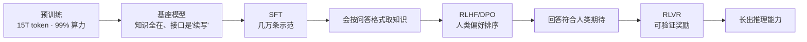

# 会续写 ≠ 会帮忙：后训练为什么是大模型的"另一半灵魂"

> 一个反直觉的事实：花掉 99% 算力、吃掉 15 万亿 token 的预训练，产出的模型你根本没法用——问它"法国的首都是哪？"，它可能回你"德国的首都是哪？（本题 2 分）"。
>
> 把这个"读完整个互联网的怪才"变成你熟悉的 ChatGPT、Claude，靠的是只占算力零头的**后训练**。这一篇讲清楚：为什么会续写不等于会帮忙，SFT、RLHF/DPO、RLVR 各自解决什么，以及为什么说预训练决定模型的上限、后训练决定你能摸到多少。

## 缩写对照表

| 缩写 | 英文全称 | 中文 |
|---|---|---|
| SFT | Supervised Fine-Tuning | 监督微调 |
| RLHF | Reinforcement Learning from Human Feedback | 基于人类反馈的强化学习 |
| DPO | Direct Preference Optimization | 直接偏好优化 |
| RLVR | Reinforcement Learning with Verifiable Rewards | 可验证奖励强化学习 |
| RM | Reward Model | 奖励模型 |
| RL | Reinforcement Learning | 强化学习 |

---

## 一、为什么"会续写"不等于"会帮忙"

预训练的唯一目标是"预测下一个 token"。训完的**基座模型（base model）**的世界观里没有"问题"和"回答"，只有"文本"和"它最可能的延续"。

给基座模型输入：

> 法国的首都是哪？

它很可能续写成：

> 德国的首都是哪？意大利的首都是哪？（本题 2 分）

——不是它不知道巴黎。而是在它见过的万亿级语料里，"法国的首都是哪？"这种句子**最常出现在试卷和问题列表里**，后面跟着的往往是更多问题，而不是答案。它在忠实地做被训练的事：预测统计上最可能的下一段文本。

**知识已经全在权重里了，但取出来的"接口"是错的。** 这就是"会续写 ≠ 会帮忙"——后训练全部工作，就是修这个接口。

## 二、SFT：教会"助手的格式"

监督微调（SFT）用几万~百万条人写的高质量示范继续训练：

```
指令：法国的首都是哪？
理想回答：法国的首都是巴黎。
```

训练目标和预训练一模一样（还是预测下一个 token），变的只是数据。模型由此学会一个新的统计规律——**"在这种对话格式里，问题后面跟的是答案"**。从此"法国的首都是哪？"的最可能续写变成了"巴黎"。

两个关键认知：

- **它没学新知识**（巴黎早就在权重里），学的是**行为模式**：看到问题就回答、用对话口吻、按用户要的格式组织输出；
- **格式不需要海量样本**。LIMA（"Less Is More for Alignment"，Meta 2023 论文）证明 1000 条精心编写的示范就能把基座调成像样的助手——因为 SFT 只是激活已有能力的取用方式，质量远比数量重要。

但 SFT 有个结构性天花板：它只学"正确示范"，**从没见过自己的错误**。让标注员写出完美回答又贵又难，而且如果示范里含有模型权重里没有的知识，等于教它"不知道时也要装作知道"——处理不当会系统性地鼓励幻觉。这两个短板，把接力棒交给了偏好优化。

## 三、RLHF/DPO：从"会回答"到"回答得好"

SFT 之后模型会回答了，但同一个问题有无数个语法正确的回答：有的啰嗦、有的敷衍、有的自信地胡编。哪个更好？**这写不成规则，只能学人类的偏好**——而这里藏着一个关键的经济学不对称：**让人写出完美回答很难，让人判断两个回答哪个好很容易**。裁判比选手便宜十倍，偏好数据因此可以规模化。

- **RLHF**：模型对同一问题生成多个回答 → 人类排序 → 用排序训一个奖励模型（RM）替人类打分 → 强化学习让模型往高分方向调整。学习信号来自**模型自己的输出**，好行为被强化、坏行为被抑制——这是它比"机械模仿示范"的 SFT 根本性强的地方。代价是训练时策略/参考/奖励/价值四个模型同时在显存里，昂贵且不稳定；
- **DPO**：2023 年的重要简化——数学上证明奖励模型可以省掉，偏好直接写进损失函数："相对参考模型，把好回答的概率抬得比差回答更高"。四个模型变两个，RL 循环变成普通梯度下降，开源社区从此人人训得起。Llama-3 的公开配方就是 SFT → 拒绝采样 → DPO 多轮迭代。

这一步注入的是"有帮助、诚实、无害"这类**价值取向**——依然不是知识，是倾向。

## 四、RLVR：后训练的最新一跳——推理能力也是"练"出来的

RLHF/DPO 的裁判是人类偏好，但偏好有两个死穴：会被讨好（模型学会说你爱听的），且**判断不了超出标注员能力的对错**。RLVR 把裁判换成程序化验证器：数学题直接比对答案，代码题跑单元测试——**奖励是客观对错，无法被讨好**。

在这种训练下（DeepSeek-R1、o1 一代），模型自发长出长链思考：先演算再作答、自我检查、发现错误折返。**没人示范过这些行为**——纯粹因为"想得久答对率更高 → 被奖励强化"而涌现。这意味着后训练的角色已经从"整形行为"扩展到了"锻造能力"：推理模型的核心竞争力，一半是在后训练阶段练出来的。

## 五、"整形"这个词为什么准确



一个常用类比：预训练造出一个**读完了整个互联网但不通人情世故的天才**——它什么都知道，但你问它问题它只会接着你的话头往下背书。SFT 教它"别人提问时要作答"，RLHF 教它"怎样的回答让人满意"，RLVR 送它进了奥数集训队。**天才的知识一点没变，变的是它与人打交道和解决问题的方式**——所以叫"整形/对齐"（shaping/alignment），而不是"再教育"。

数据量对比印证了这一点：预训练 ~15T token，SFT 不过几百万条、偏好数据更少——后训练动的是权重的"表层姿态"，不是知识本体。这也是为什么同一个基座（如 Llama-3-8B-base）能被社区训出几十种性格迥异的变体：客服版、角色扮演版、代码版——**同一个天才，不同的礼仪学校**。

## 六、为什么后训练如此重要：三个"决定性"

**1. 决定可用性**：没有后训练，万亿资产是一堆没有接口的权重。ChatGPT 引爆世界靠的不是 GPT-3 的预训练（2020 年就有了），而是 RLHF 把它变得**能用**（2022 年）——中间隔着的两年，就是后训练的价值。

**2. 决定同级模型的差距**：预训练配方在头部玩家之间已高度趋同，**后训练成了主要的差异化战场**。两个模型答案都"对"，但一个解释严谨、边界周全、拒答得体，另一个单薄敷衍——差的就是偏好优化的轮数和数据质量。你付给 frontier（前沿）模型的溢价，很大一块买的是后训练深度。

**3. 也能毁掉一个模型**：后训练是双刃剑——奖励模型有长度偏置，模型就越来越啰嗦；标注员偏爱顺从的回答，模型就学会谄媚（sycophancy，附和你的错误说法）；对齐强度过头，模型过度拒答、回答千篇一律（对齐税）。**后训练的手艺，正面决定体验上限，负面决定模型口碑**——社区抱怨某模型"变笨了""太啰嗦了"，多半是后训练配方变动的痕迹。

## 一分钟亲眼验证

ollama 同时提供两种版本：

```bash
ollama run llama3.1:8b-text    # base：只会续写
ollama run llama3.1:8b         # instruct：经过后训练
```

对两者输入同一句"法国的首都是哪？"——base 大概率续写出一串考卷式文本，instruct 直接回答巴黎。同一份权重规模、同一批预训练知识，**中间只隔着后训练**。

**一句话总结：预训练把知识压进权重、决定模型的上限；后训练修好取用知识的接口、决定你实际能摸到上限的多少——会续写只是有学问，会帮忙才是好助手。**
