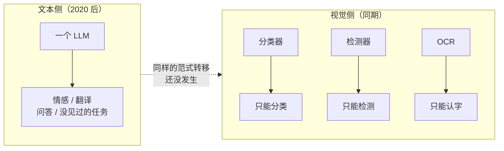
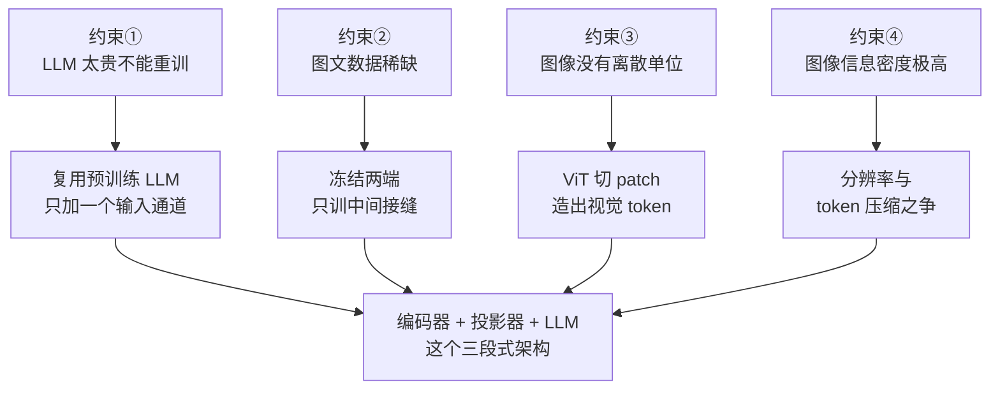

# 为什么需要多模态：纯文本 LLM 撞上的四堵墙

> 2023 年，你想做一个"上传发票截图，自动提取金额和抬头"的功能。当时的标准做法是：先跑一个 OCR（Optical Character Recognition，光学字符识别）引擎把图变成文字，再把文字丢给 LLM 抽字段。
>
> 这个方案在演示里很好，上线就崩。表格的列对不齐、手写的章盖住了数字、OCR 把"8"读成"B"、金额和币种在版面上明明相邻却在文本流里被拆到几百字之外。**你调了三个月，调的全是 OCR 的错误，而不是模型的理解。**
>
> 这一篇讲清楚：纯文本 LLM 到底撞上了哪四堵墙、CLIP 这个"只差一步"的前辈卡在哪、以及为什么最终的解法必然是"给 LLM 装一只眼睛"，而不是"把图翻译成文字再喂给它"。

---

## 缩写对照表

| 缩写 | 英文全称 | 中文 |
|---|---|---|
| LLM | Large Language Model | 大语言模型 |
| MLLM | Multimodal Large Language Model | 多模态大语言模型 |
| OCR | Optical Character Recognition | 光学字符识别 |
| CV | Computer Vision | 计算机视觉 |
| CLIP | Contrastive Language-Image Pre-training | 对比式语言-图像预训练 |
| ViT | Vision Transformer | 视觉 Transformer |
| NLP | Natural Language Processing | 自然语言处理 |
| GUI | Graphical User Interface | 图形用户界面 |
| VQA | Visual Question Answering | 视觉问答 |

---

## 一、第一堵墙：世界的信息大部分不是文本

一个容易被忽略的事实：**人类工作中真正流通的信息载体，纯文本只占很小一部分。**

| 场景 | 实际载体 | 纯文本 LLM 能直接处理吗 |
|---|---|---|
| 看一份财报 | PDF，含表格、图表、版面 | ❌ |
| 排查线上故障 | 监控面板截图、火焰图 | ❌ |
| review 一个设计稿 | Figma 截图、UI 原型 | ❌ |
| 医生看片子 | X 光、CT 影像 | ❌ |
| 用户报 bug | 手机截图、录屏 | ❌ |
| 读一篇论文 | 公式、架构图、实验曲线 | ❌ |

把 LLM 限制在纯文本上，等于把它关在一个只有文字的房间里，让它靠别人的转述来理解世界。**而转述本身就是信息损失最大的一环**——这正是第三堵墙。

## 二、第二堵墙：感知任务的碎片化，和 2018 年的 NLP 一模一样

[LLM 全景指南 01](../llm-fundamentals/01-why.zh.md) 讲过 2018 年以前 NLP 的困境：一个任务一个模型、标注昂贵、零泛化。

**计算机视觉领域在同一时期是完全一样的处境**，而且它的碎片化更严重：

| 你想做的事 | 需要的专用模型 | 它的封闭性 |
|---|---|---|
| 判断图里是猫还是狗 | 图像分类器（ResNet 等） | 只认训练时定义的 N 个类别 |
| 框出图里的所有人 | 目标检测器（YOLO 等） | 同上，且要框级标注 |
| 把图里的字读出来 | OCR 引擎 | 只输出字符，不理解含义 |
| 描述一张图 | Image Captioning 模型 | 只会一句话套话 |
| 回答关于图的问题 | VQA（视觉问答）模型 | 只能答训练分布内的问题 |

五个任务、五套标注数据、五个模型、五条运维管线。而且**每一个都是封闭标签集**：分类器认识 1000 个类别，第 1001 个它连"不知道"都说不出来，只会硬分到最像的那一类里。

**关键的不对称在这里**：文本侧已经靠"一个通用模型 + 一句自然语言指令"解决了碎片化，视觉侧却还停留在旧范式。你可以用一句话让 LLM 做任何文本任务，却必须为每个视觉任务单独立项。

## 三、第三堵墙：拼接管线是有损的，而且损失不可恢复

这是最要命的一堵，也是开头那个发票项目失败的真正原因。

面对"能不能先把图转成文字，再交给 LLM"这个显而易见的想法，答案是可以，但你会丢掉四类信息，**而且丢掉之后 LLM 再聪明也补不回来**：

| 丢掉的信息 | 具体例子 | 后果 |
|---|---|---|
| **空间关系与版面** | 表格的行列对应、金额在哪一栏、按钮在弹窗的哪个角 | 字都对，但对应关系全错 |
| **视觉属性** | 颜色（红色告警 vs 绿色正常）、字体大小、加粗、划线 | 语义完全丢失 |
| **非文字内容** | 折线图的趋势、饼图的比例、架构图的连线方向 | 直接看不见 |
| **不确定性** | OCR 把"8"读成"B"时，它输出的是确定的"B" | 错误被**硬化**成事实 |

最后一行值得展开：**拼接管线的错误是不可逆的**。OCR 输出"B"之后，下游的 LLM 拿到的就是"B"，它没有任何办法知道原图那个位置其实很模糊、可能是"8"。

**而端到端的模型可以**——它同时看到那个模糊的字形和上下文（"金额：1B0.00 元"），语言先验会告诉它这里应该是数字。**信息只有在没被过早丢弃时，才能被联合推理拯救。**

这就是"端到端"三个字在多模态里的全部分量：不是为了架构优雅，是为了**把决策推迟到信息最完整的那一刻**。

## 四、第四堵墙：跨模态推理根本无从谈起

有一类问题，拼接管线在原理上就做不了：

- "这张图表的趋势和正文第三段的结论矛盾吗？"
- "截图里的报错，和我贴的这段日志是同一个问题吗？"
- "这份设计稿有没有违反我们的设计规范文档？"

这些问题的共同点是：**必须让图像信息和文本信息在同一个推理过程里相互作用**。

拼接管线里，图像早在第一步就被压成了一段描述文字。那段描述是在"还不知道用户要问什么"的情况下生成的——它必然只保留了通用信息，而丢掉了那些只有结合问题才知道重要的细节。

**换句话说：拼接管线强迫你在提问之前就决定看图的哪一部分。** 而正确的顺序显然应该反过来。

## 五、前辈方案：CLIP 只差了一步

不能不提 CLIP（2021，OpenAI）——它是这条路上最重要的一块基石。

**它做对了什么**：用 4 亿对"图像-文本"做对比学习，把图像编码器和文本编码器训练到**同一个向量空间**里。同一个概念的图和词，向量方向一致。

这一步的意义极大：
- 第一次实现了**开放词表**的视觉识别。不再是固定 1000 类，你可以拿任意一句话去和图像匹配——"一只戴着帽子的柯基"这种训练时不存在的类别，它也能识别；
- 它产出的视觉特征**天然是和语言对齐的**。这一点直接决定了后来所有多模态 LLM 的技术路线（见 [04 · 视觉编码器](04-vision-encoder.zh.md)）。

**它卡在哪**：CLIP 只能做**匹配**，不能做**生成**。

它能回答"这张图和这句话像不像"（打一个相似度分数），但回答不了"这张图里发生了什么，为什么"。它没有语言生成能力，没有推理链条，没有指令跟随。

**CLIP 造出了一双能看的眼睛，但这双眼睛后面没有接大脑。**

而与此同时，LLM 那边已经有了一个极其强大的大脑，只是没有眼睛。

> 剩下的事情，就是把这两个东西接起来。**这就是多模态 LLM 的全部起点。**

## 六、塑造解法的四条约束

为什么最终的解法长成"预训练视觉编码器 + 一个小投影层 + 预训练 LLM"这个样子？四条约束把解空间压得几乎只剩这一个：

### 约束一：LLM 的能力太贵，不能推倒重来

一个前沿 LLM 的预训练要几千万美元、数万张 GPU、数月时间（见 [LLM 全景指南 06](../llm-fundamentals/06-training-pipeline.zh.md)）。**从零训练一个"原生多模态"的大模型，成本高到只有极少数机构能承担。**

所以现实的路线必然是：**复用一个已经训好的 LLM，想办法让它多长出一个输入通道。**

### 约束二：图文配对数据远少于纯文本

互联网上有万亿级 token 的文本，但高质量的"图像 + 描述"配对数据要少几个数量级，而"图像 + 问题 + 答案"的指令数据更是稀缺。

**这条约束直接决定了训练策略**：不能靠规模暴力，必须靠"冻结大部分参数、只训接缝处"来省数据（见 [07 · 训练管线](07-training-pipeline.zh.md)）。

### 约束三：图像没有天然的离散单位

文本天生是离散的符号序列，切成 token 是自然的（见 [LLM 全景指南 05](../llm-fundamentals/05-tokenizer.zh.md)）。

**而图像是连续的像素矩阵，没有"词"这个东西。** 要让 LLM 处理它，必须先发明一种把图像变成"token 序列"的方法——这就是 ViT 的 patch 切分要解决的问题（见 [04 · 视觉编码器](04-vision-encoder.zh.md)）。

### 约束四：图像的信息密度和文本完全不在一个量级

一张 1080p 的截图有 200 万个像素。哪怕压缩得再狠，它变成的 token 数也远超一句话。

**这条约束是多模态所有工程痛苦的根源**：视觉 token 会疯狂吞噬上下文窗口和显存预算，而上下文窗口本来就是最稀缺的资源（见 [LLM 全景指南 10](../llm-fundamentals/10-context-window.zh.md)）。分辨率、token 压缩、动态切图这些看起来琐碎的工程话题，全都是在和这条约束搏斗。

## 七、质量自检

**如果多模态 LLM 不存在**：视觉任务仍然一个模型一套标注、封闭标签集、无法用自然语言驱动；任何涉及图像的理解都必须先经过一次有损转述，而转述的错误不可恢复；跨模态推理在原理上无从谈起。

**要根治它**，你需要一个能把非文本信号翻译成 LLM 可以直接消化的形式、并且端到端联合推理的系统——**它必须被发明**。

而且它长什么样也基本被约束定死了：**拿一个训好的视觉编码器（最好是和语言对齐过的，比如 CLIP），拿一个训好的 LLM，中间接一个小模块，只训这个小模块。**

下一篇就把这个东西正式定义出来。

---

**下一篇**：[02 · 多模态 LLM 是什么：定义、边界与生态位置](02-what.zh.md)

**系列目录**：[index.md](index.md)
