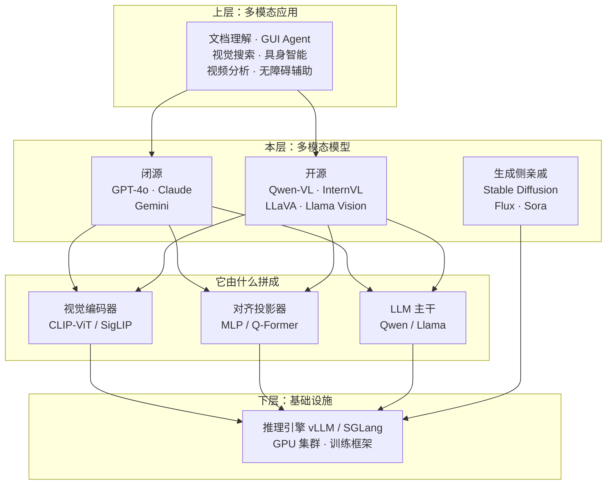

# 多模态 LLM 是什么：定义、边界与生态位置

> 上一篇讲清了纯文本 LLM 撞上的四堵墙，以及 CLIP 造出了眼睛却没接大脑。这一篇把"接起来之后的那个东西"正式定义出来。
>
> 定义本身不难。真正值钱的仍然是**边界**——多模态领域的踩坑率比纯文本还高，因为它看起来什么都能干：它能读出图里的字，于是你拿它当 OCR；它能说出"按钮在右下角"，于是你拿它当检测器；它能描述一张图，于是你以为它也能画出来。**这三件事它都做得不够好，而且原因各不相同。**
>
> 这一篇还会解决一个名词混乱：VLM、MLLM、LMM、Omni、"原生多模态"到底什么关系。

---

## 缩写对照表

| 缩写 | 英文全称 | 中文 |
|---|---|---|
| MLLM | Multimodal Large Language Model | 多模态大语言模型 |
| VLM | Vision-Language Model | 视觉-语言模型 |
| LMM | Large Multimodal Model | 大型多模态模型 |
| LLM | Large Language Model | 大语言模型 |
| ViT | Vision Transformer | 视觉 Transformer |
| CLIP | Contrastive Language-Image Pre-training | 对比式语言-图像预训练 |
| OCR | Optical Character Recognition | 光学字符识别 |
| MLP | Multi-Layer Perceptron | 多层感知机 |
| SFT | Supervised Fine-Tuning | 监督微调 |
| VQ-VAE | Vector Quantized Variational Autoencoder | 向量量化变分自编码器 |
| GUI | Graphical User Interface | 图形用户界面 |
| TTS | Text-To-Speech | 文本转语音 |

---

## 一、一句话定义

> **多模态 LLM 是一个在预训练语言模型之上、通过"模态编码器 + 对齐投影"把图像/音频/视频等非文本信号翻译成 LLM 嵌入空间里的 token 序列的模型——它让原本只认识文字的自回归生成机制，能够在同一个上下文里对多种模态联合推理。**

拆开对应上一篇的四堵墙：

| 定义中的片段 | 拆掉哪堵墙 | 展开于 |
|---|---|---|
| "图像/音频/视频等非文本信号" | ① 世界的信息不只有文本 | [01 · 为什么需要多模态](01-why.zh.md) |
| "在**预训练语言模型之上**" | ② 感知任务碎片化——复用 LLM 的通用性与指令跟随 | [06 · LLM 主干](06-llm-backbone-fusion.zh.md) |
| "翻译成 LLM 嵌入空间里的 token" | ③ 拼接管线有损——不再经过文字这个瓶颈 | [05 · 对齐投影器](05-projector.zh.md) |
| "在**同一个上下文里联合推理**" | ④ 跨模态推理 | [09 · 完整重演](09-walkthrough.zh.md) |

**注意第三行**：这是整个定义里最关键的一句。视觉信息不是被翻译成**文字**，而是被翻译成**嵌入向量**——一种 LLM 内部使用的、比文字丰富得多的表示。

这个区别就是端到端和拼接管线的分水岭。文字是一个极窄的瓶颈（一张图压成一句话），而嵌入向量可以携带版面、颜色、纹理、空间关系这些无法言说的信息。**多模态 LLM 绕过了"必须先说成人话"这个约束。**

## 二、边界：它不是什么

这一节是全篇最该记住的部分。

### 它不是 OCR 引擎

它确实能读出图里的字，而且在**理解**层面往往比 OCR 更好（因为它会用上下文纠错）。但：

- **它不保证逐字准确**。长串数字、序列号、罕见人名、手写体上，它会"读得像"而不是"读得准"；
- **它没有置信度输出**。传统 OCR 会告诉你某个字符的识别置信度是 0.6，多模态模型只会流畅地给你一个答案；
- **它没有坐标**。你问它"发票号在哪"，它可以描述位置，但拿不到可以用来裁剪的精确框。

**正确用法**：需要**理解**用它（"这张发票的付款方是谁"），需要**逐字精确 + 可核验**时用专业 OCR，或者两者并用互相校验。

### 它不是目标检测器

现代模型确实有一定的 grounding（视觉定位）能力，能输出边界框坐标。但：

- **精度远不如专用检测器**。定位误差通常在几个到几十个像素量级；
- **能力高度依赖是否专门训练过**。没做过 grounding 训练的模型，输出的坐标基本是编的（这是一类典型的多模态幻觉）；
- **小目标、密集目标上退化严重**。

**正确用法**：需要"大致在哪"用它；需要像素级精度的工业检测、自动驾驶，用专用模型。

### 它不是图像生成器

**这是最常见的误解，而且原因最深刻。**

"能看懂图"和"能画出图"是**两种不同的能力，走的是两条不同的技术路线**：

| | 理解（Understanding） | 生成（Generation） |
|---|---|---|
| 需要的表征 | **有损压缩成语义**——扔掉像素细节，留下"这是什么" | **保留足够细节以重建**——必须留住纹理、光影、精确位置 |
| 典型架构 | ViT 编码器 + LLM | 扩散模型 / 离散图像 token 自回归 |
| 输出 | 文本 | 像素 |

**这两个需求在方向上是矛盾的**：理解要求丢掉细节，生成要求留住细节。这就是为什么绝大多数"多模态 LLM"其实只能**看**不能**画**——所谓的画图功能，往往是它生成一段提示词去调用一个外挂的扩散模型（见 [08 · Any-to-Any](08-any-to-any.zh.md)）。

### 它的分辨率是有限的

一个非常实际的边界：**模型看到的不是你上传的原图**。图像会被缩放、切块、压缩成有限个视觉 token。

后果是：**细小的文字、密集的表格、图表上的刻度值，很可能在进入模型之前就已经糊了**。你以为模型"没看仔细"，实际上它根本没拿到那些像素。

这条边界的完整机制见 [04 · 视觉编码器](04-vision-encoder.zh.md)，它是多模态使用中最值得建立直觉的一条。

### 它没有修复 LLM 的任何固有弱点

幻觉、越狱、提示词注入——[LLM 全景指南](../llm-fundamentals/index.md) 里讲的所有问题，多模态一个不少，而且**视觉幻觉往往更严重**：语言先验会压过视觉证据，模型会"看到"图里根本没有的东西（见 [07 · 训练管线](07-training-pipeline.zh.md) 的失败行为一节）。

### 一张边界速查表

| 你想要的 | 多模态 LLM 能给吗 | 正确做法 |
|---|---|---|
| 理解图片内容、回答关于图的问题 | ✅ 主场 | 直接用 |
| 读懂文档版面、表格、图表趋势 | ✅ 主场 | 直接用，注意分辨率 |
| 逐字精确的文字提取 | ⚠️ 会"读得像" | 专业 OCR，或两者交叉校验 |
| 像素级精确定位 | ⚠️ 误差大 | 专用检测器 |
| 生成图像 | ❌ 多数模型不能 | 扩散模型；或看模型是否原生支持 |
| 判断图里有没有某个东西 | ⚠️ 容易受语言先验影响说"有" | 明确要求"没有就说没有"，并做校验 |

## 三、生态位置

**它坐在什么之上**：一个预训练视觉编码器 + 一个预训练 LLM + 中间的投影器。**这三块就是本系列第二部分要逐个拆开的东西。**

**什么坐在它之上**：文档理解、GUI Agent（让模型看着屏幕点按钮）、视觉搜索、具身智能（机器人）、视频分析、无障碍辅助。

**同层的亲戚**：图像生成模型（Stable Diffusion、Flux）和视频生成模型（Sora 类）。它们和多模态 LLM 的关系是**互补而非竞争**——一个负责看懂，一个负责画出，正在缓慢融合（见 [08 · Any-to-Any](08-any-to-any.zh.md)）。

## 四、名词辨析：VLM、MLLM、LMM、Omni

这几个词在中文技术文章里经常混用，实际有区别：

| 名词 | 覆盖范围 | 典型例子 |
|---|---|---|
| **VLM**（视觉-语言模型） | 只处理图像 + 文本 | LLaVA、Qwen-VL、InternVL |
| **MLLM**（多模态大语言模型） | 图像/音频/视频 + 文本，**以 LLM 为核心** | 本系列讲的主体 |
| **LMM**（大型多模态模型） | 和 MLLM 基本同义，OpenAI 一系更常用 | GPT-4o |
| **Omni**（全模态） | 强调**输入输出都多模态**，含语音实时对话 | GPT-4o、Qwen-Omni |

还有一个营销味很重、但确实指向真实技术差异的词：**"原生多模态"（natively multimodal）**。

它想说的是：**模型从预训练第一天起就同时吃文本和图像**，而不是"先训好一个 LLM，再嫁接一只眼睛"。

| | 嫁接式（主流开源路线） | 原生式 |
|---|---|---|
| 做法 | 预训练 LLM + 预训练视觉编码器 + 训投影器 | 从头用混合模态数据预训练 |
| 成本 | 低（可以只训 1% 的参数） | 极高 |
| 模态融合深度 | 视觉是"外挂的输入通道" | 模态在底层就交织 |
| 代表 | LLaVA、Qwen-VL、InternVL | Gemini、GPT-4o（普遍推测） |

**本系列以嫁接式为主线**，因为它是公开信息最完整、开源生态最成熟、也最能讲清楚各个部件职责的路线。原生式的差异会在 [07 · 训练管线](07-training-pipeline.zh.md) 单独讨论。

## 五、读懂模型名：`Qwen2.5-VL-7B-Instruct`

| 片段 | 含义 |
|---|---|
| `Qwen2.5` | 底座 LLM 的家族与代际——**它的语言能力上限由此决定** |
| `VL` | Vision-Language，标明这是视觉版；`Omni` 表示还含音频；无后缀则是纯文本 |
| `7B` | 参数量。**注意：通常指含视觉编码器的总量，但各家标法不一** |
| `Instruct` | 已做过视觉指令微调；没有这个后缀的可能只完成了对齐预训练，不会跟随指令 |

三个容易踩的坑：

1. **参数量的口径不统一**。视觉编码器通常 0.3B~6B 不等，有的厂商算进去有的不算。看显存需求时以实际权重文件体积为准；
2. **同名不同"眼"**。同一个 LLM 底座配不同的视觉编码器和分辨率策略，实际能力差别巨大——**决定文档理解好坏的往往是分辨率策略，而不是参数量**；
3. **上下文窗口要打折看**。标称 128K 是 token 数，而一张高清图可能吃掉几千 token。**能装多少页 PDF，取决于每页占多少 token，而不是标称窗口**（见 [04 · 视觉编码器](04-vision-encoder.zh.md)）。

## 六、质量自检

现在你应该能做出这些分类：

- **LLaVA 是一个 VLM**，由 CLIP-ViT（编码器）+ MLP（投影器）+ Vicuna（LLM 主干）拼成；
- **CLIP 不是多模态 LLM**，它只能算图文相似度，没有生成能力；
- **Stable Diffusion 不是多模态 LLM**，它是生成侧的模型，走的是完全不同的技术路线；
- **"用 GPT-4V 描述图片，再把描述交给 GPT-4 分析"不是多模态推理**，那是拼接管线，第一步就已经损失了信息。

能做这个分类，就可以进入概念地图了。

## 一句话总结

**多模态 LLM 是在预训练 LLM 之上外接一个感知通道**：把非文本信号翻译成嵌入向量而非文字，从而绕过"必须先说成人话"这个有损瓶颈。它在**理解**上是范式级的，在**逐字精确**（OCR）、**像素级定位**（检测）、**图像生成**上都不是；它看到的是被缩放和压缩过的图像，不是你上传的原图；它没有修复 LLM 的任何固有弱点，反而多了一类视觉幻觉。

---

**下一篇**：[03 · 概念地图：七个概念、五个角色、一个运行示例](03-concept-map.zh.md)

**系列目录**：[index.md](index.md)
