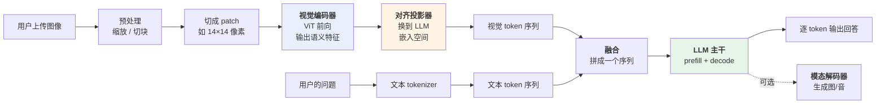

# 概念地图：七个概念、五个角色、一个运行示例

> 定义清楚之后，先别急着钻进任何一个部件。这一篇把**全部零件一次铺在桌面上**，摆到"一眼可见"的深度——七个核心概念按依赖顺序串成一条链，五个关键角色各自的"唯一职责"，一张端到端协作图。
>
> 然后引入贯穿本系列的运行示例，并**浅层**追一遍：每一步谁在场上。
>
> 读完这篇你不会懂任何一个部件的内部构造，但你会拥有一张不会迷路的地图——之后五个深潜都是在往地图的某一格里填内容。

---

## 缩写对照表

| 缩写 | 英文全称 | 中文 |
|---|---|---|
| MLLM | Multimodal Large Language Model | 多模态大语言模型 |
| ViT | Vision Transformer | 视觉 Transformer |
| CLIP | Contrastive Language-Image Pre-training | 对比式语言-图像预训练 |
| MLP | Multi-Layer Perceptron | 多层感知机 |
| LLM | Large Language Model | 大语言模型 |
| SFT | Supervised Fine-Tuning | 监督微调 |
| DPO | Direct Preference Optimization | 直接偏好优化 |
| RoPE | Rotary Position Embedding | 旋转位置编码 |
| KV Cache | Key-Value Cache | 键值缓存 |
| GUI | Graphical User Interface | 图形用户界面 |

---

## 3.1 从问题到概念：七个核心概念

每个概念都是被上一篇某堵墙逼出来的：

| # | 现实问题 | 系统概念 | 为什么必须是这个抽象 |
|---|---|---|---|
| 1 | 信息有多种载体形式 | **模态（Modality）** | 把"图像/音频/视频/文本"抽象成可以统一处理的输入通道 |
| 2 | 图像是连续像素，没有"词" | **视觉 token（Patch）** | 把图像切成固定大小的小块，每块当一个"词"——让 Transformer 能吃 |
| 3 | 像素本身没有语义 | **模态编码器（Encoder）** | 把 patch 序列加工成携带语义的特征向量 |
| 4 | 图像信息密度远高于文本 | **分辨率与 token 预算** | 看得多清 ↔ 花多少 token，多模态第一成本变量 |
| 5 | 编码器的输出 LLM 听不懂 | **对齐投影（Projector）** | 把视觉特征空间映射到 LLM 的嵌入空间——"翻译官" |
| 6 | 视觉信息如何进入 LLM | **融合策略（Fusion）** | 前缀拼接 or 交叉注意力，两条路线两种代价 |
| 7 | 三个模块如何变成一个系统 | **训练三阶段** | 对齐预训练 → 视觉指令微调 → 偏好对齐 |

这七个不是并列关系，而是**一条有向的链**：

```
模态（要处理什么）
  ↓ 图像必须先被离散化
视觉 token / Patch（切成块）
  ↓ 块本身没有语义，需要加工
模态编码器（变成语义特征）
  ↓ 切多细、编多少块，是成本的总开关
分辨率与 token 预算
  ↓ 特征向量在 LLM 眼里仍是乱码
对齐投影（翻译成 LLM 的语言）
  ↓ 翻译好了，怎么送进去
融合策略（前缀拼接 / 交叉注意力）
  ↓ 上面全部需要被训练到协同
训练三阶段
```

下面逐个说到"够用就好"的深度。

### 1. 模态：一个统一的输入抽象

**模态（Modality）指信息的载体形式**：文本、图像、音频、视频、深度图、点云……

这个抽象的价值在于：一旦某种信号能被翻译成"LLM 嵌入空间里的 token 序列"，它就和文本平起平坐了——**同一套注意力机制、同一套推理链条、同一套生成过程**。

**加一种新模态 = 加一个新的"编码器 + 投影器"对**，LLM 主干不用动。这就是为什么模型能从 VL（视觉-语言）快速扩展到 Omni（全模态）。

### 2. 视觉 token（Patch）：图像的"分词"

文本天生离散，图像不是。ViT 的解法简单粗暴：**把图像切成固定大小的方块（如 14×14 或 16×16 像素），每块拉平后线性投影成一个向量。**

一张 224×224 的图，用 14×14 的 patch，就是 16×16 = **256 个视觉 token**。

**这一步就是图像的 tokenizer。** 它和文本 tokenizer 的关键区别：

| | 文本 tokenizer | 视觉 patch 切分 |
|---|---|---|
| 单位来源 | 从语料统计学出来（BPE） | **人为规定的网格** |
| 词表 | 有限词表（如 128K 条目） | **没有词表**，直接线性投影 |
| 是否可变 | 训练前冻结 | patch 大小固定，但**总数随分辨率变** |

第三行是关键差异，也是下面第 4 条的由来。

### 3. 模态编码器：从像素到语义

切好的 patch 只是像素块，还没有语义。**编码器把 patch 序列过一遍 Transformer，输出携带语义的特征向量。**

主流选择是 **CLIP 或 SigLIP 的视觉编码器**——不是随便挑的。它们经过大规模图文对比学习，**输出的特征天然就和语言概念对齐过**，这让下游的投影器工作量小得多（细节见 [04 · 视觉编码器](04-vision-encoder.zh.md)）。

### 4. 分辨率与 token 预算：多模态的第一成本变量

这一条是多模态**独有**的、也是最容易被低估的概念。

因为 patch 数量随分辨率的**平方**增长：

| 输入分辨率 | patch 数（14×14） | 相当于多少汉字 |
|---|---|---|
| 224 × 224 | 256 | 约 200 字 |
| 448 × 448 | 1024 | 约 800 字 |
| 1344 × 1344 | 9216 | **约 7000 字** |

**一张高清截图可以轻易吃掉几千个 token**——这是一篇长文的量。而上下文窗口本来就是最稀缺的资源（见 [LLM 全景指南 10](../llm-fundamentals/10-context-window.zh.md)）。

于是形成一个贯穿全系列的核心矛盾：

> **看得越清 → token 越多 → 上下文越挤、显存越紧、账单越高、速度越慢。**

后面几乎所有的工程技巧（动态分辨率、切图、token 压缩、Q-Former），都是在这条曲线上找平衡点。

### 5. 对齐投影：整个系统里最小、最关键的模块

编码器输出的特征向量，维度和语义空间都和 LLM 的嵌入不一样——**在 LLM 眼里就是乱码**。

投影器（也叫 connector、adapter）负责把它翻译过去。它可能只是**一个两层 MLP**，参数量常常不到全模型的 1%。

**但整个系统能不能work，几乎全看它训得好不好**——它是唯一一个"专门为了连接而存在"的模块（见 [05 · 对齐投影器](05-projector.zh.md)）。

### 6. 融合策略：视觉 token 怎么进 LLM

翻译好之后，有两条路把它送进 LLM：

- **前缀拼接**：视觉 token 就当成普通 token，拼在文本序列前面。简单、灵活、主流；
- **交叉注意力**：不进主序列，而是在 LLM 层里插入 cross-attention 层去"看"视觉特征。不占上下文，但要改架构。

两条路线的完整取舍见 [06 · LLM 主干与融合](06-llm-backbone-fusion.zh.md)。

### 7. 训练三阶段

三个模块（编码器、投影器、LLM）各自都是预训练好的，但它们**从没一起工作过**。训练管线负责把它们焊在一起：

1. **对齐预训练**：冻结编码器和 LLM，**只训投影器**。用海量图文对，教会投影器"翻译"；
2. **视觉指令微调**：解冻 LLM（通常也解冻编码器），用多模态指令数据，教会它跟随指令；
3. **偏好对齐**：针对视觉幻觉等问题做 DPO 类优化。

细节见 [07 · 训练管线](07-training-pipeline.zh.md)。

## 3.2 五个关键角色

概念是名词，角色是**承担职责的组件**。理解系统的捷径是搞清每个角色"唯一负责什么"和"刻意不做什么"：

| 角色 | Owns（唯一职责） | Knows（持有什么） | **Does NOT do（刻意不做）** |
|---|---|---|---|
| **视觉编码器** | 把像素变成语义特征向量 | 视觉预训练权重（CLIP/SigLIP） | **不理解语言指令**；不知道用户问了什么；不生成文本 |
| **对齐投影器** | 把视觉特征翻译进 LLM 嵌入空间 | 一个小 MLP 或 cross-attention 模块 | **不做语义理解**；不压缩语义，只换坐标系 |
| **LLM 主干** | 统一推理与文本生成 | 全部语言能力和世界知识 | **不认识像素**；只认识嵌入向量，不关心它来自图还是字 |
| **多模态训练管线** | 把三者对齐、教会跟随指令 | 图文对、多模态指令数据 | 不参与推理；训完即退场 |
| **模态解码器**（可选） | 生成非文本输出（图/音） | 扩散模型 / 声码器 / 图像 token 解码器 | **不参与理解**；是完全独立的一条支路 |

三条最值得记住的"刻意不做"：

- **视觉编码器不知道用户问了什么** → 它对整张图做的是**无条件**编码。这解释了为什么"先看图再提问"和"带着问题看图"在当前主流架构里是同一件事，也解释了为什么细节容易丢——编码时它不知道哪里重要；
- **LLM 主干不认识像素** → 对它来说视觉 token 和文本 token **没有本质区别**，都是嵌入向量。这是整个架构优雅的地方，也是幻觉的来源之一（它无法区分"这是我看到的"和"这是我猜的"）；
- **投影器不做语义理解** → 它只换坐标系。**如果编码器没编出来的信息，投影器变不出来**。想让模型看清小字，该调的是编码器的分辨率，不是投影器。

## 3.3 协同总览：一张图看完全流程

> 这张图回答：一张图片和一句问题，如何变成一段回答。



**这张图的核心信息只有一句**：图像被翻译成和文本 token 同构的东西，之后 LLM 的处理流程**与纯文本时完全一样**——同样的 prefill/decode、同样的 KV Cache、同样的采样参数（见 [LLM 全景指南 08](../llm-fundamentals/08-inference-engine.zh.md)）。

**多模态没有改造 LLM，它只是给 LLM 换了一种输入。** 这个认识能帮你消除大量困惑。

图上还有两个不在正常流程里、但你一定会遇到的分支：

- **视觉幻觉**：语言先验压过视觉证据，模型"看到"图里没有的东西 → [07 · 训练管线](07-training-pipeline.zh.md)；
- **看不清**：细节在预处理阶段就被缩放掉了，模型拿到的像素里根本没有那个信息 → [04 · 视觉编码器](04-vision-encoder.zh.md)。

---

## 3.4 贯穿全系列的运行示例

从这里开始，本系列所有文章共享同一个场景。**每篇结尾的"⚓ 回到示例"都会把当篇的深度接回它**，[第 9 篇](09-walkthrough.zh.md)带着全部深度重演一遍。

### 场景

你的手机 App 弹出一个报错窗口。你截了张图（1170 × 2532 像素的整屏截图），连同一句话发给模型：

> **"这个报错什么意思？我接下来该点哪个按钮？"**

模型的回答：

> "弹窗提示『同步失败：网络连接超时（错误码 ETIMEDOUT）』，说明 App 在向服务器同步数据时超时了，通常是网络不稳定或服务端暂时不可用。弹窗底部有两个按钮，左边是『取消』，右边是『重试』——建议先确认网络连接，然后点**右下角的『重试』**。"

**它没有调用 OCR，没有调用任何检测模型，全程只有一次前向计算。**

这个示例被选中，是因为它同时压到了本系列的每一个概念：读字（OCR-free）、读版面（空间关系）、定位（右下角）、以及**一张整屏截图带来的 token 预算问题**。

### 浅层追踪：每一步谁在场上

**第 1 步 · 预处理：图被改造了**
1170 × 2532 的截图不能直接进模型。它会被**缩放和切块**成编码器能吃的尺寸——这一步就已经决定了小字还看不看得清（**分辨率与 token 预算**）。

**第 2 步 · 切成 patch**
每一块被切成 14×14 像素的小方格，拉平成向量。整张截图变成**几千个视觉 token**——注意，这已经相当于几千字的文本了。

**第 3 步 · 视觉编码器上场**
**ViT** 把 patch 序列过一遍 Transformer。此时"错误码 ETIMEDOUT"那几个字的笔画、"重试"按钮的形状与位置，都被编码进了特征向量。

**注意**：编码器**不知道你问了什么**，它对整张图做无条件编码。

**第 4 步 · 对齐投影器翻译**
特征向量被**投影器**换到 LLM 的嵌入空间。翻译之后，它们在 LLM 眼里就是一串普普通通的 token 嵌入。

**第 5 步 · 融合**
视觉 token 和你那句问题的文本 token 拼成一个序列，送进 LLM。

**第 6 步 · LLM 主干推理**
**prefill** 并行吃下全部 token（视觉 + 文本），**decode** 逐 token 吐出回答。注意力机制让"该点哪个按钮"这句话去关注截图右下角对应的那些视觉 token——**这就是跨模态推理发生的地方**。

**第 7 步 · 输出**
一段纯文本。（如果这是个 Omni 模型，还可以走**模态解码器**分支把回答读出来。）

### 这个示例触到了地图上的一切

| 概念 / 角色 | 在示例中的落点 | 哪一篇展开 |
|---|---|---|
| 模态 | 图像 + 文本两个通道同时进入 | 本篇 |
| 视觉 token / Patch | 第 2 步，截图变成几千个方块 | [04](04-vision-encoder.zh.md) |
| 分辨率与 token 预算 | 第 1 步，缩放决定了小字看不看得清 | [04](04-vision-encoder.zh.md) |
| 视觉编码器 | 第 3 步，笔画和位置被编码成语义 | [04](04-vision-encoder.zh.md) |
| 对齐投影器 | 第 4 步，换坐标系 | [05](05-projector.zh.md) |
| 融合策略 | 第 5 步，拼成一个序列 | [06](06-llm-backbone-fusion.zh.md) |
| LLM 主干 | 第 6 步，跨模态注意力 | [06](06-llm-backbone-fusion.zh.md) |
| 训练三阶段 | 示例里不出场，但它决定了以上每一步能不能work | [07](07-training-pipeline.zh.md) |
| 模态解码器 | 第 7 步的可选分支 | [08](08-any-to-any.zh.md) |

## 质量自检

你现在应该能在白板上画出"图像 → patch → 编码器 → 投影器 → 拼进文本序列 → LLM → 回答"这条链，并为每个环节说出一句它为什么必须存在。

你也应该能回答这两个问题：
- **为什么模型看不清小字？** —— 因为第 1 步就缩放了，信息在进入模型前已丢失；
- **为什么它能同时理解文字和版面？** —— 因为视觉 token 携带的是特征向量而非文字，版面信息没有经过"必须说成人话"这个瓶颈。

**但你还不知道任何一个部件里面长什么样**——从下一篇开始，逐个打开。

---

**下一篇**：[04 · 视觉编码器：像素如何变成语义](04-vision-encoder.zh.md)

**系列目录**：[index.md](index.md)
