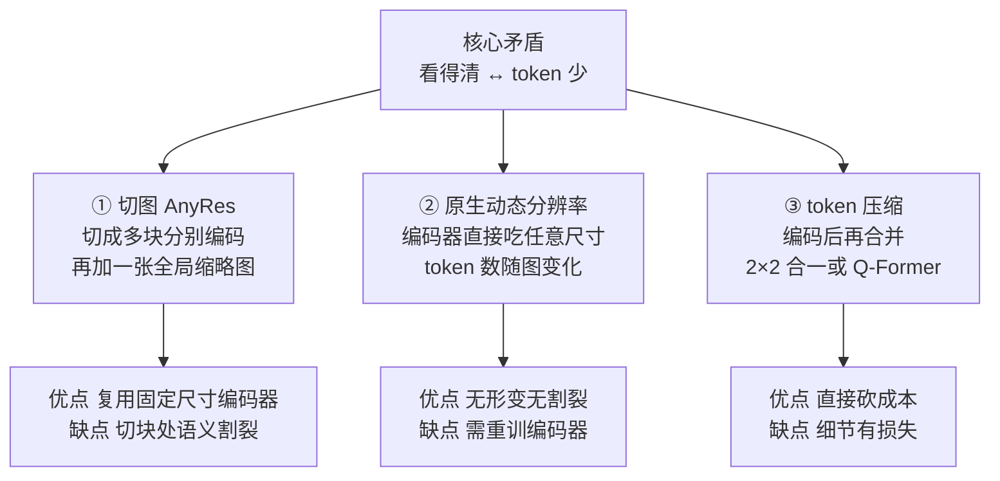

# 视觉编码器：像素如何变成语义

> **角色回顾**：视觉编码器**唯一的职责是把像素变成携带语义的特征向量**。它**不理解语言指令**——它对整张图做的是无条件编码，编码的时候根本不知道你要问什么。它对应运行示例的第 1~3 步。
>
> 这是五个深潜里最长的一篇，因为它藏着多模态最重要的那个工程变量：**分辨率与 token 预算**。你遇到的绝大多数"模型看不清"的问题，答案都在这一篇里。
>
> 一句话预告：**模型看到的从来不是你上传的那张图。**

---

## 缩写对照表

| 缩写 | 英文全称 | 中文 |
|---|---|---|
| ViT | Vision Transformer | 视觉 Transformer |
| CLIP | Contrastive Language-Image Pre-training | 对比式语言-图像预训练 |
| SigLIP | Sigmoid Loss for Language-Image Pre-training | 用 Sigmoid 损失的图文预训练 |
| CNN | Convolutional Neural Network | 卷积神经网络 |
| MLP | Multi-Layer Perceptron | 多层感知机 |
| OCR | Optical Character Recognition | 光学字符识别 |
| RoPE | Rotary Position Embedding | 旋转位置编码 |
| M-RoPE | Multimodal RoPE | 多模态旋转位置编码 |
| FPS | Frames Per Second | 每秒帧数 |

---

## 一、ViT：把图像变成序列

Transformer 只吃序列。所以第一件事是把二维图像变成一维序列。

**ViT（Vision Transformer）的做法简单到近乎粗暴**：

四步就完了：**切格子 → 拉平 → 线性投影 → 过 Transformer**。

### 和文本 tokenizer 的关键差异

[LLM 全景指南 05](../llm-fundamentals/05-tokenizer.zh.md) 讲过文本 tokenizer 的机制。两者对比能澄清很多误解：

| | 文本 tokenizer（BPE） | 视觉 patch 切分 |
|---|---|---|
| 切分依据 | 从语料**统计学出来**的合并规则 | **人为规定的等距网格** |
| 有没有词表 | 有（如 128K 条目），查表得嵌入 | **没有词表**，直接线性投影 |
| 语义边界 | 大致对齐词根词缀 | **完全不对齐**——一个字可能横跨 4 个 patch |
| token 数 | 由文本内容决定 | **由分辨率决定**，与内容无关 |

**第三行是理解视觉能力的关键**：patch 网格是机械切分的，它不认识"这里是一个字""这里是一个按钮"。一个汉字可能被切成四块分给四个 patch，一个按钮可能横跨十几个 patch。

**是后面的 Transformer 层通过自注意力把这些碎片重新拼回完整语义的。** 这也解释了为什么 ViT 必须够深——它要用注意力做"重新组装"的工作。

**第四行则是全篇的成本引擎**：token 数只和分辨率有关，和图里有没有内容无关。**一张纯白的图和一张密密麻麻的表格，占用的 token 完全一样。**

### 为什么是 Transformer 而不是 CNN

CNN（卷积神经网络）统治视觉领域十年，为什么这里换成 Transformer？

两个原因，第二个才是决定性的：

1. **全局感受野**：自注意力让第一层就能建立任意两个 patch 之间的关系。CNN 要堆很多层才能让远处的两块"看见"彼此——而版面理解恰恰需要长距离关系（"这个金额属于哪一栏"）；
2. **和 LLM 同构**：输出天然就是"一串向量"，格式和 LLM 的 token 嵌入一致。**接起来几乎不需要适配。**

第二条是工程上的决定性因素。整个多模态架构之所以能如此简洁，很大程度上是因为两边碰巧都是 Transformer。

## 二、为什么大家都用 CLIP/SigLIP 的编码器

这是本篇最重要的一个设计洞察。

你可以拿任何一个视觉编码器来用——比如一个在 ImageNet 上训练的分类模型。**但几乎所有多模态 LLM 都选择了 CLIP 或 SigLIP 的视觉塔。为什么？**

### 因为它们的特征已经和语言对齐过了

回顾 [01 · 为什么需要多模态](01-why.zh.md)：CLIP 用 4 亿对图文做对比学习，把图像和文本**投影到同一个向量空间**。

这意味着 CLIP 视觉编码器输出的特征，**已经是"朝着语言概念组织"的**：

| 编码器来源 | 它的特征在编码什么 | 对下游的影响 |
|---|---|---|
| ImageNet 分类器 | "这张图属于 1000 类中的哪一类" | 特征为**分类**优化，丢弃了大量与类别无关但与语言有关的信息 |
| **CLIP / SigLIP** | "这张图能匹配哪些**自然语言描述**" | 特征天然覆盖开放词表的语义，**投影器只需换坐标系** |

**这个差别决定了投影器的工作量。** 如果编码器输出的特征已经在"语义"这个层面上组织好了，投影器就只需要做一个线性变换；如果特征是为分类优化的，投影器就要做一次真正的语义重构——那需要多得多的参数和数据。

> **一句话**：选 CLIP 不是因为它的视觉能力最强，而是因为**它的特征离语言最近**。这是"站在巨人肩膀上"的一个教科书式案例。

### SigLIP 为什么在替代 CLIP

SigLIP（Google，2023）改了一处：把对比学习的 **softmax 损失换成 sigmoid 损失**。

- CLIP 的 softmax 损失要求在整个 batch 内做归一化 → **batch 必须很大**，且需要跨设备同步，工程复杂；
- SigLIP 的 sigmoid 损失把每一对图文当成独立的二分类 → **不需要全局归一化**，小 batch 也能训，训练效率明显更高。

结果是同等算力下能训出更好的编码器。**现在新出的多模态模型大多用 SigLIP 系。**

### 还有一条少数派路线：无编码器

也有模型（如 Fuyu、EVE 系）走**encoder-free**：不用预训练视觉编码器，直接把 patch 线性投影后送进 LLM，让 LLM 自己学会看。

- **优点**：架构极简、天然支持任意分辨率、没有编码器的分辨率限制；
- **缺点**：LLM 要从零学视觉，需要多得多的训练数据和算力。

目前是少数派，但它指向一个真问题：**"预训练编码器"这个中间层，究竟是必需品还是权宜之计？** 从 [01](01-why.zh.md) 讲的约束一（LLM 太贵不能重训）来看，它至少在当前是必需的。

## 三、分辨率与 token 预算：多模态的第一成本变量

**这一节是全系列最有实用价值的部分。**

### 平方增长：问题的来源

视觉 token 数 = (宽 ÷ patch 边长) × (高 ÷ patch 边长)。**分辨率翻倍，token 数变四倍。**

| 分辨率 | patch 数（14×14） | 约等于多少汉字 | 说明 |
|---|---|---|---|
| 224 × 224 | 256 | 200 字 | 早期标准，看清一张图的主体 |
| 336 × 336 | 576 | 450 字 | LLaVA-1.5 的选择 |
| 672 × 672 | 2304 | 1800 字 | 勉强能读大号文字 |
| 1344 × 1344 | 9216 | **7000 字** | 能读文档，但代价高昂 |

**一张高清截图能吃掉一篇长文的 token 预算。** 而这些 token 还要经过 [LLM 全景指南 08](../llm-fundamentals/08-inference-engine.zh.md) 讲的全套流程：prefill 的注意力计算是**平方级**的，KV Cache 是线性增长的。

于是核心矛盾成型：

> **看得越清 → token 越多 → 上下文越挤、prefill 越慢、显存越紧、账单越高。**

### 固定低分辨率的代价：信息在进模型前就没了

早期模型（LLaVA-1.5）固定 336×336。**任何图片，不管原始多大，都先缩放到 336×336。**

一张 1170×2532 的手机截图缩到 336×336，是什么概念？**面积压缩到原来的 1/26。** 正文小字直接糊成一片灰。

**这就是"模型看不清小字"的真正原因，也是最反直觉的一点**：

> 不是模型"没注意到"，而是**那些像素根本没进模型**。你在和一个近视一千度且不戴眼镜的人讨论一张地图。

这条认识极其实用：**当模型读错了小字，加提示词说"请仔细看"是完全无效的**——该做的是提高输入分辨率，或者把图裁剪放大后再传。

### 三条工程路线

现代模型用三种手段（通常组合使用）在这条曲线上找平衡：

**① 切图（AnyRes / Tiling）** —— LLaVA-NeXT 的做法

把高分辨率图切成若干个 336×336 的小块，**每块独立编码**，再额外加一张缩到 336×336 的全局缩略图。

- 缩略图负责"整体布局"，小块负责"局部细节"——两个尺度都有；
- 代价：4 块 + 1 全局 = 5 × 576 = **2880 个 token**；
- **隐患**：跨块的对象被切断。一个横跨两块的表格行，两块各看到一半，靠 LLM 那边重新拼接。

**② 原生动态分辨率** —— Qwen2-VL 系的做法

改造编码器，让它**直接接受任意分辨率输入**，输出的 token 数随图像尺寸自然变化。

- 没有形变、没有切块割裂，长图窄图都能正确处理；
- 代价：编码器要重新训练；且需要 **M-RoPE（多模态旋转位置编码）** 来处理二维（图像）乃至三维（视频：宽 × 高 × 时间）的位置关系——普通的一维 RoPE 表达不了"这个 patch 在右下角"（见 [06 · LLM 主干与融合](06-llm-backbone-fusion.zh.md)）。

**③ token 压缩** —— 几乎所有现代模型都在用

编码之后再压一道：

- **相邻合并（pixel shuffle / 2×2 merge）**：把相邻 2×2 的四个视觉 token 用一个 MLP 合成一个 → **token 数直接除以 4**。InternVL、Qwen2-VL 都用这招；
- **Q-Former / Resampler**：用一组固定数量的可学习 query，通过交叉注意力从视觉特征里"提炼"出固定条数的 token（如 32 或 64 条）——**无论原图多大，输出 token 数恒定**（细节见 [05 · 对齐投影器](05-projector.zh.md)）。

**压缩比是有代价的**：压得越狠，细粒度信息（小字、密集表格）丢得越多。**固定输出条数的方案（Q-Former）在文档理解上普遍弱于按需增长的方案**——因为一页密集文档和一张风景照，本来就不该占同样多的 token。

### 视频：把这个问题再乘一个数量级

视频是"很多帧图像 + 时间维度"。1 分钟 30 FPS 的视频有 1800 帧，**按每帧 576 token 算就是 100 万 token**——完全不可行。

所以视频处理必然做两件事：

1. **抽帧**：从 30 FPS 降到 1~2 FPS，甚至更低。**代价是快速事件直接丢失**——这就是为什么模型经常答不出"他什么时候挥了一下手"；
2. **时序压缩**：把相邻几帧合并编码（如 Qwen2-VL 用 3D 卷积把每 2 帧合一）。

**理解这两点，你就能预判视频模型的能力边界**：它擅长"这段视频讲了什么"，不擅长"第 37 秒发生了什么细节"。

## 四、与邻居的契约

- **上游（预处理）**：接收缩放/切块后的图像张量。**这一步是不可逆的信息瓶颈**——预处理丢掉的，后面全部都拿不回来；
- **下游（对齐投影器）**：交付一个形状为 `[N个视觉token, 编码器隐藏维度]` 的特征矩阵。**这是编码器与 LLM 之间唯一的接口**；
- **不与 LLM 直接对话**：编码器完全不知道用户的问题是什么。**它的编码是无条件的。**

最后一条的后果值得单独说：因为编码时不知道问题，编码器必须**平均地**保留全图信息，而不能"重点关注问题相关的区域"。这是当前架构的一个根本局限——人类看图是带着问题去扫视的，模型不是。

（有研究在探索"问题条件化的视觉编码"，但主流架构尚未采用，因为它会破坏 KV Cache 的复用：同一张图问不同问题就得重新编码。）

## ⚓ 回到示例

运行示例第 1~3 步，现在可以精确展开了。

你的截图是 **1170 × 2532 像素**（iPhone 整屏）。

**第 1 步 · 预处理**

假设模型走的是**原生动态分辨率**路线（Qwen2-VL 系）：

- 图像按 14×14 切分 → 约 `(1170/14) × (2532/14) ≈ 83 × 181 = 15023` 个 patch；
- 经过 **2×2 相邻合并**压缩 → 约 **3756 个视觉 token**。

**这一个截图就吃掉了近 3800 个 token**——相当于三千字的文章。如果你在同一轮对话里传三张截图，视觉 token 就超过 1 万，长上下文的所有代价（[LLM 全景指南 10](../llm-fundamentals/10-context-window.zh.md)）立刻全部到齐。

对比一下：如果这是走**固定 336×336** 的老一代模型，整张截图会被压缩到面积的 1/26。"错误码 ETIMEDOUT"那行小字大概率**直接糊掉**——示例里模型能准确复述错误文案这件事，本身就依赖于足够的分辨率。

**第 2 步 · 切成 patch**

"重试"两个字大约占 40×40 像素，横跨约 **9 个 patch**（3×3）。每个 patch 只看到笔画的一部分——**没有任何单个 patch 认识"重试"这个词**。

**第 3 步 · 编码器前向**

ViT 的自注意力开始工作：那 9 个 patch 互相关注，把碎片笔画重新组装成"这是『重试』两个字"的语义；同时，位置编码让这些 patch 携带了"我在图像右下方"的信息。

按钮的边框、背景色块、与左边"取消"按钮的相对位置——**全都被编码进了那几个特征向量**。

**关键提醒**：此刻编码器**并不知道你问的是"该点哪个按钮"**。它平等地编码了状态栏的时间、顶部的导航栏、弹窗的每一个像素。**筛选相关信息是后面 LLM 的工作。**

## 五、失败行为

**看不清 —— 最常见、最隐蔽**

信息在预处理阶段就丢了。表现为读错小字、数错表格行、看不见图表刻度。

**诊断方法**：把原图裁剪出关注区域再放大，重新提问。如果这样就对了，那就是分辨率问题，不是理解问题。

**修复手段**：提高输入分辨率参数（很多 API 有 `detail: high` 之类的开关）、手动裁剪、或换用支持动态分辨率的模型。**加提示词是没用的。**

**切块割裂**

用 AnyRes 路线的模型，横跨切块边界的对象（长表格、宽图表）容易被理解错。表现为表格的行列错位。

**长宽比形变**

固定正方形输入的模型，遇到极端长宽比的图（长截图、全景图）会强行拉伸，导致文字变形、识别率下降。

**token 预算爆掉**

多图或高分辨率导致上下文超限。**注意：很多框架会静默截断**——你以为模型看了 5 张图，实际只看了 2 张。

**视频的时间盲区**

抽帧导致的信息丢失。模型能概括视频内容，但答不准"第几秒发生了什么"。**不要用它做精确的时间点定位。**

**纯白图和密集表格花一样多的钱**

token 数只由分辨率决定。**用高分辨率传一张没什么信息量的图，是纯粹的浪费。** 传图前先想想：这张图真的需要这个分辨率吗？

## 一句话总结

**视觉编码器把像素切成 patch、编码成语义特征，它不知道用户问了什么，做的是无条件编码。** 主流选 CLIP/SigLIP 是因为它们的特征离语言最近，让投影器只需换坐标系。而它最重要的性质是：**token 数只由分辨率决定，且随分辨率平方增长**——这条曲线是多模态所有工程痛苦的源头。**模型看到的从来不是你上传的那张图**，看不清小字时该调分辨率，不是加提示词。

---

**下一篇**：[05 · 对齐投影器：整个系统里最小、最关键的那个模块](05-projector.zh.md)

**系列目录**：[index.md](index.md)
