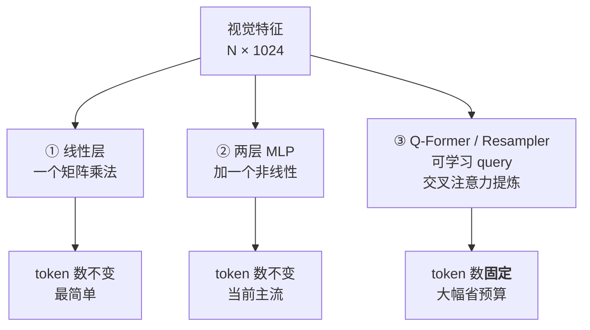

# 对齐投影器：整个系统里最小、最关键的那个模块

> **角色回顾**：对齐投影器（projector / connector / adapter）**唯一的职责是把视觉特征翻译进 LLM 的嵌入空间**。它**不做语义理解**——它只换坐标系，编码器没编出来的信息，它变不出来。它对应运行示例的第 4 步。
>
> 这是整个架构里参数量最小的模块，常常不到全模型的 1%（一个两层 MLP，几千万参数）。**但整个系统能不能work，几乎全看它。**
>
> 它也是三个模块里唯一一个**从零开始训练**的——编码器和 LLM 都是拿现成的，只有它是为了"连接"这件事本身而生的。

---

## 缩写对照表

| 缩写 | 英文全称 | 中文 |
|---|---|---|
| MLP | Multi-Layer Perceptron | 多层感知机 |
| ViT | Vision Transformer | 视觉 Transformer |
| LLM | Large Language Model | 大语言模型 |
| Q-Former | Querying Transformer | 查询式 Transformer（BLIP-2 提出） |
| BLIP-2 | Bootstrapping Language-Image Pre-training 2 | 一种图文预训练框架 |
| GELU | Gaussian Error Linear Unit | 高斯误差线性单元（激活函数） |
| OCR | Optical Character Recognition | 光学字符识别 |

---

## 一、问题：两个空间对不上

编码器交出来的是一个 `[N, 1024]` 的特征矩阵（N 个视觉 token，每个 1024 维）。LLM 期待的是 `[M, 4096]` 的嵌入序列。

**两件事对不上**：

1. **维度不同**：1024 vs 4096。这个好办，乘一个矩阵就行；
2. **语义空间不同**：这才是真问题。

第 2 点值得展开。LLM 的嵌入空间是在纯文本上训出来的——每个方向都对应着某种语言概念。而 CLIP 编码器的输出空间虽然"和语言对齐过"，但那是**CLIP 自己的**语言空间（由 CLIP 的文本编码器定义的），**和你要接的这个 LLM 的嵌入空间完全是两回事**。

打个比方：两个人都懂"苹果"这个概念，但一个说中文一个说法语。**光把音量调一致（维度对齐）没用，得真的翻译。**

**投影器就是这个翻译官。** 它要学会的映射是：

$$
\underbrace{\text{CLIP 特征空间}}_{\text{"这张图像什么"}} \longrightarrow \underbrace{\text{LLM 嵌入空间}}_{\text{"用这个 LLM 的词汇说是什么"}}
$$

## 二、三代方案

### ① 线性层 —— LLaVA 1.0

**一个矩阵**，把 1024 维投到 4096 维。就这么简单。

LLaVA 第一版证明了一件让整个领域震惊的事：**只训这一个线性层，冻结编码器和 LLM，就能得到一个可用的多模态模型。**

这个结果的含义很深：**CLIP 特征和 LLM 嵌入之间的差距，小到一个线性变换就能大致弥合**——这反过来印证了 [04 · 视觉编码器](04-vision-encoder.zh.md) 里的判断：选 CLIP 是因为它的特征离语言最近。

### ② 两层 MLP —— LLaVA-1.5 及当前主流

在线性层之间加一个 GELU 激活，变成两层 MLP。

改动听起来微不足道，**效果提升却相当明显**。原因是线性变换只能做"旋转+缩放"，而两个空间的关系并不是严格线性的——加一层非线性，映射能力有了质的变化。

**这是当前绝大多数模型的选择**：足够强、足够简单、token 数不变（进来 N 个出去还是 N 个）。

### ③ Q-Former / Perceiver Resampler —— 压缩派

前两种方案有一个共同"缺点"：**token 数不变**。编码器出来 3756 个，进 LLM 还是 3756 个，全额占用上下文预算。

Q-Former（BLIP-2 提出）换了个思路：

- 准备一组**可学习的 query 向量**（比如 32 个），它们是模型参数，与输入图像无关；
- 让这 32 个 query 通过**交叉注意力**去"查询"视觉特征，各自提炼出自己关心的信息；
- 输出**固定的 32 个 token**——**不管原图是 256 个 patch 还是 10000 个 patch。**

Flamingo 的 Perceiver Resampler 是同一思路的另一个实现。

**收益极大**：3756 个 token 压成 32 个，上下文预算直接省下 99%。

**代价也极大**：见下一节。

## 三、根本矛盾：压缩 token 数 vs 保留细节

**这是本篇的核心洞察。**

固定输出条数的方案有一个无法回避的问题：**32 个向量能装下多少信息？**

- 一张风景照——"蓝天、草地、一棵树、远处有山"——32 个 token 绰绰有余；
- 一页密集的财务报表——几十行数字、表头、脚注、印章——**32 个 token 远远不够**。

**信息量本来就不该被压成同一个尺寸。**

| 方案 | token 数 | 强在哪 | 弱在哪 |
|---|---|---|---|
| **MLP**（按需增长） | 随分辨率变化 | **文档、表格、OCR 类任务** | 上下文预算消耗大 |
| **Q-Former**（固定条数） | 恒定（如 32/64） | 通用图像描述、多图/视频场景 | **细粒度识别显著变弱** |

**实践中的结论很明确**：**做文档理解、表格识别、GUI 操作，几乎一定要选按需增长的方案**。Q-Former 系在这类任务上的表现，和它压缩掉的信息量成正比地下降。

这也是为什么当前主流从 Q-Former 回归到了朴素的 MLP——**领域的主战场从"给图片配个说明"转向了"读懂文档和屏幕"，而后者需要的正是被压掉的那些细节。**

一个折中方案在 [04 · 视觉编码器](04-vision-encoder.zh.md) 提过：**2×2 相邻合并**。它压缩 4 倍，但**压缩比固定、空间结构保留**——相邻的四块合成一块，而不是把全图提炼成固定条数。这保住了"信息量大的图占更多 token"这个重要性质，是目前最流行的折中。

## 四、为什么这么小的模块这么关键

投影器可能只有几千万参数，在一个 8B 模型里占不到 1%。但：

**① 它是唯一为"连接"而生的模块**

编码器会看图，LLM 会推理，**但没有任何一方知道对方的语言**。投影器是唯一负责建立这条通路的部件。它训坏了，前后两个强大的模块就是两座孤岛。

**② 训练管线的第一阶段就是专门训它**

[07 · 训练管线](07-training-pipeline.zh.md) 会讲：阶段一冻结编码器和 LLM，**只训投影器**。这个阶段的全部目的就是把这个翻译官教会。

**③ 它决定了"能不能低成本做多模态"**

正因为只需训一个小模块，一个团队可以用有限的算力，把任何一个开源 LLM 改造成多模态模型。**这是开源多模态生态能如此繁荣的直接原因**——LLaVA 最初的训练成本据其论文报告是单机 8 卡一天左右的量级。

## 五、与邻居的契约

- **上游（视觉编码器）**：接收 `[N, d_vision]` 的特征矩阵。**它完全不关心这些特征怎么来的**——换编码器只需重训投影器；
- **下游（LLM 主干）**：交付 `[N', d_model]` 的嵌入序列，**格式与文本 token 嵌入完全一致**。LLM 拿到后无法区分它来自图还是字；
- **不做的事**：不理解内容、不做筛选、不判断哪部分重要。**它是一个纯粹的、无状态的坐标变换。**

第二条是整个架构优雅的地方：**投影器的输出和文本嵌入同构**，所以 LLM 那边一行代码都不用改。

第三条则给出一条实用的排障原则：

> **如果模型看错了图里的内容，问题几乎不在投影器。** 要么是编码器没看清（分辨率），要么是 LLM 没推理对（语言先验太强）。投影器只是个搬运工。

## ⚓ 回到示例

运行示例第 4 步：

编码器交出约 **3756 个视觉特征向量**，每个 1024 维（承接 [04](04-vision-encoder.zh.md) 算出的数字）。其中有那么几个向量，编码的是屏幕右下角"重试"按钮那一小片区域。

投影器（一个两层 MLP）逐个把它们从 1024 维映射到 4096 维——**同时把它们从"CLIP 的语义空间"搬到"这个 LLM 的语义空间"**。

翻译之后会发生一件很微妙的事：那个编码着"重试"按钮的向量，在 LLM 的嵌入空间里，**落在了离"重试"、"按钮"、"确认"这些词的嵌入不远的位置**。

**这就是整个多模态架构最本质的一步**：图像的一个区域，变成了 LLM 词汇空间里的一个"意思"。

从这一刻起，LLM 完全不知道这个 token 来自像素——**对它来说，这就是序列里的第 1523 个 token，和你输入的那句问题里的字没有任何区别。**

## 六、失败行为

**对齐没训好 → 答非所问**

阶段一训练不充分时，视觉 token 落在 LLM 嵌入空间的"无人区"，模型的回答会与图像内容完全无关——像是在做纯文本对话，或者输出一堆重复的通用描述。

**这是最容易识别的失败**：模型的回答对任何图片都差不多。

**压缩过度 → 细粒度能力塌陷**

用 Q-Former 类方案时，模型能说对"这是一份表格"，但说不出表格里的任何具体数字。

**换编码器不换投影器 → 完全失效**

投影器是**针对某一个特定编码器 + 某一个特定 LLM**训出来的。任何一端换了，映射关系立刻作废。这也是为什么多模态模型的权重必须整套使用，不能像纯文本模型那样随意换配件。

**投影器不背的锅**

看错小字、数错行数、说图里有不存在的物体——**这些都不是投影器的问题**。分别对应 [04](04-vision-encoder.zh.md) 的分辨率和 [07](07-training-pipeline.zh.md) 的视觉幻觉。

## 一句话总结

**投影器是把视觉特征翻译进 LLM 嵌入空间的坐标变换器**，参数量常常不到全模型的 1%，却是唯一为"连接"而生的模块。三代方案（线性 → MLP → Q-Former）的核心分歧是**要不要压缩 token 数**，而这背后是一对根本矛盾：**压缩省预算，但信息量大的图不该和信息量小的图占一样多的 token**。文档和 GUI 类任务几乎一定要选按需增长的方案。

---

**下一篇**：[06 · LLM 主干与融合策略：前缀拼接 vs 交叉注意力](06-llm-backbone-fusion.zh.md)

**系列目录**：[index.md](index.md)
