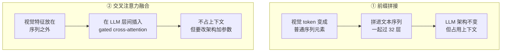

# LLM 主干与融合策略：前缀拼接 vs 交叉注意力

> **角色回顾**：LLM 主干**唯一的职责是统一推理与文本生成**。它**不认识像素**——对它来说视觉 token 和文本 token 没有任何区别，都只是嵌入向量。它对应运行示例的第 5~7 步。
>
> 这一篇讲两件事：**视觉 token 用什么方式进入 LLM**（两条路线，两种代价），以及**进去之后会和 LLM 的哪些既有机制打架**（因果掩码、位置编码、KV Cache）。
>
> 最反直觉的结论先说：**主流选择了看起来更笨、更浪费的那条路线——而且是对的。**

---

## 缩写对照表

| 缩写 | 英文全称 | 中文 |
|---|---|---|
| LLM | Large Language Model | 大语言模型 |
| RoPE | Rotary Position Embedding | 旋转位置编码 |
| M-RoPE | Multimodal RoPE | 多模态旋转位置编码 |
| KV Cache | Key-Value Cache | 键值缓存 |
| MLP | Multi-Layer Perceptron | 多层感知机 |
| TTFT | Time To First Token | 首字延迟 |
| GUI | Graphical User Interface | 图形用户界面 |
| SFT | Supervised Fine-Tuning | 监督微调 |

---

## 一、LLM 主干：什么都没改

先说一个让很多人意外的事实：**在主流的前缀拼接架构里，LLM 主干的代码一行都不用改。**

[LLM 全景指南 04](../llm-fundamentals/04-transformer.zh.md) 讲过，LLM 的输入是一串嵌入向量——文本 token 先查嵌入表变成向量，然后进入 32 层的循环。

多模态做的事情就是：**把投影器的输出直接插进这串向量里**。

```
纯文本：  [<bos>] [这] [个] [报] [错] ...        ← 全部来自嵌入表查表
多模态：  [<bos>] [img][img][img]...[img] [这] [个] [报] [错] ...
                  ↑ 来自投影器            ↑ 来自嵌入表
```

对第 1 层的自注意力来说，**这些向量长得一模一样**，它无从分辨哪个来自像素、哪个来自文字。

**这就是整个架构最优雅的地方**：多模态没有改造 LLM，它只是伪造了一批"看起来像文本嵌入"的向量塞了进去。

也正因如此，[LLM 全景指南](../llm-fundamentals/index.md) 讲的一切在这里**全部成立**：同样的 prefill/decode 两阶段、同样的 KV Cache、同样的采样参数、同样的幻觉机制。

## 二、两条融合路线

但"直接插进序列"不是唯一的选择。历史上有两条路线：



### ① 前缀拼接 —— LLaVA / Qwen-VL / InternVL 等主流

视觉 token 就是普通 token，拼在序列里，走完全相同的自注意力。

- **代表**：LLaVA 系、Qwen-VL 系、InternVL 系，以及普遍推测的多数闭源模型；
- **优点**：架构零改动；**任意交错**（图文图文图，随便排）；多图天然支持；训练简单；
- **缺点**：**视觉 token 全额占用上下文预算和 KV Cache**。

### ② 交叉注意力 —— Flamingo / Llama-3.2-Vision

视觉特征不进主序列，而是在 LLM 的层与层之间**插入新的交叉注意力层**，让文本 token 去"查看"视觉特征。

Flamingo 的做法有个精巧细节：这些插入层带一个 **tanh 门控，初始化为 0**——**训练一开始，整个视觉分支的贡献恰好是零，模型的行为与原始 LLM 完全一致**，然后门控慢慢打开。这保证了嫁接过程不会一上来就破坏 LLM 的语言能力。

- **优点**：视觉信息**不占上下文预算**；原 LLM 的权重可以完全冻结，**语言能力零损失**；处理超长视觉输入（长视频）更划算；
- **缺点**：要改架构、加新参数（Flamingo 的这些层加了相当可观的参数量）；图文交错的灵活性差；实现和推理引擎适配都更复杂。

### 对比表

| 维度 | 前缀拼接 | 交叉注意力 |
|---|---|---|
| LLM 架构改动 | **无** | 插入新层 |
| 上下文占用 | **全额占用** | 不占 |
| 图文交错灵活性 | **任意交错** | 受限 |
| 原 LLM 语言能力 | 微调时可能退化 | **可完全冻结保护** |
| 多图 / 长视频 | 预算爆炸 | **相对友好** |
| 推理引擎支持 | **开箱即用** | 需要专门适配 |
| 代表 | LLaVA、Qwen-VL | Flamingo、Llama-3.2-Vision |

## 三、为什么主流选了看起来更浪费的那条

交叉注意力在纸面上明显更"聪明"：不占上下文、保护语言能力。**但主流是前缀拼接。为什么？**

三个理由，一个比一个实在：

**① 简单本身就是压倒性的优势**

架构零改动意味着：所有现成的推理引擎（vLLM、SGLang）**开箱即用**；所有 LLM 的优化（continuous batching、PagedAttention、前缀缓存）**自动继承**；训练代码几乎不用改。

交叉注意力则要求整个工具链为它做专门适配。**在一个每周都有新模型的领域，工程摩擦力就是生死线。**

**② 表达能力上限更高**

前缀拼接让视觉 token 参与**每一层的完整自注意力**——视觉与视觉、视觉与文本、文本与视觉，全都双向可达（在因果掩码允许的范围内）。

交叉注意力只在插入的那几层、且只允许文本单向查看视觉。**信息交互的带宽小得多。**

**③ 灵活性**

"一段文字、一张图、又一段文字、又一张图"这种交错输入，在前缀拼接里就是自然地按顺序排列。交叉注意力要处理"这段文字该看哪张图"就变得别扭。

而**图文交错正是文档理解和 GUI Agent 的常态**。

> **结论**：前缀拼接用"多花一些 token"换来了架构简单、生态兼容、能力上限高。**在 token 越来越便宜、上下文越来越长的趋势下，这笔交易越来越划算。**

## 四、视觉 token 进来之后，和既有机制怎么相处

这一节是工程上最容易踩坑的部分。

### 因果掩码：图像被迫"从左到右"看

[LLM 全景指南 04](../llm-fundamentals/04-transformer.zh.md) 讲过因果掩码：每个位置只能看到自己和前面的 token。

**但图像本来是二维的、无所谓先后的。** 把它拉平成一维序列塞进因果掩码里，就意味着：**左上角的 patch 看不到右下角的 patch。**

这在原理上是个损失。实践中有两种处理：

- **多数实现直接沿用因果掩码**——反正 ViT 内部已经做过完整的双向注意力了，LLM 这边的单向限制影响没想象中大；
- **部分实现让图像块内部双向可见**（只对图像那一段解除掩码），代价是要改注意力实现，且会影响 KV Cache 的复用逻辑。

**记住这个细节**：ViT 内部是双向的，进了 LLM 之后通常是单向的。**图像的"全局理解"主要发生在编码器里，不是在 LLM 里。**

### 位置编码：一维 RoPE 表达不了二维位置

这是个真问题。

标准 RoPE（[LLM 全景指南 10](../llm-fundamentals/10-context-window.zh.md)）编码的是**一维的相对距离**——"这两个 token 相隔多远"。

把二维图像拉平成一维之后，会发生什么？

假设图像是 100×100 的 patch 网格。**正上方和正下方的两个 patch，在空间上紧邻，但在拉平后的序列里相隔 100 个位置**——和"同一行相隔 100 列"的两个 patch 距离相同。

**模型无法区分"上下相邻"和"左右相隔很远"。** 这对版面理解是致命的。

### M-RoPE：把位置编码拆成多个维度

Qwen2-VL 提出的 **M-RoPE（多模态旋转位置编码）**是当前的主流解法：

把 RoPE 的旋转维度**拆成几组**，分别编码不同的坐标：

| 分量 | 编码什么 | 用于 |
|---|---|---|
| **时间（t）** | 第几帧 | 视频 |
| **高度（h）** | 第几行 | 图像 |
| **宽度（w）** | 第几列 | 图像 |

于是"正上方那个 patch"和"同行远处那个 patch"就有了不同的位置表示——**二维（乃至三维）的空间关系被正确编码进去了**。

文本 token 则把三个分量设成相同的值，退化成普通的一维 RoPE，**与纯文本行为完全兼容**。

**M-RoPE 是"原生动态分辨率"能work的前提**：既然图像尺寸可变、token 数可变，就必须有一套能表达任意二维位置的编码方式。

### KV Cache：视觉 token 也要占

视觉 token 进了序列，它们的 K/V 就要进 KV Cache。

按 [LLM 全景指南 08](../llm-fundamentals/08-inference-engine.zh.md) 的账：Llama-3-8B 级别每 token 约 128 KB。**3756 个视觉 token ≈ 470 MB 的 KV Cache**——一张截图而已。

两个直接后果：

- **并发数急剧下降**。纯文本能跑 50 并发的显卡，跑多模态可能只剩几个；
- **prefill 时间显著变长**。注意力是平方级的，几千个视觉 token 让 TTFT（首字延迟）明显上升。**"传图之后要等好久才开始回答"就是这个原因。**

**一个好消息**：前缀缓存对多模态同样有效。同一张图问多个问题时，视觉 token 的 K/V 可以复用——**这是多轮图像对话最重要的优化**，做 GUI Agent 时尤其关键（同一个屏幕截图会被反复引用）。

## 五、与邻居的契约

- **上游（投影器）**：接收 `[N, d_model]` 的嵌入序列，**格式与文本嵌入完全一致**。LLM 不知道也不关心它的来源；
- **下游（应用层）**：暴露"prompt 进、token 流出"的接口——**和纯文本模型完全一样**，这也是多模态模型能无缝接入现有应用的原因；
- **不做的事**：不认识像素、不做视觉预处理、**不区分 token 的模态来源**。

最后一条有一个重要后果：**LLM 无法区分"这是我看到的"和"这是我记得的"。** 一个来自图像的 token 和一个来自语言先验的推测，在它眼里权重是同等的——**这是视觉幻觉的架构性根源**（见 [07 · 训练管线](07-training-pipeline.zh.md)）。

## ⚓ 回到示例

运行示例第 5~7 步：

**第 5 步 · 融合**

约 3756 个视觉 token 拼在前面，你那句"这个报错什么意思？我接下来该点哪个按钮？"约 20 个文本 token 跟在后面。**总序列长度约 3776。**

M-RoPE 给每个视觉 token 打上 `(行, 列)` 坐标——"重试"按钮那几个 token 携带着"我在第 175 行、第 60 列附近"的位置信息。

**第 6 步 · Prefill**

3776 个 token 一次并行前向。注意力开始工作：

- **"按钮"这个文本 token 的 Q**，与所有编码着按钮状物的视觉 token 的 K 高度匹配；
- **"哪个"和"点"**引导注意力去关注可交互的区域；
- M-RoPE 提供的坐标让模型能够建立"这个按钮在右下"的空间判断。

**这就是跨模态推理真正发生的地方**——不是在编码器里，不是在投影器里，而是在 LLM 的自注意力矩阵里，文本的 Q 和视觉的 K 做点积的那一刻。

顺带说明为什么传图后要等：3776 个 token 的 prefill，注意力计算量是纯文本 20 个 token 的**三万倍**。首字延迟从几十毫秒变成一两秒，就是这么来的。

**第 7 步 · Decode**

逐 token 生成回答。每一步都要读全部权重 + 全部 KV Cache（含那 470 MB 视觉 KV）——**这就是"传图之后连生成都变慢"的原因**。

模型输出"弹窗提示『同步失败……』"时，它是在**复述**那些视觉 token 携带的语义；输出"点右下角的『重试』"时，它是在**综合**视觉 token 的空间位置信息和语言知识（"重试"通常是主操作、通常在右侧）。

**注意最后这句话里的风险**：如果这个 App 的按钮顺序恰好是反的（"重试"在左），而视觉信号又不够强，语言先验就可能压过实际看到的东西。这正是下一篇要讲的视觉幻觉。

## 六、失败行为

**空间关系搞错**

不用 M-RoPE 或位置编码处理不当的模型，"左边/右边""上面/下面"经常说反。**做 GUI Agent 时这是致命的**——点错按钮的后果可能不可逆。

**上下文爆炸**

多图对话轮次一多，视觉 token 累积超限。**很多框架会静默丢弃最早的图**——你以为模型还记得第一张截图，其实早就丢了。

**并发骤降 / 显存 OOM**

多模态服务的并发能力远低于同参数量的纯文本服务，因为 KV Cache 被视觉 token 大量占用。**按纯文本的经验做容量规划一定会翻车。**

**首字延迟高**

平方级的 prefill。用户体验上表现为"传完图之后要等好几秒"。**流式输出救不了这一段**，因为第一个 token 出来之前必须做完整个 prefill。

**语言先验压过视觉证据**

架构上 LLM 无法区分 token 的模态来源，所以它可能"更相信自己的常识"而不是眼前的图。**下一篇专门讲这个。**

## 一句话总结

**LLM 主干在多模态里什么都没改**——视觉 token 被伪装成文本嵌入直接插进序列，所以纯文本 LLM 的一切机制原样成立。融合有前缀拼接和交叉注意力两条路线，**主流选了更"浪费"的前缀拼接**，因为架构零改动带来的生态兼容性和表达能力上限，压过了 token 预算的代价。进入 LLM 后要处理三件事：因果掩码让图像被迫单向、一维 RoPE 表达不了二维位置（故有 M-RoPE）、视觉 token 大量占用 KV Cache（故并发骤降、首字延迟升高）。

---

**下一篇**：[07 · 训练管线：三阶段如何把三个模块焊在一起](07-training-pipeline.zh.md)

**系列目录**：[index.md](index.md)
