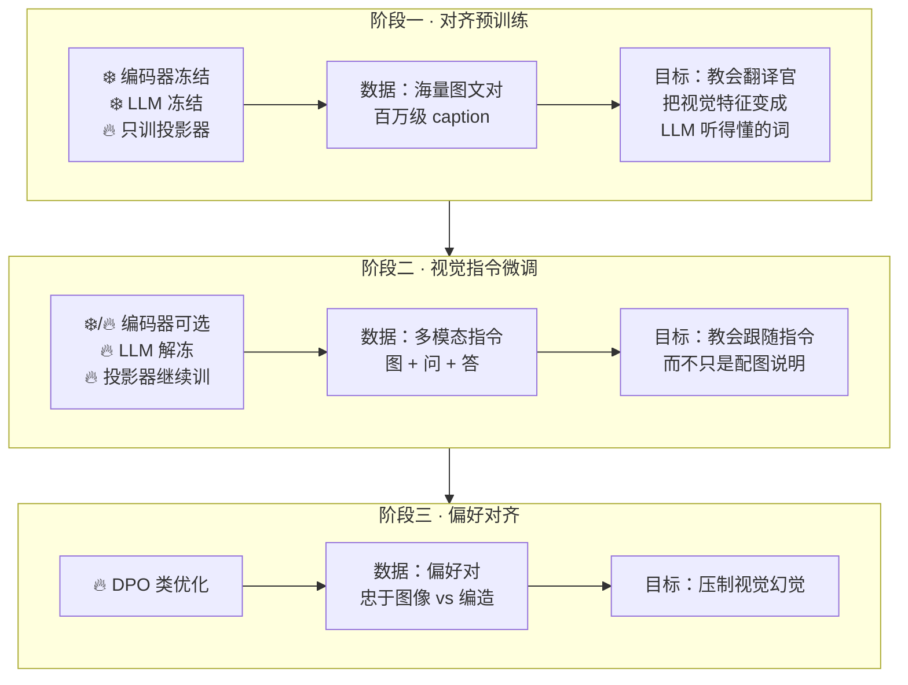
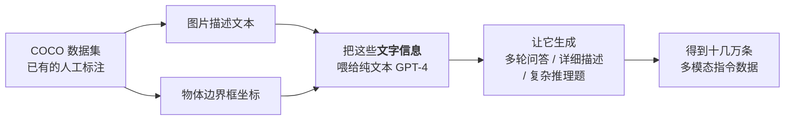

# 训练管线：三阶段如何把三个模块焊在一起

> **角色回顾**：多模态训练管线**唯一的职责是把编码器、投影器、LLM 三个各自预训练好的模块对齐成一个系统**，并教会它跟随指令。它训完即退场，不参与推理。
>
> 这里有个特别之处：三个模块**各自都很强，但从没一起工作过**。编码器会看图，LLM 会推理，中间那个翻译官则是全新的、随机初始化的。**训练管线要解决的就是这个"素未谋面"的问题。**
>
> 这一篇也是视觉幻觉的成因所在——**训练管线的每一个阶段都在留下幻觉的种子**。

---

## 缩写对照表

| 缩写 | 英文全称 | 中文 |
|---|---|---|
| SFT | Supervised Fine-Tuning | 监督微调 |
| DPO | Direct Preference Optimization | 直接偏好优化 |
| RLHF | Reinforcement Learning from Human Feedback | 基于人类反馈的强化学习 |
| RLAIF | Reinforcement Learning from AI Feedback | 基于 AI 反馈的强化学习 |
| LoRA | Low-Rank Adaptation | 低秩适配 |
| MLP | Multi-Layer Perceptron | 多层感知机 |
| ViT | Vision Transformer | 视觉 Transformer |
| POPE | Polling-based Object Probing Evaluation | 一种物体幻觉评测基准 |
| COCO | Common Objects in Context | 一个常用图像标注数据集 |
| OCR | Optical Character Recognition | 光学字符识别 |
| GUI | Graphical User Interface | 图形用户界面 |

---

## 一、三阶段总览



和 [LLM 全景指南 06](../llm-fundamentals/06-training-pipeline.zh.md) 的三级流水线对照，结构惊人地相似——**但每一阶段的目标完全不同**：

| | 纯文本 LLM | 多模态 |
|---|---|---|
| 第一阶段 | 预训练：**注入知识** | 对齐：**打通通路**（不注入知识） |
| 第二阶段 | SFT：教会问答格式 | 视觉指令微调：教会**看图**回答 |
| 第三阶段 | RLHF/DPO：学人类偏好 | 偏好对齐：主要为了**压幻觉** |

**最重要的差异在第一阶段**：纯文本的预训练花掉 99% 的算力用来往权重里压知识；多模态的第一阶段**几乎不注入任何新知识**，它只是在教一个翻译官。视觉知识来自冻结的编码器，世界知识来自冻结的 LLM——**新增的只有"连接"**。

这解释了为什么多模态改造可以如此廉价。

## 二、阶段一：对齐预训练

**冻结编码器、冻结 LLM、只训投影器。**

### 数据长什么样

最简单的形式——图文对：

```
[图片]  +  "一只橘猫趴在窗台上晒太阳"
```

训练时把图过编码器和投影器，得到视觉 token，拼在前面，让 LLM 去生成后面那句描述文本。损失只在文本部分计算（和纯文本 SFT 的 loss masking 一个道理）。

数据来源是网上海量的图文对（如 CC3M、LAION 系列这类从网页 alt 文本抓取的数据集），量级在百万到十亿级。

### 为什么这一步只训投影器

三个理由：

1. **省数据省算力**——投影器只有几千万参数，几十万到几百万条数据就够训；
2. **保护 LLM 的语言能力**——此时投影器是随机初始化的，输出的是垃圾。**如果这时候解冻 LLM，垃圾梯度会直接破坏 LLM 辛苦训出来的语言能力**；
3. **职责清晰**——这一阶段的唯一目标就是"让翻译对上号"，其他什么都不改。

**第 2 条尤其关键**，它是一个反复被验证的工程纪律：**接一个新模块时，先让新模块单独学会说话，再让整体一起调整。**

### 这一步之后模型是什么样

**能看图说话，但不会听指令。**

你给它一张图问"图里有几只猫"，它可能回答"一只橘猫趴在窗台上晒太阳"——**它只学会了"看到图就生成描述"这一个行为模式**。

这和 [LLM 全景指南 06](../llm-fundamentals/06-training-pipeline.zh.md) 里"基座模型只会续写不会帮忙"是同一类现象：**能力已经通了，但取用方式不对。**

## 三、阶段二：视觉指令微调

### LLaVA 点燃这个领域的关键一招

2023 年 LLaVA 的核心贡献不是架构（架构就是一个线性层），而是**数据**。

问题是：**"图 + 问题 + 理想回答"这样的指令数据，当时几乎不存在。** 人工标注又慢又贵。

LLaVA 的做法非常巧妙：



关键在于：**生成数据的 GPT-4 根本没看到图片**。它只看到了图片的文字标注（描述 + 物体坐标），却据此写出了高质量的视觉问答。

这一招把"多模态指令数据"的成本从人工标注降到了 API 调用，**直接引爆了开源多模态生态**——此后几乎所有开源多模态模型的指令数据都沿用了这个思路。

### 数据配比塑造模型性格

现代的视觉指令数据集是多路混合的，配比直接决定模型擅长什么：

| 数据类型 | 教会什么 | 缺了会怎样 |
|---|---|---|
| 通用视觉问答 | 基本的看图对话 | 答非所问 |
| **OCR / 文档** | 读字、读表格、读版面 | 文档理解能力约等于零 |
| **图表理解** | 读折线、柱状、饼图 | 看不懂数据图 |
| **Grounding（定位）** | 输出坐标框 | **坐标基本是编的** |
| GUI 操作 | 识别界面元素与可点击区域 | 做不了 GUI Agent |
| **纯文本数据** | 保住原有语言能力 | **灾难性遗忘**（见失败行为） |

**最后一行是最容易被忽略、后果最严重的一条。**

### 冻结与解冻：一张决策表

这一阶段的核心工程决策是"解冻谁"：

| 模块 | 常见做法 | 理由 |
|---|---|---|
| **投影器** | 🔥 总是训 | 它是主角 |
| **LLM 主干** | 🔥 通常解冻（或用 LoRA） | 不解冻就学不会"看图回答"这个新行为 |
| **视觉编码器** | ❄️ 常冻结；🔥 追求 OCR/文档能力时解冻 | 解冻能显著提升细粒度识别，但需要更多数据且容易训崩 |

第三行是当前的一个活跃战场：**想把文档理解做到顶尖，几乎必须解冻编码器**——因为 CLIP 的原始训练目标（图文匹配）并不特别关心"把每个字符都编码清楚"。但解冻编码器意味着更高的训练成本和更大的不稳定风险。

## 四、阶段三：偏好对齐，主要为了压幻觉

纯文本 LLM 的第三阶段是学人类偏好（有帮助、诚实、无害）。**多模态的第三阶段有一个更具体、更紧迫的目标：让模型忠于它实际看到的东西。**

做法沿用 [LLM 全景指南 07](../llm-fundamentals/07-post-training.zh.md) 的工具（DPO 为主），但偏好对的构造针对性很强：

```
同一张图 + 同一个问题
  ├─ 好回答（chosen）：只描述图里确实存在的东西
  └─ 差回答（rejected）：包含编造的物体、错误的属性、不存在的关系
```

代表工作是 RLHF-V（用细粒度的人工修正作为反馈）和 RLAIF-V（用更强的模型来产生偏好标注，成本大幅下降）。

**效果是显著的**——物体幻觉类基准（如 POPE）上的提升很明显。**但它压制的是症状，不是病因**。病因在下一节。

## 五、"原生多模态"的不同做法

[02 · 多模态 LLM 是什么](02-what.zh.md) 提过这条路线。它和上面的三阶段差别在哪？

| | 嫁接式（本篇主线） | 原生式 |
|---|---|---|
| 起点 | 已训好的 LLM + 已训好的编码器 | **从零开始** |
| 预训练数据 | 纯文本先训 LLM，之后才见到图 | **文本和图像从第一个 token 起就混在一起** |
| 阶段一的性质 | 打通翻译（不注入知识） | **同时注入语言知识和视觉知识** |
| 成本 | 可以只训 1% 参数 | 完整的预训练成本 |
| 模态融合深度 | 视觉是外挂通道 | 模态在最底层就交织 |

原生式的理论优势是**更深的模态融合**——视觉和语言的表示从一开始就在同一个空间里长出来，而不是事后对齐。代价是它需要完整的预训练预算，**只有少数机构做得起**（[01 · 为什么需要多模态](01-why.zh.md) 的约束一）。

**实践上两者在收敛**：嫁接式在往"更早融合、更多阶段、解冻更多模块"走，原生式也会用现成的编码器做初始化。

## ⚓ 回到示例

运行示例里模型能做对三件事，每一件都对应训练管线的一个具体环节：

| 模型做对的事 | 归功于哪个阶段 |
|---|---|
| **把视觉信息接进语言推理**（能谈论图里的东西） | 阶段一：投影器学会了翻译 |
| **准确复述"同步失败：网络连接超时"** | 阶段二：OCR / 文档类指令数据 |
| **说出"右下角"这个空间判断** | 阶段二：grounding / GUI 类指令数据 + M-RoPE |
| **回答的是"该点哪个按钮"而不是描述整张截图** | 阶段二：指令跟随 |
| **没有编造出弹窗里不存在的按钮** | 阶段三：偏好对齐压制幻觉 |

**倒过来看更有价值**：如果一个模型在你的截图任务上表现很差，你基本可以反推它缺了哪一课——

- 答非所问、只会描述图 → **缺阶段二的指令数据**；
- 字读错、读不全 → **缺 OCR 类数据，或分辨率不够**（[04](04-vision-encoder.zh.md)）；
- 位置说反 → **缺 grounding 数据，或位置编码没处理好**（[06](06-llm-backbone-fusion.zh.md)）；
- 编造出不存在的按钮 → **缺阶段三**。

## 六、失败行为

### 视觉幻觉：语言先验压过视觉证据

**这是多模态特有的、也是最重要的失败模式。**

现象：你给模型一张**没有冰箱**的厨房照片，问"冰箱是什么颜色的？"——很多模型会自信地回答"白色"。

**成因有三层，一层比一层深：**

**① 架构层**：[06 · LLM 主干](06-llm-backbone-fusion.zh.md) 讲过，LLM **无法区分 token 的模态来源**。一个来自图像的证据和一个来自语言先验的推测，在注意力机制里权重是同等的。**架构上就没有"我看到的" vs "我猜的"这个区分。**

**② 数据层**：训练数据里的 caption 本身就带偏。人们描述厨房照片时会写"宽敞的厨房"，很少写"这个厨房里没有冰箱"。**模型见过无数"厨房→有冰箱"的共现，却几乎没见过否定的例子。**

这和 [LLM 全景指南 11](../llm-fundamentals/11-hallucination.zh.md) 讲的"语料里没有『我不知道』的示范"是同构的问题——**否定式的描述在自然语料里天然稀缺。**

**③ 注意力层**：几千个视觉 token 里，真正相关的可能只有几十个。[LLM 全景指南 10](../llm-fundamentals/10-context-window.zh.md) 讲的注意力稀释在这里同样成立——**视觉证据本来就弱，语言先验相对就强。**

**实用对策**：
- 提示词里明确授权否定："如果图中没有，请直接说没有"；
- 问开放式问题（"图里有哪些电器"）而不是预设式问题（"冰箱什么颜色"）——**预设式问题本身就在诱导幻觉**；
- 关键判断做二次校验（换个问法再问一遍，看是否一致）。

### 灾难性遗忘：语言能力悄悄退化

阶段二解冻 LLM 之后，如果**只用多模态数据训练**，模型的纯文本能力会明显下降——数学变差、代码变差、长文写作变差。

**这是开源社区反复踩的坑**，因为它不报错，只是悄悄退化。而多模态基准测试不会测纯文本能力，所以很容易发布之后才被用户发现。

**标准解法**：在阶段二的数据里**混入相当比例的纯文本数据**。这是一条必须遵守的纪律。

### 模态坍塌：模型学会了忽略图像

一个隐蔽的失败：如果指令数据里有相当一部分问题**不看图也能答对**（"图中的动物通常吃什么？"），模型会学到一个省力的捷径——**忽略视觉 token，纯靠语言知识回答**。

表现是：给它一张完全不相干的图，回答居然还差不多。

**这是数据构造的问题**：指令数据必须**强制依赖图像**才能答对。

### 分辨率与数据不匹配

用低分辨率数据训练的模型，推理时给它高分辨率图，效果未必更好——**编码器没见过那么多 patch，位置编码也在外推区**。反之亦然。

## 一句话总结

**训练管线把三个素未谋面的模块焊成一个系统，分三步走**：阶段一冻结两端只训投影器（打通翻译，不注入知识）；阶段二解冻 LLM 做视觉指令微调（LLaVA 用纯文本 GPT-4 合成数据这一招引爆了整个开源生态）；阶段三用 DPO 类方法压制视觉幻觉。而**视觉幻觉的病根在架构层——LLM 无法区分"看到的"和"猜的"**，偏好对齐只能压制症状。另外两条必须记住的纪律：**阶段二一定要混入纯文本数据**（否则语言能力灾难性遗忘），**指令数据必须强制依赖图像**（否则模型学会忽略图像）。

---

**下一篇**：[08 · 模态解码器与 Any-to-Any：让模型也能"说"出图像和声音](08-any-to-any.zh.md)

**系列目录**：[index.md](index.md)
