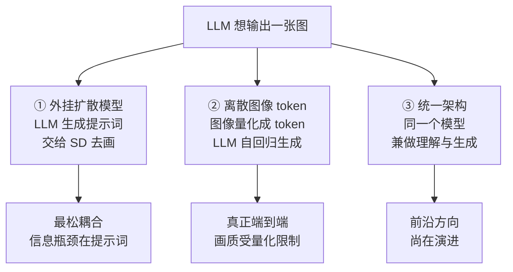
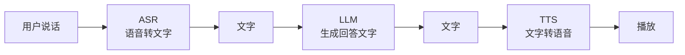

# 模态解码器与 Any-to-Any：让模型也能"说"出图像和声音

> **角色回顾**：模态解码器**唯一的职责是把 LLM 的输出变成非文本信号**（图像、音频）。它**不参与理解**——它是完全独立的一条支路，挂在整个系统的输出端。它对应运行示例第 7 步的可选分支。
>
> 前七篇讲的都是"输入多模态"：图进、文出。这一篇讲**输出也多模态**：文进、图出；音进、音出。
>
> 核心问题只有一个，而且在 [02 · 多模态 LLM 是什么](02-what.zh.md) 已经预告过：**理解和生成需要的是两种互相矛盾的表征。** 这一篇把这个矛盾讲透，然后看业界的三条破解路线各自付出了什么代价。

---

## 缩写对照表

| 缩写 | 英文全称 | 中文 |
|---|---|---|
| VQ-VAE | Vector Quantized Variational Autoencoder | 向量量化变分自编码器 |
| VQGAN | Vector Quantized Generative Adversarial Network | 向量量化生成对抗网络 |
| ASR | Automatic Speech Recognition | 自动语音识别 |
| TTS | Text-To-Speech | 文本转语音 |
| LLM | Large Language Model | 大语言模型 |
| ViT | Vision Transformer | 视觉 Transformer |
| SD | Stable Diffusion | 一个开源图像扩散模型 |

---

## 一、根本矛盾：理解要扔掉细节，生成要留住细节

这是全篇的地基。

回顾 [04 · 视觉编码器](04-vision-encoder.zh.md)：编码器把一张 200 万像素的图压成几千个语义向量。**这个压缩比是几百倍，而且是有意为之的有损压缩**——它扔掉了纹理、精确色值、笔画的每一个像素，只留下"这是什么"。

**这对理解是好事**：语义越纯粹，LLM 越好推理。

**但对生成是灾难**：你没法从"一只橘猫趴在窗台上"这个语义，重建出**那一只**特定的猫。原图的信息已经不在了。

| | 理解需要的表征 | 生成需要的表征 |
|---|---|---|
| 压缩方向 | **有损压缩成语义**——扔掉细节 | **保留足够信息以重建**——留住细节 |
| 好的表征标准 | "相似的图，向量也相似" | "从向量能还原出原图" |
| 典型训练目标 | 对比学习（CLIP） | 重建损失 / 扩散去噪 |
| 输出 | 一段文本 | 一张图 |

**两个目标在方向上是相反的。** 这就是为什么"看图"和"画图"至今仍是两套不同的模型——**不是因为没人想统一，是因为统一意味着要找到一种同时满足两个矛盾需求的表征。**

## 二、图像生成的三条路线



### ① 外挂扩散模型 —— 最常见、最松耦合

LLM 生成一段文本提示词，交给一个独立的扩散模型（Stable Diffusion、Flux 等）去画。

**这是绝大多数"能画图的聊天助手"的真实实现。**

- **优点**：两个模型各自最优、可独立升级、工程简单；
- **致命缺点**：**信息瓶颈又回到了文字**。

最后这一点值得停下来品一下——它和 [01 · 为什么需要多模态](01-why.zh.md) 里批评的"OCR → 文本 → LLM"拼接管线，**是完全同构的问题，只是方向反过来了**：

```
输入侧的拼接管线： 图像 →【文字】→ LLM      ← 我们花了七篇讲为什么要绕开它
输出侧的外挂扩散： LLM →【文字】→ 图像      ← 同一个瓶颈，还在那里
```

后果很具体：你说"把上一张图里的猫改成橘色"，LLM 只能把这句话转成提示词交给扩散模型——**而扩散模型根本没看过上一张图**。所以你得到的是一只全新的橘猫，而不是原来那只猫变了颜色。

### ② 离散图像 token —— 真正的端到端

思路很漂亮：**既然 LLM 擅长自回归地生成 token 序列，那就把图像也变成 token 序列。**

**VQ-VAE / VQGAN** 做的就是这件事：

1. 训练一个编码器把图像块映射到一个**有限的码本（codebook）**里，比如 8192 个"视觉词"；
2. 于是一张图变成了一串离散的整数——**和文本 token 完全同构**；
3. LLM 自回归地生成这串整数；
4. 配套的解码器把整数序列还原成像素。

**这一步的意义**：图像生成被彻底转化成了"预测下一个 token"——**和 [LLM 全景指南](../llm-fundamentals/index.md) 讲的那套机制一模一样**。同一个 Transformer、同一个损失函数、同一套采样参数，可以无缝地在文本和图像之间切换。

代表工作是 Chameleon、Emu3 这类"早期融合、全离散 token"的模型。

- **优点**：真正端到端；图文可以任意交错生成；不再有文字瓶颈——模型能"看着上一张图"来改它；
- **缺点**：**量化本身有损**。码本大小限制了画质上限，细节和纹理通常不如专门的扩散模型；序列很长（一张图几千个 token），生成慢。

### ③ 统一架构 —— 前沿方向

让同一个模型同时承担理解和生成，常见做法是给 LLM 接一个扩散式的输出头，或者让同一个骨干在两种目标下联合训练。

这是当前最活跃的研究方向，**因为它直面第一节那个矛盾**：能不能找到一种表征，既足够语义化以支持推理，又足够完整以支持重建？

目前还没有定论。**但趋势很明确：理解和生成正在向同一个模型收拢。**

## 三、音频：级联 vs 端到端，差别肉眼可见

音频是"输出多模态"里最快落地、体验差异最直观的一块。

### 级联方案：三段串行



这是 2024 年之前所有语音助手的做法。三个独立模型串起来，问题也是三重的：

| 问题 | 具体表现 |
|---|---|
| **延迟累加** | 三段串行，每段几百毫秒，总延迟常常超过 1~2 秒 |
| **必须等说完** | ASR 要等你说完整句才能出结果，无法边听边想 |
| **副语言信息全丢** | 语气、情绪、重音、笑声、犹豫——**在转成文字的那一刻全部消失** |
| **无法自然打断** | 系统在播放时听不见你，插话机制要靠工程 hack |

**第三行又是那个熟悉的文字瓶颈。** 你用嘲讽的语气说"这可真是太棒了"，ASR 输出的就是"这可真是太棒了"——LLM 拿到的是字面意思。

### 端到端方案：音频直接进出

把音频也变成 token（用音频编码器和音频码本），**让 LLM 直接吃音频 token、吐音频 token**：

- **延迟压到几百毫秒**——省掉了两次模态转换和串行等待，接近真人对话的节奏；
- **保留副语言信息**——语气、情绪进了模型，模型也能用语气回应；
- **可以自然打断**——因为模型始终在听，输入输出是流式的。

**这就是 GPT-4o 一代实时语音之所以"感觉不一样"的技术原因**：不是 TTS 的音色变好了，而是**中间那道文字瓶颈被拆掉了**。

**代价**：音频 token 序列非常长（每秒几十到上百个 token），对上下文预算和推理速度的压力很大——又回到了 [04 · 视觉编码器](04-vision-encoder.zh.md) 那条老矛盾：**保真度 ↔ token 预算。**

## 四、与邻居的契约

- **上游（LLM 主干）**：接收 LLM 的输出——可能是文本提示词（路线 ①）、离散图像/音频 token（路线 ②）、或隐藏状态（路线 ③）；
- **下游（用户）**：交付像素或波形；
- **不做的事**：**完全不参与理解**。它是一条单向的输出支路，理解链路上的任何一步都不经过它。

最后一条有个实用推论：**一个模型"能画图"和它"看图看得好不好"完全没有关系**。选型时这两个能力要分开评估，别因为它会画图就假设它读文档也强。

## ⚓ 回到示例

运行示例的输出是纯文本，模态解码器**没有出场**。

但如果这是一个 Omni（全模态）模型，第 7 步会多一条分支：模型可以**直接把回答说出来**——而且是端到端的，不经过"先生成文字再 TTS"这一步。

这个差别在这个场景下非常实际：**你正拿着手机对着报错弹窗，手上可能腾不出来。** 端到端语音意味着你可以直接问出口、直接听到答案，延迟在几百毫秒，还能中途打断说"等等，左边那个按钮是什么"。

再往前一步想，一个真正的 any-to-any 模型还能做一件今天做不到的事：**直接在你的截图上画一个圈标出该点的位置**。

这需要它同时具备：
- **理解**——看懂截图（前七篇的全部内容）；
- **生成**——输出像素（本篇）；
- **而且两者共享同一份对这张图的表征**——这样"圈出来的位置"才和"看到的位置"是同一个。

**第三点正是第一节那个矛盾的核心难题**，也是统一架构真正想解决的问题。今天的模型只能退而求其次：输出一个坐标框，让外部程序去画。

## 五、失败行为

**外挂扩散的"失忆"**
"把刚才那张图改一下"——外挂路线做不到，因为扩散模型没看过刚才那张图。**这是路线①的结构性缺陷，不是模型不够聪明。**

**离散 token 的画质天花板**
量化损失导致细节和纹理不如专用扩散模型。**文字渲染尤其困难**——图像里要画出正确的文字，对码本表达能力的要求非常高。

**音频 token 吃光上下文**
长语音对话的 token 消耗惊人。多轮实时语音的成本结构和文本聊天完全不是一个量级。

**"能画图"被误读为"视觉能力强"**
理解与生成是两条独立支路。**别用生成能力去推断理解能力**，反之亦然。

**端到端语音的可控性下降**
文字这个中间层虽然是瓶颈，但它也是一个**可审计、可过滤、可日志化**的检查点。去掉之后，内容安全和合规检查都变难了——**这是端到端方案一个真实但少被讨论的代价。**

## 一句话总结

**理解要有损压缩成语义，生成要保留细节以重建——两个需求方向相反**，这是"看图"和"画图"至今仍是两套模型的根本原因。业界三条路线：外挂扩散（最常见，但把信息瓶颈又还给了文字，和输入侧的拼接管线同构）、离散图像 token（真正端到端，代价是量化损失和序列长度）、统一架构（前沿方向）。音频侧的级联 vs 端到端差异最直观：**拆掉文字瓶颈把延迟从秒级压到几百毫秒，还保住了语气和情绪**——代价是可审计性下降和 token 消耗剧增。

---

**下一篇**：[09 · 完整重演：一张截图的完整旅程 + 动手练习](09-walkthrough.zh.md)

**系列目录**：[index.md](index.md)
