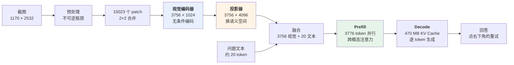

# 完整重演：一张截图的完整旅程 + 动手练习

> 八篇文章，每一篇都在往同一张地图的某一格里填内容。这一篇把它们缝成一个连续的故事。
>
> 同一张截图、同一句问题——但这次每一跳都能看到内部：从 1170×2532 个像素被切成 15023 个方块，到第 3756 个视觉 token 被翻译进 LLM 的词汇空间，再到注意力矩阵里"按钮"这个字的 Q 和右下角那片像素的 K 撞在一起的那一刻。
>
> 然后是六个动手练习。**每个练习验证一篇文章的一个具体论断**——尤其是那条最反直觉的："模型看到的从来不是你上传的那张图"。

---

## 场景重申

你的手机 App 弹出一个报错窗口。你截了张图（**1170 × 2532 像素**，iPhone 整屏），连同一句话发给模型：

> **"这个报错什么意思？我接下来该点哪个按钮？"**

模型的回答：

> "弹窗提示『同步失败：网络连接超时（错误码 ETIMEDOUT）』，说明 App 在向服务器同步数据时超时了，通常是网络不稳定或服务端暂时不可用。弹窗底部有两个按钮，左边是『取消』，右边是『重试』——建议先确认网络连接，然后点**右下角的『重试』**。"

---

## 全深度时间线

### T−N 个月 · 训练侧（[07 · 训练管线](07-training-pipeline.zh.md)）

三个模块被分别造好，然后焊在一起。

**编码器**（[04](04-vision-encoder.zh.md)）：一个 SigLIP 视觉塔，在数亿对图文上做过对比学习。它的特征**天然朝着语言概念组织**——这是后面一切能低成本进行的前提。

**LLM 主干**（[06](06-llm-backbone-fusion.zh.md)）：一个已经走完预训练 + SFT + DPO 全流程的语言模型（[LLM 全景指南 06](../llm-fundamentals/06-training-pipeline.zh.md)、[07](../llm-fundamentals/07-post-training.zh.md)）。它知道 ETIMEDOUT 是什么、知道网络超时通常怎么排查、知道"重试"通常是主操作——**这些世界知识全部来自纯文本时代，和图像无关。**

**投影器**（[05](05-projector.zh.md)）：一个随机初始化的两层 MLP。三个模块里唯一的新面孔。

然后是三阶段焊接：

- **阶段一**：冻结两端，只训这个 MLP，用百万级图文对。翻译官学会了把视觉特征搬进 LLM 的语义空间。此时模型能看图说话，但不会听指令；
- **阶段二**：解冻 LLM，用多模态指令数据训练。**其中的 OCR/文档类数据教会了它读屏幕上的字，grounding/GUI 类数据教会了它说"右下角"**。同时混入纯文本数据，防止语言能力灾难性遗忘；
- **阶段三**：DPO 类偏好对齐，压制"编造出弹窗里不存在的按钮"这类视觉幻觉。

> **这一步决定了后面的一切。** 你稍后看到的每一个正确判断，在这一刻就已经被决定了。

### T+0ms · 你按下发送

### 第 1 步 · 预处理：图被改造了（[04](04-vision-encoder.zh.md)）

**这是整条链路上唯一不可逆的信息瓶颈。**

假设模型走原生动态分辨率路线：图像按 14×14 像素切分，得到约

$$
\lfloor 1170/14 \rfloor \times \lfloor 2532/14 \rfloor \approx 83 \times 181 = 15023 \text{ 个 patch}
$$

经过 **2×2 相邻合并**压缩 4 倍 → **约 3756 个视觉 token**。

**停下来感受一下这个数字**：一张截图 ≈ 3756 个 token ≈ 三千字的文章。

对比一下老一代固定 336×336 的模型：整张截图会被压到**面积的 1/26**，"错误码 ETIMEDOUT"那行小字大概率直接糊成灰块。**示例能成立，前提就是分辨率够。**

### 第 2 步 · 切成 patch

"重试"两个字大约占 40×40 像素，横跨约 **9 个 patch**（3×3）。

**没有任何单个 patch 认识"重试"这个词**——每个 patch 只看到笔画的一个碎片。

### 第 3 步 · 视觉编码器前向（[04](04-vision-encoder.zh.md)）

ViT 的自注意力开始工作。那 9 个 patch 互相关注，把碎片笔画**重新组装**成"这是『重试』两个字"的语义；二维位置编码让它们携带"我在图像右下方"的信息。

按钮的边框、背景色块、与左边"取消"按钮的相对位置——全被编码进特征向量。

**关键提醒**：此刻编码器**完全不知道你问了什么**。它平等地编码了状态栏的时间、顶部导航栏、弹窗的每一寸像素。**筛选是后面的事。**

### 第 4 步 · 投影器翻译（[05](05-projector.zh.md)）

3756 个 1024 维的特征向量，逐个被两层 MLP 映射到 4096 维——**同时从"SigLIP 的语义空间"搬到"这个 LLM 的语义空间"**。

翻译之后发生了整个架构里最本质的一件事：

> 那个编码着"重试"按钮的向量，在 LLM 的嵌入空间里，**落在了离"重试""按钮""确认"这些词的嵌入不远的位置**。

**图像的一个区域，变成了 LLM 词汇空间里的一个"意思"。**

从这一刻起，LLM 不知道这个 token 来自像素。对它来说，这就是序列里的第 1523 个 token。

### 第 5 步 · 融合（[06](06-llm-backbone-fusion.zh.md)）

3756 个视觉 token 拼在前面，你那句问题的约 20 个文本 token 跟在后面。**总序列长度约 3776。**

M-RoPE 给每个视觉 token 打上 `(行, 列)` 坐标——"重试"那几个 token 携带着"第 175 行、第 60 列附近"的位置信息。**没有这一步，模型分不清"正上方"和"同行远处"。**

### 第 6 步 · Prefill：跨模态推理真正发生的地方（[06](06-llm-backbone-fusion.zh.md)）

3776 个 token 一次并行前向。注意力矩阵里：

- **"按钮"这个文本 token 的 Q**，与所有编码着按钮状物的视觉 token 的 K 高度匹配；
- **"哪个"和"点"**把注意力引向可交互区域；
- **M-RoPE 的坐标**让模型建立"这个按钮在右下"的空间判断。

> **这就是跨模态推理**——不在编码器里，不在投影器里，而在这里：文本的 Q 和视觉的 K 做点积的那一刻。

**顺带解释"传图后要等好几秒"**：注意力是平方级的，3776 个 token 的 prefill 计算量是纯文本 20 个 token 的**三万倍**。首字延迟就是这么来的，流式输出救不了这一段。

### 第 7 步 · Decode：逐字生成

每一步读全部权重 + 全部 KV Cache（含约 **470 MB** 的视觉 KV）——**这就是传图之后连生成都变慢的原因**，也是多模态服务并发能力远低于纯文本的原因。

模型输出的两句话，来源其实不同：

| 输出 | 它在做什么 |
|---|---|
| "弹窗提示『同步失败：网络连接超时』" | **复述**视觉 token 携带的语义 |
| "通常是网络不稳定或服务端暂时不可用" | **调用纯文本时代学到的世界知识** |
| "点右下角的『重试』" | **综合**视觉的空间位置 + 语言先验（"重试"通常是主操作） |

**最后一行藏着风险**：如果这个 App 的按钮顺序恰好是反的（"重试"在左），而视觉信号又不够强，语言先验就可能压过实际看到的东西——**这就是 [07](07-training-pipeline.zh.md) 讲的视觉幻觉，架构上 LLM 无法区分"我看到的"和"我猜的"。**

### 带数据的全景图

---

## 收束：回到第 1 篇的四堵墙

[01 · 为什么需要多模态](01-why.zh.md) 列了四堵墙。刚才这几秒里：

| 那堵墙 | 刚才发生了什么 |
|---|---|
| **① 世界的信息不只有文本** | 一张截图直接成为输入，不需要人转述 |
| **② 感知任务碎片化** | **没有调用 OCR、没有调用检测器、没有调用分类器**——一个模型一次前向 |
| **③ 拼接管线有损** | 版面、按钮位置、颜色全部保留到了推理那一刻；模型是**带着问题**在看图，而不是先把图压成一句话 |
| **④ 跨模态推理无从谈起** | "该点哪个按钮"这个问题，同时需要读字（视觉）、判断位置（视觉）、理解 ETIMEDOUT（语言知识）——**三者在同一个注意力矩阵里完成** |

用旧范式做这件事：OCR 引擎读字 + 检测器框按钮 + 规则引擎判断位置关系 + LLM 解释错误码，四个系统、四套运维，而且 OCR 一旦读错，后面全错。

**四堵墙，在这个日常到不起眼的场景里被全部推倒。**

---

## 动手练习：六个验证

每个练习验证一篇文章的一个具体论断。建议按顺序做。

### 练习 1 · 证明"模型看到的不是你上传的图"

**验证**：[04 · 视觉编码器](04-vision-encoder.zh.md) —— 信息在预处理阶段就丢了。

1. 找一张**含小字**的高分辨率图（一页 PDF、一张长截图、一张有脚注的图表）；
2. 原图直接传，让模型读出某个角落的小字——大概率读错或读不全；
3. **不要加任何提示词**，直接把那块区域**裁剪出来放大**再传一次。

**如果第 3 步就对了，那就证明问题不在"理解"，在"分辨率"。**

进阶：如果 API 提供 `detail: low / high` 之类的开关，用同一张图对比两档的结果和 token 消耗。

### 练习 2 · 亲眼看到 token 预算

**验证**：[04](04-vision-encoder.zh.md) —— token 数只由分辨率决定，与内容无关。

调用任意多模态 API，读返回的 `usage` 字段里的输入 token 数：

1. 传一张 **512×512** 的图，记录 token 数；
2. 传一张 **2048×2048** 的图，记录 token 数——**看是不是接近 16 倍**；
3. **传一张纯白的 2048×2048 图**，再记录一次。

**第 3 步是关键**：纯白图和信息密集的图 token 数几乎一样。**这条会永久改变你传图前的思考方式。**

### 练习 3 · 证明编码器不知道你要问什么

**验证**：[04](04-vision-encoder.zh.md) 与 [05](05-projector.zh.md) —— 编码是无条件的。

对同一张复杂的图，分别问两个完全不相干的问题（"左上角写了什么" vs "整体色调是什么"）。

观察：**输入 token 数完全一样**（图的编码开销与问题无关），而且如果 API 支持前缀缓存，第二次的图像部分应该命中缓存。

**这印证了"编码器对整张图做无条件编码，筛选是 LLM 的工作"。**

### 练习 4 · 触发一次视觉幻觉，再消除它

**验证**：[07 · 训练管线](07-training-pipeline.zh.md) —— 语言先验压过视觉证据。

三步，**顺序很重要**：

1. 找一张**缺少某个常见物体**的场景照（没有冰箱的厨房、没有时钟的教室、没有键盘的桌面）；
2. 问一个**预设式问题**："冰箱是什么颜色的？"——很多模型会直接回答颜色；
3. 换成**开放式问题**："图里有哪些电器？如果没有请直说。"

**对比 2 和 3 的差别**，你会直观理解为什么"预设式问题本身就在诱导幻觉"，以及为什么"明确授权否定"是性价比最高的一条对策。

### 练习 5 · 测试空间理解的真实精度

**验证**：[06 · LLM 主干与融合](06-llm-backbone-fusion.zh.md) —— 位置编码与 grounding 能力。

给模型一张界面截图，要求它输出某个按钮的**归一化坐标框**（如 `[x1, y1, x2, y2]`，0~1 范围）。

把坐标画回原图看看差多少。然后：
- 换一个**没做过 grounding 训练**的模型，对比——差距通常大到离谱；
- 试试小目标和密集排列的元素，看精度如何塌陷。

**这条决定了你能不能用它做 GUI Agent。**

### 练习 6 · 检查多模态版本的语言能力有没有退化

**验证**：[07](07-training-pipeline.zh.md) —— 灾难性遗忘。

找一个**同底座的纯文本版和多模态版**（如 `Qwen2.5-7B-Instruct` vs `Qwen2.5-VL-7B-Instruct`），用**纯文本**题目（数学题、代码题、长文改写）各跑一遍。

**如果多模态版明显更差，你就亲眼看到了灾难性遗忘**——以及为什么阶段二必须混入纯文本数据。

---

## 延伸阅读

**本仓库的姊妹系列**：
- [LLM 全景指南](../llm-fundamentals/index.md) —— 本系列的地基。尤其推荐 [04 · Transformer 内部构造](../llm-fundamentals/04-transformer.zh.md)（注意力机制）、[10 · 上下文窗口](../llm-fundamentals/10-context-window.zh.md)（token 预算）、[11 · 幻觉的机制](../llm-fundamentals/11-hallucination.zh.md)（视觉幻觉的同构问题）
- [LLM 推理系列](../llm-inference/index.md) —— prefill/decode、KV Cache、量化的工程细节，多模态全部继承

**外部资源**：
- **《An Image is Worth 16x16 Words》(ViT, 2020)** —— patch 切分的原始论文
- **《Learning Transferable Visual Models From Natural Language Supervision》(CLIP, 2021)** —— 为什么大家都用它的编码器
- **《Visual Instruction Tuning》(LLaVA, 2023)** —— 三阶段训练与合成指令数据这一招的出处
- **《Flamingo》(2022)** —— 交叉注意力融合路线的代表
- **Qwen2-VL / InternVL / Llama 3 技术报告** —— 动态分辨率、token 压缩、M-RoPE 的工程实录，本系列大量数字出自这里

---

## 一页带走全部

| 问题 | 一句话答案 |
|---|---|
| **多模态 LLM 是什么** | 在预训练 LLM 之上外接一个感知通道，把非文本信号翻译成**嵌入向量**而非文字，绕过"必须先说成人话"这个有损瓶颈 |
| **为什么不能先 OCR 再交给 LLM** | 空间关系、颜色、非文字内容全丢，而且 OCR 的错误被**硬化**成事实，下游无法挽救 |
| **图像怎么变成 token** | 切成 14×14 的 patch，线性投影，过 ViT。**没有词表，切分是机械网格，一个字可能横跨 4 个 patch** |
| **为什么都用 CLIP/SigLIP 的编码器** | 不是因为视觉能力最强，而是**它的特征离语言最近**，让投影器只需换坐标系 |
| **为什么模型看不清小字** | **信息在预处理缩放时就丢了**，那些像素根本没进模型。加提示词无效，该调分辨率或裁剪 |
| **一张图占多少 token** | 只由分辨率决定，随分辨率**平方**增长。一张高清截图 ≈ 几千 token ≈ 一篇长文。**纯白图和密集表格花一样的钱** |
| **投影器是什么** | 参数不到 1% 的坐标变换器，唯一为"连接"而生的模块。**它只换坐标系，编码器没编出来的它变不出来** |
| **视觉 token 怎么进 LLM** | 主流是**前缀拼接**——伪装成文本嵌入直接插进序列。LLM 一行代码不用改，代价是全额占用上下文和 KV Cache |
| **为什么传图后又慢又贵** | prefill 是平方级（首字延迟），KV Cache 被视觉 token 大量占用（并发骤降）。**按纯文本经验做容量规划一定翻车** |
| **视觉幻觉为什么难治** | **架构上 LLM 无法区分"我看到的"和"我猜的"**；训练数据里否定式描述天然稀缺。偏好对齐只压症状不治病因 |
| **为什么能看图却不能画图** | 理解要**有损压缩成语义**，生成要**保留细节以重建**——两个需求方向相反 |
| **实践三条铁律** | ① 看不清就提分辨率或裁剪，别加提示词 ② 问开放式问题而非预设式问题 ③ 传图前想想这张图真的需要这个分辨率吗 |

---

**系列完结。** 感谢读到这里。

回到 [系列目录](index.md) · 继续 [LLM 全景指南](../llm-fundamentals/index.md) · [LLM 推理系列](../llm-inference/index.md)
