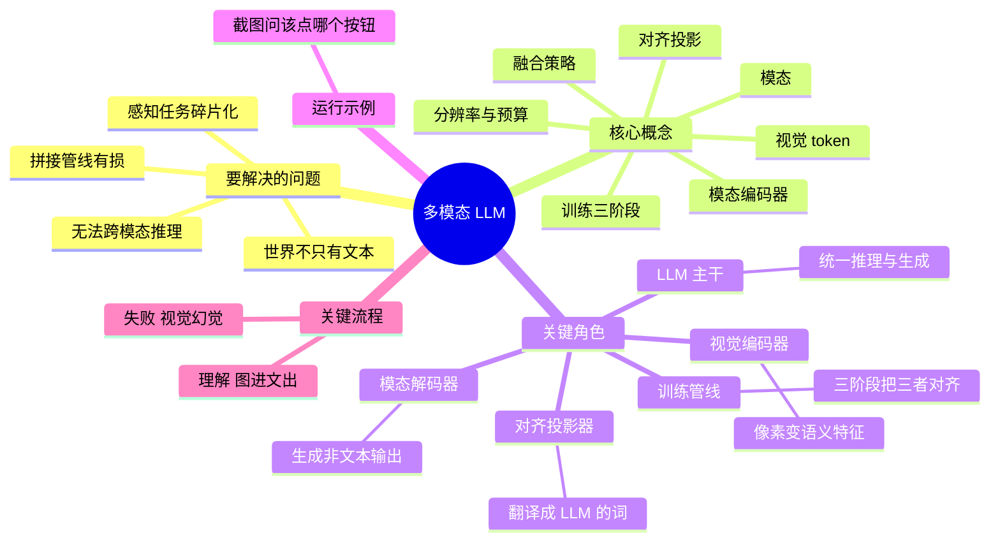
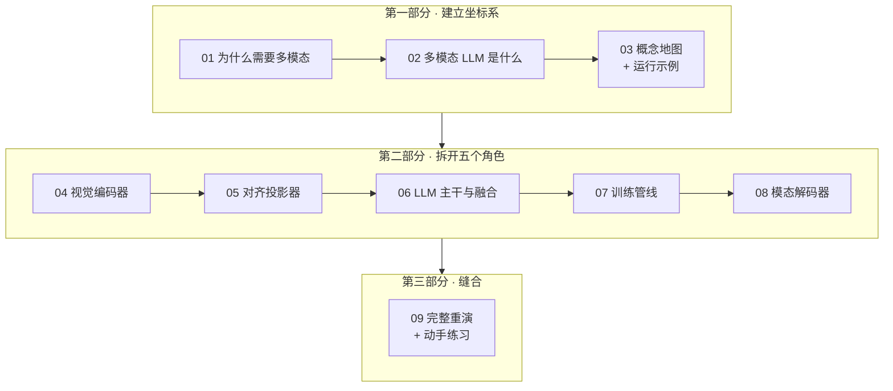

# 多模态大模型 / Multimodal LLM Series

[← Back to AI](../README.md)

一个把"大模型如何看懂图像、听懂声音"讲透的中文系列。**十篇文章、一条主线**：从"为什么纯文本 LLM 必然要长出眼睛"开始，拆开视觉编码器、对齐投影器、LLM 主干、训练管线、模态解码器五个关键角色，最后带着全部深度重跑一遍开篇的示例。

姊妹系列：[LLM 全景指南](../llm-fundamentals/index.md) —— 本系列默认你已经知道 token、参数、预训练/后训练、推理这些基本概念；不清楚的话建议先读那一篇的前三章。

---

## 一条主线：贯穿全篇的运行示例

> 你的手机 App 弹出一个报错窗口。你截了张图，连同一句话发给模型：
> **"这个报错什么意思？我接下来该点哪个按钮？"**
>
> 模型准确复述了弹窗里的错误文案、解释了原因，并告诉你点右下角那个"重试"。
> **它没有调用 OCR，没有调用任何检测模型，全程只有一次前向计算。** —— 这怎么做到的？

示例在[第 3 篇](03-concept-map.zh.md)完整定义，之后每篇结尾的 **⚓ 回到示例**都会把当篇的深度接回它，[第 9 篇](09-walkthrough.zh.md)带着全部深度重演一次。

## 全域思维导图

## 阅读地图

## 文章列表与 CSDN 发布状态

### 第一部分 · 建立坐标系

**01 · 为什么需要多模态：纯文本 LLM 撞上的四堵墙**

世界的信息大部分不是文本；感知任务在 LLM 之前同样碎片化；`OCR → 文本 → LLM` 这类拼接管线丢掉了什么；为什么跨模态推理必须端到端。以及 CLIP 这个"只差一步"的前辈卡在哪。

- [x] [01-why.zh.md](01-why.zh.md) — 中文版
- [ ] `01-why.en.md` — English

**02 · 多模态 LLM 是什么：定义、边界与生态位置**

一句话定义拆解；它**不是** OCR 引擎、不是目标检测器、不是图像生成器；理解与生成为什么是两个不同的分支；VLM / MLLM / Omni 这些名词的关系；读懂 `Qwen2.5-VL-7B-Instruct` 这样的模型名。

- [x] [02-what.zh.md](02-what.zh.md) — 中文版
- [ ] `02-what.en.md` — English

**03 · 概念地图：七个概念、五个角色、一个运行示例**

模态、视觉 token、模态编码器、对齐投影、融合策略、分辨率预算、训练三阶段——七个概念按依赖顺序串起来；五个关键角色各自的"唯一职责"；以及贯穿全系列的截图示例的完整定义与浅层追踪。

- [x] [03-concept-map.zh.md](03-concept-map.zh.md) — 中文版
- [ ] `03-concept-map.en.md` — English

### 第二部分 · 拆开五个角色

**04 · 视觉编码器：像素如何变成语义**

ViT（Vision Transformer，视觉 Transformer）把图像切成 patch 的机制；为什么大家都用 CLIP/SigLIP 的编码器而不是 ImageNet 分类器；**分辨率与 token 预算**这个多模态第一成本变量；动态分辨率、切图（tiling）、token 压缩三条路线。

- [x] [04-vision-encoder.zh.md](04-vision-encoder.zh.md) — 中文版
- [ ] `04-vision-encoder.en.md` — English

**05 · 对齐投影器：整个系统里最小、最关键的那个模块**

参数量常常不到全模型的 1%，却决定了视觉信息能不能被 LLM 听懂。线性层 → MLP → Q-Former / Resampler 三代方案的取舍；为什么"压缩 token 数"和"保留细节"是一对根本矛盾。

- [x] [05-projector.zh.md](05-projector.zh.md) — 中文版
- [ ] `05-projector.en.md` — English

**06 · LLM 主干与融合策略：前缀拼接 vs 交叉注意力**

视觉 token 进入 LLM 的两条路线及其后果；为什么主流选了看起来更笨的那条；视觉 token 如何与因果掩码、RoPE、KV Cache 打交道；M-RoPE 为什么必须存在。

- [x] [06-llm-backbone-fusion.zh.md](06-llm-backbone-fusion.zh.md) — 中文版
- [ ] `06-llm-backbone-fusion.en.md` — English

**07 · 训练管线：三阶段如何把三个模块焊在一起**

阶段一只训投影器（冻结两端）、阶段二视觉指令微调、阶段三针对幻觉的偏好对齐；LLaVA 用合成数据点燃这个领域的关键一招；冻结/解冻的取舍；多模态特有的灾难性遗忘。

- [x] [07-training-pipeline.zh.md](07-training-pipeline.zh.md) — 中文版
- [ ] `07-training-pipeline.en.md` — English

**08 · 模态解码器与 Any-to-Any：让模型也能"说"出图像和声音**

理解与生成为什么是矛盾的表征需求；外挂扩散、离散图像 token、统一 Transformer 三条生成路线；端到端语音为什么能把延迟从秒级压到几百毫秒。

- [x] [08-any-to-any.zh.md](08-any-to-any.zh.md) — 中文版
- [ ] `08-any-to-any.en.md` — English

### 第三部分 · 缝合

**09 · 完整重演：一张截图的完整旅程 + 动手练习**

从截图被切成 patch 到模型说出"点右下角的重试"，一条连续时间线串起全部八篇；随后是六个动手练习，每个验证一篇文章的一个具体论断；最后是一页速查卡片。

- [x] [09-walkthrough.zh.md](09-walkthrough.zh.md) — 中文版
- [ ] `09-walkthrough.en.md` — English

---

*勾选框表示已发布到 CSDN。建议阅读顺序即编号顺序；已有 LLM 基础的读者可从 03 直接切入。*
