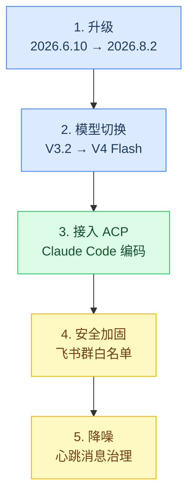
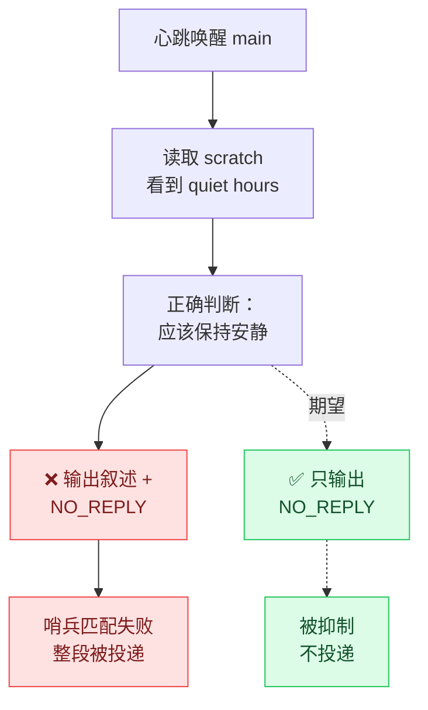

# OpenClaw 2026.8.2 升级与加固实录

> **环境**：macOS 26.4.1 (arm64) / Node v22.23.2 / OpenClaw 2026.8.2
> **时间**：2026-09-03 ~ 09-05
> **性质**：一次完整的升级 + 模型切换 + ACP 接入 + 安全加固的操作记录。
> 所有结论均在真机验证过；配套的架构分析见
> [ACP 集成的四个反直觉发现](../agents/acp-coding-agent-integration.md)。

---

## 一、缩写对照表

| 缩写 | 全称（English） | 中文 |
|---|---|---|
| ACP | Agent Client Protocol | 智能体客户端协议 |
| CLI | Command-Line Interface | 命令行界面 |
| PATH | Executable Search Path | 可执行文件搜索路径 |
| LTS | Long-Term Support | 长期支持版本 |
| nvm | Node Version Manager | Node 版本管理器 |
| npm | Node Package Manager | Node 包管理器 |
| cwd | Current Working Directory | 当前工作目录 |
| DM | Direct Message | 私聊消息 |
| CST | China Standard Time | 中国标准时间 |

---

## 二、全景



---

## 三、升级：三个连锁阻塞

升级本身是一条命令，但会连环触发三个前置问题。**按顺序处理，跳步会失败。**

### 3.1 Node 版本闸门

```
npm error [openclaw] error: this OpenClaw release requires
Node >=22.22.3 <23 || >=24.15.0 <25 || >=25.9.0.
```

preinstall 脚本会直接拦截。选择**同大版本升级**风险最小：

```bash
nvm install 22.23.2 --reinstall-packages-from=22.22.0
nvm alias default 22.23.2
npm install -g openclaw@latest
```

`--reinstall-packages-from` 会把全局包一起迁移过去，避免漏装。

### 3.2 服务里写死了旧 Node 路径

**这是最容易漏的一步。** launchd 的 plist 里硬编码了 Node 的绝对路径：

```xml
<string>/Users/xxx/.nvm/versions/node/v22.22.0/bin/node</string>
```

升级 Node 后这个路径仍然指向旧版本，服务会继续跑**旧版 OpenClaw**。
必须重装服务定义：

```bash
openclaw gateway install --force
```

> ⚠️ 推论：**每次升级 Node 之后都要重装网关服务。**
> doctor 也会提示 "Gateway service uses Node from a version manager;
> it can break after upgrades."

### 3.3 配置迁移

新版会拒绝已废弃的配置键，`gateway install` 会先报配置无效。
执行迁移前**必须先停掉网关**，否则 doctor 无法进入维护模式：

```bash
launchctl bootout gui/$(id -u)/ai.openclaw.gateway
openclaw doctor --fix --yes
openclaw gateway install --force
```

本次迁移掉的键：

| 废弃键 | 去向 |
|---|---|
| `gateway.tailscale.resetOnExit` | 删除（托管路由随生命周期自动处理） |
| `gateway.nodes.denyCommands` | 删除 |
| `commands.ownerDisplay` | 删除 |
| `meta.lastTouchedAt` | 删除 |
| `agents.defaults.models` | → `agents.defaults.modelPolicy.allow` |

doctor 还会顺带做：创建 30 分钟心跳监控、把 `HEARTBEAT.md`
迁进 cron scratch、把 `TOOLS.md` 合并进 `AGENTS.md`、
把旧的设备配对文件导入 SQLite。**这些副作用后面会咬人**（见第六节）。

### 3.4 插件要单独升

主程序升级**不会**带上第三方插件：

```bash
openclaw plugins update --all
```

飞书插件 2026.6.10 → 2026.8.2。另外若存在手工放置的旧副本
（如 `~/.openclaw/extensions/feishu`），会与 npm 安装版冲突并报
duplicate plugin id，移走即可。

---

## 四、模型切换：缓存价格才是大头

从 `deepseek-v3.2` 换到 `deepseek-v4-flash-0731`：

| | v3.2 | v4-flash-0731 |
|---|---:|---:|
| 输入 | $0.269/M | **$0.065/M** |
| **缓存读** | $0.135/M | **$0.016/M** |
| 输出 | $0.400/M | **$0.180/M** |
| 上下文 | 164K | 1.31M |
| 并行工具调用 | ❌ | ✅ |

**关键认知：对 Agent 场景，缓存读价格比标称输入价更重要。**
OpenClaw 每轮都重发系统提示词和工具定义，实测缓存命中率
可达 67%~100%。缓存读便宜 8.4 倍，这一项主导了实际账单。

配置（注意新模型必须同时加进允许列表，否则被策略拦截）：

```bash
openclaw config set agents.defaults.modelPolicy.allow --json '[...]'
openclaw config set agents.defaults.model.primary \
  "openrouter/deepseek/deepseek-v4-flash-0731"
```

### 4.1 坑：上下文并不会真的变成 1.31M

OpenClaw 本地模型目录里没有收录 V4 Flash 系列
（执行 `openclaw models refresh` 后仍然没有），
对目录外的模型一律按默认 **200K** 计算上下文窗口。

所以压缩会在 200K 触发，而不是 1.31M。当前版本没有按模型
覆盖上下文长度的配置项。**选型时宣称的长上下文，
要先确认编排框架认不认。**

### 4.2 坑：认证失效表现为 401 User not found

升级后 agent 报 401，实为状态库里存的 OpenRouter Key 已失效，
而环境变量里另有一个有效 Key。排查方法是直接打接口验证：

```bash
curl -s -H "Authorization: Bearer $OPENROUTER_API_KEY" \
  https://openrouter.ai/api/v1/key
```

写回有效 Key：

```bash
printf '%s\n' "$OPENROUTER_API_KEY" | \
  openclaw models auth paste-api-key --provider openrouter \
  --profile-id openrouter:default
```

---

## 五、接入 Claude Code（ACP）

完整的架构分析和踩坑见
[ACP 集成的四个反直觉发现](../agents/acp-coding-agent-integration.md)，
这里只留操作步骤。

```bash
# 1. 真正安装 CLI（不能依赖 IDE/桌面应用注入的临时 shim）
npm install -g @anthropic-ai/claude-code

# 2. 用网关的真实 PATH 验证可见性
env -i HOME="$HOME" PATH='<gateway PATH>' \
  bash -lc 'command -v claude && claude --version'

# 3. 装 ACP 运行时插件
openclaw plugins install @openclaw/acpx --accept-capabilities
openclaw config set plugins.entries.acpx.enabled true
openclaw config set acp.enabled true
openclaw config set acp.defaultAgent claude

# 4. 权限策略
openclaw config set plugins.entries.acpx.config.permissionMode approve-all
openclaw config set plugins.entries.acpx.config.nonInteractivePermissions deny

openclaw gateway restart
```

**用法**：在任意已接入频道用自然语言说
「Run this in Claude Code: `<任务>` in `<绝对路径>`」即可。
**不需要绑定频道**，装插件时自带的 `acp-router` 技能会识别意图。

⚠️ 务必写**绝对路径**，否则任务会落到 `~/.openclaw/workspace`。

---

## 六、安全加固

### 6.1 飞书群默认是放行的

与 Telegram 不同，`channels.feishu.groupPolicy` **不设置时新群直接放行**
—— 实测新建群发的第一条消息就被正常处理了。

```bash
# 先把要用的群加进白名单，再改策略，否则会把自己挡在外面
openclaw config set channels.feishu.groups --json \
  '{"oc_xxx":{"enabled":true,"requireMention":true}}'
openclaw config set channels.feishu.groupPolicy allowlist
```

**顺序很重要**：先加白名单再改策略。反过来会先切断所有群。

拿群 ID 的办法（应用缺 `im:chat` 权限时无法枚举群组）：

```bash
openclaw logs | grep -o 'oc_[a-z0-9]*'
```

`requireMention: true` 值得默认打开 —— 在开了 `approve-all` 的环境里，
它能防止群里一句随口的话触发编码 Agent 写文件。

### 6.2 ACP 的安全边界

| 层 | 说明 |
|---|---|
| 无沙箱 | 按目标工具自身 CLI 权限和 cwd 读写宿主机 |
| `approve-all` | 读、写、执行命令全不询问 |
| 实际闸门 | 只剩频道准入策略（配对 / 白名单 / 需要 @） |

---

## 七、心跳降噪：一个四层排查的样本

### 7.1 现象

每小时收到类似消息：

> Saturday 7:00 AM — still in quiet hours (23:00–08:00), nothing urgent,
> nothing pending. Market closed for the weekend, repos verified clean.
> Staying quiet. **NO_REPLY**

### 7.2 排查过程中的两个误判

**误判一**：以为是某个自定义 cron 任务。实际有两个任务，
真正的噪声源判断要看 `deliveryStatus` 和 payload：

```bash
openclaw cron list
openclaw cron get <id>
openclaw cron runs --id <id> --limit 100
```

**误判二（重要）**：看到系统心跳 75 次运行全是
`deliveryStatus: not-requested`，据此判断「它不可能是噪声源」。

**这个推理是错的。** cron 的 delivery 只是**其中一条**到达聊天的路径。
心跳还会**唤醒绑定在聊天频道上的 agent 会话**，
agent 这一轮说的话会直接出现在聊天里，完全不经过 cron delivery。

> **教训：`deliveryStatus` 只能证明「cron 没有主动投递」，
> 不能证明「这个任务没有产生聊天消息」。**

### 7.3 真正的根因

系统心跳的私有 scratch（由 doctor 从 `HEARTBEAT.md` 迁移而来）里写着：

```markdown
## Quiet Hours
- Stay quiet 23:00–08:00 CST unless urgent
```

模型把「stay quiet」理解成了「**说明自己正在保持安静**」，
于是输出了一段叙述 + 末尾的 `NO_REPLY`。

而 `NO_REPLY` 是 OpenClaw 的真实哨兵值（源码中有
`NO_REPLY final payload was skipped before delivery`），
但**只有当整条回复就是这个哨兵时才会被抑制**。
包了一层叙述就匹配不上，于是整段被投递出去。



### 7.4 四层修复（关键在于不依赖模型听话）

```bash
# 1. 降频
openclaw config set agents.defaults.heartbeat.every "2h"

# 2. 静默时段由框架强制执行（这一层最关键）
openclaw config set agents.defaults.heartbeat.activeHours --json \
  '{"start":"08:00","end":"23:00","timezone":"Asia/Shanghai"}'

# 3. 频道级抑制「一切正常」类输出
openclaw config set channels.feishu.heartbeatVisibility --json \
  '{"showOk":false,"showAlerts":true}'

# 4. 同时把 scratch 里的指令写死（见下）
openclaw cron scratch <id> --file new-scratch.md
```

scratch 里要明确到不留解释空间：

```markdown
## Output rule (read this first)
- If there is nothing urgent, reply with **exactly** `NO_REPLY`
  and nothing else. No preamble, no explanation.
- Never narrate a decision to stay quiet.
```

| 层 | 由谁保证 | 可靠性 |
|---|---|---|
| scratch 措辞 | 模型 | 低（已失败过一次） |
| `every: 2h` | 调度器 | 高 |
| `activeHours` | 框架 | **高（turn 根本不执行）** |
| `showOk: false` | 频道层 | **高** |

> **通用教训：靠提示词约束模型行为是最脆弱的一层。
> 凡是框架提供了硬开关的，优先用硬开关。**

### 7.5 系统任务不能直接改

心跳是 declaration 驱动的系统任务（`declarationKey: heartbeat:main`），
直接改任务会被拒：

```
Error: system-owned monitor jobs cannot be edited by cron clients
```

要改就改**生成它的配置**（`agents.defaults.heartbeat.*`），
改完 `openclaw cron list` 里的调度会自动跟着变。

---

## 八、Gotchas 速查

| 现象 | 真相 |
|---|---|
| 技能依赖检查显示 `✓ claude` | 可能是交互式终端里的临时 shim，**服务的 PATH 里没有**。用 `env -i PATH='<服务PATH>'` 复验 |
| `/acp doctor` 报凭据缺失 | 只查了 `~/.claude/.credentials.json`，**没查 macOS 钥匙串**。直接跑一次真实调用来验证 |
| `agents bindings` 列表里没有某条绑定 | 它只枚举 `route` 类型，不显示 `acp` 类型。用 `config get bindings` 核实 |
| 模型转述的 `/acp status` | 会把 CLI 自身默认值当成你的配置报出来，**不可信** |
| 升级后服务还是旧版本 | plist 里写死了旧 Node 路径，要 `gateway install --force` |
| cron `deliveryStatus: not-requested` | 只说明 cron 没主动投递，**不代表没产生聊天消息** |
| 模型宣称 1.31M 上下文 | 框架目录外的模型按 200K 处理 |

**唯一可信的验收方式：日志时间线 + 磁盘产物**，
而不是任何一个健康检查的 ✓，也不是模型的转述。

---

## 九、最终配置摘要

```jsonc
{
  "agents": { "defaults": {
    "model": {
      "primary": "openrouter/deepseek/deepseek-v4-flash-0731",
      "fallbacks": ["openrouter/~deepseek/deepseek-v4-flash-latest",
                    "openrouter/openai/gpt-oss-120b:free"] },
    "heartbeat": { "every": "2h",
      "activeHours": { "start": "08:00", "end": "23:00",
                       "timezone": "Asia/Shanghai" } } } },

  "acp": { "enabled": true, "defaultAgent": "claude" },

  "plugins": { "entries": { "acpx": { "enabled": true, "config": {
    "permissionMode": "approve-all",
    "nonInteractivePermissions": "deny" } } } },

  "channels": { "feishu": {
    "dmPolicy": "pairing",
    "groupPolicy": "allowlist",
    "groups": { "oc_xxx": { "enabled": true, "requireMention": true } },
    "heartbeatVisibility": { "showOk": false, "showAlerts": true } } }
}
```

---

## 十、相关文档

- [OpenClaw 安装与配置](./setup.md) —— 首次安装看这篇
- [ACP 集成的四个反直觉发现](../agents/acp-coding-agent-integration.md)
  —— 把 Claude Code 接进编排框架的架构分析
