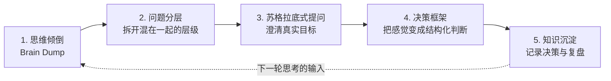
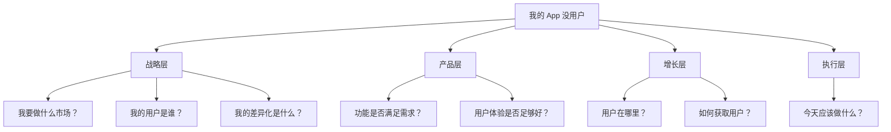
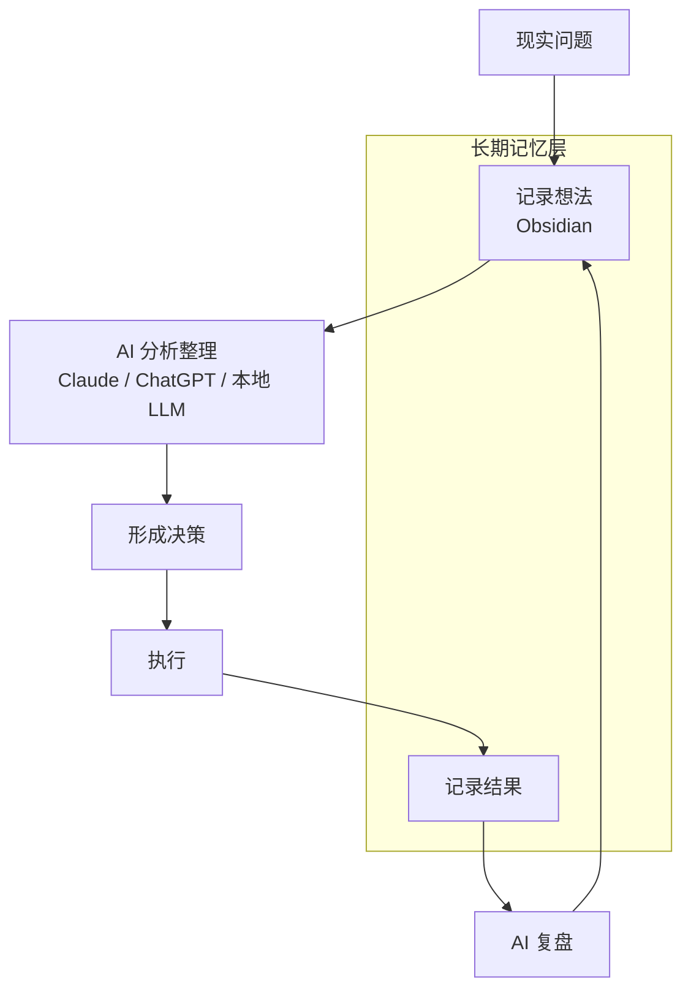

# 如何用 AI 整理自己的思路

用 AI（Artificial Intelligence，人工智能）整理思路，本质上不是让 AI「替你想」，而是把它当成一个**外置认知系统（external thinking system）**：帮你把模糊的想法显性化、结构化，发现盲点，最后收敛成可执行的行动。

一句话概括：**AI 不负责给你答案，AI 负责提高你产生答案的质量。**

## 缩写对照表

| 缩写 | 英文全称 | 中文 |
|---|---|---|
| AI | Artificial Intelligence | 人工智能 |
| LLM | Large Language Model | 大语言模型 |
| App | Application | 应用程序 |
| Agent | —（AI Agent） | 智能体，能自主调用工具完成任务的 AI 程序 |
| PKM | Personal Knowledge Management | 个人知识管理 |
| SOP | Standard Operating Procedure | 标准作业流程 |

## 整体框架

五个步骤构成一个闭环，从「一团乱麻」走到「今天该做什么」，再把结果沉淀回知识库：



关键点：**顺序不能颠倒**。跳过第 1、2 步直接问「我该怎么办」，得到的一定是一个漂亮但没用的通用答案。

---

## 1. 思维倾倒（Brain Dump）

人的很多问题不是没有想法，而是：

- 想法太多，互相纠缠
- 情绪和事实混在一起
- 重要和次要没有区分
- 不知道真正的问题是什么

**第一步不要整理，直接倾倒。** 想到什么写什么，不要求逻辑通顺。

倾倒示例：

> 我最近想做一个 AI 英语学习产品，但不知道应该继续优化 App，还是投入推广，还是做 AI Agent。我感觉方向很多，但资源有限。

然后交给 AI：

```text
下面是我最近的一些混乱想法，请不要马上给建议。

请帮我：
1. 提取事实
2. 提取假设
3. 找出隐藏的问题
4. 把我的思考结构化
5. 找出我没有意识到的矛盾
```

AI 在这一步的角色是**镜子**，不是顾问。「请不要马上给建议」这句话是整个提示词里最重要的一句——它挡住了模型急于收敛的倾向。

---

## 2. 问题分层

思考困难，往往是因为把不同层级的问题混在一起了。比如「我的 App 没用户」这一句话，实际上同时包含四层：



分层之后你会发现：大部分焦虑来自**用执行层的动作去回答战略层的问题**——比如靠「再加一个功能」来解决「不知道用户是谁」。

让 AI 帮你拆：

```text
请把这个问题按照：
战略层 / 产品层 / 技术层 / 运营层 / 执行层
拆解，并指出每一层当前最关键的那一个问题。
```

---

## 3. 苏格拉底式提问

不要问：

> 我应该怎么办？

因为这类问题会让 AI 立刻给出一个表面答案，而你真正缺的不是选项，是对自己动机的澄清。

更好的方式：

```text
不要给建议。
像一个战略顾问一样，通过提问帮助我发现：
- 我的真实目标
- 我的隐藏假设
- 我的风险
- 我的盲区

一次只问一个问题，等我回答后再问下一个。
```

「一次只问一个问题」这个约束很关键：一次抛出十个问题，你只会草草略过；一次一个，才会真的停下来想。

---

## 4. 决策框架

很多时候不是不知道选项，而是不知道**怎么比较**。让 AI 把选项和评价维度做成一张加权表，感觉就变成了可讨论的结构化判断。

例：「我要不要继续维护我的 App？」

| 评价维度 | 权重 | 继续开发 | 停止开发 | 转型 |
|---|---:|---:|---:|---:|
| 市场机会 | 25% | | | |
| 个人优势 | 20% | | | |
| 收益潜力 | 20% | | | |
| 时间成本 | 20% | | | |
| 长期价值 | 15% | | | |
| **加权总分** | **100%** | | | |

对应的提示词：

```text
我在以下选项之间纠结：继续开发 / 停止开发 / 转型。

请：
1. 先建议一组评价维度和权重，并说明为什么这样分配权重
2. 用 1–10 分对每个选项逐维度打分，给出打分理由
3. 计算加权总分
4. 指出这个结论对哪个权重最敏感——如果那个权重变了，结论会不会反转
```

第 4 步是最有价值的：它告诉你**这个决策真正取决于什么**。如果结论对某个权重极度敏感，那你要做的不是继续纠结选项，而是先把那个维度搞清楚。

---

## 5. 建立个人知识系统

长期来看，最有价值的是让 AI 了解你的长期思考，而不是每次从零开始解释背景。这需要一个 PKM（Personal Knowledge Management，个人知识管理）目录作为长期记忆层。

推荐结构：

```text
My Brain/
├── 01_Inbox
│   └── 临时想法
├── 02_Projects
│   ├── AI Dictionary
│   ├── OpenClaw
│   └── Local LLM
├── 03_Knowledge
│   ├── AI
│   ├── Programming
│   ├── Philosophy
│   └── Business
├── 04_Decisions
│   ├── Why I chose X
│   └── Lessons learned
└── 05_Reflection
    ├── Weekly review
    └── Monthly thinking
```

其中 `04_Decisions` 最容易被忽略，却最值钱：**记录当时为什么这么选、当时假设是什么**。几个月后回看，你能校准的不是决策结果，而是自己的判断力。

每周把笔记喂给 AI 做一次复盘：

```text
这是我本周的笔记。

请分析：
1. 我反复关注什么？
2. 哪些问题一直没有解决？
3. 我的认知发生了什么变化？
4. 下一步最重要的三个动作是什么？
```

---

## 一个通用的思考模板

把前面几步压缩成一个可复用的 SOP（Standard Operating Procedure，标准作业流程）提示词：

```text
# Role
你是我的思维教练。

# Context
我的背景：
（填写）

当前问题：
（填写）

# Task
不要直接回答。请按照以下顺序帮助我思考：
1. 澄清问题
2. 分离事实和观点
3. 找出隐藏假设
4. 提出关键问题
5. 给出多个可能路径
6. 评价每个路径的风险
7. 推荐下一步行动

每完成一步先停下来，等我确认后再继续。
```

---

## Personal AI Operating System

把上面所有环节串起来，就是一套长期有效的个人工作流：



分工：

| 层次 | 承担者 | 职责 |
|---|---|---|
| 长期记忆层 | Obsidian（或任意 Markdown 笔记库） | 存放想法、决策记录、复盘 |
| 推理与分析层 | Claude / ChatGPT | 结构化、提问、决策辅助 |
| 私有知识处理层 | 本地 LLM（Large Language Model，大语言模型） | 处理不宜上传的敏感内容 |

---

## 常见误区

| 误区 | 后果 | 修正 |
|---|---|---|
| 一上来就问「我该怎么办」 | 得到一个正确但无用的通用答案 | 先做思维倾倒和问题分层 |
| 把 AI 的输出直接当结论 | 你的判断力没有增长，只是外包了 | 把输出当作待检验的假设 |
| 每次对话都从零解释背景 | 反复付出上下文成本，结论也不连贯 | 建立知识库，把背景固定下来 |
| 只记录结论，不记录理由 | 无法复盘，重复犯同样的错 | 在 `04_Decisions` 里写清当时的假设 |

---

## 小结

长期价值不在于 AI 帮你完成了某一个任务，而在于：

> **AI 帮你提高思考质量，让经验不断积累，而不是每次重新开始。**

判断这套方法是否奏效的标准也很简单——**同一类问题，你第二次思考的速度和质量，是否明显好于第一次。**
