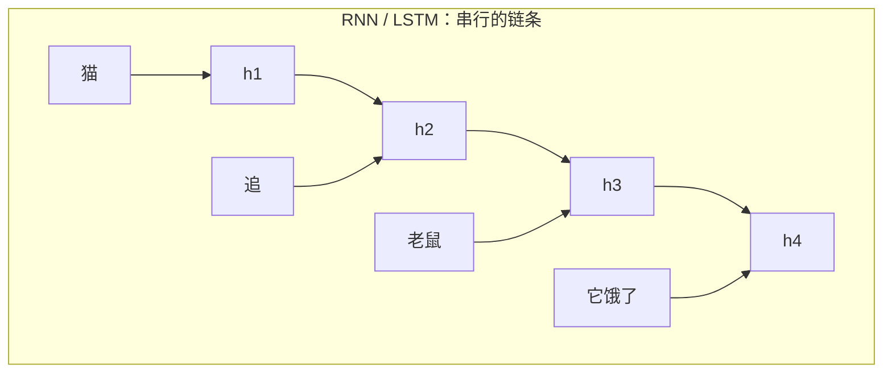
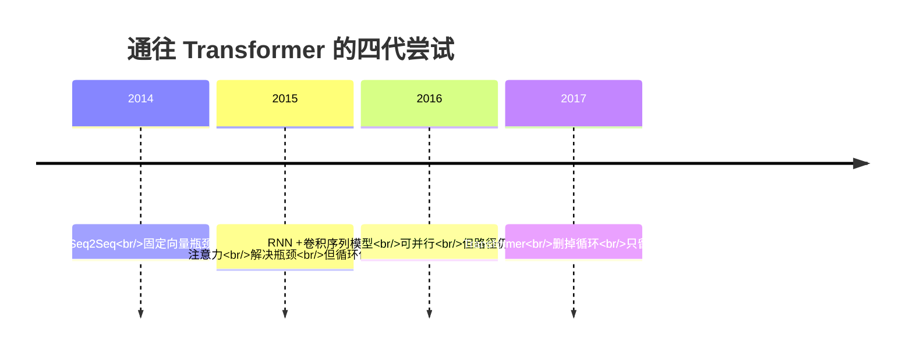
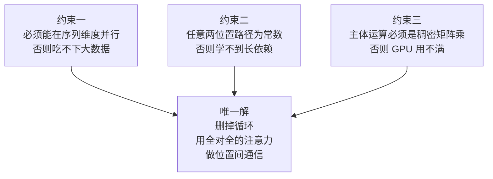

# 为什么会有 Transformer：一句话必须一个词一个词地读，是怎么被打破的

> 2017 年之前，所有严肃的序列模型都建立在同一个假设上：**要理解第 100 个词，必须先理解前 99 个词**。
>
> 这个假设听起来天经地义——人读句子不就是从左到右吗？但它给机器带来了两个致命后果：训练不能并行，远距离的信息会在传递中衰减殆尽。
>
> 这一篇讲清楚：这两个后果具体有多痛、四代前辈各自卡在哪、以及三条约束如何把答案逼到"干脆彻底删掉循环"这一个方向上。

---

## 缩写对照表

| 缩写 | 英文全称 | 中文 |
|---|---|---|
| RNN | Recurrent Neural Network | 循环神经网络 |
| LSTM | Long Short-Term Memory | 长短期记忆网络 |
| GRU | Gated Recurrent Unit | 门控循环单元 |
| CNN | Convolutional Neural Network | 卷积神经网络 |
| Seq2Seq | Sequence-to-Sequence | 序列到序列（模型） |
| NMT | Neural Machine Translation | 神经机器翻译 |
| BPTT | Back-Propagation Through Time | 沿时间反向传播 |
| GPU | Graphics Processing Unit | 图形处理器 |
| SGD | Stochastic Gradient Descent | 随机梯度下降 |

---

## 一、之前的世界：一个词一个词地爬

设想 2016 年你要做一个中英翻译系统。当时的标准答案是 **Seq2Seq + LSTM**：一个编码器 LSTM 从左到右读中文，把整句话压成一个固定长度的向量；一个解码器 LSTM 拿着这个向量，从左到右吐英文。

它的计算形态是这样的：

$$h_t = f(h_{t-1},\ x_t)$$

第 $t$ 个隐状态依赖第 $t-1$ 个隐状态。这个公式里藏着后面所有痛苦的根源：**$h_t$ 在 $h_{t-1}$ 算完之前不可能开始算**。

### 痛点一：训练无法并行，GPU 大部分时间在空转

一块 GPU 的本事是同时做上万次乘加。但 RNN 的链条把它锁成了单线程：一个长度 50 的句子，必须依次做 50 步，每步都要等上一步的结果。批量（batch）维度上可以并行，序列维度上完全不行。

后果是硬性的：**序列越长，训练越慢，而且是线性变慢，没有任何办法绕过。** 2016 年训练一个像样的 NMT 模型要在多卡上跑好几天，其中相当一部分时间 GPU 的算力是闲置的——它在等一个只能一步步走的链条。

这不只是"慢"的问题。它意味着**你不能靠堆数据和堆算力来变强**，因为墙不在算力上，在依赖结构上。

### 痛点二：远距离信息在传递中衰减

看这句话：

> **猫**追老鼠，因为**它**饿了。

要正确理解"它"指猫（而不是老鼠），模型必须把"猫"这个位置的信息一路传到"它"这个位置。在 RNN 里，这段信息要经过 6 次矩阵变换和 6 次非线性挤压才能到达。

反向传播时同样的路径要反着走一遍（BPTT，沿时间反向传播）。梯度每经过一步就乘一次雅可比矩阵，连乘 $n$ 次的结果只有两种命运：**指数衰减到 0（梯度消失）或指数爆炸**。LSTM 用门控和一条相对线性的 cell state 通道把这件事缓解了——注意是缓解，不是解决。实践中 LSTM 能可靠捕捉的依赖长度大约在几十个词量级，几百词以上基本无能为力。

用一个更本质的指标看这件事：**任意两个位置之间的信息路径长度**。

| 架构 | 任意两位置的最大路径长度 | 含义 |
|---|---|---|
| RNN / LSTM | $O(n)$ | 距离越远，衰减越狠 |
| 卷积（核宽 $k$） | $O(\log_k n)$ | 要堆很多层才能覆盖全句 |
| 自注意力 | $O(1)$ | 任意两点一步直达 |

这张表来自 Transformer 原论文，它几乎单独解释了整篇论文的动机：**把路径长度压到常数**。

### 痛点三：Seq2Seq 的瓶颈向量

早期 Seq2Seq 还有一个更粗暴的问题：编码器要把整个源句子压进**一个**固定长度的向量，解码器只能看这一个向量。句子越长，这个向量越是灾难性的信息瓶颈——翻译长句时质量断崖式下跌，是当年公认的现象。

## 二、四代前辈，各自卡在哪

**第一代 · Seq2Seq（2014）**：奠定了编码-解码范式，但卡在瓶颈向量。

**第二代 · RNN + 注意力（2014–2015）**：Bahdanau 等人提出的注意力机制是关键转折——解码器每生成一个词，都回头对源句子**所有位置**算一组权重，加权求和得到一个"这一步该看哪里"的定制向量。

$$c_i = \sum_j \alpha_{ij} h_j$$

瓶颈解决了，翻译长句的质量回来了。但注意力当时只是**挂在 RNN 上的一个补丁**：主干仍是循环的，训练仍不能并行，只是信息能跨距离直取了。

**第三代 · 卷积序列模型（2016–2017）**：ConvS2S、ByteNet 换了个思路——用卷积替代循环，序列维度终于可以并行了。但卷积的感受野是局部的，要让第 1 个词和第 100 个词发生关系，得堆 $O(\log_k n)$ 层。路径变短了，但没短到常数，而且层数随句长增长。

**第四代 · Transformer（2017）**：`Attention Is All You Need` 做的事情，从工程角度看极其激进——**把 RNN 整个删掉，只留下那个补丁**。既然注意力已经能让任意两个位置直接连通，循环还有什么必要？

## 三、三条约束，如何逼出唯一解

Transformer 的设计不是灵光一现，而是三条硬约束的交点：

- **约束一（可并行）**排除了一切带有 $h_t \leftarrow h_{t-1}$ 形式的结构；
- **约束二（常数路径）**排除了局部卷积；
- **约束三（矩阵乘友好）**决定了通信方式必须能写成大矩阵乘法——而"每个位置对每个位置算一个分数"恰好就是 $QK^\top$ 这一次矩阵乘。

三条约束同时满足的方案，几乎只剩下一个：**让所有位置在一次矩阵乘里互相看见**。

代价当然存在，而且很显眼：路径从 $O(n)$ 变成 $O(1)$，计算量从 $O(n \cdot d^2)$ 变成 $O(n^2 \cdot d)$。**这是一次用平方级计算换常数级路径的交易**——在 2017 年的 GPU 上这笔账划算，也正是今天所有长上下文工程问题（KV Cache 显存、FlashAttention、稀疏注意力）的源头。

## 四、如果它不存在，会怎样

用一句话检验这一篇是否讲清楚了：**假如 Transformer 不存在，有人会不得不发明它。**

因为一旦你同时要求"能吃下整个互联网的文本"（需要并行）和"能理解跨越千词的指代与结构"（需要短路径），你就被逼到了同一个角落。GPT、BERT、ViT、Whisper、扩散模型的骨干——它们全都长在这一次交易之上。

---

**下一篇** → [02 · Transformer 到底是什么：定义、边界与生态位置](02-what.zh.md)

[← 系列索引](index.md)
