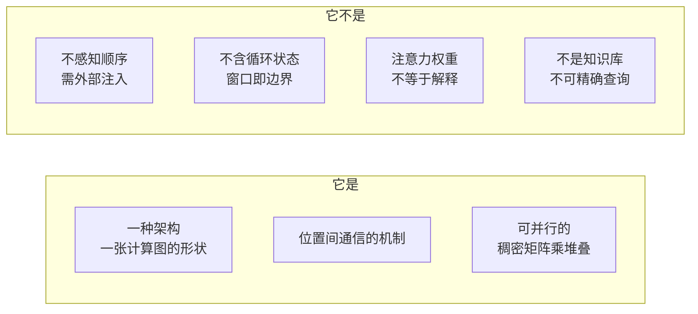
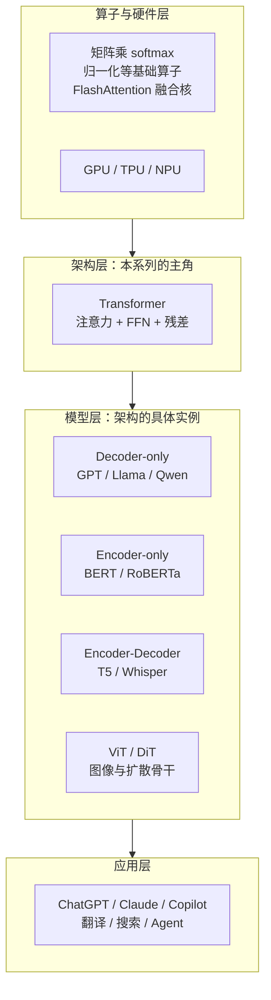

# Transformer 到底是什么：定义、边界与生态位置

> 上一篇留下的答案是"删掉循环，只留注意力"。这一篇把这句话变成一个精确的定义，然后立刻划边界——**它不是什么**，比它是什么更能防止误用。
>
> 读完你应该能做三件事：一句话说清 Transformer 是什么；说出它明确不做的四件事；在整个 AI 技术栈里指出它坐在谁之上、谁坐在它之上。

---

## 缩写对照表

| 缩写 | 英文全称 | 中文 |
|---|---|---|
| MLP | Multi-Layer Perceptron | 多层感知机 |
| FFN | Feed-Forward Network | 前馈网络（此处与 MLP 同义） |
| BERT | Bidirectional Encoder Representations from Transformers | 双向编码器表示 |
| GPT | Generative Pre-trained Transformer | 生成式预训练 Transformer |
| ViT | Vision Transformer | 视觉 Transformer |
| SSM | State Space Model | 状态空间模型 |
| MoE | Mixture of Experts | 混合专家 |
| MHA | Multi-Head Attention | 多头注意力 |
| RoPE | Rotary Position Embedding | 旋转位置编码 |
| SDPA | Scaled Dot-Product Attention | 缩放点积注意力 |

---

## 一、一句话定义

> **Transformer 是一种神经网络架构：它把"序列中每个位置该看哪些其他位置"这件事，交给一次全对全的加权求和（注意力）来完成，从而在删掉循环依赖的同时，让任意两个位置一步直达。**

拆开这句话的四个承重点：

| 短语 | 承接的是第 1 篇的哪个痛点 |
|---|---|
| **神经网络架构** | 它是一张计算图的形状，不是模型、不是算法、不是产品 |
| **全对全的加权求和** | 用一次稠密矩阵乘做位置间通信（约束三：GPU 友好） |
| **删掉循环依赖** | 序列维度可并行（约束一：吃得下大数据） |
| **任意两位置一步直达** | 路径长度 $O(1)$（约束二：学得到长依赖） |

注意定义里**没有**出现的词：没有"理解"、没有"语义"、没有"推理"。Transformer 本身只是一种把向量搬来搬去的规整方式，所有语义都来自训练。

## 二、边界：它明确不做的四件事

边界比定义更有用，因为几乎所有对 Transformer 的误解都出在这四条上。

### 1. 它本身不知道顺序

这是最反直觉、也最重要的一条。**自注意力对输入位置是置换等变的**（permutation-equivariant）：把输入序列打乱顺序，输出也只是跟着打乱，内容完全不变。

也就是说，"猫追老鼠"和"老鼠追猫"在纯注意力眼里**完全一样**。

顺序信息必须**从外部注入**——这就是位置编码存在的唯一理由。位置编码不是锦上添花的技巧，它是在补一个架构层面的硬缺口。（细节见[第 5 篇](05-embedding-position.zh.md)）

### 2. 它不是循环的，因此没有"状态"

RNN 有一个随时间演进的隐状态，理论上可以记住任意长的历史（实践中记不住）。Transformer 没有状态：**它每次都把整个上下文重新看一遍**。

好处是没有衰减；代价是上下文是硬边界——**窗口之外的东西不是"记得模糊"，而是根本不存在**。以及成本随长度平方增长。

推理时的 KV Cache 常被误认为是"状态"，其实它只是把已算过的 K、V 存下来避免重算，不是压缩后的记忆。

### 3. 注意力不是"注意"，更不是解释

"attention weight 高 = 模型在关注这里 = 这是它做决定的依据"——这个推论**不成立**。注意力权重是一次可微的、数据相关的加权平均系数，把它当作模型的解释（attribution）在学术上已被反复证伪。多头之间会互相抵消，残差通路会绕过注意力，权重高低和最终 logit 的因果关系并不直接。

**它是一种路由机制，不是一种解释机制。**

### 4. 它不保证符号推理，也不存储可查询的知识库

FFN 里确实压缩了海量事实，但那是**有损的、不可枚举的、不可精确编辑的**。Transformer 不提供"查一下这个事实是否存在"的接口。这正是 RAG（检索增强生成）和工具调用存在的理由。

## 三、生态位置：它坐在谁之上，谁坐在它之上

*这张图回答：Transformer 在整个 AI 技术栈里的位置。*

**它坐在什么之上**：稠密矩阵乘法和 softmax 这几个基础算子，以及能高效执行它们的加速硬件。Transformer 之所以赢，很大程度上是因为它的主体运算恰好是硬件最擅长的那一种。

**谁坐在它之上**：三个变体家族，区别只在**注意力能看见谁**：

| 家族 | 注意力可见范围 | 典型模型 | 擅长 |
|---|---|---|---|
| Encoder-only | 双向，全可见 | BERT | 理解、分类、检索 |
| Decoder-only | 单向，只看左边 | GPT、Llama | 生成、对话（今天的主流） |
| Encoder-Decoder | 编码双向 + 解码单向 + 交叉注意力 | T5、Whisper | 有明确输入输出的转换任务 |

**本系列聚焦 decoder-only**，因为今天的大语言模型几乎全是这一支。

## 四、最近的邻居，以及它们的分歧点

| 邻居 | 与 Transformer 的关键差别 |
|---|---|
| **RNN / LSTM** | 有循环状态、串行、路径 $O(n)$；推理时每步 $O(1)$ 内存，这是它至今未死的原因 |
| **CNN** | 局部感受野、可并行、路径 $O(\log n)$；ViT 出现前是视觉的默认解 |
| **SSM / Mamba** | 用可并行扫描重新引入线性复杂度的状态；训练可并行、推理常数内存，正在长序列场景挑战注意力 |
| **MoE** | 不是替代品，而是**只替换 FFN 层**的改造：把一个大 FFN 换成多个专家 + 路由器，注意力部分原封不动 |
| **线性 / 稀疏注意力** | 保留架构骨架，把 $O(n^2)$ 的那一步近似成 $O(n\log n)$ 或 $O(n)$，用精度换长度 |

一个值得记住的判断：**近十年所有挑战者的靶心都是那个 $n^2$**。骨架（残差流 + 通信层 + 计算层）本身极其稳定，几乎没人动。

## 五、读完这一篇你应该能回答

- Transformer 是模型还是架构？——架构。GPT 是模型。
- 为什么需要位置编码？——因为自注意力置换等变，架构本身不感知顺序。
- 能不能用注意力权重解释模型为什么这么答？——不能，它是路由不是归因。
- 上下文窗口为什么是硬边界？——因为没有循环状态，窗口外的信息在计算图里根本不存在。

---

**上一篇** ← [01 · 为什么会有 Transformer](01-why.zh.md) ｜ **下一篇** → [03 · 概念地图：八个概念、五个角色](03-concept-map.zh.md)

[← 系列索引](index.md)
