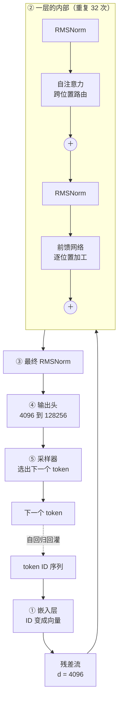
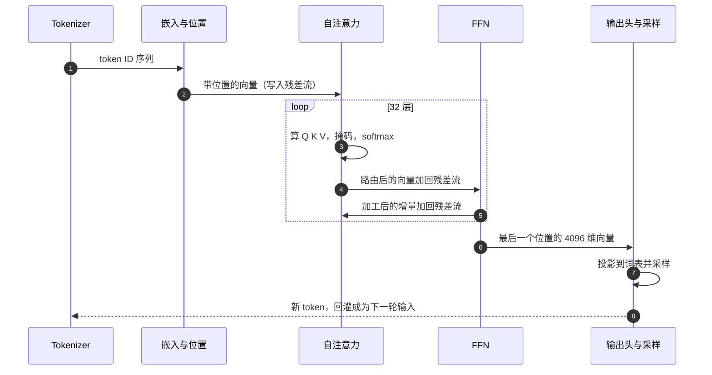

# 概念地图：八个概念、五个角色，一次摊开整张地图

> 这一篇不下潜。目标是让你在进入任何一个组件之前，**先把整张地图握在手里**：八个核心概念按依赖顺序串成一条链，五个关键角色各自的"唯一职责"，以及它们协作起来的完整路径。
>
> 每个概念在这里只给一行定义——它们各自的深度留给第 5 到第 11 篇。

---

## 缩写对照表

| 缩写 | 英文全称 | 中文 |
|---|---|---|
| Q / K / V | Query / Key / Value | 查询 / 键 / 值 |
| SDPA | Scaled Dot-Product Attention | 缩放点积注意力 |
| FFN | Feed-Forward Network | 前馈网络 |
| RMSNorm | Root Mean Square Normalization | 均方根归一化 |
| RoPE | Rotary Position Embedding | 旋转位置编码 |
| LM Head | Language Model Head | 语言模型输出头 |
| GQA | Grouped-Query Attention | 分组查询注意力 |
| KV Cache | Key-Value Cache | 键值缓存 |

---

## 一、领域映射：从问题到概念

Transformer 把"理解一段文字"这个问题，映射成了八个自己的概念。按依赖顺序，后一个都建立在前一个之上：

| 现实问题中的元素 | Transformer 的概念 | 为什么要这个抽象 |
|---|---|---|
| 一个词/字 | **Token 嵌入** | 把离散符号变成可微分的稠密向量，才能做梯度下降 |
| "这段话的当前理解状态" | **残差流** | 一条贯穿全部层的向量总线，每层只往上加增量 |
| "同一个词在不同句子里意思不同" | **上下文化** | 全模型的最终目标：把孤立词向量变成带上下文的向量 |
| "我需要什么 / 我能提供什么 / 我携带什么" | **Q / K / V 三元组** | 把"该看谁"拆成可学习的检索问题 |
| "看谁看得多一点" | **缩放点积注意力** | 相似度打分 + softmax，得到一组和为 1 的权重 |
| "语法、指代、话题要同时看" | **多头** | 在多个子空间里并行做多种关系抽取 |
| "生成时不能偷看未来" | **因果掩码** | 用一个上三角 $-\infty$ 强制自回归 |
| "词序是有意义的" | **位置编码** | 补上架构本身缺失的顺序感知 |

### 概念一：Token 嵌入

每个 token ID 查一张表，得到一个 $d_{\text{model}}$ 维向量（Llama-3-8B 是 4096 维）。这是**上下文无关**的初始语义坐标：同一个"它"，无论出现在哪句话里，初始向量完全相同。

### 概念二：残差流

理解 Transformer 最有用的一个心智模型：**每个位置有一条从底走到顶的向量总线**，宽度恒为 $d_{\text{model}}$。每个子层（注意力、FFN）从总线上**读**、算出一个增量、再**加**回总线。

$$x \leftarrow x + \text{Attention}(\text{Norm}(x)) \quad\text{然后}\quad x \leftarrow x + \text{FFN}(\text{Norm}(x))$$

这条总线是理解一切的锚：所有组件都是"接在总线上的读写设备"，而不是流水线上首尾相接的工位。

### 概念三：上下文化

模型要做的事，一句话说就是：**把上下文无关的词向量，变成上下文相关的词向量**。第 0 层的"它"是所有语境的平均；第 20 层的"它"应该已经几乎等同于"猫"。这个转变就是 32 层反复加工的全部意义。

### 概念四：Q / K / V 三元组

注意力把"该看谁"建模成一次软性检索。每个位置的向量被三个不同的权重矩阵投影成三个角色：

- **Query（查询）**：我在找什么样的信息；
- **Key（键）**：我这里有什么样的信息，供别人匹配；
- **Value（值）**：如果你决定看我，我实际交给你的内容。

Q 与 K 决定**看谁**，V 决定**拿到什么**——这个分离是整个机制里最精妙的一处设计。

### 概念五：缩放点积注意力

$$\text{Attention}(Q,K,V) = \text{softmax}\!\left(\frac{QK^\top}{\sqrt{d_k}}\right)V$$

Q 与所有 K 做点积得到分数，除以 $\sqrt{d_k}$ 防止 softmax 饱和，softmax 归一成权重，再对 V 加权求和。**整个 Transformer 里唯一让不同位置互相影响的运算，就是这一行。**

### 概念六：多头

一个句子里同时存在多种关系：主谓一致、指代、话题、句法距离……让一组权重同时表达全部关系是强人所难。多头的做法是把 $d_{\text{model}}$ 切成 $h$ 份，每份独立做一次完整注意力，最后拼回来。Llama-3-8B 是 32 个头、每头 128 维。

### 概念七：因果掩码

生成式模型必须保证：**预测第 $t$ 个 token 时只能看到前 $t-1$ 个**，否则训练时就是抄答案。做法极其朴素——在 softmax 之前，把分数矩阵的上三角全部置为 $-\infty$。

### 概念八：位置编码

因为注意力置换等变（见[第 2 篇](02-what.zh.md)），顺序必须外部注入。现代主流是 **RoPE**：不给向量"加"位置，而是按位置把 Q、K 向量**旋转**一个角度，使点积天然只依赖相对距离。

## 二、五个关键角色

每个角色一句话身份，深度留给后面。**这张表就是深度篇的目录。**

| 角色 | 拥有（唯一职责） | 知道（持有什么状态） | 刻意不做 |
|---|---|---|---|
| **嵌入层与位置编码器** | 把 token ID 变成带位置感的向量 | 词表映射表；位置旋转规则 | 不做任何跨位置的信息交换 |
| **自注意力模块** | 位置之间的信息路由 | Q/K/V/O 四个投影矩阵；推理时的 KV Cache | 不引入任何非线性知识加工 |
| **前馈网络 FFN** | 单个位置内部的知识加工 | 约七成的模型参数 | 完全不看其他位置 |
| **残差与归一化** | 让百层深度仍可训练、可传播 | 每个子层前的缩放向量 | 不改变语义，只稳定数值 |
| **输出头与采样器** | 把向量变回一个 token | 词表投影矩阵；温度等采样参数 | 不参与任何中间层计算 |

三条值得当场记住的分工：

1. **注意力负责"通信"，FFN 负责"计算"**——这是 Transformer 最本质的二分。
2. **注意力是唯一跨位置的运算**，其余所有组件都逐位置独立。
3. **参数量的大头在 FFN（约 70%），而推理时的显存与延迟瓶颈在注意力**——这个错位是所有推理优化的战场。

## 三、协作总览：happy path

*这张图回答：一串 token 如何变成下一个 token。注意最后那条虚线——生成是把输出接回输入的循环。*

按角色出场顺序的时序视角：

*这张图回答：五个角色在一次前向计算中的调用顺序与交接物。*

**两条重要的非 happy path**，机制留到深度篇：

- **长序列下的注意力矩阵爆炸**：$n^2$ 的分数矩阵在 8K 长度下单是中间结果就要数 GB —— FlashAttention 如何绕过（[第 8 篇](08-attention-variants.zh.md)）；
- **深层训练的数值发散**：几十层残差累加会让激活值量级失控 —— Pre-Norm 与 RMSNorm 如何托住（[第 10 篇](10-residual-norm.zh.md)）。

## 四、白板检验

读到这里，你应该能在白板上画出：一条残差流，上面挂着交替的注意力块和 FFN 块，输入端有嵌入和位置编码，输出端有一个投影到词表的头——并且能为每一个方块说出"它存在是为了解决第 1 篇的哪个痛点"。

还不知道的是：每个方块**内部**长什么样。那从[第 5 篇](05-embedding-position.zh.md)开始。

---

**上一篇** ← [02 · Transformer 是什么](02-what.zh.md) ｜ **下一篇** → [04 · 运行示例：一句话的完整旅程](04-running-example.zh.md)

[← 系列索引](index.md)
