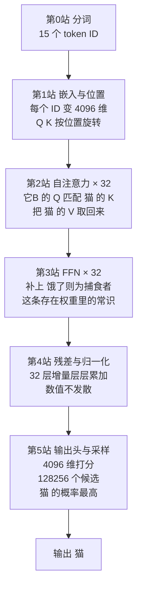

# 运行示例：一句话的完整旅程（浅层追踪）

> 从这一篇开始，全系列共用**同一个例子**。它足够小，三句话就能说清；又足够丰富，能把八个概念和五个角色全部用上一遍。
>
> 这一篇只做**浅层追踪**——每一站说清"谁上场、做了什么、交出什么"，不打开任何一个盒子。后面每篇深度篇结尾的 **⚓ 回到示例**，都会把那一站重放一次、这次带全深度；[第 12 篇](12-walkthrough.zh.md)则从头到尾重演一遍。

---

## 一、示例定义

> 你在本地用 **Llama-3-8B** 跑推理，输入这样一句提示词：
>
> ```
> 猫追老鼠，因为它饿了。这里的「它」指的是
> ```
>
> 模型输出的下一个 token 是 **「猫」**，而不是「老鼠」。
>
> 从"追"和"饿了"推出"它 = 猫"，是一次**指代消解**（coreference resolution）：需要跨越 9 个字把"它"和"猫"连起来，还需要一条常识"饿了的是追的一方"。**这一切在一次前向计算里完成，模型没有查任何词典。**

选它当主线的理由：

- **必须用到跨位置通信**（"它"要够到"猫"）→ 逼出自注意力；
- **必须用到存储的常识**（饿→捕食者）→ 逼出 FFN；
- **必须区分"猫追老鼠"和"老鼠追猫"** → 逼出位置编码；
- **必须只看左边**（生成场景）→ 逼出因果掩码；
- **必须在多个层面同时判断**（语法 + 指代 + 常识）→ 逼出多头与多层；
- **答案是一个 token** → 输出头与采样器的职责一目了然。

模型规格（后文所有数字都基于它）：

| 参数 | 值 |
|---|---|
| 隐藏维度 $d_{\text{model}}$ | 4096 |
| 层数 | 32 |
| 查询头数 / KV 头数 | 32 / 8（GQA） |
| 每头维度 $d_k$ | 128 |
| FFN 中间维度 | 14336 |
| 词表大小 | 128256 |
| 位置编码 | RoPE，base = 500000 |

## 二、第 0 站：分词

Tokenizer 先把这句话切成整数序列。Llama-3 的词表对中文的切分大致是一到两个字一个 token，这句话约 15 个 token（含句首的 BOS 标记）。

```
[BOS] 猫 追 老鼠 ， 因为 它 饿 了 。 这里 的 「 它 」 指 的是
  ↑                    ↑                        ↑
 位置0              位置6(它A)               位置13(它B)
```

> 上面的切分与位置编号是**示意**，用于后文引用。真实切分可自行验证：
> ```python
> from transformers import AutoTokenizer
> tok = AutoTokenizer.from_pretrained("meta-llama/Meta-Llama-3-8B")
> print(tok.tokenize("猫追老鼠，因为它饿了。这里的「它」指的是"))
> ```

注意这里已经出现了**两个"它"**：位置 6 的「它A」（句中指代）和位置 13 的「它B」（提问对象）。它们的初始嵌入向量**完全相同**——区分它们的全部信息，来自位置编码和上下文。这个细节后面会反复用到。

分词属于模型之外的前置环节（详见 [LLM 全景指南 · 05 Tokenizer](../llm-fundamentals/05-tokenizer.zh.md)），本系列从下一站开始。

## 三、浅层追踪：五个角色依次上场



*这张图回答：从一串整数到一个汉字，五个角色的接力顺序。*

### 第 1 站 · 嵌入层与位置编码器

15 个 token ID 各自查表，变成 15 个 **4096 维向量**，写入 15 条**残差流**。此时「它A」和「它B」的向量还一模一样。

随后 **RoPE** 登场：它不改这条总线上的向量，而是在每层算注意力时，按位置把 **Q** 和 **K** 旋转对应的角度。位置 6 转 6 份，位置 13 转 13 份——**顺序信息就是这样被注入的**。

> 交出：15 条初始化好的残差流 + 一套按位置旋转的规则。

### 第 2 站 · 自注意力（每层一次，共 32 次）

这是"它"能够到"猫"的**唯一通道**。

在某一层的某几个头里：位置 13「它B」的 **Query** 向量，编码的意思大致是"我是一个待消解的代词，我在找一个具备施事性的名词"。它和前面每个位置的 **Key** 做点积——和位置 1「猫」的 Key 匹配度最高。

**因果掩码**保证它只能看位置 0–13，看不到右边（这里右边也没内容了，但训练时至关重要）。

softmax 之后得到一组和为 1 的权重，对所有位置的 **Value** 加权求和——「猫」那份 Value 占了大头。这个结果作为增量**加回**位置 13 的残差流。

**32 个头同时在做不同的事**：有的头在做局部语法（"的是"跟着"指"），有的在追踪主语，有的在对齐引号。指代那件事只由其中少数几个头承担。

> 交出：位置 13 的残差流上，多了一份"来自『猫』的信息"。

### 第 3 站 · 前馈网络（每层一次，共 32 次）

注意力只是把信息**搬**过来了，还没**加工**。FFN 接手：它完全不看别的位置，只处理位置 13 这一条向量，把它升到 14336 维、过一次门控非线性、再压回 4096 维。

存在权重里的常识——「追逐」的施事方是捕食者、「饿了」的主体通常是捕食者——就在这一步被激活并写回残差流。模型约 **70% 的参数**都在这些 FFN 里。

> 交出：位置 13 的残差流上，"这个代词指向一个捕食者"这件事被强化了。

### 第 4 站 · 残差与归一化（贯穿全部 32 层）

上面两站的产物都是**增量**，不是替换。每个子层前有一次 **RMSNorm** 把输入拉回统一量级，每个子层后有一次加法把增量并入总线。

32 层 × 2 个子层 = **64 次"读—算—加"**。「它B」的表示就是这样从"一个泛泛的代词"逐层逼近"猫"的。

> 交出：一条走完 32 层、数值稳定、语义已高度上下文化的残差流。

### 第 5 站 · 输出头与采样器

只有**最后一个位置**（位置 14，「的是」）的向量被送进输出头——因为要预测的是它之后的那个词。

一次 $4096 \times 128256$ 的矩阵乘，给词表里每个候选打一个分（logits），softmax 变成概率分布：

```
猫    0.83
老鼠  0.09
它    0.02
...
```

采样器按温度等参数选出最终 token。温度趋近 0 时必出「猫」。

> 交出：token「猫」。若继续生成，它会被接回输入，进入下一轮——此时前 15 个位置的 K、V 已在 **KV Cache** 里，无需重算。

## 四、这一站与哪一篇对应

| 站 | 角色 | 深度篇 |
|---|---|---|
| 1 | 嵌入层与位置编码器 | [05 · 嵌入与位置编码](05-embedding-position.zh.md) |
| 2 | 自注意力（核心机制） | [06 · QKV 与缩放点积](06-attention-core.zh.md) |
| 2 | 自注意力（多头与掩码） | [07 · 多头与因果掩码](07-multi-head-mask.zh.md) |
| 2 | 自注意力（工程变体） | [08 · GQA、KV Cache 与 FlashAttention](08-attention-variants.zh.md) |
| 3 | 前馈网络 | [09 · FFN：知识存在哪里](09-ffn.zh.md) |
| 4 | 残差与归一化 | [10 · 残差流与归一化](10-residual-norm.zh.md) |
| 5 | 输出头与采样器 | [11 · 输出头与采样](11-output-head.zh.md) |

## 五、自测

合上这一页，试着复述：**「它」是靠哪个组件够到「猫」的？「饿了所以是捕食者」这条常识存在哪个组件里？如果把输入打乱成"老鼠追猫"，哪个组件负责让结果不同？**

三个答案分别是：自注意力、FFN、位置编码。答得出来，就可以下潜了。

---

**上一篇** ← [03 · 概念地图](03-concept-map.zh.md) ｜ **下一篇** → [05 · 嵌入层与位置编码](05-embedding-position.zh.md)

[← 系列索引](index.md)
