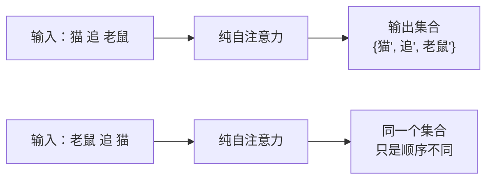
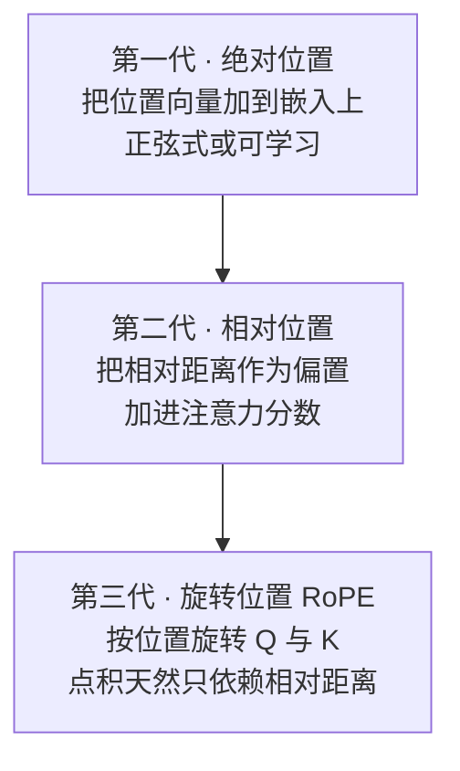
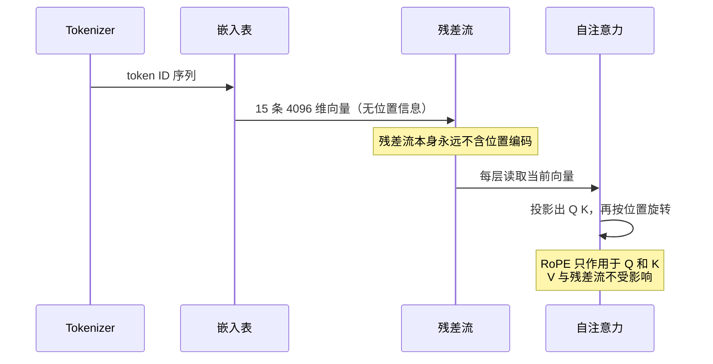

# 深度篇 ① · 嵌入层与位置编码器：从整数到"带位置感的向量"

> **角色回顾**：它拥有的唯一职责是**把 token ID 变成带位置感的向量**；它持有词表映射表和位置旋转规则；它**刻意不做**任何跨位置的信息交换。
>
> 在[运行示例](04-running-example.zh.md)里，它是**第 1 站**：把 15 个 token ID 变成 15 条残差流，并让位置 6 的「它A」和位置 13 的「它B」从此不再等价。

---

## 缩写对照表

| 缩写 | 英文全称 | 中文 |
|---|---|---|
| RoPE | Rotary Position Embedding | 旋转位置编码 |
| APE | Absolute Positional Encoding | 绝对位置编码 |
| ALiBi | Attention with Linear Biases | 线性偏置注意力 |
| PI | Position Interpolation | 位置插值 |
| NTK | Neural Tangent Kernel | 神经正切核（此处指 NTK-aware 缩放） |
| YaRN | Yet another RoPE extensioN method | 一种 RoPE 外推方法 |

---

## 一、嵌入层：一张巨大的查找表

嵌入层的内部结构简单到近乎无聊：**一个 $V \times d_{\text{model}}$ 的矩阵**，$V$ 是词表大小。前向计算就是**按行索引**，连矩阵乘法都不是。

Llama-3-8B：$128256 \times 4096 = 525{,}336{,}576$ 个参数，占 8.03B 总量的 **6.5%**。

```
token ID 9906 → 取第 9906 行 → [0.021, -0.335, 0.117, ..., 0.008]
```

三件值得知道的事：

**1）这一步之后文字就消失了。** 模型此后只在向量空间里运算，直到最后一步才变回 token。所有"模型看不见字母"的现象（数不清 strawberry 有几个 r）都源于此。

**2）嵌入是上下文无关的。** 同一个 ID 永远拿到同一行。示例里两个「它」在这一步**完全相同**——把它们区分开是后面所有层的工作。这正是"上下文化"这个目标的起点。

**3）输入嵌入与输出头可以共享，也可以不共享。** 共享（weight tying）省一半参数，早期模型常用；Llama-3-8B **不共享**，输入嵌入和输出头各有 5.25 亿参数，合计 13.1%。不共享的理由是两者的最优表示空间其实并不相同。

## 二、为什么必须有位置编码

[第 2 篇](02-what.zh.md)已经说过结论，这里给出机制。

自注意力对每个位置做的是"和所有位置算相似度再加权求和"。**这个运算里没有任何一处引用了下标 $i$ 本身**。把输入序列做任意置换 $\pi$，输出就是同样置换后的结果——内容一个字节都不会变。



*这张图回答：为什么没有位置编码，"猫追老鼠"和"老鼠追猫"对模型是同一句话。*

在运行示例里，这个缺陷是致命的：**"谁追谁"决定了"它"指谁**。位置编码不是优化项，是补一个架构缺口。

## 三、三代位置编码



**第一代（原论文，2017）**：给位置 $p$ 造一个向量 $PE_p$，直接加到词嵌入上。用不同频率的正弦、余弦构造，好处是能表示任意长度。问题是模型必须自己从绝对坐标里**反推**相对距离，而语言真正在乎的几乎总是相对距离。

**可学习绝对位置**（BERT、GPT-2）更简单粗暴：把位置也做成一张查找表。问题更明显——**超过训练长度的位置根本没有对应的行**，完全无法外推。

**第二代（相对位置偏置）**：T5 的相对位置桶、ALiBi 的线性距离惩罚。ALiBi 尤其干脆：在注意力分数上直接减去 $m \cdot |i-j|$，距离越远罚得越狠。外推性极好，但表达能力受限于"距离越远越不重要"这个先验。

**第三代 · RoPE**：今天几乎所有主流开源模型（Llama、Qwen、Mistral、DeepSeek）的选择。

## 四、RoPE：把位置变成一个旋转角

RoPE 的核心思想一句话：**不给向量加东西，而是转向量**。

把每个头的 $d_k=128$ 维向量，两两配对成 64 个二维平面。对第 $i$ 个平面定义一个频率：

$$\theta_i = \text{base}^{-2i/d_k}, \qquad i = 0, 1, \dots, d_k/2 - 1$$

在位置 $m$ 上，把第 $i$ 个平面里的那对分量旋转 $m\theta_i$ 弧度：

$$\begin{pmatrix} q'_{2i} \\ q'_{2i+1} \end{pmatrix} = \begin{pmatrix} \cos m\theta_i & -\sin m\theta_i \\ \sin m\theta_i & \cos m\theta_i \end{pmatrix} \begin{pmatrix} q_{2i} \\ q_{2i+1} \end{pmatrix}$$

Q 和 K 都这么转，V **不转**。

### 为什么这样就得到了相对位置

二维旋转有一个漂亮性质：两个旋转过的向量做内积，等价于把其中一个反向旋转两者角度之差。于是：

$$\langle \text{RoPE}(q, m),\ \text{RoPE}(k, n) \rangle = f(q, k, m-n)$$

**注意力分数只依赖 $m-n$，绝对位置被完全消掉了。** 这就是 RoPE 的全部魔法：用绝对位置的方式实现，得到相对位置的效果，而且不需要在注意力里加任何额外的项——旋转可以在算 Q、K 时一次做完。

### 频率的分布：从"每 6 个 token 转一圈"到"几百万 token 转一圈"

| 平面 $i$ | 频率 $\theta_i$ | 转一圈需要多少 token |
|---|---|---|
| 0（最快） | 1 | $2\pi \approx 6.3$ |
| 中间 | … | 数十到数千 |
| 63（最慢） | $1/\text{base}$ | $2\pi \cdot \text{base}$ |

高频平面刻画**紧邻关系**（相邻几个词），低频平面刻画**远距离关系**。这是一种自带多尺度的设计。

Llama-3 把 base 从原始的 10000 提到 **500000**——直接效果是最慢的那些平面周期变得极长，为长上下文预留了分辨率。

### 长度外推：训练 8K，如何推到 128K

RoPE 的外推能力不是无限的：位置超出训练范围后，旋转角落入训练中从未见过的区域，注意力分数分布崩坏，输出迅速退化为胡言乱语。三种主流补救：

| 方法 | 做法 | 代价 |
|---|---|---|
| **PI（位置插值）** | 把位置 $m$ 压缩成 $m/s$，硬塞进训练过的角度范围 | 高频分辨率被压扁，近距离能力下降 |
| **NTK-aware 缩放** | 只放大低频、保住高频 | 更平衡，通常仍需少量微调 |
| **YaRN** | 分频段处理 + 调整注意力温度 | 效果最好，实现最复杂 |

Llama-3.1 的 128K 上下文正是靠 RoPE 缩放（缩放因子 8）加长上下文续训得到的。

> **一个关键澄清**：位置编码撑大的是"模型能正确处理的位置范围"，不是"模型能有效利用的信息范围"。128K 能读进去，不代表中段的信息真的被用上——那是"lost in the middle"，属于注意力的问题，不是位置编码的问题。

## 五、与邻居的契约



*这张图回答：位置信息在什么时刻、以什么形式进入计算。*

两个容易搞错的契约细节：

1. **RoPE 不写残差流。** 位置信息不是加在总线上的，而是**每一层算注意力时现场施加**。这意味着 32 层各自独立地"重新感知"一次位置。
2. **V 不旋转。** 只有决定"看谁"的 Q、K 带位置，实际搬运的内容 V 是位置无关的。

## 六、⚓ 回到示例

现在把第 1 站放慢重放。

输入 `猫追老鼠，因为它饿了。这里的「它」指的是`，Tokenizer 交出约 15 个 ID。

**嵌入层**逐个查表。位置 6 的「它A」和位置 13 的「它B」拿到的是**同一行**——设为 $e_{\text{它}}$，两条残差流此刻逐位相等。

**这就是问题所在**：如果什么都不做，位置 13 的「它B」将和位置 6 的「它A」在整个网络里保持同分，模型无法知道被提问的是哪一个。

**RoPE 打破对称**。在第 1 层算注意力时：

- 「它A」的 Query 各平面旋转 $6\theta_i$；
- 「它B」的 Query 各平面旋转 $13\theta_i$；
- 「猫」（位置 1）的 Key 旋转 $1\theta_i$。

于是「它B」对「猫」的注意力分数只取决于距离 $13-1=12$；「它A」对「猫」的只取决于 $6-1=5$。**同样的词、同样的初始向量，因为距离不同而得到了不同的分数**——两条残差流从这一刻起分道扬镳。

再看那个被逼出来的需求：**"猫追老鼠"和"老鼠追猫"**。两句的 token 集合完全相同，仅顺序相反。没有 RoPE，两句在注意力眼里是同一个多重集合，输出必然相同；有了 RoPE，"猫"与"追"的相对距离从 $+1$ 变成 $-1$，负责施事关系的那几个头会给出完全不同的分数。**指代结论的正确性，从这一步就被决定了。**

## 七、故障行为

| 故障 | 现象 | 设计如何应对 |
|---|---|---|
| **位置超出训练长度** | 输出突然退化成重复或乱码 | RoPE 缩放（PI / NTK / YaRN）+ 长上下文续训 |
| **词表外的 token** | 遇到未知字节 | BPE 保证字节级兜底，不会真的"查不到" |
| **嵌入表被量化** | 低比特量化下罕见词表示劣化 | 嵌入层与输出头通常保持较高精度 |
| **位置 0 的特殊性** | 首 token 常吸走大量注意力（attention sink） | 这是模型自发形成的"泄压阀"，KV Cache 裁剪时必须保留前几个 token |

最后一条特别值得记住：**流式推理里丢掉最前面的 token 会让模型立刻崩坏**，原因就是 attention sink。StreamingLLM 的做法正是永久保留最初几个 token 的 KV。

---

**上一篇** ← [04 · 运行示例](04-running-example.zh.md) ｜ **下一篇** → [06 · 注意力核心：QKV 与缩放点积](06-attention-core.zh.md)

[← 系列索引](index.md) ｜ [← 概念地图](03-concept-map.zh.md)
