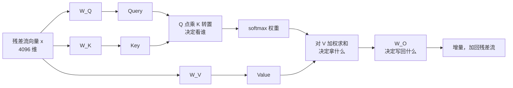

# 深度篇 ②-A · 注意力核心：QKV 与缩放点积

> **角色回顾**：自注意力拥有的唯一职责是**位置之间的信息路由**；它持有 Q、K、V、O 四个投影矩阵；它**刻意不做**知识加工（那是 FFN 的事）。
>
> 在[运行示例](04-running-example.zh.md)里，它是**第 2 站**——「它B」够到「猫」的唯一通道。自注意力是全架构里最深的一个角色，因此拆成三篇：**本篇讲单头的完整机制**，[第 7 篇](07-multi-head-mask.zh.md)讲多头与掩码，[第 8 篇](08-attention-variants.zh.md)讲工程变体。

---

## 缩写对照表

| 缩写 | 英文全称 | 中文 |
|---|---|---|
| Q / K / V | Query / Key / Value | 查询 / 键 / 值 |
| SDPA | Scaled Dot-Product Attention | 缩放点积注意力 |
| $W_O$ | Output Projection | 输出投影矩阵 |
| FLOPs | Floating-Point Operations | 浮点运算次数 |

---

## 一、心智模型：一次软性的字典查询

先建立直觉，再看公式。

想象一个 Python 字典查询 `d[key]`：你拿一个 key 去精确匹配，命中就返回对应的 value，没命中就报错。**注意力是这件事的可微版本**：

| 硬字典 | 注意力 |
|---|---|
| 一个 key 精确匹配 | 与**所有** key 算相似度 |
| 命中 / 未命中（0 或 1） | softmax 后的连续权重，和为 1 |
| 返回一个 value | 返回**所有** value 的加权平均 |
| 不可微，无法训练 | 处处可微，可端到端学习 |

把"硬查找"松弛成"软加权平均"，是为了**能求导**——这是所有深度学习组件的共同约束。

于是每个位置同时扮演三个角色：

- **Query**：我在找什么（只在我发起查询时用）；
- **Key**：我这里有什么，供别人来匹配（只在别人查我时用）；
- **Value**：如果有人决定看我，我实际交出的内容。

## 二、为什么必须是三个矩阵，不是一个

最常见的疑问：既然 Q、K、V 都由同一个向量 $x$ 投影而来，为什么不直接用 $x$ 本身？

**理由一：关系是有方向的。** 如果直接用 $x$ 做点积，$\text{score}(i,j) = x_i \cdot x_j$ 天然对称——"猫看老鼠"和"老鼠看猫"的分数必然相等。但语言关系绝大多数不对称：代词该看向名词，形容词该看向被修饰的中心词，反过来未必。**用两个不同的矩阵 $W_Q \ne W_K$ 投影，才能让 $\text{score}(i,j) \ne \text{score}(j,i)$。**

**理由二："用什么匹配"和"传什么内容"应当解耦。** 一个词可能靠它的**句法角色**被找到，但被取走的是它的**语义内容**。共用一个向量会强迫模型在这两个目标之间妥协。$W_V$ 的独立存在，让"检索特征"和"载荷特征"可以各自优化。

**理由三：$W_O$ 决定写回什么。** 输出投影 $W_O$ 把多头拼接的结果映射回残差流。它常被忽略，但正是它决定了这一层的产出**以什么形式写入总线**——同一份注意力结果，可以被写成完全不同的增量。



*这张图回答：四个投影矩阵各自把守哪一道关。*

## 三、公式逐项拆解

$$\text{Attention}(Q,K,V) = \text{softmax}\!\left(\frac{QK^\top}{\sqrt{d_k}}\right)V$$

按形状走一遍（单头，序列长 $n$，头维度 $d_k=128$）：

| 步骤 | 运算 | 输出形状 | 含义 |
|---|---|---|---|
| 1 | $Q = XW_Q$ | $n \times 128$ | 每个位置的查询向量 |
| 2 | $K = XW_K$，$V = XW_V$ | $n \times 128$ | 键与值 |
| 3 | $S = QK^\top$ | $n \times n$ | **每个位置对每个位置的原始分数** |
| 4 | $S / \sqrt{d_k}$ | $n \times n$ | 缩放 |
| 5 | 加因果掩码 | $n \times n$ | 上三角置 $-\infty$（[第 7 篇](07-multi-head-mask.zh.md)） |
| 6 | 逐行 softmax | $n \times n$ | 每行和为 1 的权重 |
| 7 | $\times V$ | $n \times 128$ | 加权求和后的输出 |

**第 3 步是整个 Transformer 里唯一一次让位置 $i$ 和位置 $j$ 相遇的运算。** 记住这一点，很多事情就通了：为什么复杂度是 $n^2$、为什么需要因果掩码、为什么长上下文这么贵——全都源自这一个 $n \times n$ 矩阵。

## 四、$\sqrt{d_k}$：一个防止 softmax 窒息的除法

假设 $q$ 和 $k$ 的各分量独立、均值 0、方差 1。它们的点积是 $d_k$ 项之和，**方差为 $d_k$，标准差 $\sqrt{d_k}$**。

$d_k = 128$ 时，标准差约 **11.3**。分数于是散布在 $\pm 30$ 这样的范围里，送进 softmax 会发生什么？

$$\text{softmax}([30, 0, -10]) \approx [1.0,\ 9\times10^{-14},\ \approx 0]$$

**softmax 饱和成了 one-hot**。一旦饱和，它的梯度趋近于 0——模型学不动了。而且这种"硬选择"让注意力退化成不可微的 argmax，失去了软加权的全部好处。

除以 $\sqrt{d_k}$ 把标准差拉回 1，分数落在 softmax 梯度最健康的区间。

用一个三位置的微型例子看差别（原始分数 $[2.0,\ 0.5,\ 1.0]$，$d_k=4$）：

| | 猫 | 追 | 老鼠 |
|---|---|---|---|
| 不缩放的 softmax | 0.629 | 0.140 | 0.231 |
| 除以 $\sqrt{4}=2$ 后 | 0.481 | 0.227 | 0.292 |

分布明显变平缓。$d_k$ 越大，不缩放的塌缩越严重——这个除法在 $d_k=128$ 时是生死攸关的。

> 顺带解释一个常见困惑：为什么是 $\sqrt{d_k}$ 而不是 $d_k$？因为要抵消的是**标准差**（$\sqrt{d_k}$），不是方差。

## 五、softmax 的另一个副作用：竞争

softmax 让一行权重之和恒为 1，这带来一个重要性质：**注意力是零和的**。给「猫」多一分，就必须从别处扣一分。

这解释了两个真实现象：

- **Attention sink**：模型有时"没什么特别想看的"，但 softmax 强迫它必须把这 1.0 分配出去。于是它学会把多余的权重倾倒在一个语义无关的位置上——通常是序列首 token。这是一个自发演化出的"泄压阀"。
- **头的专业化**：因为权重稀缺，每个头被迫聚焦于少数几种关系，而不是平均地关照所有位置。

## 六、参数与算力账（Llama-3-8B 单层）

Llama-3-8B 用 GQA（[第 8 篇](08-attention-variants.zh.md)细讲）：32 个查询头、8 个 KV 头、每头 128 维。

| 矩阵 | 形状 | 参数量 |
|---|---|---|
| $W_Q$ | $4096 \times 4096$ | 16,777,216 |
| $W_K$ | $4096 \times 1024$ | 4,194,304 |
| $W_V$ | $4096 \times 1024$ | 4,194,304 |
| $W_O$ | $4096 \times 4096$ | 16,777,216 |
| **合计** | | **41,943,040** |

32 层共约 **13.4 亿参数**，占 8.03B 的 **16.7%**——注意力**只占不到六分之一的参数**，却占据了几乎全部的推理优化注意力。原因在于算力和显存的分布与参数量并不一致：

| 部分 | 计算量（每层，粗略） | 随长度的增长 |
|---|---|---|
| 四次投影 | $\approx 4nd^2$ | 线性 |
| $QK^\top$ 与加权求和 | $\approx 2n^2d$ | **平方** |

两者相等的临界点在 $4d^2 = 2nd$，即 $n \approx 2d$。对 $d=4096$ 的 Llama-3-8B，这个临界点大约是 **8192 个 token**：短提示词下投影是大头，超过约 8K 之后，那个 $n^2$ 开始主导一切。

**这条分界线是长上下文所有工程问题的起点。**

## 七、⚓ 回到示例

把第 2 站放慢，只看**一个头、一层**——就是那个负责指代消解的头。

**输入**：位置 13「它B」的残差流向量 $x_{13}$（4096 维），以及前面所有位置的向量。

**第一步，投影。** $q_{13} = x_{13}W_Q$，得到一个 128 维向量。经过训练，这个头的 $W_Q$ 学到的功能大致是"如果输入是一个代词，就输出一个指向施事性名词的查询"。同时每个位置算出自己的 $k_j = x_jW_K$——「猫」的 Key 编码了"我是一个可作施事的生命体名词"。

**第二步，打分。** $q_{13}$ 与位置 0 到 13 的每个 $k_j$ 做点积（RoPE 已在此前施加，见[第 5 篇](05-embedding-position.zh.md)），得到 14 个分数。示意结果：

```
位置   1(猫)   3(老鼠)   2(追)   8(饿)   其余
原始   9.8      6.1      3.2     5.4     ...
```

**第三步，缩放。** 全部除以 $\sqrt{128} \approx 11.31$：

```
缩放后 0.87     0.54     0.28    0.48    ...
```

如果没有这一步，9.8 与 6.1 之差经 softmax 后会变成 97.5% 对 2.4% 的极端分配——训练初期这会让梯度迅速枯竭。缩放后的差距温和得多，模型有空间继续学习。

**第四步，掩码 + softmax。** 位置 14 及以后被置为 $-\infty$（本例中右边已无内容，但训练时同一句话的后续 token 必须被挡住）。softmax 后：

```
猫 0.31 ｜ 老鼠 0.19 ｜ 饿 0.17 ｜ 追 0.13 ｜ 其余合计 0.20
```

**注意「猫」并没有拿到 0.9。** 真实模型里单个头的权重通常是分散的——正确答案由 32 个头 × 32 层累积投票得出，而不是某一个头一锤定音。这是理解注意力的关键：**它是分布式的、增量的，不是一次性判决。**

**第五步，取值并写回。** 对所有位置的 $v_j$ 按上述权重加权求和，得到 128 维输出；与其余 31 个头拼成 4096 维；过 $W_O$；结果作为**增量**加回位置 13 的残差流。

至此，位置 13 的向量里第一次带上了"猫"的成分。后面 31 层会不断强化它。

## 八、故障行为

| 故障 | 现象 | 设计如何应对 |
|---|---|---|
| **softmax 饱和** | 梯度消失，训练停滞 | $\sqrt{d_k}$ 缩放；配合归一化控制输入量级 |
| **注意力熵坍缩** | 所有头都退化成只看自己或只看首 token | 残差连接保证信息可绕过；warmup 与 Pre-Norm 缓解 |
| **秩坍缩 / 过度平滑** | 深层后所有位置向量趋同 | 纯注意力堆叠会指数级坍缩；**残差与 FFN 正是解药**（[第 9](09-ffn.zh.md)、[第 10 篇](10-residual-norm.zh.md)） |
| **长序列下分数矩阵爆显存** | 8K 长度、32 头的 $n^2$ 矩阵单层就要 4GB | 不物化该矩阵（FlashAttention，[第 8 篇](08-attention-variants.zh.md)） |

最后一条值得算一遍：$n=8192$、fp16、单头分数矩阵为 $8192^2 \times 2\text{B} = 128\text{MB}$，32 个头就是 **4GB**——而这只是一层的中间结果。这个数字直接催生了 FlashAttention。

---

**上一篇** ← [05 · 嵌入与位置编码](05-embedding-position.zh.md) ｜ **下一篇** → [07 · 多头与因果掩码](07-multi-head-mask.zh.md)

[← 系列索引](index.md) ｜ [← 概念地图](03-concept-map.zh.md)
