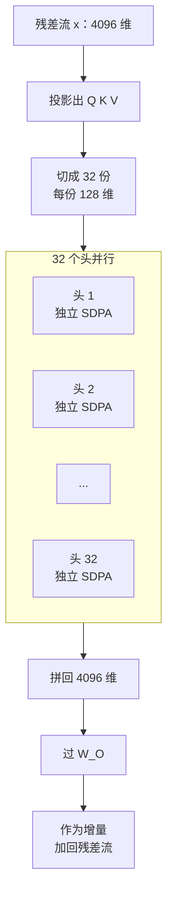
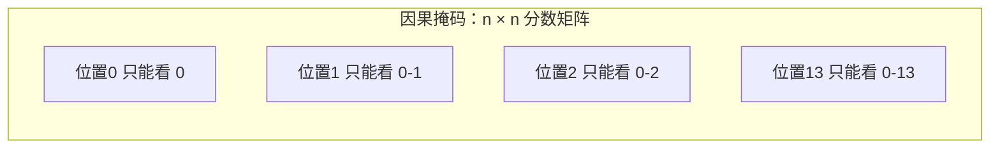
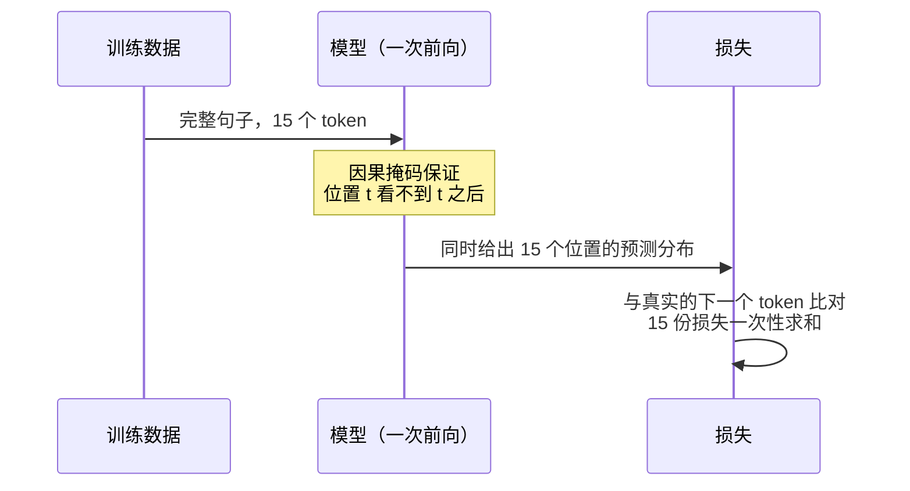

# 深度篇 ②-B · 多头与因果掩码：并行的多种关系，与不许偷看的铁律

> **角色回顾**：仍是自注意力这个角色。[上一篇](06-attention-core.zh.md)讲清了**单个头**怎么工作；这一篇回答两个"为什么"：为什么要有 32 个头，以及为什么必须有一个上三角的 $-\infty$。
>
> 在[运行示例](04-running-example.zh.md)里，这两件事分别对应：多个头同时处理语法/指代/常识（第 2 站的并行结构），以及「它B」只能看见它左边的内容（自回归约束）。

---

## 缩写对照表

| 缩写 | 英文全称 | 中文 |
|---|---|---|
| MHA | Multi-Head Attention | 多头注意力 |
| Prefix-LM | Prefix Language Model | 前缀语言模型 |
| MLM | Masked Language Modeling | 掩码语言建模 |
| SWA | Sliding Window Attention | 滑动窗口注意力 |

---

## 一、为什么一个头不够

问题出在 softmax 上：**一次 softmax 只能表达一种"该看谁"的判断**，而且权重之和被锁死为 1（[第 6 篇](06-attention-core.zh.md)的"竞争"性质）。

但示例那句话里，位置 13 的「它B」同时需要：

1. 找到最近的名词短语（**句法**）；
2. 判断哪个名词是施事方（**语义角色**）；
3. 记住引号内的内容是被讨论的对象（**篇章结构**）；
4. 关注紧邻的"的是"以维持语法连贯（**局部**）。

让一组权重同时满足这四件事是不可能的——给「猫」0.9 就没法同时给"的是"0.9。**多头的本质，就是给模型多组独立的权重预算。**

## 二、内部结构：切分、并行、拼接、投影



*这张图回答：4096 维的向量如何被切成 32 份分头处理再合并。*

关键设计：**每头维度 $d_k = d_{\text{model}} / h = 4096/32 = 128$**。

这个选择不是随意的——它让多头的**总计算量与单头几乎相同**。32 个头各算 128 维，和 1 个头算 4096 维，矩阵乘的 FLOPs 是同一个量级。**多头是免费的表达力**：不多花算力，换来 32 个独立的注意力模式。

代价在别处：每头 128 维意味着每个头能表达的关系维度受限。头太多、每头太窄，单个头会因维度不足而表达力下降——这是 $h$ 的上界来源。

### 拼接与 $W_O$ 的真实含义

拼接看起来只是把 32 个 128 维向量首尾相连，但配合 $W_O$ 就有了更准确的解读：**$W_O$ 可以按列切成 32 块，每块负责把一个头的输出映射回残差流**。也就是说：

$$\text{输出} = \sum_{i=1}^{32} \text{head}_i \cdot W_O^{(i)}$$

**多头注意力其实是 32 个独立模块的加和，而不是一次混合。** 这个视角在可解释性研究里非常有用——可以单独把某个头的贡献从残差流里"减掉"看效果。

## 三、头确实会分工，但不像教科书那么整齐

可解释性研究（尤其是对小模型的电路分析）确认了几类反复出现的头：

| 头的类型 | 干什么 |
|---|---|
| **前一 token 头** | 几乎只看紧邻左边一个位置，负责局部连贯 |
| **归纳头（induction head）** | 找到"上文出现过的相同 token"，然后复制它后面的那个 —— 上下文学习（in-context learning）能力的关键电路 |
| **句法头** | 权重分布高度对应依存句法关系 |
| **稀释头 / sink 头** | 大部分权重丢给首 token，实质上"这一步不做事" |

两条重要的现实修正：

1. **分工是涌现的，不是设计的。** 没有任何损失项要求头去做这些，它们是训练自发形成的。
2. **头有大量冗余。** 研究显示，训练好的模型剪掉很大一部分头，性能只有轻微下降——多头在训练期提供的是"多次尝试的机会"，在推理期则相当程度上是冗余的。这正是 MQA / GQA 敢于砍掉 KV 头的底气（[第 8 篇](08-attention-variants.zh.md)）。

## 四、因果掩码：一个上三角的 $-\infty$

### 机制

在 softmax **之前**，给分数矩阵加一个掩码矩阵：

$$M_{ij} = \begin{cases} 0 & j \le i \\ -\infty & j > i \end{cases}$$

$e^{-\infty} = 0$，于是这些位置的权重精确为 0。实现上通常用一个很大的负数（如 fp16 下的 $-65504$ 或 `-1e9`）代替 $-\infty$ 以免产生 NaN。



*这张图回答：因果掩码在分数矩阵上切出的形状——一个下三角。*

### 为什么必须有它：训练时的"一次前向，n 个预测"

这是掩码最容易被低估的价值。

一个自回归语言模型的训练目标是：给定前缀，预测下一个 token。朴素做法是一个样本只训练一个位置——效率极低。

因果掩码让一件漂亮的事成为可能：**把整句话一次性喂进去，同时训练全部 $n$ 个位置的预测**。位置 0 的输出预测位置 1、位置 1 的输出预测位置 2……每个位置都只看得到自己左边的内容，所以每个位置的预测都是合法的。



*这张图回答：为什么一次前向计算能产生 15 份训练信号。*

**训练效率提升了 $n$ 倍。** 这是 Transformer 能够吃下万亿 token 的直接原因之一——也是[第 1 篇](01-why.zh.md)里"必须能并行"这条约束的最终兑现方式。

### 推理时它反而"没用"

生成时是一个 token 一个 token 出的，右边本来就还不存在。掩码在推理期几乎不改变任何结果——**它的价值 100% 在训练期**。理解这一点，就理解了为什么它是"训练与推理行为一致性"的守卫者：没有掩码，训练时模型能偷看答案，推理时看不到，两者行为不一致，模型会彻底失效。

## 五、掩码的四种形状，决定了模型的四种性格

同一套注意力机制，换一个掩码就换一个模型家族：

| 掩码形状 | 谁能看见谁 | 代表模型 | 性格 |
|---|---|---|---|
| **全可见（无掩码）** | 双向 | BERT | 理解强，不能自回归生成 |
| **因果（下三角）** | 只看左边 | GPT、Llama | 生成，今天的主流 |
| **前缀（Prefix-LM）** | 提示词内双向，生成部分单向 | UL2、部分多模态模型 | 兼顾理解与生成 |
| **滑动窗口** | 只看左边最近 $w$ 个 | Mistral、Gemma | 复杂度降为线性，牺牲远距离 |

**架构完全相同，只有一个矩阵不一样。** 这是 Transformer 设计里最省事、也最能说明其通用性的一处。

## 六、⚓ 回到示例

### 多头的实况

回到位置 13 的「它B」，在某一层里 32 个头同时给出 32 组权重。抽样几个（示意）：

| 头 | 权重最高的位置 | 它在做什么 |
|---|---|---|
| 头 7 | 位置 12「「」 | 前一 token 头，维持局部连贯 |
| 头 11 | 位置 1「猫」 | 指代候选检索 |
| 头 19 | 位置 6「它A」 | 归纳头：上文出现过同一个 token「它」，去看它的上下文 |
| 头 23 | 位置 0 [BOS] | sink 头，本步实质不做事 |
| 其余 | 分散 | 语法、话题、无明显模式 |

**头 19 特别值得注意。** 它做的是纯粹的模式复制：「它B」和「它A」是同一个 token，那就去看「它A」当时在关注什么。而「它A」（位置 6，在"因为它饿了"中）本身就通过别的头绑定到了「猫」。**于是「猫」的信息通过两条路径抵达位置 13：直接检索（头 11）和归纳复制（头 19）。**

这就是"分布式、增量"的具体样子——没有哪个头独自解决了指代问题，是多条路径叠加的结果。

### 因果掩码的实况

**推理时**：位置 13 的分数矩阵那一行，位置 14 及以后全是 $-\infty$。本例中位置 14 是最后一个 token，没有右边内容，掩码看似无所谓。

**训练时才是关键**。假设这句话出现在训练语料里，完整形式是：

```
猫追老鼠，因为它饿了。这里的「它」指的是猫。
```

模型一次前向就要产出 16 份预测。其中：

- 位置 6「它A」预测下一个是「饿」——它**必须看不到**后文的「指的是猫」，否则这就不是预测而是抄写；
- 位置 14「的是」预测下一个是「猫」——这正是我们的目标预测，它能看到位置 0–14 的全部内容，但看不到答案本身。

**如果掩码写错了**（比如少了一行、或者用了 `<=` 而不是 `<` 的错误边界），位置 14 就能看到位置 15 的「猫」。后果是：**训练损失会漂亮得离谱（因为答案就在输入里），而生成时模型完全不会说话。** 这是实现 Transformer 时最经典、也最难察觉的一类 bug。

## 七、故障行为

| 故障 | 现象 | 设计如何应对 |
|---|---|---|
| **掩码泄漏未来** | 训练 loss 极低但生成全是乱码 | 单元测试：改动第 $t+1$ 个 token，第 $t$ 个位置的输出必须**逐位不变** |
| **fp16 下用 $-\infty$** | softmax 出现 NaN | 用有限大负数（如 $-65504$ 或 `-1e9`） |
| **整行被完全掩掉** | 该行 softmax 分母为 0，输出 NaN | padding 掩码需保证每行至少有一个可见位置 |
| **头冗余** | 大量头退化为 sink，算力浪费 | 头剪枝；或直接用 GQA 减少 KV 头（[第 8 篇](08-attention-variants.zh.md)） |
| **多头拼接维度写反** | 输出形状对但语义全乱，loss 缓慢下降不收敛 | reshape 后必须 `transpose(1,2)`，是实现中的高频错误点 |

第一条的那个测试值得单独记住：**改未来不动现在**，是验证因果性唯一可靠的方法。

---

**上一篇** ← [06 · QKV 与缩放点积](06-attention-core.zh.md) ｜ **下一篇** → [08 · GQA、KV Cache 与 FlashAttention](08-attention-variants.zh.md)

[← 系列索引](index.md) ｜ [← 概念地图](03-concept-map.zh.md)
