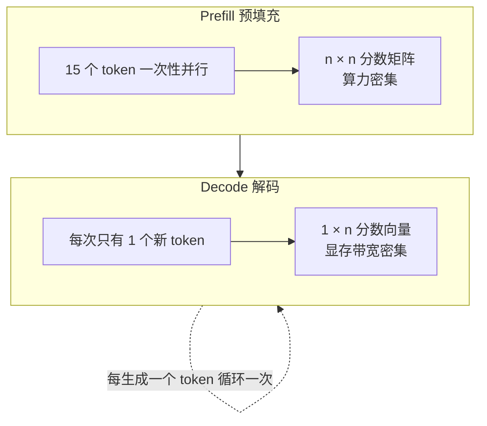
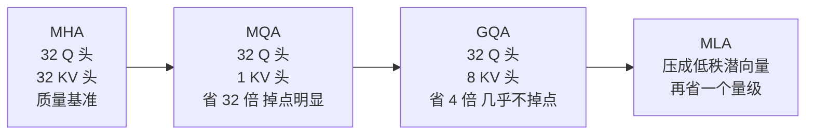
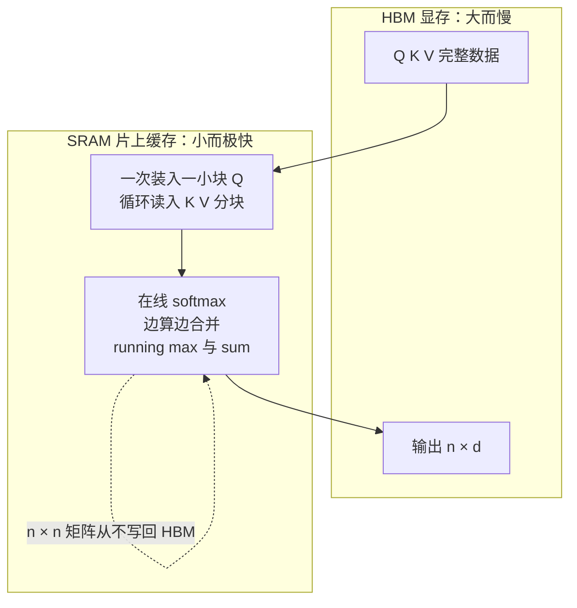

# 深度篇 ②-C · 工程变体：KV Cache、GQA/MQA/MLA 与 FlashAttention

> **角色回顾**：还是自注意力。前两篇讲的是**数学上它是什么**；这一篇讲**工程上它为什么这么贵，以及业界怎么把它变便宜**。
>
> 在[运行示例](04-running-example.zh.md)里，这一篇对应第 5 站末尾那句话：*"若继续生成，前 15 个位置的 K、V 已在 KV Cache 里，无需重算。"* —— 那句轻描淡写的话背后，是今天 LLM 推理的全部经济学。

---

## 缩写对照表

| 缩写 | 英文全称 | 中文 |
|---|---|---|
| KV Cache | Key-Value Cache | 键值缓存 |
| MHA | Multi-Head Attention | 多头注意力 |
| MQA | Multi-Query Attention | 多查询注意力 |
| GQA | Grouped-Query Attention | 分组查询注意力 |
| MLA | Multi-head Latent Attention | 多头潜在注意力 |
| SWA | Sliding Window Attention | 滑动窗口注意力 |
| HBM | High Bandwidth Memory | 高带宽显存 |
| SRAM | Static Random-Access Memory | 静态随机存储（GPU 片上高速缓存） |
| SM | Streaming Multiprocessor | 流式多处理器 |

---

## 一、问题的形状：两个完全不同的阶段

生成一段文字被切成两个阶段，它们的瓶颈截然相反：



*这张图回答：为什么同一个注意力算子，在两个阶段需要完全不同的优化。*

- **Prefill**：所有位置一次算完，矩阵又大又方，GPU 算力吃得很满 → 优化目标是**减少 $n^2$ 的开销**；
- **Decode**：每步只有一个新 Query，要和历史所有 K 做点积。计算量极小，但必须把全部权重和全部 KV 从显存读一遍 → 优化目标是**减少要读的字节数**。

这两个方向分别对应本篇的两条主线：**FlashAttention 治 prefill，KV Cache 系列变体治 decode。**

## 二、KV Cache：一个必然的缓存

朴素实现下，生成第 $t$ 个 token 要把前 $t-1$ 个 token 全部重算一遍 K、V——总代价是 $O(n^2)$ 次重复劳动。

但注意一个事实：**因果掩码保证了位置 $j$ 的 K、V 不受它右边任何内容影响**。所以第 $t$ 步算出的 $k_j, v_j$，在第 $t+1$ 步一模一样。

于是缓存它们。这不是优化技巧，而是因果性给出的**必然推论**。

### 显存账：这才是真正的约束

单个 token 的 KV Cache 大小：

$$\text{bytes} = 2 \times L \times h_{kv} \times d_k \times \text{精度字节数}$$

对 32 层、每头 128 维、fp16 的 Llama-3-8B：

| 配置 | KV 头数 | 每 token | 8K 上下文 | 批量 32 时 |
|---|---|---|---|---|
| **MHA** | 32 | 512 KB | 4 GB | 128 GB ✗ |
| **GQA**（实际采用） | 8 | 128 KB | 1 GB | 32 GB |
| **MQA** | 1 | 16 KB | 128 MB | 4 GB |

对比一下：模型权重本身 fp16 是 16 GB，固定不变。**在长上下文 + 高并发的服务场景里，KV Cache 会超过权重本身，成为第一显存开销。**

一张 80GB 的 H100 上跑 Llama-3-8B：权重 16GB，剩 64GB。用 MHA，8K 上下文只能并发 16 路；用 GQA，能并发 64 路。**吞吐量差 4 倍——这就是 GQA 存在的全部理由。**

## 三、MHA → MQA → GQA → MLA：一条压缩 KV 的演化线



*这张图回答：四种注意力变体在"KV 显存 vs 模型质量"上的取舍位置。*

**MQA（2019）**：所有 32 个 Query 头共享**同一组** K、V。KV Cache 直接除以 32。代价是质量下降明显、训练也更不稳定——32 个头被迫从同一份 K、V 里找信息，多头的表达优势损失了一大半。

**GQA（2023）**：折中方案，也是今天的事实标准。把 32 个 Query 头分成 8 组，**每组 4 个 Q 头共享一组 K、V**。

```
Q 头:  1 2 3 4 | 5 6 7 8 | ... | 29 30 31 32
KV 头:    1    |    2    | ... |      8
```

为什么几乎不掉点？回到[第 7 篇](07-multi-head-mask.zh.md)的那个发现：**头之间本来就高度冗余**。同组 4 个头共享检索空间（K）和载荷空间（V），但各自的 $W_Q$ 仍然独立——**"看谁"的判断依然是 32 种，只有"从哪个空间里找"被合并成 8 种**。表达力的损失远小于 4 倍这个数字给人的直觉。

**MLA（DeepSeek-V2/V3，2024）**：换了思路。不再是"少存几个头"，而是**把 K、V 压缩成一个低秩潜向量**存起来，用时再投影回去。位置信息通过一小段解耦的 RoPE 维度单独携带。DeepSeek-V2 报告其 KV Cache 相比同规模 MHA 基线减少约 93%，同时质量不降反升。代价是实现复杂度显著上升。

**一句话总结这条线**：MQA 砍得太狠，GQA 是甜点，MLA 是把"砍头数"换成"降秩"的更优解。

## 四、FlashAttention：不物化那个矩阵

### 问题

[第 6 篇](06-attention-core.zh.md)末尾算过：$n=8192$、fp16 下，单层 32 个头的分数矩阵是 **4 GB**。这个矩阵被写进 HBM，读出来做 softmax，再写回，再读出来乘 V——**同一份 4GB 数据在显存里来回搬了好几趟**。

而 GPU 的真相是：算力增长远快于显存带宽增长。**注意力早已不是被算力卡住，而是被"搬运"卡住。**

### 解法：分块 + 在线 softmax + 不落盘

FlashAttention 的核心洞察：那个 $n \times n$ 矩阵**只是中间结果，最终输出只有 $n \times d$**。既然如此，为什么要把它完整地写出来？



*这张图回答：FlashAttention 如何用分块把注意力从显存带宽瓶颈里解放出来。*

三个要点：

1. **分块（tiling）**：把 Q、K、V 切成能塞进 SRAM 的小块，在片上完成一小块的完整计算；
2. **在线 softmax**：softmax 需要全行的最大值和求和，看起来必须先看完整行。在线算法维护一个 running max 和 running sum，每来一个新块就按数学等价的方式**修正**之前的结果——这是整个方法能成立的数学关键；
3. **反向传播时重算**：不存分数矩阵，反向时按需重新计算。用少量算力换掉大量显存读写，**在带宽受限的场景下这是净赚**。

### 效果

- 显存占用从 $O(n^2)$ 降为 $O(n)$；
- 端到端速度提升数倍（长序列下更明显）；
- **计算结果与朴素实现在数值上等价**——它不是近似算法。

最后这一点非常重要：FlashAttention **不牺牲任何精度**，因此它没有取舍，是纯粹的胜利。这也是它在两年内成为所有框架默认实现的原因（PyTorch 的 `scaled_dot_product_attention` 会自动选用）。

## 五、其余方向：用精度换长度

以上都是**精确**方法。当 $n$ 大到连 FlashAttention 都扛不住时，只能开始近似：

| 方向 | 做法 | 代价 |
|---|---|---|
| **滑动窗口（SWA）** | 每个位置只看最近 $w$ 个（Mistral 用 4096） | 远距离依赖靠多层叠加间接传递 |
| **稀疏注意力** | 只算固定或可学习的稀疏模式 | 模式选错则丢关键信息 |
| **线性注意力** | 用核函数改写，避开 $n^2$ | 表达力下降，长期质量有差距 |
| **SSM / Mamba** | 换掉注意力本身，用可并行扫描 | 精确检索能力弱于注意力，常做成混合架构 |
| **KV Cache 量化 / 驱逐** | KV 存成 INT8/INT4，或丢弃低价值 token | 质量随压缩率下降；丢弃需保留 sink token |

一条经验判断：**精确方法（GQA、FlashAttention）应当先用满，近似方法只在长度真的超出预算时才引入。**

## 六、⚓ 回到示例

现在把第 5 站末尾那句话展开。

**Prefill 阶段**：15 个 token 一次性送入。每层算出 15 个位置的 K、V，形状是 `[8 个 KV 头, 15, 128]`。分数矩阵是 $15 \times 15$——小到微不足道，这个长度下 FlashAttention 与朴素实现没有可感知差别。

写入 KV Cache 的数据量：$15 \times 128\text{KB} = 1.9\text{ MB}$。可以忽略。

**Decode 第 1 步**：模型输出「猫」。

**Decode 第 2 步**：把「猫」接回输入，位置 15。此时发生的事：

1. 只为「猫」这**一个** token 算 Q、K、V；
2. 它的 K、V **追加**到 Cache 尾部，Cache 长度变 16；
3. 它的 Query 与 Cache 里全部 16 个 K 做点积——分数是一个 $1 \times 16$ 的**向量**，不是矩阵；
4. 对 16 个 V 加权求和。

**前 15 个位置的 K、V 一次都没有重算。** 如果没有 Cache，这一步要重做 15 个位置的全部投影——而且第 3 步、第 4 步……代价会一直累积成 $O(n^2)$。

**GQA 在这里的具体体现**：位置 15 的 32 个 Query 头，被分成 8 组去查 8 组 K、V。头 11（指代检索）和头 12、13、14 共享同一组 K——它们看的是同一个"检索空间"，但因为 $W_Q$ 各异，仍然问出了四个不同的问题。

**如果这句话不是 15 个 token 而是 128K 个**：Cache 会涨到 $131072 \times 128\text{KB} = 16\text{ GB}$——正好和模型权重一样大。此时每生成一个 token，GPU 都要把这 16GB 完整读一遍。**"长上下文越聊越慢"的机制，就在这里。**

## 七、故障行为

| 故障 | 现象 | 设计如何应对 |
|---|---|---|
| **KV Cache 撑爆显存** | OOM，或并发数被迫降到个位数 | GQA/MLA + PagedAttention 分页管理 + KV 量化 |
| **Cache 碎片化** | 显存够但分配不出连续块，利用率仅五六成 | vLLM 的 PagedAttention：按页管理，像虚拟内存一样 |
| **前缀 token 被驱逐** | 流式长对话中模型突然崩坏 | 保留最初几个 token（attention sink，见[第 5 篇](05-embedding-position.zh.md)） |
| **Cache 与位置编码错位** | 续写时位置编号接错，输出逻辑断裂 | RoPE 必须按 Cache 中的绝对位置施加，不能按当前批次下标 |
| **长上下文延迟膨胀** | 首 token 快、后续越来越慢 | 这是机制而非 bug；只能靠压缩上下文或换架构缓解 |

---

**上一篇** ← [07 · 多头与因果掩码](07-multi-head-mask.zh.md) ｜ **下一篇** → [09 · FFN：知识存在哪里](09-ffn.zh.md)

延伸阅读：[LLM 推理系列 · KV Cache 完全解析](../llm-inference/kv-cache.zh.md)

[← 系列索引](index.md) ｜ [← 概念地图](03-concept-map.zh.md)
