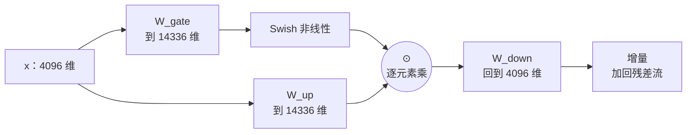
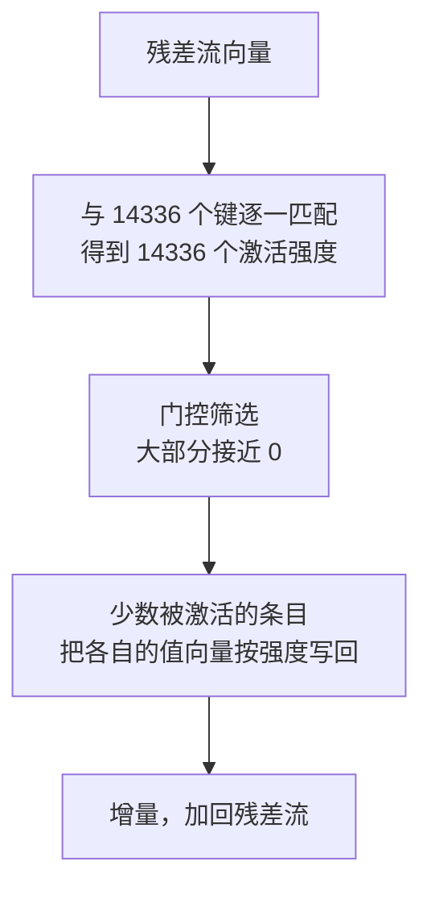

# 深度篇 ③ · 前馈网络 FFN：那七成参数在干什么

> **角色回顾**：FFN 拥有的唯一职责是**单个位置内部的知识加工**；它持有约七成的模型参数；它**刻意不看**任何其他位置。
>
> 在[运行示例](04-running-example.zh.md)里，它是**第 3 站**：注意力把「猫」的信息搬到了位置 13，但"追逐的施事方是捕食者、饿了的是捕食者"这条常识，是 FFN 从权重里取出来的。

---

## 缩写对照表

| 缩写 | 英文全称 | 中文 |
|---|---|---|
| FFN | Feed-Forward Network | 前馈网络 |
| MLP | Multi-Layer Perceptron | 多层感知机（此处同义） |
| ReLU | Rectified Linear Unit | 修正线性单元 |
| GELU | Gaussian Error Linear Unit | 高斯误差线性单元 |
| SwiGLU | Swish-Gated Linear Unit | Swish 门控线性单元 |
| MoE | Mixture of Experts | 混合专家 |
| SAE | Sparse Autoencoder | 稀疏自编码器 |

---

## 一、结构：升维、非线性、降维

FFN 的结构比注意力简单得多。经典版本（原论文）只有两个矩阵：

$$\text{FFN}(x) = W_2 \cdot \sigma(W_1 x)$$

先把 4096 维升到一个更宽的中间维度，过一次非线性，再压回 4096 维。**升维再降维**这个形状是关键：中间那层宽出来的空间，就是知识存放的地方。

现代模型（Llama、Qwen、Mistral）用的是 **SwiGLU**，三个矩阵：

$$\text{FFN}(x) = W_{\text{down}} \Big( \text{Swish}(W_{\text{gate}}\, x) \odot W_{\text{up}}\, x \Big)$$

其中 $\odot$ 是逐元素乘。多出来的 $W_{\text{gate}}$ 分支充当**门控**：它决定 $W_{\text{up}}$ 那条通路上每一个中间维度**放行多少**。

*这张图回答：SwiGLU 的三条通路如何组成一次门控的升维-降维。*

Llama-3-8B 的数字：中间维度 **14336**（$3.5 \times d_{\text{model}}$），三个 $4096 \times 14336$ 的矩阵，**每层 176,160,768 个参数**。

### 参数账：为什么说"七成"

| 部分 | 每层参数 | 32 层合计 | 占 8.03B 的比例 |
|---|---|---|---|
| 注意力（含 GQA） | 41,943,040 | 1.34 B | 16.7% |
| **FFN** | **176,160,768** | **5.64 B** | **70.2%** |
| 归一化 | 8,192 | 0.26 M | ~0% |
| 嵌入 + 输出头 | — | 1.05 B | 13.1% |

**FFN 是模型的主体。** 一个常见的误解是"Transformer 的核心是注意力，所以参数主要在注意力里"——恰恰相反。注意力只是路由，**知识存在 FFN 里**。

### 激活函数的三代演进

| 代 | 函数 | 特点 |
|---|---|---|
| ReLU | $\max(0,x)$ | 简单，但负半轴梯度恒为 0，会产生"死神经元" |
| GELU | 平滑近似 | BERT、GPT-2/3 采用，负半轴保留小梯度 |
| **SwiGLU** | Swish + 门控 | 多一个矩阵换来更好的质量-参数比，现代开源模型的默认选择 |

原论文作者对 SwiGLU 效果的著名评语是"归因于神造的恩典"——即理论解释至今不充分，但实验结果稳定更好。这在深度学习里并不罕见。

## 二、内部机制：把 FFN 读成一张键值记忆表

这是理解 FFN 的最有力视角，来自对 FFN 的可解释性研究。

把 $W_{\text{up}}$（或经典版的 $W_1$）**按行**看：每一行是一个 4096 维向量，与输入做点积，得到一个标量。**这就是一次模式匹配**——这一行是一个"检测器"，它在问"输入里有没有某种特征"。

再把 $W_{\text{down}}$（或 $W_2$）**按列**看：每一列也是一个 4096 维向量。当对应的中间维度被激活时，这一列就**按激活强度写回残差流**。

于是：

$$\text{FFN}(x) = \sum_{i=1}^{14336} \underbrace{a_i(x)}_{\text{第 }i\text{ 个检测器的激活}} \cdot \underbrace{W_{\text{down}}^{(:,i)}}_{\text{它要写入的内容}}$$

**FFN 是一张 14336 条目的软性键值表**：键是模式检测器，值是要写回残差流的信息。注意力从**上下文**里检索，FFN 从**权重**里检索——两者是同一个动作的两种数据源。

*这张图回答：FFN 内部如何完成一次"从参数里查知识"。*

三个由此推出的重要事实：

**1）激活是稀疏的。** 任意一个输入，14336 个中间维度里通常只有一小部分被显著激活。这个稀疏性是 MoE 的直接理论依据——**既然每次只用一小部分，为什么要把全部都算一遍？**

**2）不同层负责不同粒度。** 浅层 FFN 倾向于处理词法与浅层句法模式，深层 FFN 才处理事实与语义关系。事实类知识的编辑研究（如 ROME）就是定位到特定层的特定 FFN 条目再改写。

**3）神经元是多义的（polysemantic）。** 一个中间维度往往同时响应好几个毫不相关的概念。原因是模型要在 14336 个维度里塞下远多于 14336 个特征——这被称为**叠加（superposition）**。稀疏自编码器（SAE）正是为了把叠加的特征拆开而设计的。

## 三、与邻居的契约

FFN 的接口极其干净：

| 项 | 内容 |
|---|---|
| **输入** | 一个位置的、归一化后的 4096 维向量 |
| **输出** | 一个 4096 维增量，加回同一位置的残差流 |
| **看得见** | 只有自己这一个位置 |
| **看不见** | 其他任何位置，以及位置编号 |

**"不看其他位置"是设计上的刻意选择，不是遗漏。** 好处是巨大的：FFN 对所有位置完全并行、无依赖，可以直接按 token 维度切分到不同设备上（张量并行的天然切分点）。分工清晰意味着可优化。

也正因如此，MoE 只替换 FFN 而不动注意力——**FFN 的无状态、逐位置性质使它成为最容易被"换成一堆专家"的部件**。

## 四、⚓ 回到示例

回到第 3 站。注意力刚刚把「猫」的信息搬到了位置 13 的残差流上。此刻这条向量携带的信息大致是：

> "我是一个代词；上文的候选名词里，『猫』的权重最高；上下文中出现了『追』和『饿了』。"

**但这还不足以得出结论。** 需要一条常识：*追逐关系里的施事方是捕食者，而"饿了"描述的通常是捕食者。* 这条知识不在输入里，只能来自权重。

FFN 接手，只处理位置 13 这一条向量：

**第一步，模式匹配。** $x_{13}$ 与 14336 个键逐一点积。假设第 8021 个键在训练中学到的模式是"代词 + 捕食性动词 + 生理状态描述共现"——它被强烈激活，激活值 3.7。同时第 205 个键（"引号内容是被讨论对象"）激活 2.1，绝大多数其他键接近 0。

**第二步，门控。** $W_{\text{gate}}$ 分支给出的门控值决定这些激活是否放行。假设 8021 号被放行、部分噪声激活被压到接近 0。

**第三步，写回。** $W_{\text{down}}$ 的第 8021 列，是一个 4096 维向量，方向大致对应"施事方 / 捕食者"这个语义。它按 3.7 的强度被加进位置 13 的残差流。

**结果**：这条残差流现在不只是"指向猫"，而是"指向一个作为施事方的捕食者，而上文唯一的候选是猫"。

**关键分工再确认一次**：

| 谁 | 提供了什么 | 来源 |
|---|---|---|
| 自注意力 | "上文有『猫』和『老鼠』，『猫』更相关" | **上下文** |
| FFN | "饿了 + 追逐 ⇒ 施事方是捕食者" | **权重** |

如果只有注意力，模型知道候选是谁但不知道选谁；如果只有 FFN，模型有常识但够不到上文。**两者缺一，示例都会失败。** 这就是"通信 + 计算"这个二分法的实际意义。

这个过程在 32 层里重复。浅层的 FFN 处理的是"『的是』后面通常跟名词"这类浅层模式；到了第 20 层往后，才是上面这种语义级判断。

## 五、故障行为

| 故障 | 现象 | 设计如何应对 |
|---|---|---|
| **死神经元** | ReLU 下部分中间维度永久输出 0，容量浪费 | 改用 GELU / SwiGLU，负半轴保留梯度 |
| **知识错误且难修** | 模型坚持一个过时事实 | 知识分布在多层多条目上，定点编辑（ROME 等）易有副作用；实践中更依赖 RAG 与工具调用 |
| **幻觉** | 键匹配到了"形似但错误"的条目 | 这是有损压缩的固有产物，非 bug（见 [LLM 全景指南 · 11](../llm-fundamentals/11-hallucination.zh.md)） |
| **激活值溢出** | fp16 下中间层激活超出表示范围 | 归一化控制量级（[第 10 篇](10-residual-norm.zh.md)）；必要时用 bf16 |
| **算力浪费在稀疏激活上** | 每次都算全部 14336 维，实际只用一小部分 | MoE：把一个大 FFN 拆成多个专家，每 token 只激活其中少数几个 |

---

**上一篇** ← [08 · 注意力工程变体](08-attention-variants.zh.md) ｜ **下一篇** → [10 · 残差流与归一化](10-residual-norm.zh.md)

[← 系列索引](index.md) ｜ [← 概念地图](03-concept-map.zh.md)
