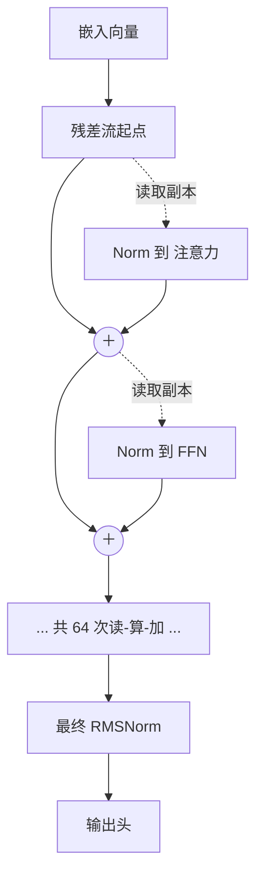
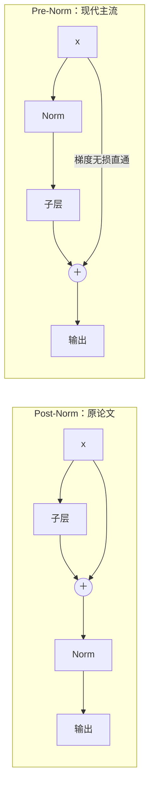

# 深度篇 ④ · 残差与归一化：让 32 层不至于崩掉的那些胶水

> **角色回顾**：它拥有的唯一职责是**让深层网络仍然可训练、可传播**；它持有每个子层前的缩放向量；它**刻意不改变语义**，只稳定数值与梯度。
>
> 在[运行示例](04-running-example.zh.md)里，它是**第 4 站**，也是唯一一个贯穿全部 32 层、64 次子层调用的角色。它是配角，但去掉它模型根本训不起来。

---

## 缩写对照表

| 缩写 | 英文全称 | 中文 |
|---|---|---|
| LayerNorm | Layer Normalization | 层归一化 |
| RMSNorm | Root Mean Square Normalization | 均方根归一化 |
| BatchNorm | Batch Normalization | 批归一化 |
| Post-LN | Post-Layer-Normalization | 后置归一化 |
| Pre-LN | Pre-Layer-Normalization | 前置归一化 |

---

## 一、残差流：不是流水线，是一条总线

先纠正一个几乎人人都有过的错误图景。

**错误图景**：数据像流水线一样，从注意力流进 FFN，从 FFN 流进下一层的注意力，一站一站被改造。

**正确图景**：每个位置有一条**贯穿全部 32 层的 4096 维总线**。每个子层从总线上**读一份副本**，算出一个增量，再把增量**加回**总线。总线本身从不被替换。

$$x \leftarrow x + \text{Attn}(\text{Norm}(x)), \qquad x \leftarrow x + \text{FFN}(\text{Norm}(x))$$

*这张图回答：残差流为什么是"总线"而不是"管道"。*

这个视角一旦建立，三件事立刻变得显然：

**1）任何一层都可以选择"什么都不做"。** 增量为 0，信息原样通过。所以深度是**软性**的——32 层不是必须走满 32 步，模型可以自主决定哪些层对哪些 token 有用。

**2）梯度有一条无损高速路。** 加法的梯度是 1，反向传播时梯度可以沿着总线**原样**传回最底层，完全不经过任何矩阵。这就是残差连接解决梯度消失的全部机制——朴素、有效。

**3）不同层之间可以"隔空通信"。** 第 3 层的某个注意力头往总线写入一个特征，第 20 层的某个 FFN 可以读到它，中间各层无需参与。可解释性研究里的"电路"（circuit）指的正是这种跨层协作。

### 一个推论：残差流是拥挤的

4096 个维度要承载全部信息：token 身份、句法角色、指代关系、话题、情感……而模型要表达的特征数远多于 4096。**这就是[第 9 篇](09-ffn.zh.md)提到的"叠加"现象的根源**——特征以近似正交的方向挤在同一个空间里，互相之间有少量干扰。

## 二、归一化：为什么必须有，为什么在前面

### 它防的是什么

64 次加法累加下来，残差流上向量的模长会**单调增长**。如果不加干预：

- 激活值量级失控，fp16 下直接溢出；
- 送进 softmax 和非线性的输入落到饱和区，梯度消失；
- 各层输入的分布随训练漂移，学习率极难调。

归一化的作用就是：**在每个子层读取副本时，先把它拉回一个统一的量级**。

注意它归一化的是**副本**，不是总线本身。总线上的向量继续自由增长——这个区别是 Pre-Norm 的核心。

### LayerNorm 与 RMSNorm

**LayerNorm**（原论文）：对每个 token 的向量，减去均值、除以标准差，再乘一个可学习的缩放 $\gamma$ 加一个偏置 $\beta$：

$$\text{LN}(x) = \gamma \odot \frac{x - \mu}{\sqrt{\sigma^2 + \epsilon}} + \beta$$

**RMSNorm**（现代主流）：把减均值和偏置都去掉，只做均方根缩放：

$$\text{RMSNorm}(x) = \gamma \odot \frac{x}{\sqrt{\frac{1}{d}\sum_i x_i^2 + \epsilon}}$$

去掉均值中心化省了一遍求和与一遍减法，实测能带来约 10%–15% 的归一化层耗时下降，而质量基本无损。**结论是：中心化这一步原来并不重要，起作用的是重新缩放。** Llama 全系、Qwen、Mistral 都用 RMSNorm。

每层两个 RMSNorm，各 4096 个参数——32 层合计仅 26 万参数，**占模型的 0.003%**。这是全架构里性价比最高的一笔开销。

> 与 BatchNorm 的区别值得一提：BatchNorm 沿 batch 维度统计，依赖批次大小、且训练/推理行为不一致；LayerNorm/RMSNorm 只在单个 token 的特征维度上统计，**与批次和序列长度完全无关**——这正是变长序列场景所必需的。

### Post-Norm 与 Pre-Norm：一次影响深远的位置调整

原论文用的是 **Post-Norm**：先算子层、再加残差、最后归一化。

$$x \leftarrow \text{Norm}(x + \text{Sublayer}(x))$$

问题是：归一化被放在了残差通路**之上**，梯度回传时必须穿过它，那条"无损高速路"就被切断了。后果是深层模型极难训练——必须配合学习率 warmup，层数一多就容易发散。

**Pre-Norm** 把归一化挪到子层**之前**：

$$x \leftarrow x + \text{Sublayer}(\text{Norm}(x))$$

*这张图回答：一个 Norm 的位置差别，如何决定百层模型能否训起来。*

Pre-Norm 让残差通路上**除了加法什么都没有**，梯度直通。代价是最终输出的量级会随层数增长，所以要在**全部层之后再补一个 final norm**——这就是架构图里那个孤零零的最终 RMSNorm 的来历。

今天几乎所有大模型都是 Pre-Norm。**"从 Post 换到 Pre"是让 Transformer 从几十层走向上百层的关键改动之一。**

## 三、⚓ 回到示例

第 4 站的实况：位置 13 的残差流走完 64 次"读—算—加"。

**第 0 层入口**：向量就是「它」的嵌入，模长设为 1.0（示意）。此刻它和位置 6 的「它A」几乎相同。

**第 1–8 层**：浅层主要在做局部语法与词法。注意力增量小，FFN 增量小。模长缓慢上升到约 3。此时向量的含义还很泛：**"一个代词"**。

**第 9–20 层**：语义层开始工作。[第 6 篇](06-attention-core.zh.md)里那个指代头在第 14 层左右给出显著贡献，[第 9 篇](09-ffn.zh.md)里那个 8021 号 FFN 条目在第 18 层附近激活。这些增量方向一致地累加，模长升到约 12。含义收敛为：**"指向猫这个施事方"**。

**第 21–32 层**：主要在做输出格式的准备——把语义表示转成便于输出头打分的形式。模长继续升到约 30。

**关键点：这个从 1 到 30 的增长完全是良性的**，因为每个子层读到的都是 RMSNorm 之后的副本，量级恒定在 1 附近。子层内部的矩阵永远面对同一个尺度的输入，训练才可能稳定。

**如果去掉残差连接会怎样？** 位置 13 的向量在第 1 层就被注意力的输出**完全替换**。「它」这个 token 自身的身份信息、以及 RoPE 提供的位置信息，都会在几层之内被冲刷殆尽。而且更致命的是[第 6 篇](06-attention-core.zh.md)故障表里的**秩坍缩**：纯注意力堆叠会让所有位置的向量指数级地收敛到同一个方向——32 层之后，位置 13 和位置 3 将变得无法区分。**残差连接是防止这件事发生的主要机制。**

**如果去掉归一化会怎样？** 上面那个从 1 到 30 的增长会变成指数式的。以每层放大 1.5 倍估算，32 层后是 $1.5^{32} \approx 4.3 \times 10^{5}$ 倍——fp16 的上限是 65504，**训练在前几百步内必然溢出为 NaN**。

## 四、故障行为

| 故障 | 现象 | 设计如何应对 |
|---|---|---|
| **训练发散 / loss 突刺** | loss 曲线出现尖峰或直接变 NaN | Pre-Norm + warmup + 梯度裁剪；bf16 优于 fp16（动态范围更大） |
| **深层退化** | 加层数反而变差 | 残差保证"至少不劣于恒等映射" |
| **秩坍缩 / 过度平滑** | 深层所有 token 表示趋同 | 残差 + FFN 共同对抗；这也是纯注意力模型无法工作的原因 |
| **$\epsilon$ 取值不当** | 极小激活下除零或数值抖动 | 通常取 $10^{-5}$ 或 $10^{-6}$，且在 fp32 中计算归一化 |
| **归一化位置写错** | Post-Norm 实现却按 Pre-Norm 调参，深层训不动 | 明确架构约定；Pre-Norm 必须记得补 final norm |

最后一条实践经验：**归一化的统计量务必用 fp32 计算**，即使模型整体是 bf16。求平方和这一步在低精度下极易损失有效数字，是混合精度训练里的经典坑。

---

**上一篇** ← [09 · FFN](09-ffn.zh.md) ｜ **下一篇** → [11 · 输出头与采样](11-output-head.zh.md)

[← 系列索引](index.md) ｜ [← 概念地图](03-concept-map.zh.md)
