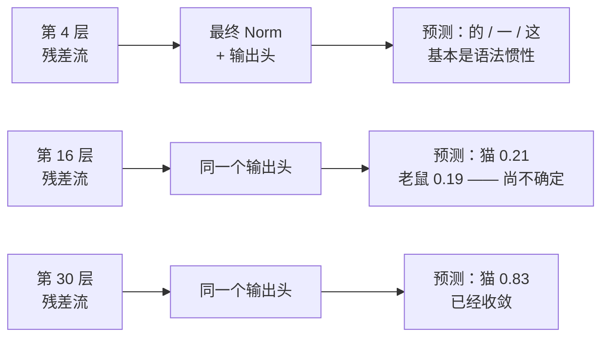
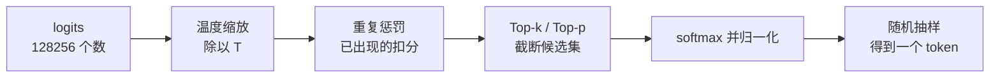

# 深度篇 ⑤ · 输出头与采样器：从 4096 个数到一个汉字

> **角色回顾**：它拥有的唯一职责是**把残差流上的向量变回一个 token**；它持有词表投影矩阵和采样参数；它**不参与任何中间层计算**。
>
> 在[运行示例](04-running-example.zh.md)里，它是**第 5 站**：把位置 14 走完 32 层的那条 4096 维向量，变成「猫」这一个字。

---

## 缩写对照表

| 缩写 | 英文全称 | 中文 |
|---|---|---|
| LM Head | Language Model Head | 语言模型输出头 |
| Logits | — | 未归一化的对数几率打分 |
| Top-k / Top-p | — | 前 k 个 / 累积概率前 p（核采样） |
| Logit Lens | — | 用输出头解读中间层残差流的探针方法 |

---

## 一、结构：一次矩阵乘，一次 softmax

输出头的全部内容：

```
最终 RMSNorm → 线性投影 4096 × 128256 → logits → softmax → 概率分布
```

投影矩阵 $W_{\text{lm}}$ 的每一**列**是一个 4096 维向量，对应词表里的一个 token。做矩阵乘就是**让残差流向量与全部 128256 个 token 向量逐一做点积**——本质上又是一次相似度检索，只不过检索的对象是词表。

$$\text{logit}_v = \langle x_{\text{final}},\ W_{\text{lm}}^{(:,v)} \rangle$$

参数量：$4096 \times 128256 = 525{,}336{,}576$，占 8.03B 的 **6.5%**。

计算量上它也不便宜：每生成一个 token 要做 5.25 亿次乘加，**相当于两到三个 Transformer 层的投影开销**。词表越大，这个头越重——这是词表大小工程权衡的一部分。

### 权重共享（weight tying）

$W_{\text{lm}}$ 和输入嵌入表的形状恰好互为转置，所以可以共享同一份权重，省下 5.25 亿参数。GPT-2 等早期模型这么做。

Llama-3-8B **不共享**。理由是两者的最优空间并不相同：输入嵌入要回答"这个 token 意味着什么"，输出头要回答"什么样的语境该生成这个 token"。在参数不再稀缺的今天，多花 6.5% 换质量是划算的。

### 只算最后一个位置

推理时有一个容易忽略的优化：**只有最后一个位置需要过输出头**。前面 14 个位置的预测在生成场景下毫无用处。

训练时则相反：**全部 $n$ 个位置都要过输出头**，因为每个位置都在贡献一份损失（[第 7 篇](07-multi-head-mask.zh.md)的"一次前向 n 个预测"）。这也是训练时输出头成为显存大户的原因——$n \times 128256$ 的 logits 张量在长序列下相当可观。

## 二、Logit Lens：在任意一层提前解读残差流

因为残差流的维度从头到尾恒为 4096，**输出头这个"解码器"可以被安在任何一层的输出上**。这个技巧叫 logit lens：



*这张图回答：一个预测是在哪几层之间成形的。*

它给出的洞察很有价值：**模型的答案不是在最后一层"算出来"的，而是在中间某几层逐步收敛的**，最后几层往往只做格式与置信度的微调。这直接支撑了"提前退出"（early exit）和投机解码这类推理加速方法。

## 三、从 logits 到 token：采样器的四个旋钮

logits 是一组任意实数。softmax 把它变成概率分布：

$$P(v) = \frac{e^{z_v / T}}{\sum_{v'} e^{z_{v'} / T}}$$

那个 $T$ 就是**温度**——用户唯一能在推理时实时调整的"性格旋钮"。

### 温度

温度在指数上做除法，效果是**缩放分布的尖锐程度**：

以示例的前三个候选（logits 18.20 / 15.98 / 14.47）为例，只看这三个并重新归一化：

| 温度 | 猫 | 老鼠 | 它 | 效果 |
|---|---|---|---|---|
| $T=0.5$ | 0.988 | 0.012 | 0.001 | 几乎确定性，重复风险高 |
| $T=1.0$ | 0.883 | 0.096 | 0.021 | 原始分布 |
| $T=2.0$ | 0.674 | 0.222 | 0.105 | 发散，容易跑题 |
| $T \to 0$ | 1.0 | 0 | 0 | 等价于贪心解码 |

注意 $T$ 并不改变**排序**，只改变差距。$T \to 0$ 就是 argmax。

### 截断类采样

光有温度不够：词表有 12.8 万个候选，即使每个的概率只有 $10^{-6}$，尾部加起来也可能有可观的总质量。**采样到一个荒谬 token 的概率并不可忽略**，而一旦采错，自回归会把错误一路放大。

于是有了截断：

| 方法 | 做法 | 特点 |
|---|---|---|
| **Top-k** | 只保留概率最高的 $k$ 个 | 简单；但分布尖锐时 $k$ 太大，平坦时 $k$ 太小 |
| **Top-p（核采样）** | 从高到低累积到概率和达 $p$ 为止 | 自适应候选数量，最常用 |
| **Min-p** | 保留概率不低于 $p \times P_{\max}$ 的候选 | 对温度更鲁棒，近年流行 |
| **重复惩罚** | 对已出现过的 token 扣分 | 抑制复读；过强会伤害正常重复（如代码缩进） |

实际系统里这些是**串联**的：先温度缩放，再截断，最后在剩下的候选里按概率抽样。



*这张图回答：一次采样调用里，四个旋钮的作用顺序。*

**一个重要提醒**：采样器完全在模型之外。同一份权重、同一个提示词，不同采样参数会给出截然不同的输出。评测模型时不固定采样参数，结论不可比。

## 四、⚓ 回到示例

第 5 站的实况。

**输入**：位置 14「的是」走完 32 层后的残差流向量（模长约 30，见[第 10 篇](10-residual-norm.zh.md)）。

**第一步，最终 RMSNorm**。把模长拉回 1 附近——如果跳过这一步，logits 会全部放大约 30 倍，softmax 直接饱和成 one-hot，温度旋钮完全失效。

**第二步，投影**。与 128256 个 token 向量逐一点积。「猫」这一列在训练中学到的方向，恰好对齐残差流里被强化的那个"施事捕食者"方向，于是点积最大。

结果（示意）：

```
猫    logit 18.20
老鼠  logit 15.98
它    logit 14.47
动物  logit 12.30
...   剩余 128252 个 token
```

**第三步，softmax**：

```
猫 0.83 ｜ 老鼠 0.09 ｜ 它 0.02 ｜ 其余合计 0.06
```

**为什么「老鼠」还有 0.09？** 因为它同样是上文出现过的名词，语法上完全成立。模型对指代的判断依据只是常识倾向，不是逻辑证明——**0.09 这个数字恰恰是这个模型不确定性的诚实表达**。这也解释了为什么同一个问题在 $T=1$ 下多次采样，偶尔会得到「老鼠」。

**第四步，用 logit lens 回看这个答案是怎么长出来的**（示意）：

| 层 | 此处解出的 top-1 | 「猫」的概率 |
|---|---|---|
| 4 | 「的」 | 0.001 |
| 12 | 「老鼠」 | 0.08 |
| 16 | 「猫」 | 0.21 |
| 24 | 「猫」 | 0.61 |
| 32 | 「猫」 | 0.83 |

第 12 层时模型还倾向「老鼠」——大概是因为它离得更近、是最近的名词。**转折发生在第 14–18 层之间**，正是[第 6 篇](06-attention-core.zh.md)那个指代头和[第 9 篇](09-ffn.zh.md)那个常识条目发挥作用的位置。**答案在中段就已经定了，后面十几层是在加固它。**

**第五步，采样**。$T=0$ 时必出「猫」。$T=0.7$、top-p=0.9 时，候选集会被截断到只剩「猫」和「老鼠」，绝大多数情况下仍是「猫」。

## 五、故障行为

| 故障 | 现象 | 设计如何应对 |
|---|---|---|
| **复读循环** | 同一句话无限重复 | 贪心解码的固有缺陷；提高温度、加重复惩罚、或用 top-p |
| **温度过高** | 语法崩坏、事实乱编 | 与 top-p 联用；$T>1.2$ 在多数任务上都不划算 |
| **尾部采到荒谬 token** | 输出中突然出现无关字符 | top-p / min-p 截断 |
| **softmax 数值溢出** | 大 logit 下 $e^z$ 溢出 | 实现上先减去每行最大值（log-sum-exp 技巧），所有框架都已内置 |
| **训练时 logits 张量爆显存** | 长序列 × 12.8 万词表 | 分块计算交叉熵；或用融合的 fused CE 实现 |
| **词表未对齐** | 输出乱码 | 推理时的 tokenizer 必须与训练时**完全一致**，包括特殊 token |

---

**上一篇** ← [10 · 残差与归一化](10-residual-norm.zh.md) ｜ **下一篇** → [12 · 完整重演 + 动手练习](12-walkthrough.zh.md)

[← 系列索引](index.md) ｜ [← 概念地图](03-concept-map.zh.md)
