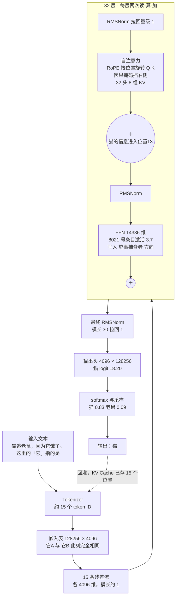

# 完整重演：一句话如何变成「猫」+ 动手练习

> 前七篇各自打开了一个盒子。这一篇把它们**缝成一条连续的叙事**——从 15 个整数进入模型，到「猫」这个字被采样出来，每一跳都带着已知的全部深度。
>
> 然后是七个动手练习，每个验证前面某一篇的一个论断；最后是一页可以带走的速查卡。

---

## 一、带数据标注的全景图



*这张图回答：把[第 3 篇](03-concept-map.zh.md)的协作图，标上这个具体例子的真实数据后是什么样。*

## 二、时间线：一次前向计算的完整叙事

### T+0 · 分词：文字变整数

`猫追老鼠，因为它饿了。这里的「它」指的是` 被切成约 15 个 token。两个「它」拿到**同一个 ID**，位置分别是 6 和 13。从此模型不再看见任何文字。

### T+1 · 嵌入：整数变向量

15 次查表，得到 15 个 4096 维向量，写入 15 条残差流。位置 6 与位置 13 的向量**逐位相等**——这是后面所有工作的起点，也是必须被打破的对称。

此时残差流上**没有任何位置信息**。

### T+2 · 第 1 层，注意力：RoPE 打破对称

进入第 1 层。先过 RMSNorm 把副本拉到模长 1，再投影出 Q、K、V。

**RoPE 在此刻施加**：把每个头的 128 维切成 64 个平面，位置 $m$ 的第 $i$ 个平面旋转 $m \cdot 500000^{-2i/128}$ 弧度。位置 13 的「它B」转了 13 份，位置 6 的「它A」转了 6 份。

**两条残差流从这一刻起不再等价。**

Q 与所有 K 点积得到 $15 \times 15$ 的分数矩阵，除以 $\sqrt{128} \approx 11.31$，加上因果掩码（上三角置 $-65504$），逐行 softmax。

浅层的头做的多是局部活：头 7 几乎把全部权重给了紧邻左侧的位置 12，头 23 把权重倒给了 [BOS]（sink）。**指代的事还没开始。**

结果乘 V、拼接 32 个头、过 $W_O$，作为增量加回残差流。模长从 1.0 升到约 1.4。

### T+3 · 第 1 层，FFN：浅层模式

再过一次 RMSNorm，进入 FFN。三个 $4096 \times 14336$ 的矩阵：$W_{\text{gate}}$ 与 $W_{\text{up}}$ 并行升维，Swish 门控相乘，$W_{\text{down}}$ 压回 4096。

第 1 层激活的多是词法级条目——"『的』后面常跟名词"这类。增量加回残差流。

**至此第 1 层结束。同样的事再来 31 遍。**

### T+4 · 第 14 层前后：指代头登场

这是全过程的转折点。

某个头（记为 L14H11）的 $W_Q$ 已经学会：输入若是代词，就输出一个指向施事性名词的查询。位置 13 的 $q$ 与位置 1「猫」的 $k$ 点积最高：

```
缩放后分数：猫 0.87 ｜ 老鼠 0.54 ｜ 饿 0.48 ｜ 追 0.28
softmax：   猫 0.31 ｜ 老鼠 0.19 ｜ 饿 0.17 ｜ 追 0.13 ｜ 其余 0.20
```

**「猫」只拿到 0.31，不是压倒性的。** 与此同时另一条路径在起作用：归纳头 L?H19 发现位置 13 与位置 6 是同一个 token「它」，于是去复制位置 6 当时的上下文——而位置 6（"因为它饿了"）本身早已绑定到「猫」。

**两条路径叠加**，位置 13 的残差流上首次带上了明显的"猫"成分。

### T+5 · 第 18 层前后：FFN 补上常识

注意力搬来了信息，但还缺一条判断：*追逐的施事方是捕食者，"饿了"的主体是捕食者。* 这条不在输入里。

位置 13 的向量与 14336 个键匹配，8021 号条目（"代词 + 捕食动词 + 生理状态"共现模式）激活 3.7，门控放行。$W_{\text{down}}$ 的第 8021 列——方向对应"施事捕食者"——按 3.7 的强度写回残差流。

**分工在这里体现得最清楚**：注意力从**上下文**取"有猫和老鼠"，FFN 从**权重**取"该选捕食者"。缺任何一个，这个例子都会失败。

### T+6 · 第 32 层：累积完成

64 次"读—算—加"结束。模长从 1.0 长到约 30，但每个子层读到的副本始终是模长 1——**这就是 Pre-Norm 的全部意义**：总线自由增长，子层永远面对同一尺度。

用 logit lens 回看这条轨迹：

| 层 | top-1 | 「猫」概率 |
|---|---|---|
| 4 | 「的」 | 0.001 |
| 12 | 「老鼠」 | 0.08 |
| 16 | 「猫」 | 0.21 |
| 24 | 「猫」 | 0.61 |
| 32 | 「猫」 | 0.83 |

**答案在第 14–18 层之间就定了**，后面十几层是在加固与格式化。

### T+7 · 输出头：向量变分数

只有最后一个位置过输出头。先最终 RMSNorm（模长 30 → 1，否则 softmax 直接饱和），再与 128256 个 token 列向量逐一点积：

```
猫 18.20 ｜ 老鼠 15.98 ｜ 它 14.47 ｜ 动物 12.30 ｜ ...
```

softmax → `猫 0.83 ｜ 老鼠 0.09 ｜ 它 0.02 ｜ 其余 0.06`。

**「老鼠」的 0.09 不是错误，是诚实的不确定性**——它在语法上完全成立，模型的依据只是常识倾向。

### T+8 · 采样与回灌

$T=0$ 出「猫」。若继续生成，「猫」被追加为位置 15，只为它一个 token 算 Q、K、V，追加进 **KV Cache**（此时 15 × 128KB ≈ 1.9MB），它的 Query 与 Cache 里 16 个 K 做点积——**前 15 个位置一次都没重算**。

## 三、可运行的验证脚本

下面的脚本把上面的叙事跑一遍：打印分词、找出关注「猫」的头、并做 logit lens。

```python
import torch
from transformers import AutoTokenizer, AutoModelForCausalLM

MODEL = "meta-llama/Meta-Llama-3-8B"
text = "猫追老鼠，因为它饿了。这里的「它」指的是"

tok = AutoTokenizer.from_pretrained(MODEL)
# 注意：必须用 eager 实现才能拿到注意力权重，
# FlashAttention/SDPA 内核根本不物化那个 n×n 矩阵（见第 8 篇）
model = AutoModelForCausalLM.from_pretrained(
    MODEL, torch_dtype=torch.bfloat16, device_map="auto",
    attn_implementation="eager",
)
model.eval()

ids = tok(text, return_tensors="pt").to(model.device)
toks = tok.convert_ids_to_tokens(ids["input_ids"][0])
print("分词：", list(enumerate(toks)))

with torch.no_grad():
    out = model(**ids, output_hidden_states=True, output_attentions=True)

# ---- 1) 谁在关注「猫」：扫描全部 32 层 × 32 头 ----
cat_pos = next(i for i, t in enumerate(toks) if "猫" in tok.convert_tokens_to_string([t]))
last = len(toks) - 1
scores = []
for layer, attn in enumerate(out.attentions):        # [1, 32, n, n]
    w = attn[0, :, last, cat_pos]                    # 最后位置看「猫」的权重
    for head in range(w.shape[0]):
        scores.append((w[head].item(), layer, head))
for w, l, h in sorted(scores, reverse=True)[:5]:
    print(f"L{l:02d}H{h:02d}  权重 {w:.3f}")

# ---- 2) Logit Lens：答案在第几层成形 ----
cat_id = tok.encode("猫", add_special_tokens=False)[0]
for layer, h in enumerate(out.hidden_states):        # 33 个：嵌入 + 32 层
    logits = model.lm_head(model.model.norm(h[0, last]))
    probs = logits.softmax(-1)
    top = probs.argmax().item()
    print(f"层 {layer:02d}  top1={tok.decode([top])!r:8}  P(猫)={probs[cat_id]:.4f}")
```

预期现象：关注「猫」的注意力集中在**中间层的少数几个头**上，而 `P(猫)` 在中段某几层内快速抬升后趋于平稳。**具体是哪几个头、哪几层，会随模型而变——重要的是模式，不是编号。**

## 四、七个动手练习

每个练习验证前面一篇的一个论断。

**练习 1（对应[第 2 篇](02-what.zh.md)）· 证明注意力不感知顺序**
把 RoPE 关掉（把旋转角全部置 0），比较 `猫追老鼠` 和 `老鼠追猫` 的输出分布。**预期**：两者的输出应变得高度相似——因为注意力本身置换等变。

**练习 2（[第 5 篇](05-embedding-position.zh.md)）· 摸到位置外推的墙**
把输入重复填充到超过模型训练长度（不做 RoPE 缩放），观察输出。**预期**：在某个长度附近，输出突然退化为重复或乱码，而不是缓慢变差。

**练习 3（[第 6 篇](06-attention-core.zh.md)）· 拿掉 $\sqrt{d_k}$**
在一个从零训练的小 Transformer 里去掉缩放。**预期**：注意力权重迅速塌缩成 one-hot，训练损失长时间不下降。

**练习 4（[第 7 篇](07-multi-head-mask.zh.md)）· 验证因果性**
用同一段输入，只改动最后一个 token，比较倒数第二个位置的 hidden state。**预期**：**逐位完全相同**。若不同，掩码有 bug——这是检验因果性唯一可靠的测试。

**练习 5（[第 8 篇](08-attention-variants.zh.md)）· 量一量 KV Cache**
用 `use_cache=True` 生成 1000 个 token，每 100 步打印 `past_key_values` 的总字节数。**预期**：线性增长，斜率约 128 KB/token；同时观察每 token 延迟随之上升。

**练习 6（[第 9 篇](09-ffn.zh.md)）· 看 FFN 激活有多稀疏**
挂钩子取出某层 FFN 的中间激活（14336 维），统计绝对值超过阈值的比例。**预期**：显著激活的维度只占一小部分——这正是 MoE 的立论基础。

**练习 7（[第 11 篇](11-output-head.zh.md)）· 温度的实际影响**
固定提示词，在 $T \in \{0, 0.3, 0.7, 1.0, 1.5\}$ 下各采样 20 次。**预期**：$T=0$ 完全一致且可能复读；$T \ge 1.2$ 开始出现事实性错误。

## 五、回到第 1 篇的问题

[第 1 篇](01-why.zh.md)提出的痛点是：**要理解第 100 个词必须先理解前 99 个**——训练无法并行，远距离信息在传递中衰减。

刚才这条时间线正是这两个问题的解答：

- **「它」够到「猫」，跨越 12 个位置，只用了一次点积。** 不是 12 步传递，是 $O(1)$ 步直达。RNN 需要 12 次矩阵变换才能做到的事，注意力在一次 $QK^\top$ 里完成，而且信息毫无衰减。
- **这 15 个位置的计算全部并行。** 训练时因果掩码让同一次前向同时产出 15 份预测，效率是逐位置训练的 15 倍。正是这个倍数，让"吃下整个互联网的文本"从不可能变成了工程问题。

代价也一并兑现了：那个 $n \times n$ 的分数矩阵。**今天所有关于长上下文的工程努力——GQA、MLA、FlashAttention、PagedAttention、稀疏与线性注意力——全都是在偿还 2017 年那一笔"用平方级计算换常数级路径"的交易。**

## 六、一页速查卡

**架构骨架**

```
token ID → 嵌入 → [ Norm → 注意力 → ＋ → Norm → FFN → ＋ ] × 32 → Norm → 输出头 → 采样
                    └────────── 残差流：一条 4096 维的总线 ──────────┘
```

**唯一必须记住的二分**：注意力负责**通信**（唯一跨位置的运算），FFN 负责**计算**（完全逐位置）。

**Llama-3-8B 数字表**

| 项 | 值 |
|---|---|
| $d_{\text{model}}$ / 层数 / 头数 | 4096 / 32 / 32Q + 8KV |
| 每头维度 / FFN 中间维度 | 128 / 14336 |
| 词表 / RoPE base | 128256 / 500000 |
| 参数分布 | FFN 70.2%｜嵌入+输出头 13.1%｜注意力 16.7% |
| KV Cache | 128 KB/token（GQA），MHA 下为 512 KB |
| $n^2$ 开始主导的长度 | 约 8192 token（$n \approx 2d$） |

**八个概念一句话**

| 概念 | 一句话 |
|---|---|
| Token 嵌入 | 查表，上下文无关的起点 |
| 残差流 | 一条总线，每层只加增量 |
| 上下文化 | 全模型的最终目标 |
| Q / K / V | Q·K 决定看谁，V 决定拿什么 |
| 缩放点积 | 唯一跨位置的运算，$\sqrt{d_k}$ 防饱和 |
| 多头 | 多组权重预算，几乎不额外花算力 |
| 因果掩码 | 训练时一次前向产出 n 份预测 |
| 位置编码 | 补架构缺口，RoPE 用旋转实现相对位置 |

**五个角色一句话**

| 角色 | 唯一职责 | 刻意不做 |
|---|---|---|
| 嵌入与位置编码 | ID 变带位置感的向量 | 不做跨位置交换 |
| 自注意力 | 位置间信息路由 | 不做知识加工 |
| FFN | 逐位置知识加工 | 完全不看其他位置 |
| 残差与归一化 | 让深度可训练 | 不改变语义 |
| 输出头与采样 | 向量变 token | 不参与中间层 |

---

**上一篇** ← [11 · 输出头与采样](11-output-head.zh.md)

**接下来读什么**：
- 工程侧展开 → [LLM 推理系列](../llm-inference/index.md)（KV Cache、量化、Agentic 推理经济学）
- 训练与规模侧 → [LLM 全景指南](../llm-fundamentals/index.md)（训练管线、Scaling Law、上下文窗口）
- 视觉侧 → [多模态大模型系列](../multimodal/index.md)（同一套骨架如何处理图像）

[← 系列索引](index.md) ｜ [← 概念地图](03-concept-map.zh.md)
