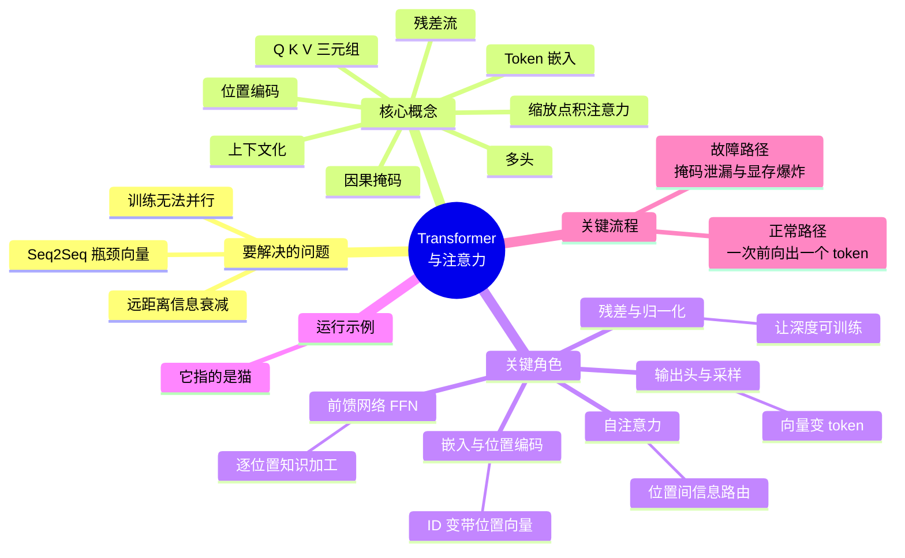
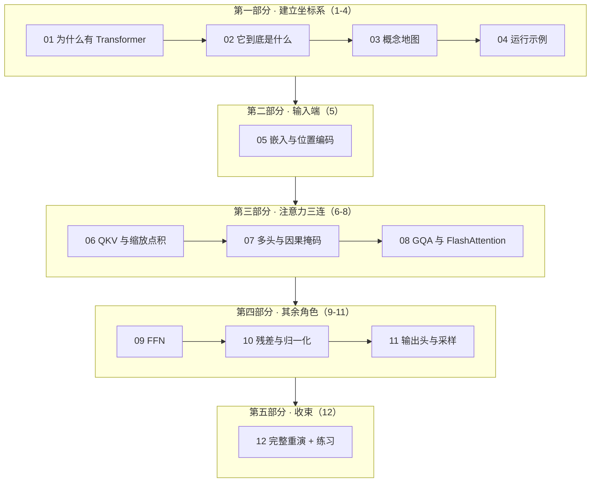

# Transformer 与注意力机制 / Transformer & Attention Series

[← Back to AI](../README.md)

一个把 Transformer 拆到底的中文系列。**十二篇文章、一条主线**：从"为什么必须有人删掉循环"开始，摊开八个核心概念与五个关键角色，然后逐个下潜——嵌入与位置编码、注意力（拆成三篇）、FFN、残差与归一化、输出头与采样——最后带着全部深度重跑一遍开篇的示例。

面向已经知道"LLM 是什么"、但想弄清**里面到底怎么算**的读者。不需要矩阵微积分，只需要接受"矩阵乘法是一堆数进去、另一堆数出来"。

姊妹系列：
- [LLM 全景指南](../llm-fundamentals/index.md) —— 本系列是它[第 4 篇](../llm-fundamentals/04-transformer.zh.md)的完整展开；想先建立全局坐标系的读者建议从那里开始。
- [LLM 推理系列](../llm-inference/index.md) —— 本系列第 8 篇的工程侧延伸。
- [多模态大模型系列](../multimodal/index.md) —— 同一套骨架如何处理图像与音频。

---

## 一条主线：贯穿全篇的运行示例

> 你在本地用 **Llama-3-8B** 跑推理，输入：
> **`猫追老鼠，因为它饿了。这里的「它」指的是`**
>
> 模型输出「**猫**」，而不是「老鼠」。跨越 9 个字的指代消解，加上一条"饿了的是追的一方"的常识，**在一次前向计算里完成，没有查任何词典**。这是怎么做到的？

示例在[第 4 篇](04-running-example.zh.md)完整定义，之后每篇深度篇结尾的 **⚓ 回到示例**都会把当篇的深度接回它，[第 12 篇](12-walkthrough.zh.md)带着全部深度重演一次。

## 全域思维导图

## 阅读地图

## 文章列表与 CSDN 发布状态

### 第一部分 · 建立坐标系

**01 · 为什么会有 Transformer：一句话必须一个词一个词地读，是怎么被打破的**

RNN/LSTM 的两个致命后果——训练不能并行、远距离梯度衰减；从 Seq2Seq 到"RNN + 注意力"到卷积序列模型的四代尝试各自卡在哪；三条约束（可并行、常数路径、矩阵乘友好）如何把答案逼到"删掉循环、只留注意力"这个唯一解，以及它换来的那个 $O(n^2)$ 代价。

- [x] [01-why.zh.md](01-why.zh.md) — 中文版
- [ ] `01-why.en.md` — English

**02 · Transformer 到底是什么：定义、边界与生态位置**

一句话定义拆解；它明确**不做**的四件事（不感知顺序、没有循环状态、注意力权重不是解释、不是可查询的知识库）；它坐在矩阵乘算子之上、三大变体家族坐在它之上；与 RNN、CNN、SSM/Mamba、MoE、线性注意力的分歧点各在哪一处。

- [x] [02-what.zh.md](02-what.zh.md) — 中文版
- [ ] `02-what.en.md` — English

**03 · 概念地图：八个概念、五个角色，一次摊开整张地图**

Token 嵌入、残差流、上下文化、QKV、缩放点积、多头、因果掩码、位置编码——八个概念按依赖顺序串成一条链；五个关键角色的"拥有 / 知道 / 刻意不做"；以及一张能在白板上复现的协作总览图。

- [x] [03-concept-map.zh.md](03-concept-map.zh.md) — 中文版
- [ ] `03-concept-map.en.md` — English

**04 · 运行示例：一句话的完整旅程（浅层追踪）**

定义贯穿全系列的例子并浅层走一遍五个角色；为什么这个例子必须同时用到跨位置通信、权重里的常识、位置编码、因果掩码和多头；以及每一站分别对应后面的哪一篇。

- [x] [04-running-example.zh.md](04-running-example.zh.md) — 中文版
- [ ] `04-running-example.en.md` — English

### 第二部分 · 输入端

**05 · 嵌入层与位置编码器：从整数到「带位置感的向量」**

嵌入表为什么只是查表、以及为什么"文字从此消失"；置换等变性如何让位置编码从"技巧"变成"补缺口"；三代位置编码的演进；RoPE 的旋转如何让点积天然只依赖相对距离；从 8K 外推到 128K 的 PI / NTK / YaRN 三条路；以及 attention sink 为什么让流式推理不能丢开头。

- [x] [05-embedding-position.zh.md](05-embedding-position.zh.md) — 中文版
- [ ] `05-embedding-position.en.md` — English

### 第三部分 · 注意力三连

**06 · 注意力核心：QKV 与缩放点积**

把注意力读成"可微版的字典查询"；为什么必须是三个投影矩阵而不是一个（关系有方向、匹配与载荷需解耦）；公式逐项按形状拆解；$\sqrt{d_k}$ 到底在防什么（附数值对比）；softmax 的零和竞争如何催生 attention sink；以及 $n \approx 2d \approx 8192$ 这条决定长上下文命运的分界线。

- [x] [06-attention-core.zh.md](06-attention-core.zh.md) — 中文版
- [ ] `06-attention-core.en.md` — English

**07 · 多头与因果掩码：并行的多种关系，与不许偷看的铁律**

为什么一次 softmax 装不下四种关系；$d_k = d/h$ 为什么让多头几乎是"免费的表达力"；$W_O$ 按列切开后多头其实是 32 个模块的加和；归纳头等几类涌现的分工与头的冗余；因果掩码如何让一次前向产出 $n$ 份训练信号；四种掩码形状如何决定四个模型家族的性格；以及那个"改未来不动现在"的必备测试。

- [x] [07-multi-head-mask.zh.md](07-multi-head-mask.zh.md) — 中文版
- [ ] `07-multi-head-mask.en.md` — English

**08 · 工程变体：KV Cache、GQA/MQA/MLA 与 FlashAttention**

Prefill 与 Decode 两个阶段截然相反的瓶颈；KV Cache 为什么是因果性的必然推论；一张显存账表（MHA 512KB/token vs GQA 128KB）如何直接决定并发数；MHA → MQA → GQA → MLA 这条压缩线各自的取舍；FlashAttention 的分块 + 在线 softmax 为什么是"无取舍的净胜"；以及滑动窗口、稀疏、线性注意力这些"用精度换长度"的方向。

- [x] [08-attention-variants.zh.md](08-attention-variants.zh.md) — 中文版
- [ ] `08-attention-variants.en.md` — English

### 第四部分 · 其余角色

**09 · 前馈网络 FFN：那七成参数在干什么**

SwiGLU 的三条通路与门控；为什么 FFN 占 70% 参数而注意力只占 16.7%；把 FFN 读成一张 14336 条目的键值记忆表（键是模式检测器、值是要写回残差流的内容）；由此推出的激活稀疏性（MoE 的立论基础）、层的分工、以及神经元多义性与叠加。

- [x] [09-ffn.zh.md](09-ffn.zh.md) — 中文版
- [ ] `09-ffn.en.md` — English

**10 · 残差与归一化：让 32 层不至于崩掉的那些胶水**

残差流是"总线"不是"管道"——以及由此立刻推出的三件事（层可以什么都不做、梯度有无损高速路、跨层隔空通信）；LayerNorm 到 RMSNorm 去掉了什么又为什么无损；Post-Norm 到 Pre-Norm 这个位置调整如何让模型从几十层走向上百层；以及去掉残差会遇到的秩坍缩、去掉归一化会遇到的指数溢出。

- [x] [10-residual-norm.zh.md](10-residual-norm.zh.md) — 中文版
- [ ] `10-residual-norm.en.md` — English

**11 · 输出头与采样器：从 4096 个数到一个汉字**

输出头本质上是又一次相似度检索，只不过检索对象是词表；权重共享的取舍；Logit Lens 如何证明"答案在中间层就已成形"；温度、Top-k、Top-p、Min-p、重复惩罚的作用顺序与数值对比；以及为什么"老鼠 0.09"不是错误而是诚实的不确定性。

- [x] [11-output-head.zh.md](11-output-head.zh.md) — 中文版
- [ ] `11-output-head.en.md` — English

### 第五部分 · 收束

**12 · 完整重演：一句话如何变成「猫」+ 动手练习**

带数据标注的全景图；从 T+0 分词到 T+8 采样回灌的完整时间线（含"答案在第 14–18 层之间定下"这个关键观察）；一段可运行的验证脚本（找关注「猫」的头 + Logit Lens）；七个各自验证一篇论断的动手练习；以及一页速查卡。

- [x] [12-walkthrough.zh.md](12-walkthrough.zh.md) — 中文版
- [ ] `12-walkthrough.en.md` — English

---

*勾选框表示已发布到 CSDN。建议阅读顺序即编号顺序；已经熟悉 Transformer 总体结构的读者可直接从 06 切入注意力三连。*
