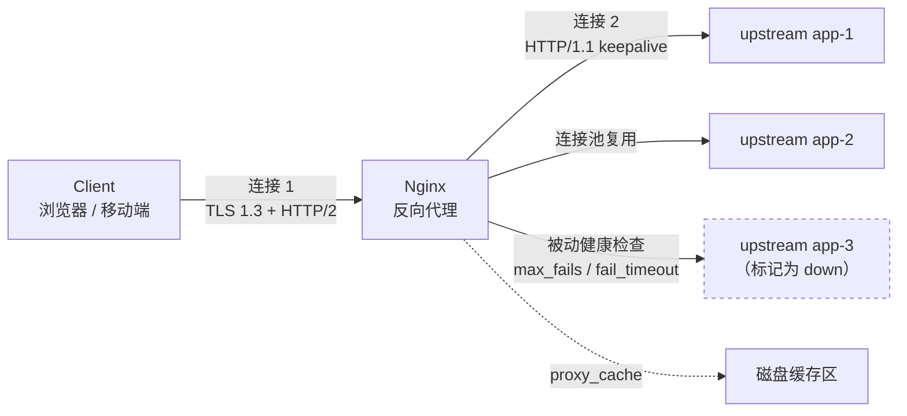

# Nginx as a Reverse Proxy

> "Nginx or a reverse proxy?" is a category error worth unpacking. *Reverse proxy* is a **role**; Nginx is one **implementation** of it. The useful questions are what the role actually requires, how Nginx implements it, and when a different implementation fits better.

## Abbreviation glossary

| Abbreviation | Full English name | 中文 |
|---|---|---|
| rProxy | reverse proxy | 反向代理 |
| TLS | Transport Layer Security | 传输层安全协议 |
| SSL | Secure Sockets Layer | 安全套接层（TLS 的前身） |
| SNI | Server Name Indication | 服务器名称指示 |
| L4 / L7 | OSI Layer 4 (transport) / Layer 7 (application) | 四层（传输层）/ 七层（应用层） |
| ALB | Application Load Balancer (AWS) | 应用负载均衡器 |
| NLB | Network Load Balancer (AWS) | 网络负载均衡器 |
| SSE | Server-Sent Events | 服务器推送事件 |
| WAF | Web Application Firewall | Web 应用防火墙 |
| xDS | Extensible Discovery Service (Envoy's config API) | 可扩展发现服务 |
| CRD | Custom Resource Definition (Kubernetes) | 自定义资源定义 |
| RPS | Requests Per Second | 每秒请求数 |
| TTFB | Time To First Byte | 首字节时间 |

---

## 1. The role, stated precisely

A reverse proxy is a server that terminates a client connection, then originates a *separate* connection to one or more upstream servers on the client's behalf. Two connections, two independent lifecycles. Everything interesting follows from that split:

- Because the connections are independent, the proxy can **fan out** (load balancing), **retry** (a failed upstream attempt need not fail the client), **cache**, **rewrite**, and **terminate TLS** without the client knowing.
- Because the proxy terminates TLS, it becomes the place where certificates, cipher policy, and HTTP protocol versions are decided — the client may speak HTTP/2 while the upstream speaks HTTP/1.1.
- Because the client only ever sees the proxy, upstream topology is free to change. This is the property that makes rolling deploys, blue/green, and canaries possible at all.

For how this differs from a forward proxy, see [forward and reverse proxy](./forward_reverse_proxy.md). The rest of this article is about the reverse direction only.



---

## 2. Why Nginx scales: the architecture in one section

Nginx's design choice, made in 2004 against Apache's process-per-connection model, is **event-driven, non-blocking, fixed worker count**.

- One **master** process reads config, binds listening sockets, and manages workers. It runs as root only to bind privileged ports and to open files.
- N **worker** processes (`worker_processes auto;` → one per CPU core) each run a single-threaded event loop over `epoll` (Linux) / `kqueue` (BSD). A worker holds tens of thousands of connections simultaneously because a connection that is waiting costs only a file descriptor and a small state struct — not a thread stack.
- Workers share nothing except shared-memory zones you declare explicitly (`proxy_cache_path` keys, `limit_req_zone` counters, `upstream` state). This is why rate limits and connection limits in open-source Nginx are **per-worker-shared-zone**, not per-cluster — a distinction that bites when you size limits.

The practical consequences for you as an operator:

- **Blocking a worker blocks every connection it holds.** Disk I/O is the usual culprit; `aio` and `sendfile` exist for this. Any third-party module doing synchronous work — a naive Lua script making a blocking call — will destroy tail latency.
- **Memory is bounded and predictable.** A worker's footprint is dominated by buffers you configured, not by concurrency. This is why Nginx behaves gracefully at the point where thread-per-request servers fall over.
- **Config reload is graceful by construction.** `nginx -s reload` spawns new workers with the new config; old workers stop accepting and drain in-flight requests. Zero dropped connections, no connection reuse across the boundary.

---

## 3. `proxy_pass`: the mechanics, including the trailing-slash trap

This is the single most misunderstood directive in Nginx.

```nginx
location /api/ {
    proxy_pass http://backend;      # NO trailing slash
}
# GET /api/users  →  upstream receives  /api/users
```

```nginx
location /api/ {
    proxy_pass http://backend/;     # trailing slash
}
# GET /api/users  →  upstream receives  /users
```

The rule: **if the `proxy_pass` value contains a URI component (anything after the host, including a bare `/`), the part of the request URI matched by the `location` prefix is replaced by that URI.** If there is no URI component, the original request URI is passed through unchanged.

Two corollaries that cost people afternoons:

- With a **regex** location or a `location` using named captures, the URI-replacement form is not allowed — Nginx requires you to construct the target explicitly, usually with variables and `rewrite`.
- Using a **variable** in `proxy_pass` (`proxy_pass http://$upstream_host;`) changes the resolution semantics entirely: Nginx then resolves the name at request time using the `resolver` directive, rather than once at startup. This is the standard trick for upstreams whose DNS changes — and the standard cause of `no resolver defined to resolve ...` errors.

```nginx
# Dynamic upstream resolution, re-resolved per TTL
resolver 10.0.0.2 valid=30s ipv6=off;

location /svc/ {
    set $target "service.internal.example:8080";
    proxy_pass http://$target/;
}
```

Without this, **Nginx resolves upstream hostnames once at startup and caches the result forever.** On a platform where backends get new IPs — Kubernetes, ECS, any autoscaling group — a static `proxy_pass http://service.internal:8080;` will keep hammering a dead IP until you reload. This is one of the most common production surprises when moving Nginx into a container platform.

---

## 4. Headers: the inheritance rule nobody remembers

```nginx
proxy_set_header Host              $host;
proxy_set_header X-Real-IP         $remote_addr;
proxy_set_header X-Forwarded-For   $proxy_add_x_forwarded_for;
proxy_set_header X-Forwarded-Proto $scheme;
proxy_set_header X-Forwarded-Host  $host;
```

**The rule: `proxy_set_header` directives are inherited from an outer block only if the inner block defines none of its own.** Add a single `proxy_set_header` inside a `location` and every inherited header from `server` or `http` silently disappears. This is the mechanism behind "it worked until I added one header and the app started 404-ing on Host".

The `Host` header matters more than it looks:

- Default is `proxy_set_header Host $proxy_host;` — the *upstream's* name. Virtual-hosted backends, absolute URL generation, and cookie domains all break.
- `$host` is the request's Host header with the port stripped, falling back to `server_name`. Usually what you want.
- `$http_host` is the raw client-supplied value including port. Use when the upstream needs to reconstruct exact URLs; be aware it is fully attacker-controlled.

`$proxy_add_x_forwarded_for` appends `$remote_addr` to any existing `X-Forwarded-For`. **That existing value came from the client and is a lie until proven otherwise.** If your Nginx is the internet-facing edge, overwrite rather than append:

```nginx
proxy_set_header X-Forwarded-For $remote_addr;   # edge: do not trust what arrived
```

If Nginx is *behind* a trusted load balancer, use `real_ip` to establish the true client address before anything else reads it:

```nginx
set_real_ip_from 10.0.0.0/8;          # the trusted LB range, and only that
real_ip_header   X-Forwarded-For;
real_ip_recursive on;                  # walk right-to-left past trusted hops
```

Get this wrong in either direction and you have either broken geolocation and rate limiting, or built a trivially spoofable IP allowlist.

---

## 5. Buffering: the reason your streaming endpoint is broken

By default Nginx **buffers the upstream response**: it reads the response as fast as the upstream can produce it, into memory (`proxy_buffers`) and spilling to disk (`proxy_max_temp_file_size`), then feeds it to the client at the client's pace.

This is the right default for most traffic. It frees the upstream worker — typically an expensive thread in a Java or Python app — the instant the response is produced, rather than holding it for the seconds a mobile client on a poor connection needs to receive it. Slow-client absorption is arguably Nginx's single largest contribution to backend capacity.

It is exactly wrong for:

- **Server-Sent Events and long-poll** — events accumulate in the buffer and arrive in a burst, or never.
- **Streaming LLM token responses** — the user sees nothing, then the whole answer at once.
- **Large uploads** with `proxy_request_buffering on` (the default for requests) — the whole body lands on the proxy's disk before the upstream sees a byte.

```nginx
location /stream/ {
    proxy_pass http://backend;
    proxy_buffering off;          # forward each chunk immediately
    proxy_cache off;
    proxy_read_timeout 3600s;     # a long-lived stream is not a stuck request
    chunked_transfer_encoding on;
    add_header X-Accel-Buffering no;   # also tells any upstream Nginx to stop buffering
}

location /upload/ {
    proxy_pass http://backend;
    proxy_request_buffering off;  # stream the body through
    client_max_body_size 0;       # 0 = no limit; set a real number in production
}
```

`X-Accel-Buffering: no` is worth remembering in the other direction too — an *upstream application* can emit that header to ask the fronting Nginx to disable buffering for that response, without any proxy config change.

---

## 6. Upstreams, keepalive, and timeouts

```nginx
upstream backend {
    # Algorithms: round-robin (default), least_conn, ip_hash, hash <key> [consistent]
    least_conn;

    server 10.0.1.10:8080 max_fails=3 fail_timeout=10s weight=2;
    server 10.0.1.11:8080 max_fails=3 fail_timeout=10s;
    server 10.0.1.12:8080 backup;      # only used when all primaries are down

    keepalive 32;                       # persistent connections retained PER WORKER
    keepalive_timeout 60s;
    keepalive_requests 1000;
}

server {
    location / {
        proxy_pass http://backend;

        proxy_http_version 1.1;         # REQUIRED for upstream keepalive
        proxy_set_header Connection ""; # REQUIRED: clear the inherited "close"

        proxy_connect_timeout 2s;       # TCP connect — should be small
        proxy_send_timeout   30s;       # between successive writes to upstream
        proxy_read_timeout   30s;       # between successive reads — NOT total duration

        proxy_next_upstream error timeout http_502 http_503;
        proxy_next_upstream_tries 2;
        proxy_next_upstream_timeout 5s;
    }
}
```

Points that matter in production:

**Upstream keepalive needs all three lines.** `keepalive 32;` alone does nothing: without `proxy_http_version 1.1` and `proxy_set_header Connection "";` Nginx still sends `Connection: close` and opens a fresh TCP connection per request. On a TLS-to-upstream path that is a full handshake per request, and it shows up as a flat tens-of-milliseconds tax on TTFB.

**`keepalive N` is per worker, not global.** With 8 workers and `keepalive 32`, the upstream may see up to 256 idle connections from this one proxy. Size upstream connection limits accordingly.

**`proxy_read_timeout` is an inactivity timer, not a total-request budget.** An upstream that dribbles a byte every 29 seconds will never time out. If you need a hard ceiling, enforce it upstream or in front.

**`proxy_next_upstream` retries are dangerous on non-idempotent requests.** `error` and `timeout` are in the default set, and a `timeout` on a POST means the upstream may well have processed it. Nginx has `non_idempotent` as an opt-in for this reason — the *absence* of that keyword means POST/PATCH/LOCK are not retried, which is correct. Do not add it casually.

**Health checking in open-source Nginx is passive only.** `max_fails`/`fail_timeout` mark a server down after real requests fail — meaning real users absorb the failures, and a server that recovers is only rediscovered when the `fail_timeout` window lapses and a user's request is used as the probe. Active health checks (`health_check` directive) are an Nginx Plus feature. This is one of the clearest reasons teams move to Envoy or a cloud load balancer.

---

## 7. TLS termination and re-encryption

```nginx
server {
    listen 443 ssl;
    http2 on;

    server_name api.example.com;

    ssl_certificate     /etc/nginx/tls/fullchain.pem;   # leaf + intermediates, in order
    ssl_certificate_key /etc/nginx/tls/privkey.pem;

    ssl_protocols TLSv1.2 TLSv1.3;
    ssl_prefer_server_ciphers off;         # TLS 1.3: let the client choose
    ssl_session_cache shared:SSL:10m;      # shared across workers — important
    ssl_session_tickets off;               # unless you rotate ticket keys properly

    ssl_stapling on;                        # OCSP stapling for the server cert
    ssl_stapling_verify on;
    resolver 1.1.1.1 valid=300s;

    location / {
        # Re-encrypt to the upstream
        proxy_pass https://backend;
        proxy_ssl_verify on;
        proxy_ssl_trusted_certificate /etc/nginx/tls/internal-ca.pem;
        proxy_ssl_name backend.internal.example;   # SNI + verification name
        proxy_ssl_server_name on;                  # actually send SNI — off by default
        proxy_ssl_session_reuse on;
    }
}
```

Two defaults that surprise people:

- **`proxy_ssl_verify` is `off` by default.** Nginx will happily proxy to an upstream presenting any certificate, including an expired self-signed one from an attacker who has won a DNS race. If you re-encrypt, verify.
- **`proxy_ssl_server_name` is `off` by default**, so Nginx does not send SNI to the upstream. Against any modern multi-tenant TLS endpoint this fails, often with a confusing certificate error rather than an obvious one.

**`ssl_session_cache shared:...` must be shared**, not `builtin`. The builtin cache is per worker, so a client whose resumption attempt lands on a different worker does a full handshake. On a busy edge this is a measurable CPU difference.

---

## 8. Complete, annotated config

A realistic edge config combining the above:

```nginx
user  nginx;
worker_processes auto;
worker_rlimit_nofile 65535;

events {
    worker_connections 16384;
    multi_accept on;
}

http {
    # --- logging with the fields you will actually need at 03:00 ---
    log_format main '$remote_addr $host "$request" $status $body_bytes_sent '
                    'rt=$request_time uct=$upstream_connect_time '
                    'uht=$upstream_header_time urt=$upstream_response_time '
                    'ua=$upstream_addr us=$upstream_status '
                    'cache=$upstream_cache_status rid=$request_id';
    access_log /var/log/nginx/access.log main buffer=32k flush=5s;

    sendfile on;
    tcp_nopush on;
    keepalive_timeout 65s;
    server_tokens off;                      # do not advertise the version

    # --- rate limiting: per worker-shared zone, 10 MB ≈ 160k IPs ---
    limit_req_zone $binary_remote_addr zone=perip:10m rate=20r/s;
    limit_conn_zone $binary_remote_addr zone=conn_perip:10m;

    proxy_cache_path /var/cache/nginx levels=1:2 keys_zone=static:100m
                     max_size=10g inactive=60m use_temp_path=off;

    upstream backend {
        least_conn;
        server 10.0.1.10:8080 max_fails=3 fail_timeout=10s;
        server 10.0.1.11:8080 max_fails=3 fail_timeout=10s;
        keepalive 32;
    }

    server {
        listen 443 ssl;
        http2 on;
        server_name api.example.com;

        ssl_certificate     /etc/nginx/tls/fullchain.pem;
        ssl_certificate_key /etc/nginx/tls/privkey.pem;
        ssl_protocols TLSv1.2 TLSv1.3;
        ssl_session_cache shared:SSL:10m;

        # Behind a trusted cloud LB — establish the real client IP first
        set_real_ip_from 10.0.0.0/8;
        real_ip_header   X-Forwarded-For;
        real_ip_recursive on;

        limit_req  zone=perip burst=40 nodelay;
        limit_conn conn_perip 20;

        # Shared proxy settings — remember: any proxy_set_header in an inner
        # block discards ALL of these. Re-declare or use an include file.
        proxy_http_version 1.1;
        proxy_set_header Connection "";
        proxy_set_header Host              $host;
        proxy_set_header X-Real-IP         $remote_addr;
        proxy_set_header X-Forwarded-For   $proxy_add_x_forwarded_for;
        proxy_set_header X-Forwarded-Proto $scheme;
        proxy_set_header X-Request-ID      $request_id;

        proxy_connect_timeout 2s;
        proxy_read_timeout   30s;

        location /healthz {
            access_log off;
            return 200 "ok\n";
        }

        location /static/ {
            proxy_pass http://backend;
            proxy_cache static;
            proxy_cache_valid 200 301 302 10m;
            proxy_cache_use_stale error timeout updating http_502 http_503;
            proxy_cache_lock on;                 # collapse concurrent misses
            proxy_cache_background_update on;
            add_header X-Cache-Status $upstream_cache_status always;
        }

        location /events {
            proxy_pass http://backend;
            proxy_buffering off;
            proxy_cache off;
            proxy_read_timeout 3600s;
        }

        location /ws {
            proxy_pass http://backend;
            proxy_set_header Upgrade    $http_upgrade;   # WebSocket upgrade
            proxy_set_header Connection "upgrade";
            # NOTE: this block's proxy_set_header list replaces the server-level
            # one entirely — Host and X-Forwarded-* must be repeated here.
            proxy_set_header Host $host;
            proxy_set_header X-Forwarded-For $proxy_add_x_forwarded_for;
            proxy_read_timeout 3600s;
        }

        location / {
            proxy_pass http://backend;
        }
    }
}
```

`proxy_cache_lock on` deserves a callout: without it, N concurrent requests for the same cold cache key all go to the upstream. That is the cache stampede that turns a cache expiry into an outage.

Verify before reloading, always:

```bash
nginx -t                 # parse and validate
nginx -T | less          # dump the FULLY resolved config, includes expanded
nginx -s reload          # graceful: new workers take over, old ones drain
```

`nginx -T` is the one to reach for when a directive "isn't taking effect" — it shows exactly what Nginx assembled from your includes.

---

## 9. Nginx versus the other implementations of the role

| | **Nginx (OSS)** | **HAProxy** | **Envoy** | **Traefik** | **Caddy** | **Cloud ALB/NLB** |
|---|---|---|---|---|---|---|
| Primary identity | Web server that proxies well | Dedicated load balancer | Programmable L7 proxy | Container-native edge router | Batteries-included web server | Managed service |
| Config model | Static file + reload | Static file + reload | **Dynamic via xDS API** | Dynamic from labels/CRDs | Static file, very terse | Console / API / IaC |
| Config change | Graceful reload | Graceful reload (seamless since 1.8) | **Hot, no reload** | Automatic on service change | Reload or admin API | API call |
| Active health checks | **Plus only** | Yes, rich | Yes, incl. outlier detection | Yes | Basic | Yes |
| Observability | Basic `stub_status`; logs | Very detailed stats socket | **Best in class** — per-upstream histograms | Good | Basic | CloudWatch |
| Circuit breaking / outlier ejection | No | Partial | **Yes** | Partial | No | Partial |
| Automatic TLS certificates | No (use certbot) | No | No | **Yes** | **Yes** | Yes (ACM) |
| gRPC / HTTP/2 upstream | Yes (`grpc_pass`) | Yes | **Native, first-class** | Yes | Yes | ALB: yes |
| Static file serving | **Excellent** | No | No | No | **Excellent** | No |
| Caching | Yes, solid | No | Limited | No | Via plugin | CloudFront separately |
| Memory footprint | **Low** | **Lowest** | High | Moderate | Moderate | n/a |
| Extensibility | Modules (compile-time), Lua via OpenResty | Lua, SPOE | **WASM, Lua, external filters** | Middleware plugins | Modules in Go | Lambda@Edge etc. |
| Typical sweet spot | Edge: TLS + static + proxy in one process | Pure high-RPS TCP/HTTP balancing | Service mesh data plane; dynamic fleets | Kubernetes / Docker ingress | Small services, zero-config HTTPS | You do not want to run it |

**Choose Nginx when** you want one low-footprint process doing TLS termination, static assets, caching, and proxying, over a topology that changes on the order of deploys rather than seconds. It is the highest value-per-megabyte option in this table and the most widely understood.

**Choose something else when:**
- Upstreams change continuously and you cannot reload for every change → **Envoy** (xDS) or **Traefik** (service discovery).
- You need active health checks, outlier ejection, and circuit breaking without paying for Nginx Plus → **Envoy** or **HAProxy**.
- You need per-upstream latency histograms and retry/timeout budgets as first-class telemetry → **Envoy**.
- You are doing pure L4 balancing at very high connection rates → **HAProxy** or an **NLB**.
- You want TLS certificates to just work with no certbot cron → **Caddy** or **Traefik**.
- The operational burden is not worth it → a managed **ALB**, accepting the loss of caching and config expressiveness.

A very common and entirely reasonable production shape is **both**: a cloud load balancer for the public IP, TLS certificates, and cross-zone distribution, with Nginx behind it doing the routing, caching, header work, and static serving that the cloud LB cannot express.

---

## 10. Operational checklist

- [ ] `nginx -t` in CI; `nginx -T` diffed on config changes
- [ ] `proxy_http_version 1.1` + `proxy_set_header Connection ""` wherever `keepalive` is set
- [ ] `resolver` configured, and variable-based `proxy_pass` used for any upstream whose IP changes
- [ ] `X-Forwarded-For` overwritten at the true edge, `set_real_ip_from` scoped to the trusted range only
- [ ] `proxy_buffering off` on every streaming and SSE route, and nowhere else
- [ ] `proxy_ssl_verify on` and `proxy_ssl_server_name on` on every re-encrypted upstream
- [ ] `ssl_session_cache shared:` (never `builtin`)
- [ ] `proxy_cache_lock on` on cacheable routes
- [ ] `$upstream_connect_time` / `$upstream_header_time` / `$upstream_response_time` in the access log — without them you cannot tell a slow upstream from a slow proxy
- [ ] `server_tokens off`, and `client_max_body_size` set to a real value
- [ ] Know that health checks are passive, and that the first failures are paid for by users

---

## See also

- [Forward proxy and reverse proxy](./forward_reverse_proxy.md)
