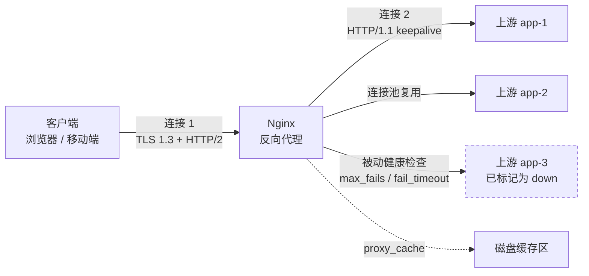

# Nginx 做反向代理：角色、实现，以及那些会咬人的默认值

> "用 Nginx 还是用反向代理？"——这是一个范畴错误，值得拆开讲。**反向代理是一个角色，Nginx 是它的一种实现。** 有用的问题是：这个角色到底要求什么、Nginx 怎么实现它、以及什么时候该换一个实现。

## 缩写对照表

| 缩写 | 英文全称 | 中文 |
|---|---|---|
| rProxy | reverse proxy | 反向代理 |
| TLS | Transport Layer Security | 传输层安全协议 |
| SSL | Secure Sockets Layer | 安全套接层（TLS 的前身） |
| SNI | Server Name Indication | 服务器名称指示 |
| L4 / L7 | OSI Layer 4 (transport) / Layer 7 (application) | 四层（传输层）/ 七层（应用层） |
| ALB | Application Load Balancer (AWS) | 应用负载均衡器 |
| NLB | Network Load Balancer (AWS) | 网络负载均衡器 |
| SSE | Server-Sent Events | 服务器推送事件 |
| WAF | Web Application Firewall | Web 应用防火墙 |
| xDS | Extensible Discovery Service | 可扩展发现服务（Envoy 的配置 API） |
| CRD | Custom Resource Definition | 自定义资源定义（Kubernetes） |
| RPS | Requests Per Second | 每秒请求数 |
| TTFB | Time To First Byte | 首字节时间 |

---

## 一、把这个角色说准确

反向代理是这样一台服务器：**它终结客户端连接，然后代表客户端，向一个或多个上游服务器发起另一条独立的连接**。两条连接，两套独立的生命周期。所有有意思的能力都是从这个"劈开"派生出来的：

- 因为两条连接独立，代理可以**扇出**（负载均衡）、**重试**（一次上游失败不必让客户端失败）、**缓存**、**改写**、**终结 TLS**，而客户端一无所知。
- 因为代理终结了 TLS，它就成了决定证书、加密套件策略和 HTTP 协议版本的地方——**客户端可以说 HTTP/2，而上游说 HTTP/1.1**。
- 因为客户端只见得到代理，**上游拓扑可以随意变化**。滚动发布、蓝绿、金丝雀之所以可能，根源就在这一条。

与正向代理的区别见 [正向代理与反向代理](./forward_reverse_proxy.md)。本文只谈反向这一侧。



*这张图回答：一次请求在代理两侧分别是什么形态。*

---

## 二、Nginx 为什么扛得住：一节讲完架构

Nginx 在 2004 年针对 Apache"每连接一进程"模型做出的设计选择是：**事件驱动、非阻塞、固定 worker 数**。

- 一个 **master** 进程读配置、绑定监听套接字、管理 worker。它以 root 运行**只是**为了绑定特权端口和打开文件。
- N 个 **worker** 进程（`worker_processes auto;` → 每个 CPU 核一个），各自跑一个单线程事件循环，底层是 `epoll`（Linux）/ `kqueue`（BSD）。**一个 worker 能同时持有几万条连接**，因为一条等待中的连接只消耗一个文件描述符和一小块状态结构——不是一个线程栈。
- worker 之间**什么都不共享**，除了你显式声明的共享内存区（`proxy_cache_path` 的 key、`limit_req_zone` 计数器、`upstream` 状态）。这正是开源版 Nginx 的限流和连接数限制是**按 worker-共享区**而非按集群生效的原因——定容量时这个区别会咬人。

对运维者的三条实际后果：

- **阻塞一个 worker，就阻塞了它持有的每一条连接。** 罪魁通常是磁盘 I/O，`aio` 和 `sendfile` 就是为此而生。任何做同步工作的三方模块——比如一段发起阻塞调用的朴素 Lua 脚本——都会摧毁尾延迟。
- **内存是有界且可预测的。** 一个 worker 的占用主要由你配置的缓冲区决定，而不是由并发量决定。这就是为什么在"每请求一线程"的服务器崩盘的那个点上，Nginx 还能优雅工作。
- **配置重载天然是平滑的。** `nginx -s reload` 用新配置拉起新 worker；老 worker 停止接受新连接并把在途请求排空。**零连接丢弃**，且连接不会跨越这个边界复用。

---

## 三、`proxy_pass`：机制，以及那个结尾斜杠陷阱

这是 Nginx 里**最容易被误解的一条指令**。

```nginx
location /api/ {
    proxy_pass http://backend;      # 没有结尾斜杠
}
# GET /api/users  →  上游收到  /api/users
```

```nginx
location /api/ {
    proxy_pass http://backend/;     # 有结尾斜杠
}
# GET /api/users  →  上游收到  /users
```

规则是：**如果 `proxy_pass` 的值包含 URI 部分（主机之后的任何东西，哪怕只是一个 `/`），那么被 `location` 前缀匹配到的那段请求 URI 会被这个 URI 替换掉。** 不含 URI 部分时，原始请求 URI 原样透传。

两条会让人搭进去一下午的推论：

- 用**正则** location，或使用命名捕获的 `location` 时，**URI 替换形式是不被允许的**——Nginx 要求你显式构造目标，通常借助变量和 `rewrite`。
- 在 `proxy_pass` 里**使用变量**（`proxy_pass http://$upstream_host;`）会彻底改变解析语义：Nginx 会在**请求时**用 `resolver` 指令解析域名，而不是启动时解析一次。这是应对 DNS 会变的上游的标准手法——也是 `no resolver defined to resolve ...` 报错的标准来源。

```nginx
# 动态上游解析，按 TTL 重新解析
resolver 10.0.0.2 valid=30s ipv6=off;

location /svc/ {
    set $target "service.internal.example:8080";
    proxy_pass http://$target/;
}
```

没有这一招，**Nginx 只在启动时解析一次上游域名，然后永久缓存结果**。在后端 IP 会变的平台上——Kubernetes、ECS、任何弹性伸缩组——一条静态的 `proxy_pass http://service.internal:8080;` 会一直朝着一个已死的 IP 猛打，直到你 reload。**这是把 Nginx 搬进容器平台时最常见的生产惊喜之一。**

---

## 四、请求头：那条没人记得住的继承规则

```nginx
proxy_set_header Host              $host;
proxy_set_header X-Real-IP         $remote_addr;
proxy_set_header X-Forwarded-For   $proxy_add_x_forwarded_for;
proxy_set_header X-Forwarded-Proto $scheme;
proxy_set_header X-Forwarded-Host  $host;
```

**规则：`proxy_set_header` 只有在内层块一条都没定义时，才从外层块继承。** 在某个 `location` 里加**一条** `proxy_set_header`，从 `server` 或 `http` 继承来的**全部**请求头会悄无声息地消失。

"我只是加了一个头，应用就开始按 Host 404"——机制就在这里。

`Host` 头比看上去重要：

- 默认是 `proxy_set_header Host $proxy_host;`——**上游的名字**。虚拟主机后端、绝对 URL 生成、cookie 域名会全部出问题。
- `$host` 是请求的 Host 头去掉端口，缺失时回落到 `server_name`。**通常这才是你要的。**
- `$http_host` 是客户端提供的原始值，含端口。上游需要重建精确 URL 时用它，但要清楚它**完全受攻击者控制**。

`$proxy_add_x_forwarded_for` 会把 `$remote_addr` 追加到已有的 `X-Forwarded-For` 后面。**已有的那个值来自客户端，在被证明之前它就是个谎话。** 如果你的 Nginx 就是面向互联网的边缘，请覆盖而不是追加：

```nginx
proxy_set_header X-Forwarded-For $remote_addr;   # 边缘：不要信任传进来的
```

如果 Nginx 在一个可信负载均衡**后面**，用 `real_ip` 在任何人读取之前先确立真实客户端地址：

```nginx
set_real_ip_from 10.0.0.0/8;          # 只写可信 LB 的网段
real_ip_header   X-Forwarded-For;
real_ip_recursive on;                  # 从右向左跳过可信跳数
```

**两个方向都可能错**：要么搞坏地理定位和限流，要么亲手造出一个可以随意伪造的 IP 白名单。

---

## 五、缓冲：你的流式接口坏掉的原因

Nginx 默认**缓冲上游响应**：以上游能产出的最快速度把响应读进内存（`proxy_buffers`），溢出则落盘（`proxy_max_temp_file_size`），再按客户端的节奏喂给客户端。

对大多数流量这是正确的默认。它让上游 worker——通常是 Java 或 Python 应用里一个昂贵的线程——**在响应产出的那一刻就被释放**，而不是被一个信号很差的移动客户端拖住好几秒。**吸收慢客户端，大概是 Nginx 对后端容量最大的一项贡献。**

但它对这几类场景恰恰是错的：

- **SSE 与长轮询**——事件堆在缓冲区里，要么突发一次性到达，要么根本不到。
- **流式 LLM token 输出**——用户先看到什么都没有，然后整个答案一次砸出来。
- **大文件上传**（`proxy_request_buffering on` 是请求方向的默认）——整个请求体先落到代理的磁盘上，上游才看到第一个字节。

```nginx
location /stream/ {
    proxy_pass http://backend;
    proxy_buffering off;          # 每个 chunk 立即转发
    proxy_cache off;
    proxy_read_timeout 3600s;     # 长连接流不是卡住的请求
    chunked_transfer_encoding on;
    add_header X-Accel-Buffering no;   # 同时告诉上游的 Nginx 也别缓冲
}

location /upload/ {
    proxy_pass http://backend;
    proxy_request_buffering off;  # 请求体边收边转
    client_max_body_size 0;       # 0 = 不限；生产里请填真实数值
}
```

`X-Accel-Buffering: no` 反方向也值得记住：**上游应用**可以自己吐这个响应头，要求前面的 Nginx 对该响应关闭缓冲，**完全不需要改代理配置**。

---

## 六、上游、keepalive 与超时

```nginx
upstream backend {
    # 算法：round-robin（默认）、least_conn、ip_hash、hash <key> [consistent]
    least_conn;

    server 10.0.1.10:8080 max_fails=3 fail_timeout=10s weight=2;
    server 10.0.1.11:8080 max_fails=3 fail_timeout=10s;
    server 10.0.1.12:8080 backup;      # 仅当所有主节点都 down 时才用

    keepalive 32;                       # 长连接是【按 worker】保留的
    keepalive_timeout 60s;
    keepalive_requests 1000;
}

server {
    location / {
        proxy_pass http://backend;

        proxy_http_version 1.1;         # 上游 keepalive 的【必需项】
        proxy_set_header Connection ""; # 【必需项】：清掉继承来的 close

        proxy_connect_timeout 2s;       # TCP 连接——应当很小
        proxy_send_timeout   30s;       # 两次写上游之间
        proxy_read_timeout   30s;       # 两次读之间——【不是】总时长
    }
}
```

几个生产上真正要紧的点：

**上游 keepalive 需要三行齐备。** 只写 `keepalive 32;` 什么用都没有：缺了 `proxy_http_version 1.1` 和 `proxy_set_header Connection "";`，Nginx 照样发 `Connection: close`，每个请求开一条新 TCP。**在到上游是 TLS 的路径上，这意味着每请求一次完整握手**，表现为 TTFB 上一笔几十毫秒的固定税。

**`keepalive N` 是按 worker 的，不是全局的。** 8 个 worker 配 `keepalive 32`，上游可能看到来自这一个代理的多达 256 条空闲连接。上游的连接数上限要照这个算。

**`proxy_read_timeout` 是"无活动"计时器，不是请求总预算。** 一个每 29 秒挤出一个字节的上游**永远不会超时**。需要硬上限就在上游或更前面强制。

**`proxy_next_upstream` 在非幂等请求上很危险。** `error` 和 `timeout` 在默认集合里，而一个 POST 上的 `timeout` 很可能意味着上游**已经处理过了**。Nginx 之所以把 `non_idempotent` 做成显式开关就是这个原因——**没有这个关键字意味着 POST/PATCH/LOCK 不会被重试，这是正确的**。不要随手加上它。

**开源版 Nginx 的健康检查只有被动的。** `max_fails`/`fail_timeout` 是在真实请求失败之后才把节点标为 down——**也就是说这些失败是真实用户承担的**；而一个已经恢复的节点，要等 `fail_timeout` 窗口过去、再拿一个用户的请求当探针才会被重新发现。主动健康检查（`health_check` 指令）是 Nginx Plus 的功能。**这是团队转向 Envoy 或云负载均衡最清晰的理由之一。**

---

## 七、TLS 终结与重加密

```nginx
server {
    listen 443 ssl;
    http2 on;

    server_name api.example.com;

    ssl_certificate     /etc/nginx/tls/fullchain.pem;   # 叶证书 + 中间证书，按顺序
    ssl_certificate_key /etc/nginx/tls/privkey.pem;

    ssl_protocols TLSv1.2 TLSv1.3;
    ssl_prefer_server_ciphers off;         # TLS 1.3：交给客户端选
    ssl_session_cache shared:SSL:10m;      # 跨 worker 共享——很重要
    ssl_session_tickets off;               # 除非你能正确轮换 ticket key

    ssl_stapling on;                        # 服务端证书的 OCSP stapling
    ssl_stapling_verify on;
    resolver 1.1.1.1 valid=300s;

    location / {
        # 到上游重新加密
        proxy_pass https://backend;
        proxy_ssl_verify on;
        proxy_ssl_trusted_certificate /etc/nginx/tls/internal-ca.pem;
        proxy_ssl_name backend.internal.example;   # SNI + 校验名
        proxy_ssl_server_name on;                  # 真的发 SNI —— 默认是关的
        proxy_ssl_session_reuse on;
    }
}
```

两个会让人意外的默认值：

- **`proxy_ssl_verify` 默认是 `off`。** Nginx 会欣然把流量代理给出示**任意**证书的上游，包括一个赢了 DNS 竞争的攻击者的过期自签证书。**既然重加密，就要校验。**
- **`proxy_ssl_server_name` 默认是 `off`**，所以 Nginx 不会向上游发 SNI。面对任何现代多租户 TLS 端点这都会失败，而且常常报一个令人困惑的证书错误，而不是一个显而易见的错误。

**`ssl_session_cache` 必须用 `shared:`，不能用 `builtin`。** builtin 缓存是按 worker 的，于是一个客户端的会话复用请求落到别的 worker 上就得做完整握手。在繁忙边缘上，这是可测量的 CPU 差异。

客户端证书（mTLS）方向的配置与坑，见 [用 PKI 做用户与设备认证](../../security/auth/pki-for-user-and-device-authentication.zh.md)。

---

## 八、可读的完整配置

把上面这些合起来的一份现实边缘配置（节选要点，完整版见英文版）：

```nginx
http {
    # --- 日志字段要凑够凌晨三点真正用得上的那些 ---
    log_format main '$remote_addr $host "$request" $status $body_bytes_sent '
                    'rt=$request_time uct=$upstream_connect_time '
                    'uht=$upstream_header_time urt=$upstream_response_time '
                    'ua=$upstream_addr us=$upstream_status '
                    'cache=$upstream_cache_status rid=$request_id';

    limit_req_zone $binary_remote_addr zone=perip:10m rate=20r/s;
    proxy_cache_path /var/cache/nginx levels=1:2 keys_zone=static:100m
                     max_size=10g inactive=60m use_temp_path=off;

    server {
        # 在可信云 LB 之后——先确立真实客户端 IP
        set_real_ip_from 10.0.0.0/8;
        real_ip_header   X-Forwarded-For;
        real_ip_recursive on;

        # 共享的代理设置 —— 记住：内层任何一条 proxy_set_header
        # 都会丢弃这里【全部】的头。要么重声明，要么用 include 文件。
        proxy_http_version 1.1;
        proxy_set_header Connection "";
        proxy_set_header Host              $host;
        proxy_set_header X-Forwarded-For   $proxy_add_x_forwarded_for;
        proxy_set_header X-Request-ID      $request_id;

        location /static/ {
            proxy_cache static;
            proxy_cache_valid 200 301 302 10m;
            proxy_cache_use_stale error timeout updating http_502 http_503;
            proxy_cache_lock on;                 # 合并并发回源
            proxy_cache_background_update on;
            proxy_pass http://backend;
        }

        location /ws {
            proxy_pass http://backend;
            proxy_set_header Upgrade    $http_upgrade;
            proxy_set_header Connection "upgrade";
            # 注意：这一块的 proxy_set_header 列表会【整体替换】server 层的，
            # 所以 Host 和 X-Forwarded-* 必须在这里重复一遍。
            proxy_set_header Host $host;
            proxy_set_header X-Forwarded-For $proxy_add_x_forwarded_for;
            proxy_read_timeout 3600s;
        }
    }
}
```

`proxy_cache_lock on` 值得单独点名：**没有它，N 个针对同一个冷 key 的并发请求会全部回源**。这就是把一次缓存过期变成一场故障的缓存击穿。

改完一定先验证再重载：

```bash
nginx -t                 # 解析并校验
nginx -T | less          # 打印【完全展开】后的配置，include 都会被展开
nginx -s reload          # 平滑：新 worker 接管，老 worker 排空
```

**某条指令"没生效"时，第一个该敲的是 `nginx -T`**——它显示 Nginx 从你那堆 include 里到底拼出了什么。

---

## 九、Nginx 与这个角色的其他实现

| | **Nginx（开源）** | **HAProxy** | **Envoy** | **Traefik** | **Caddy** | **云 ALB/NLB** |
|---|---|---|---|---|---|---|
| 主要身份 | 顺便很会代理的 Web 服务器 | 专职负载均衡器 | 可编程 L7 代理 | 容器原生边缘路由 | 开箱即用的 Web 服务器 | 托管服务 |
| 配置模型 | 静态文件 + reload | 静态文件 + reload | **通过 xDS API 动态下发** | 从标签/CRD 动态生成 | 静态文件，极简 | 控制台 / API / IaC |
| 配置变更 | 平滑 reload | 平滑 reload | **热更新，无需 reload** | 服务变化时自动 | reload 或 admin API | API 调用 |
| 主动健康检查 | **仅 Plus 版** | 有，且丰富 | 有，含异常点驱逐 | 有 | 基础 | 有 |
| 可观测性 | 基础 `stub_status` + 日志 | 非常详细的 stats socket | **同类最佳**——按上游的直方图 | 良好 | 基础 | CloudWatch |
| 熔断 / 异常驱逐 | 无 | 部分 | **有** | 部分 | 无 | 部分 |
| 自动 TLS 证书 | 无（用 certbot） | 无 | 无 | **有** | **有** | 有（ACM） |
| gRPC / HTTP/2 上游 | 有（`grpc_pass`） | 有 | **原生一等公民** | 有 | 有 | ALB：有 |
| 静态文件服务 | **出色** | 无 | 无 | 无 | **出色** | 无 |
| 缓存 | 有，且扎实 | 无 | 有限 | 无 | 靠插件 | 另用 CloudFront |
| 内存占用 | **低** | **最低** | 高 | 中等 | 中等 | 不适用 |
| 典型甜点区 | 边缘：一个进程搞定 TLS + 静态 + 代理 | 纯高 RPS 的 TCP/HTTP 均衡 | 服务网格数据面；动态集群 | K8s / Docker 入口 | 小服务，零配置 HTTPS | 你根本不想自己运维 |

**什么时候选 Nginx**：你想用一个低占用的进程同时做 TLS 终结、静态资源、缓存和代理，而拓扑变化的频率是"按发布计"而不是"按秒计"。**它是这张表里每兆字节价值最高的选项，也是被理解得最广的那个。**

**什么时候选别的：**

- 上游持续变化、无法为每次变化 reload → **Envoy**（xDS）或 **Traefik**（服务发现）。
- 需要主动健康检查、异常驱逐和熔断，又不想买 Nginx Plus → **Envoy** 或 **HAProxy**。
- 需要把按上游的延迟直方图、重试/超时预算当作一等遥测 → **Envoy**。
- 纯 L4、极高连接速率 → **HAProxy** 或 **NLB**。
- 希望 TLS 证书自动搞定、不想伺候 certbot 的 cron → **Caddy** 或 **Traefik**。
- 运维负担根本不值得 → 托管 **ALB**，代价是失去缓存与配置表达力。

一种非常常见且完全合理的生产形态是**两者都要**：云负载均衡提供公网 IP、TLS 证书和跨可用区分发，Nginx 在它后面做路由、缓存、请求头处理和静态资源服务——这些恰恰是云 LB 表达不了的。

---

## 十、运维检查清单

- [ ] CI 里跑 `nginx -t`；配置变更时 diff 一下 `nginx -T`
- [ ] 凡是设了 `keepalive` 的地方，都配齐 `proxy_http_version 1.1` + `proxy_set_header Connection ""`
- [ ] 配好 `resolver`，且对任何 IP 会变的上游使用基于变量的 `proxy_pass`
- [ ] 真正的边缘上**覆盖** `X-Forwarded-For`；`set_real_ip_from` 只圈可信网段
- [ ] 每条流式 / SSE 路由都 `proxy_buffering off`，**且仅限这些路由**
- [ ] 每个重加密上游都开 `proxy_ssl_verify on` 和 `proxy_ssl_server_name on`
- [ ] `ssl_session_cache shared:`（绝不用 `builtin`）
- [ ] 可缓存路由上开 `proxy_cache_lock on`
- [ ] 访问日志里带上 `$upstream_connect_time` / `$upstream_header_time` / `$upstream_response_time`——**没有它们，你分不清是上游慢还是代理慢**
- [ ] `server_tokens off`，`client_max_body_size` 设成真实数值
- [ ] 心里清楚健康检查是被动的，**头几次失败是由用户买单的**

---

## 参见

- [正向代理与反向代理](./forward_reverse_proxy.md)
- [用 PKI 做用户与设备认证](../../security/auth/pki-for-user-and-device-authentication.zh.md)
