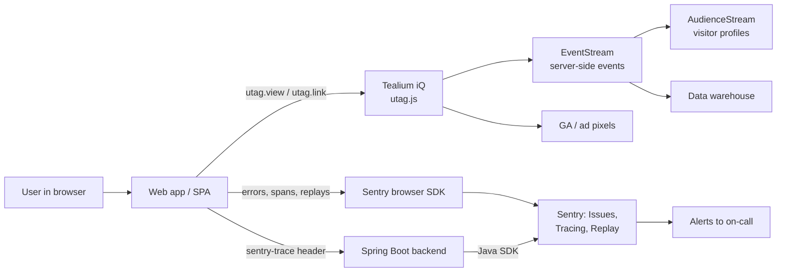
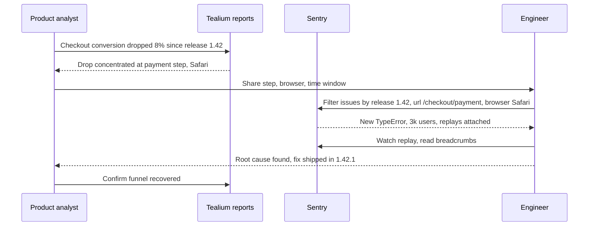

# User Behaviour Analysis With Tealium and Sentry

## Abbreviations

| Abbreviation | Full name |
| --- | --- |
| UBA | User Behaviour Analysis |
| CDP | Customer Data Platform |
| TMS | Tag Management System |
| SDK | Software Development Kit |
| DSN | Data Source Name (Sentry's project ingest URL) |
| SPA | Single-Page Application |
| PII | Personally Identifiable Information |
| GA | Google Analytics |
| APM | Application Performance Monitoring |
| E2E | End-to-End |

## Why two tools

UBA (User Behaviour Analysis) has to answer two different questions:

1. **What did users do?** — page views, clicks, funnel steps, conversion.
2. **What went wrong for them?** — errors, slow pages, the actions leading up to a failure.

Tealium answers the first; Sentry answers the second. They are complements, not alternatives.

| Dimension | Tealium | Sentry |
| --- | --- | --- |
| Category | TMS (Tag Management System) + CDP (Customer Data Platform) | Error monitoring + APM (Application Performance Monitoring) |
| Question answered | What users did, where they dropped off | What broke, what was slow, what the user did just before |
| Main products | iQ Tag Management, EventStream, AudienceStream | Issues, Tracing, Session Replay |
| Where data goes | Fanned out to downstream vendors (GA, ads, warehouse) | Kept in Sentry for triage and alerting |
| Browser integration | `utag.js` + `utag_data` data layer | `@sentry/browser` or a framework SDK (Software Development Kit) |
| Primary consumer | Product, marketing, analytics | Engineering, on-call |



## Tealium: instrument once, distribute many times

### Concepts

- **iQ Tag Management** — the page loads a single `utag.js`; which vendor tags fire, and with what data, is
  configured in the Tealium console and published without an application release.
- **Data layer** — the contract between the app and Tealium: a flat object (`utag_data`) plus event payloads.
  Everything downstream is only as good as this contract.
- **EventStream** — server-side event collection and forwarding (connectors to warehouses, CRMs, ad platforms).
- **AudienceStream** — the CDP layer: stitches events into visitor profiles and computes audiences/badges.

### Browser integration

```html
<script>
  // Data layer for the initial page, defined before utag.js loads
  var utag_data = { page_name: "product", page_type: "pdp", product_id: "SKU-123" };
</script>
<script src="https://tags.tiqcdn.com/utag/<account>/<profile>/<env>/utag.js" async></script>
```

```js
// Page view (needed manually on SPA route changes)
utag.view({ page_name: "checkout", page_type: "funnel" });

// Interaction event
utag.link({ event_name: "add_to_cart", product_id: "SKU-123", product_price: "19.90" });
```

In an SPA (Single-Page Application) the route change does not reload `utag.js`, so:

- suppress the automatic view on first load with `window.utag_cfg_ovrd = { noview: true }` if the router fires it;
- call `utag.view()` from the router's after-navigation hook, with the new page's data layer.

### Practices

- **Specify the data layer before instrumenting.** Event names, variable names and allowed values belong in a
  shared spec; otherwise every downstream report ends up with its own definition of "add to cart".
- **Keep PII (Personally Identifiable Information) out of the data layer.** Use consent management in Tealium to
  gate vendor tags per user choice.
- **Use environments** (`dev` / `qa` / `prod` in the `utag.js` path) so tag changes are tested before publishing.
- **Verify in the browser** with the Tealium debugging tools or by watching network calls to the collect endpoint.

## Sentry: errors, performance and session replay

### Concepts

- **Issues** — events (exceptions, unhandled promise rejections, messages) grouped by fingerprint.
- **Breadcrumbs** — the trail recorded before an event: clicks, navigations, console output, XHR/fetch calls.
  This is where Sentry overlaps with behaviour analysis.
- **Tracing** — spans for page loads, navigations and outgoing requests; with trace propagation the backend
  transaction joins the same trace.
- **Session Replay** — a DOM-based video-like reconstruction of the session around an error.

### Browser integration

```js
import * as Sentry from "@sentry/browser";

Sentry.init({
  dsn: "https://<key>@<org>.ingest.sentry.io/<project>",
  environment: "prod",
  release: "web@1.42.0",
  integrations: [
    Sentry.browserTracingIntegration(),
    Sentry.replayIntegration({ maskAllText: true, blockAllMedia: true }),
  ],
  tracesSampleRate: 0.1,                  // trace 10% of page loads/navigations
  tracePropagationTargets: [/^\/api\//],  // attach trace headers to own API only
  replaysSessionSampleRate: 0.01,         // record 1% of ordinary sessions
  replaysOnErrorSampleRate: 1.0,          // always keep the replay when an error occurs
});
```

The DSN (Data Source Name) is not a secret in the browser — it only permits sending events — but restrict
allowed domains in the project settings.

Framework SDKs (`@sentry/react`, `@sentry/angular`, `@sentry/vue`, …) add error boundaries and router-aware
navigation spans. Upload source maps at build time so stack traces point to original source.

### Backend integration (Spring Boot 3)

```yaml
# application.yaml — with io.sentry:sentry-spring-boot-starter-jakarta on the class path
sentry:
  dsn: ${SENTRY_DSN}
  environment: prod
  traces-sample-rate: 0.1
```

Because the browser sends `sentry-trace` and `baggage` headers to targets in `tracePropagationTargets`, a slow
click can be followed from the browser span into the controller span. How the servlet request reaches the
controller is described in
[Spring Boot Startup Lifecycle](../../languages/java/springboot/2026-09-17-springboot-startup-lifecycle.md).

For infrastructure-level metrics and traces on the same kind of Java service, see
[Splunk O11y on EKS Fargate (Java)](./splunk-o11y-eks-fargate-java-architecture.md) — Sentry complements it
from the user's side rather than replacing it.

## Making the two work together



- **Tealium shows the funnel; Sentry explains the drop.** Correlate by time window, page and release.
- **Share one pseudonymous visitor ID.** Put Tealium's visitor ID into Sentry with
  `Sentry.setUser({ id: visitorId })` or `Sentry.setTag("tealium_visitor_id", visitorId)`; never an email.
- **Tag the release in both.** A `release` / `app_version` value in the data layer and in `Sentry.init` makes
  "before vs after deploy" comparisons trivial.
- **Watch sampling and privacy.** Replay masks text and blocks media by default; keep it that way unless a
  review says otherwise, and scrub request data in `beforeSend` if needed.
- **Test the instrumentation.** Tags silently break during refactors; E2E (End-to-End) tests can assert that the
  Tealium and Sentry requests are actually sent — see [Playwright](../../web/frontend/2026-09-17-playwright-e2e-testing.md).

## Checklist

| Step | Tealium | Sentry |
| --- | --- | --- |
| Define | Data-layer spec (events, variables, values) | Projects, environments, release naming |
| Integrate | `utag.js`, `utag.view` on route change, `utag.link` on actions | `Sentry.init`, framework SDK, source maps, backend starter |
| Protect | Consent management, no PII in data layer | Replay masking, `beforeSend` scrubbing, allowed domains |
| Correlate | Visitor ID and release in data layer | Same visitor ID via `setUser`/tag, `release` |
| Verify | Tealium debugger, network calls, E2E assertions | Test error in staging, E2E assertions |
| Operate | Funnel dashboards | Alerts, issue ownership, release health |

## Conclusion

Tealium and Sentry cover the two halves of user behaviour analysis: Tealium records *intent and progress*
through a governed data layer and forwards it wherever it is needed, while Sentry records *friction* — errors,
latency and the breadcrumbs and replays that show how the user got there. Joined by a shared visitor ID and
release tag, they turn "conversion dropped" into a specific, fixable defect.

## References

- [Tealium Docs](https://docs.tealium.com/)
- [Tealium — utag.js](https://docs.tealium.com/platforms/javascript/)
- [Sentry — JavaScript SDK](https://docs.sentry.io/platforms/javascript/)
- [Sentry — Session Replay](https://docs.sentry.io/product/explore/session-replay/)
- [Sentry — Spring Boot](https://docs.sentry.io/platforms/java/guides/spring-boot/)
