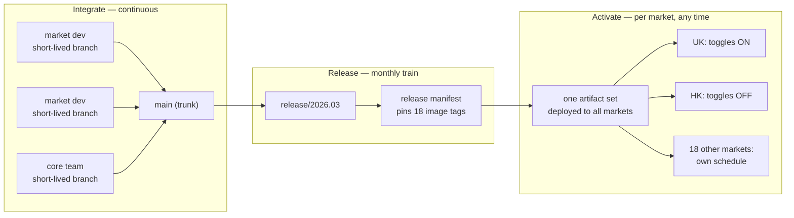
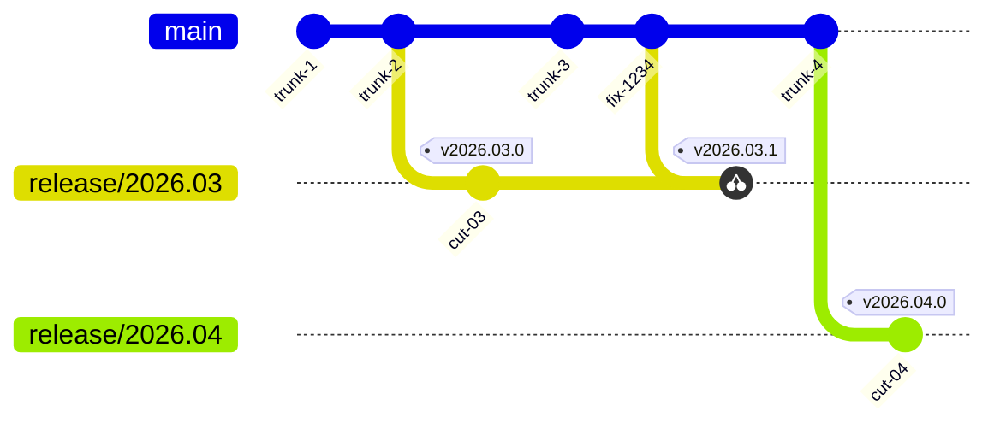
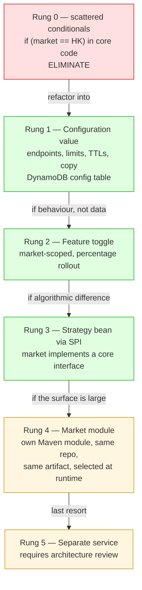
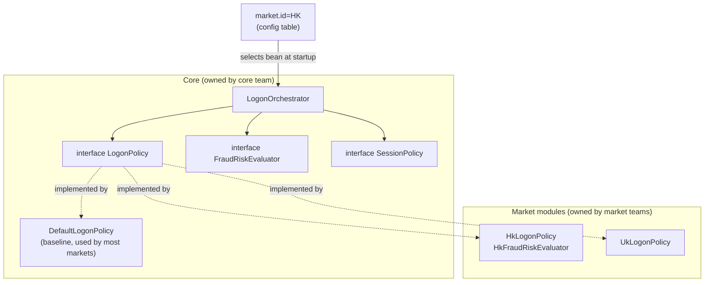
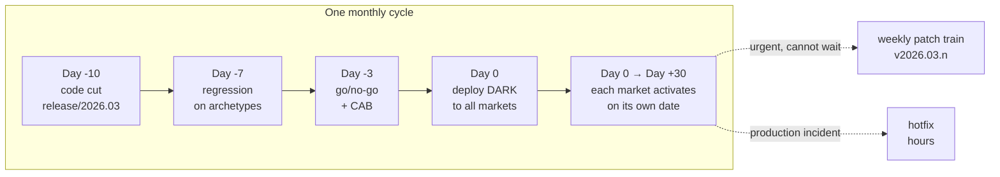
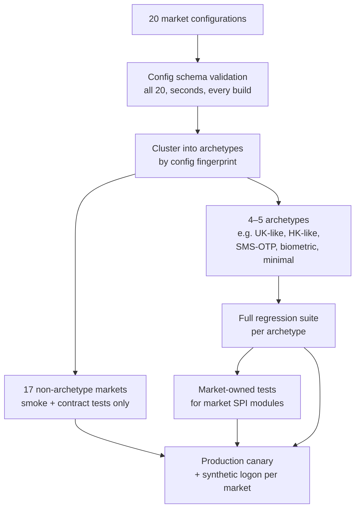
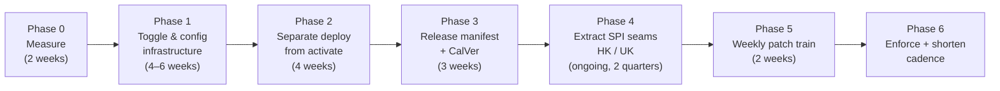

# Release Management for a Shared Codebase Serving 20 Markets

How to keep one trunk, one release train, and still let twenty markets ship on their own schedule — applied to a banking authentication and authorization platform.

> Companion note: [Git Branching Strategies](./branching-strategy.md) covers the general branching models and coordinated multi-repository releases. This document assumes that background and focuses on the multi-market layer built on top of it.

---

## Abbreviation Glossary（缩写对照表）

| Abbreviation | Full English Name | 中文 |
|---|---|---|
| AuthN | Authentication | 身份认证 |
| AuthZ | Authorization | 授权 |
| API | Application Programming Interface | 应用程序接口 |
| OAuth | Open Authorization | 开放授权 |
| EKS | Elastic Kubernetes Service | 弹性 Kubernetes 服务 |
| HSM | Hardware Security Module | 硬件安全模块 |
| PDP | Policy Decision Point | 策略决策点 |
| SPI | Service Provider Interface | 服务提供者接口 |
| CI/CD | Continuous Integration / Continuous Delivery | 持续集成／持续交付 |
| QA | Quality Assurance | 质量保证 |
| SLA | Service Level Agreement | 服务等级协议 |
| CAB | Change Advisory Board | 变更咨询委员会 |
| RACI | Responsible, Accountable, Consulted, Informed | 责任分配矩阵 |
| TTL | Time To Live | 存活时间 |
| UK | United Kingdom | 英国 |
| HK | Hong Kong | 香港 |
| SemVer | Semantic Versioning | 语义化版本 |
| CalVer | Calendar Versioning | 日历化版本 |
| GitOps | Git-as-source-of-truth operations model | 以 Git 为唯一事实源的运维模式 |

---

## Table of Contents

1. [The Real Diagnosis: Three Axes Are Being Conflated](#1-the-real-diagnosis-three-axes-are-being-conflated)
2. [Branching Strategy](#2-branching-strategy)
3. [Decoupling Market Variation from Branching](#3-decoupling-market-variation-from-branching)
4. [Release Cadence](#4-release-cadence)
5. [Governance and Process](#5-governance-and-process)
6. [Testing and Environment Strategy](#6-testing-and-environment-strategy)
7. [Migration Path](#7-migration-path)
8. [Risks Specific to This Platform](#8-risks-specific-to-this-platform)
9. [Summary](#9-summary)

---

## 1. The Real Diagnosis: Three Axes Are Being Conflated

The question is framed as *"how do we manage the release pace"*, but branching is not where this problem is solved. Markets ask for their own branch because, today, **the only way for a market to control when its change reaches its users is to control the code**. Take that constraint away and the demand for market branches disappears on its own.

The fix is to split one activity into three independent axes:

| Axis | Question it answers | Cadence | Owner |
|---|---|---|---|
| **Integrate** | Is the code merged and continuously verified? | Continuously, per pull request | Every market's developers |
| **Release** | Which immutable artifact set is certified for production? | Monthly train + weekly patch train | Core team |
| **Activate** | Which market sees which behaviour, starting when? | Any time, per market, self-service | Each market |



Everything below is the mechanics of making those three axes actually independent.

**The single most important consequence:** deploying code and activating behaviour become different actions. Code ships *dark* on the monthly train; a market goes live by flipping configuration, which is a minutes-long, self-service, auditable operation — not a code cut.

---

## 2. Branching Strategy

### Recommendation

**Trunk-based development in all 18 repositories, plus a core-team-owned release-train branch per train. No market ever owns a long-lived branch.**

| Branch | Lifetime | Owner | Purpose |
|---|---|---|---|
| `main` | Permanent | Core team (merge rights via review) | The only integration point. Always releasable, never frozen. |
| `feature/<ticket>-<slug>` | ≤ 3 days | Any market developer | Short-lived; merged by pull request into `main`. |
| `release/<YYYY.MM>` | ~6 weeks (until train N+1 is in production everywhere) | Core team release manager | The certified snapshot. Only cherry-picks land here. |
| `hotfix/<YYYY.MM>.<n>` | Hours | Core team + incident owner | Cut from the release branch for a production incident. |

Tags: `v2026.03.0`, `v2026.03.1` (patch train), `v2026.03.1-hf1` (hotfix).



Note the direction of `fix-1234`: it is authored on `main` and *then* cherry-picked onto `release/2026.03`, shipping as the patch-train tag `v2026.03.1`. Trunk work (`trunk-3`, `trunk-4`) continues uninterrupted throughout.

### Why not the alternatives

| Candidate | Verdict | Reason in this context |
|---|---|---|
| **Trunk + release trains** *(recommended)* | ✅ | One integration point keeps 20 teams honest; the release branch gives the auditable, rollback-able snapshot that banking change control requires; market autonomy is served by activation, not branching. |
| **GitFlow (`develop` + `release/*`)** | ❌ | The `develop` branch buys nothing here — it is a second integration point that has to be kept in sync across 18 repositories, and it delays cross-market conflict discovery by weeks. |
| **Release branch per market** (`release/hk-2026.03`) | ❌❌ | This is the failure mode to prevent. With 20 markets it produces up to 20 divergent lines per train, an *n×m* backport matrix, and no single artifact that can be certified. Support and security patching become impossible to reason about. |
| **Fork per market** | ❌❌ | Same as above, permanently. |
| **Monorepo of all 18 repositories** | ⚠️ Worth evaluating separately | It genuinely removes cross-repository version bookkeeping. But it is a large migration that does not solve the market-divergence problem, which is the actual pain. Do it later, if at all — not as part of this change. |

### The one rule that holds the model together

> **Fix forward, cherry-pick backward. Never the reverse.**

Every change lands on `main` first and is cherry-picked onto the release branch. A fix authored directly on a release branch will eventually be lost when that branch is retired — and with a monthly cadence, "eventually" means about four weeks. Enforce it in CI: a commit on `release/*` whose `Cherry-picked-from:` trailer does not resolve to a commit reachable from `main` fails the build.

---

## 3. Decoupling Market Variation from Branching

This is the substance of the solution. Market difference has to be expressed *somewhere*; the goal is to keep it out of version control topology and put it in a place with an escalation ladder.

### The variation ladder

Always resolve a market difference at the **lowest rung that works**.



**Rung 0 is the thing to remove.** Scattered `if (market.equals("HK"))` checks in core logic are what make people believe the codebase "can't be shared" — they are untestable, invisible to the market that owns them, and they grow without limit. Every one of them belongs on a higher rung.

### Rungs 1 and 2: configuration and toggles

The existing DynamoDB configuration table is the right home. Give it an explicit, versioned schema keyed by market:

| Attribute | Example | Notes |
|---|---|---|
| `pk` | `MARKET#HK` | Partition by market |
| `sk` | `TOGGLE#logon.stepup.biometric_v2` | Or `CONFIG#downstream.fraud.endpoint` |
| `value` | `true` / `"https://…"` | |
| `rolloutPercent` | `10` | Percentage rollout inside a market |
| `type` | `RELEASE` \| `OPS` \| `MARKET` | Determines the governance rules below |
| `owner` | `hk-auth-team` | Required |
| `expiresAt` | `2026-06-30` | Required for `RELEASE`, forbidden for `MARKET` |
| `changeRef` | `CHG-00123` | Audit trail for the regulator |

**Toggle naming convention:** `<domain>.<capability>.<change>` — for example `logon.stepup.biometric_v2`, `session.idle.extended_timeout`, `antifraud.velocity.rule_set_v3`. Domain-first naming makes ownership and blast radius obvious from the key alone.

**Three toggle types, three different rules — this distinction is what prevents toggle debt:**

| Type | Lifetime | Rule |
|---|---|---|
| `RELEASE` | Temporary — shipped dark, activated, then removed | Must carry an owner and an expiry date. CI fails the build when a `RELEASE` toggle is older than **two trains (≈90 days)**. Removing it is a task in the train that follows full activation. |
| `OPS` | Permanent | Kill switches and circuit breakers (e.g. `antifraud.provider.disable`). Exempt from expiry; reviewed annually. |
| `MARKET` | Permanent | Genuine, indefinite product differences (e.g. `logon.otp.sms_enabled`). These are configuration, not debt. |

Without the expiry rule, this model degrades within a year into a codebase where no combination of toggles has ever been tested. Treat the CI expiry check as non-negotiable.

### Rungs 3 and 4: the HK / UK divergence

Toggles handle *"does this market do X?"*. They handle badly *"this market computes the risk score in a fundamentally different way"*. For genuine algorithmic divergence, define **seams** — interfaces at the exact points where markets differ — and let markets supply implementations.



In Spring Boot this is ordinary dependency injection:

```java
public interface LogonPolicy {
    StepUpDecision evaluate(LogonContext ctx);
}

@Component
@ConditionalOnProperty(name = "market.id", havingValue = "HK")
public class HkLogonPolicy implements LogonPolicy { /* HK rules */ }

@Component
@ConditionalOnMissingBean(LogonPolicy.class)   // baseline for the other 18 markets
public class DefaultLogonPolicy implements LogonPolicy { /* … */ }
```

Three properties make this work where branching does not:

1. **All implementations compile into the same artifact.** One binary, one security patch, one certification.
2. **The seam is a reviewed contract.** Core owns the interface; changing it is a deliberate, announced act. Markets cannot silently reach into core internals.
3. **Divergence is visible and bounded.** "How different is HK?" becomes a countable answer: *four SPI implementations*. On branches it is an unanswerable diff.

Guardrail: enforce with a static-analysis rule (ArchUnit or a Checkstyle regex in CI) that market identifiers may appear only inside `market-*` modules and configuration keys — never in core packages.

---

## 4. Release Cadence

### Keep the monthly cut, but stop making it the only door

The monthly code cut is not the problem, and shortening it is not the first fix. The problem is that today it is the *only* route to production, so every market's urgency has to fight for a slot in it. Add lanes instead:

| Lane | Frequency | Contents | Cut from | Lead time |
|---|---|---|---|---|
| **Feature train** | Monthly | Everything merged to `main` by cut day | `main` | ~2 weeks cut→prod |
| **Patch train** | Weekly | Approved cherry-picks only | current `release/*` | ~2 days |
| **Hotfix** | On demand | One incident fix | current `release/*` | Hours |
| **Configuration / toggle change** | Continuous | No code at all | — | Minutes |



Once the ladder in section 3 exists, most requests that today feel like "we need our own branch" are served by a toggle flip or the weekly patch train. Measure this: **track how many market escalations per train actually required new code.** In practice it is a small minority, and that number is the argument that ends the branch-per-market discussion.

### Progressive activation by market

One artifact serves 20 markets, so sequence the *activation*, not the build:

`internal staff → one small market → the change's requesting market → UK / HK → remaining markets`

Within a market, use `rolloutPercent` for a staged ramp (1% → 10% → 50% → 100%) with automatic rollback on error-rate or step-up-failure thresholds. For an AuthN platform this matters more than pre-production testing: a logon regression is visible in seconds in production telemetry and invisible in a test environment that no real user touches.

### Should the cadence shorten later?

Yes — eventually monthly → biweekly. But do it **last**, after dark deployment, the patch train, and archetype-based regression are all working. Shortening the train before those exist just makes the same pain arrive twice as often.

---

## 5. Governance and Process

### Code cut criteria (all must hold, automated where possible)

- `main` green: unit, integration, and contract tests pass in all 18 repositories.
- Every new `RELEASE` toggle is registered with an owner and expiry, and defaults to **off**.
- No open severity-1 or severity-2 defect on the previous train.
- Configuration contract tests pass against **all 20 markets'** current production configuration.
- Session and token payload compatibility check passes against the currently deployed version (see section 8).

### Code freeze — freeze the branch, never the trunk

Freeze applies only to `release/*`. `main` stays open throughout. A trunk freeze is precisely what pushes market teams toward private branches, so it must never happen; a market whose work misses the cut simply catches the next train, with its code already integrated and tested rather than rotting on a branch.

### Cherry-pick policy

- **Eligible:** defect fixes, regulatory-deadline items with a named commitment, security patches.
- **Not eligible:** new features, refactors, dependency upgrades — these wait for the next train.
- **Approval:** core release manager **and** the requesting market lead. Both signatures recorded on the pull request.
- **Budget:** a soft cap of **5 cherry-picks per train**. The cap is a diagnostic, not a punishment — if it is exceeded three trains running, the cadence or the ladder is wrong, and that is what should be fixed.
- Every cherry-pick re-runs the full pipeline on the release branch. No exceptions for "trivial" changes.

### Versioning across the 18 repositories

Use **two version schemes for two different purposes** — this is the point most teams get wrong by trying to pick one:

| Scheme | Applies to | Purpose |
|---|---|---|
| **SemVer** (`2.4.1`) per repository | Each service's published API contract | Tells consumers about compatibility. Independent of the train. |
| **CalVer** (`2026.03.1`) per train | The platform release as a whole | Tells operations, CAB, and regulators which certified set is live. |

The deployable unit is not a repository — it is a **release manifest** pinning all 18 image digests, held in a `platform-release` repository and promoted GitOps-style:

```yaml
# platform-release/manifests/2026.03.1.yaml
platformVersion: "2026.03.1"
cutFrom: release/2026.03
services:
  auth-logon-api:     { image: "…/auth-logon-api@sha256:a1b2…", semver: "4.2.0" }
  auth-session-api:   { image: "…/auth-session-api@sha256:c3d4…", semver: "3.7.1" }
  # … 16 more
markets:
  UK: { activatedAt: "2026-03-05", changeRef: "CHG-00981" }
  HK: { activatedAt: "2026-03-12", changeRef: "CHG-00994" }
```

This manifest is simultaneously the deployment input, the rollback target, and the audit record of which market ran which code on which date — an artifact a banking regulator will ask for eventually.

### RACI

| Concern | Core team | Market team |
|---|---|---|
| `main`, release branches, manifest | **Accountable** | Consulted |
| SPI contracts and core domain logic | **Accountable** | Consulted |
| Market SPI implementations (`market-hk`) | Consulted | **Accountable** |
| Market configuration and toggle values | Consulted | **Accountable** |
| Market activation date and change record | Informed | **Accountable** |
| Cross-market regression suite | **Accountable** | Contributes archetype cases |

The deliberate shift: markets gain real, unambiguous ownership of *activation and configuration* — genuine autonomy over the thing they actually care about — in exchange for giving up ownership of branches.

---

## 6. Testing and Environment Strategy

Validating one artifact against 20 configurations naïvely costs 20× QA. It does not have to, because the 20 configurations are not 20 independent problems.



**1. Configuration validation is a test, and it is nearly free.** Publish a JSON Schema for the configuration table and validate all 20 markets' live configuration on every build. Most "it broke in market X" incidents are a missing or malformed configuration value, and this catches them in seconds without any environment.

**2. Reduce the matrix to archetypes.** Fingerprint each market's configuration (the set of `MARKET`-type toggles plus active SPI implementations) and cluster. Twenty markets almost always collapse into four or five archetypes. Run the **full** regression suite against each archetype; run smoke plus contract tests for the rest. That is 5× cost, not 20×, and it is where the saving comes from.

**3. Push market-specific testing to market teams.** A market's SPI module ships with its own unit and component tests, owned and gated by that market team. This is the only way QA scales to 20 markets — the core team cannot be the bottleneck for business logic it does not own.

**4. Do not test toggle combinations exhaustively.** *n* toggles is 2ⁿ combinations; that is unwinnable. Instead: require toggles to be designed independent (a toggle changes one seam), test each new toggle ON and OFF against its archetype, and declare any genuine toggle interaction a design defect to be refactored into a single higher-rung choice.

**5. Contract tests carry the cross-service load.** With 18 repositories, consumer-driven contract tests (Pact or Spring Cloud Contract) between the logon, session, and anti-fraud APIs — and against the PDP's expectation of session validation — catch integration breakage without standing up 20 full environments.

**6. Environments:**

| Environment | Shape | Purpose |
|---|---|---|
| Ephemeral per pull request | One archetype configuration | Fast developer feedback |
| Integration | All 18 services, archetype-parameterised | Contract and regression suites |
| Staging | Production-like, HSM and ElastiCache included | Train certification, performance, security scan |
| Production | 20 market configurations, one artifact | Canary + synthetic logon probes per market |

**7. Synthetic monitoring per market is part of the test strategy, not an afterthought.** Run a synthetic logon, step-up, and session-validation journey against every market continuously. It is the only mechanism that verifies all 20 configurations against real infrastructure, and it verifies them where it counts.

---

## 7. Migration Path

Sequence matters here. The common failure is starting with the branching rule — banning market branches before the alternative exists simply converts market frustration into shadow processes.



**Phase 0 — Measure first.** Count market-specific conditionals in core packages; count live long-lived branches and their age; measure lead time from merge to production per market; count cherry-picks per train; count escalations that genuinely needed new code. Without this baseline you cannot win the argument with market leads, and you cannot prove the change worked.

**Phase 1 — Toggle and configuration infrastructure.** The enabling capability; nothing else functions without it. Extend the DynamoDB configuration table with the market-scoped toggle schema, build the toggle registry with owner and expiry, expose self-service change with an audit trail, and add the CI expiry check from day one — retrofitting it later means fighting an existing backlog of stale toggles.

**Phase 2 — Separate deploy from activate.** Make dark deployment the default: new code ships off, activation is a configuration change. This is the phase that actually gives markets their autonomy, and it is where market teams stop resisting the programme.

**Phase 3 — Release manifest and CalVer.** Introduce `platform-release`, pin all 18 image digests, make the manifest the deployment and rollback unit, and record market activation dates in it.

**Phase 4 — Extract SPI seams.** Start with the single largest divergence (most likely the HK logon or step-up flow). Extract the interface, move the HK logic into `market-hk`, delete the corresponding core conditionals, and add the ArchUnit guardrail once the first seam is clean. Expect this to run for two quarters; it is the longest phase and the one that pays down the real debt.

**Phase 5 — Weekly patch train.** Only now is there a viable alternative to a market branch for urgent work. Announce the cherry-pick policy and the budget alongside it.

**Phase 6 — Enforce and then shorten.** Turn on branch-age alarms, the cherry-pick trailer check, and the toggle expiry gate. Once three consecutive trains stay inside the cherry-pick budget, move the feature train to biweekly.

**What to watch during migration**

- Market teams keeping private branches "just in case" — check branch age reports weekly and address the underlying need rather than the branch.
- Toggle count growing faster than toggle removal — publish the ratio on the team dashboard from Phase 1.
- Phase 4 dragging because seam extraction competes with feature work — allocate a fixed capacity slice (10–15%) rather than trying to do it opportunistically.
- Regulatory sign-off in some markets is tied to a named code version; introduce the manifest (Phase 3) *before* asking those markets to change how they activate.

---

## 8. Risks Specific to This Platform

The general model above applies to any multi-market product. These constraints come from this particular stack and deserve explicit design attention.

**Session compatibility during rolling deployment.** Sessions live in ElastiCache and are shared across pods that, during a rolling deploy, run two different versions. Any change to the session payload must be **two-phase**: train *N* writes both old and new formats and reads either; train *N+1* stops writing the old format. Compressing this into one train will log users out mid-session. Add an automated compatibility check to the cut criteria that deserialises the previous version's session format against the new code.

**Token format and CloudHSM.** The same two-phase rule applies to token structure, with an additional constraint: key rotation and token-format change must never land in the same train, or a rollback becomes impossible to reason about.

**The PDP and Kong contract.** Downstream business APIs depend on session validation semantics. That contract is effectively public API for the other twenty-odd teams behind the gateway — it needs consumer-driven contract tests and a deprecation window measured in trains, not days.

**The configuration table is now a production dependency with no test gate.** Once markets self-serve configuration, a bad value is a production incident with no pipeline in front of it. Mitigate with: schema validation on write, staged rollout of configuration changes exactly like code, one-click configuration rollback, and configuration change history retained for audit.

**Regulatory and CAB reality.** In several markets the binding constraint on release pace is not engineering at all — it is a local change advisory board or regulator sign-off window. This model serves that well: each market gets its own change record, its own activation date, and a manifest proving exactly which code it activated, all without a branch. Confirm this explicitly with the two or three most heavily regulated markets early, because if a market's regulator requires a market-specific *artifact*, that is a genuine exception to design for rather than argue with.

**Toggle debt is the model's characteristic failure mode.** Branch sprawl is visible and everyone fears it; toggle sprawl is invisible until the day nobody can say what any configuration combination does. The expiry gate, the removal task in the following train, and the published add/remove ratio are what keep this model from becoming worse than the branching it replaced.

---

## 9. Summary

| Question | Answer |
|---|---|
| **Branching** | Trunk-based in all 18 repositories; core-team-owned `release/<YYYY.MM>` per train; no market branch, ever. Fix forward, cherry-pick backward. |
| **Market variation** | An escalation ladder — configuration → toggle → SPI strategy bean → market module. Eliminate scattered market conditionals. HK/UK divergence becomes four named SPI implementations, not a diff. |
| **Cadence** | Keep the monthly feature train; add a weekly patch train, an on-demand hotfix lane, and continuous configuration change. Shorten the train only after the rest works. |
| **Governance** | Freeze the release branch, never the trunk. SemVer per service for compatibility, CalVer per train for operations, a release manifest as the deployable and auditable unit. Cherry-pick budget of 5 as a diagnostic. |
| **Testing** | Validate all 20 configurations by schema; cluster into 4–5 archetypes for full regression; push market logic testing to market teams; canary and synthetic-probe per market in production. |
| **Migration** | Measure → toggle infrastructure → separate deploy from activate → manifest → extract SPI seams → patch train → enforce and shorten. |

The one-line version:

> **Markets don't need their own branch — they need their own activation date.** Give them that through configuration and toggles, and centralised version control stops being a constraint they have to fight.
