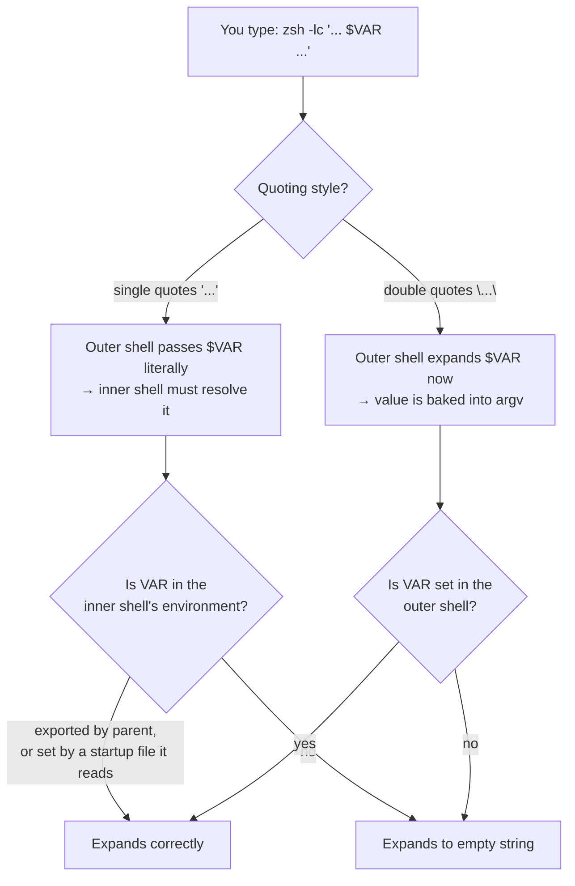

# Zsh Subshell Variable Expansion

## Summary

A `zsh -lc '...'` command failed to expand `$LOCAL_UPSTREAM_KEY`. Three separate mechanisms can produce that same empty-string symptom: single quotes suppressing expansion in the outer shell, a variable that was never exported, and `zsh -lc` not reading the startup file that defines it. Telling them apart is what makes the fix obvious.

## Key takeaway

`'...'` and `"..."` decide **who expands the variable**; `export` decides **who inherits it**. These are two independent gates, and the value only survives if it passes the one that applies. The cleanest fix is usually to drop the subshell entirely.

## Mental model: two independent gates



Two rules follow from this:

- **Single quotes move the problem inward.** `zsh -lc 'echo ${VAR}'` hands the literal seven characters `${VAR}` to the child. Whether it resolves is entirely a question about the *child's* environment.
- **`export` is what crosses a process boundary.** `VAR=value` is shell-local. A child process — which is what `zsh -lc` starts — never sees it unless it was exported or passed as a command prefix.

## Which startup files does `zsh -lc` actually read?

This is the part that most often surprises people: `-l` (login) and `-i` (interactive) are separate flags, and `.zshrc` is tied to **interactive**, not login. So `zsh -lc` never reads `.zshrc`.

| Invocation | `.zshenv` | `.zprofile` | `.zshrc` | `.zlogin` |
|---|:--:|:--:|:--:|:--:|
| `zsh -lc 'cmd'` (login, non-interactive) | ✅ | ✅ | ❌ | ✅ |
| `zsh -c 'cmd'` (non-login, non-interactive) | ✅ | ❌ | ❌ | ❌ |
| `zsh -ic 'cmd'` (interactive) | ✅ | ❌ | ✅ | ❌ |

*(Verified on zsh under macOS by instrumenting each startup file with an `echo`.)*

**Consequence:** if the key lives in `.zshrc`, `zsh -lc` will not see it no matter how you quote things. Put variables meant for every context in `.zshenv` (or export them from `.zprofile` and accept that only login shells get them).

## The nuance worth remembering

A variable set **without** `export` inside `.zprofile` *is* visible to the `-c` command body — the startup file and the command run in the same process. It just cannot go one level deeper:

```bash
# .zprofile contains:  MYVAR=hello        (no export)

zsh -lc 'echo "[$MYVAR]"'              # → [hello]   same process
zsh -lc 'zsh -c "echo [\$MYVAR]"'      # → []        one process deeper, not exported
```

So "unexported variables are invisible to subshells" is precise about *parent → child*, not about *startup file → command body*.

## Quick diagnostic

Run these three in order; the first one that misbehaves names the cause.

```bash
# 1. Is it in the outer (your interactive) shell at all?
echo "[$LOCAL_UPSTREAM_KEY]"

# 2. Does it survive into the login subshell?
zsh -lc 'echo "[$LOCAL_UPSTREAM_KEY]"'

# 3. Is it exported, or merely set?
zsh -lc 'typeset -p LOCAL_UPSTREAM_KEY'
# "export LOCAL_UPSTREAM_KEY=..."   → exported
# "typeset LOCAL_UPSTREAM_KEY=..."  → set but NOT exported
```

| Step 1 | Step 2 | Diagnosis |
|---|---|---|
| empty | empty | Not defined anywhere, or defined in a file no shell in the chain reads |
| has value | empty | Defined in your interactive shell only — not exported, or set in `.zshrc` |
| has value | has value | Expansion is fine; the bug is elsewhere in the command (check quoting of the payload) |

## Fix options, in order of preference

### A — Avoid the subshell entirely (recommended)

Nothing crosses a process boundary, so neither gate applies:

```bash
AUTH="Authorization: Bearer ${LOCAL_UPSTREAM_KEY}"
curl https://deeprouter.top/v1/chat/completions \
  -H "Content-Type: application/json" \
  -H "$AUTH" \
  -d '{ "model": "gpt-4o-mini", "messages": [{"role": "user", "content": "who are you?"}], "temperature": 0.7 }' | jq
```

Note the deliberate quoting split: `"$AUTH"` in double quotes so it expands, the JSON body in single quotes so `$` and `"` inside it are left alone.

### B — Export the variable properly

```bash
# In ~/.zshenv (read by every zsh, including non-interactive ones):
export LOCAL_UPSTREAM_KEY="your_key"
```

Then the original `zsh -lc '...'` command works unchanged. Use `.zshenv` rather than `.zshrc` if scripts and editors need the value too.

### C — Pass the value as a command prefix

A prefix assignment puts the variable in that one command's environment without exporting it into your session:

```bash
LOCAL_UPSTREAM_KEY="your_key" zsh -lc '
AUTH="Authorization: Bearer ${LOCAL_UPSTREAM_KEY}"
curl https://deeprouter.top/v1/chat/completions \
  -H "Content-Type: application/json" \
  -H "$AUTH" \
  -d "{ \"model\": \"gpt-4o-mini\" }" | jq
'
```

### D — Double quotes, expanding in the outer shell (avoid for secrets)

```bash
zsh -lc "AUTH='Authorization: Bearer ${LOCAL_UPSTREAM_KEY}'; curl ..."
```

This works — the outer shell substitutes the value before `zsh` is even executed — but it **bakes the secret into the child process's argument list**, where `ps aux` and process accounting can read it. Options A–C keep the value in the environment or in a shell variable instead. Escaping also gets fragile fast once the payload contains its own quotes.

## Root cause summary

| Issue | Cause | Tell |
|---|---|---|
| Single-quote isolation | `'...'` passes `${VAR}` literally; the outer shell never expands it | Works when you switch to `"..."` |
| Non-exported variable | `VAR=x` without `export` — invisible across a process boundary | `typeset -p VAR` prints `typeset VAR=…`, not `export VAR=…` |
| Wrong startup file | Value lives in `.zshrc`, which `zsh -lc` does not read | `zsh -ic` finds it, `zsh -lc` does not |

## Related topics

- Zsh shell quoting rules
- Shell variable export and scope
- Subshell environment inheritance
- Zsh startup file order (`.zshenv` → `.zprofile` → `.zshrc` → `.zlogin`)
