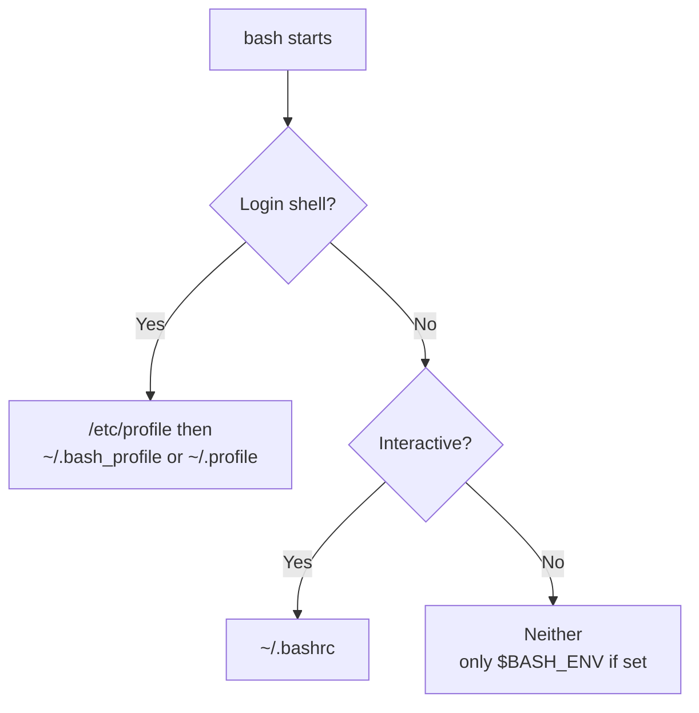

# TTY, PTY, and Non-TTY Shell Sessions

## Abbreviation Glossary

| Abbreviation | Full English name | 中文 |
|---|---|---|
| TTY | Teletypewriter (in Unix: any terminal device) | 终端设备 |
| PTY | Pseudo-Terminal | 伪终端 |
| PTS | Pseudo-Terminal Slave | 伪终端从端 |
| PTMX | Pseudo-Terminal Multiplexer | 伪终端多路复用器 |
| FD | File Descriptor | 文件描述符 |
| SSH | Secure Shell | 安全外壳协议 |
| CI | Continuous Integration | 持续集成 |
| EOF | End Of File | 文件结束符 |
| SIGINT | Signal Interrupt | 中断信号 |
| SIGHUP | Signal Hang Up | 挂断信号 |
| SIGWINCH | Signal Window Change | 窗口大小变化信号 |
| SIGTTIN / SIGTTOU | Signal TTY Input / Signal TTY Output | 后台读/写终端信号 |
| TIOCGWINSZ | Terminal Input/Output Control — Get Window Size | 获取终端窗口大小的控制命令 |
| TIOCSTI | Terminal Input/Output Control — Simulate Terminal Input | 模拟终端输入的控制命令 |
| ICANON | Input Canonical mode | 规范（行）输入模式 |
| stdio | Standard Input/Output library | 标准输入输出库 |

---

## 1. The Short Answer

The three terms are not three points on one scale. Two of them describe **what kind of
device your standard streams are connected to**, and one describes **how that device is
implemented**:

| Term | What it actually means |
|---|---|
| **TTY** | Your standard streams are connected to a *terminal device*. The kernel gives you line editing, signals, job control, and a window size. |
| **PTY** | A TTY that is **emulated in software** instead of backed by hardware. Practically every terminal you use today is a PTY. |
| **Non-TTY** | Your standard streams are connected to a **pipe, file, or socket** — not a terminal at all. None of the terminal machinery exists. |

So a PTY session **is** a TTY session; PTY is the *implementation*. The real dividing
line — the one that changes program behaviour — is **TTY vs non-TTY**.

The single test that decides everything:

```c
isatty(fd)   /* C */
```
```bash
[ -t 1 ] && echo "stdout is a terminal"   # shell
```

---

## 2. What a TTY Actually Gives You

A terminal is not just "a place where text appears". It is a kernel character device with
a **line discipline** sitting between the program and the device. That line discipline is
where the useful behaviour lives:

| Feature | What it does | Gone in a non-TTY? |
|---|---|---|
| **Canonical mode (ICANON)** | Buffers input by *line*; Backspace and `Ctrl-U` edit before the program ever sees it | Yes |
| **Echo** | Characters you type are printed back | Yes |
| **Signal keys (ISIG)** | `Ctrl-C` → SIGINT, `Ctrl-\` → SIGQUIT, `Ctrl-Z` → SIGTSTP | Yes |
| **EOF key** | `Ctrl-D` ends input | Yes |
| **Flow control** | `Ctrl-S` / `Ctrl-Q` pause and resume output | Yes |
| **Output processing** | Translates `\n` into carriage-return + newline | Yes |
| **Window size** | `TIOCGWINSZ` reports rows/columns; SIGWINCH on resize | Yes — no size exists |
| **Job control** | Sessions, process groups, foreground/background, `fg`/`bg`/`Ctrl-Z` | Yes |
| **Controlling terminal** | SIGHUP delivered when the terminal disappears | Yes |

Two consequences worth internalising:

- **`Ctrl-C` is not a shell feature.** It is the line discipline noticing the INTR
  character and sending SIGINT to the *foreground process group*. With no TTY there is no
  foreground process group and no INTR character, so there is nothing to press.
- **Raw mode is a TTY feature too.** Editors, `vim`, `htop`, and shells with line editing
  turn canonical mode *off* (`tcsetattr`) so they can read keystrokes one at a time. That
  option only exists because a terminal is there.

---

## 3. Real TTY vs PTY vs Pipe

```mermaid
flowchart TB
    subgraph REAL["Real TTY — hardware backed"]
        HW["Serial port / video console<br/>/dev/ttyS0, /dev/tty1"] --> LD1["Kernel line discipline"]
        LD1 --> SH1["shell<br/>stdin/stdout = terminal"]
    end

    subgraph PTY["PTY — software emulated terminal"]
        APP["Terminal emulator, sshd,<br/>tmux, script, expect"] --> M["PTY master<br/>/dev/ptmx"]
        M --> LD2["Kernel line discipline"]
        LD2 --> S["PTY slave<br/>/dev/pts/N"]
        S --> SH2["shell<br/>stdin/stdout = terminal"]
    end

    subgraph NON["Non-TTY — no terminal at all"]
        SRC["Pipe, file, or socket"] --> SH3["process<br/>no line discipline<br/>no signals, no size"]
    end
```



*This diagram answers: where the terminal behaviour comes from in each of the three cases.*

### 3.1 Real TTY

Backed by actual hardware: a serial line (`/dev/ttyS0`) or the Linux virtual console you
reach with `Ctrl-Alt-F2` (`/dev/tty1`…`/dev/tty63`). On servers and laptops you will
almost never be on one, except at the physical console or over a serial cable.

### 3.2 PTY

A PTY is a **pair of file descriptors** that the kernel wires together:

- the **master** end is held by whatever is *pretending to be the terminal hardware* —
  your terminal emulator, `sshd`, `tmux`, `script`, or an `expect`/`pexpect` script;
- the **slave** end (`/dev/pts/N`) is what the shell opens as its controlling terminal.

Anything written to the master arrives as *input* on the slave, and vice versa — with the
full line discipline in between, which is why a PTY behaves exactly like real hardware.

How a terminal emulator sets one up:

```
1. posix_openpt()  → get the master fd (via /dev/ptmx)
2. grantpt(), unlockpt(), ptsname()  → prepare and name the slave
3. fork()
4. child: setsid()              → new session, no controlling terminal yet
          open("/dev/pts/N")    → this slave becomes the controlling terminal
          dup2() onto fd 0,1,2
          execve("/bin/bash")
5. parent: read/write the master; render output, forward keystrokes
```

That is the whole trick. `tmux` does it per pane, `sshd` does it per interactive session,
`docker run -t` does it per container.

### 3.3 Non-TTY

No terminal device is involved at all. Standard streams point at a pipe, a regular file,
or a socket. The process still runs perfectly well — it just has none of the terminal
machinery, and `isatty()` returns false.

---

## 4. Where Each One Shows Up

| Scenario | stdin | stdout | TTY? |
|---|---|---|---|
| Local terminal emulator | `/dev/pts/N` | `/dev/pts/N` | Yes (PTY) |
| Physical console / serial | `/dev/tty1`, `/dev/ttyS0` | same | Yes (real TTY) |
| `cmd \| grep foo` | PTY | **pipe** | stdout: **No** |
| `cmd > out.log` | PTY | **file** | stdout: **No** |
| `ssh host cmd` | pipe | pipe | **No** |
| `ssh -t host cmd` | PTY | PTY | Yes |
| `cron` job | `/dev/null` | pipe to mailer | **No** |
| CI runner (GitHub Actions, Jenkins) | pipe | pipe | **No** |
| `systemd` service | null / socket | journal socket | **No** |
| `docker run` (no flags) | pipe | pipe | **No** |
| `docker run -it` | PTY | PTY | Yes |
| `tmux` / `screen` pane | PTY | PTY | Yes |
| `expect` / `script` wrapper | PTY | PTY | Yes (deliberately) |

Note the third row carefully: **TTY-ness is per file descriptor**, not per process. In
`cmd | grep`, `cmd` still has a terminal on stdin and stderr while stdout is a pipe. This
is exactly why `ls | cat` loses colour but still lets you press `Ctrl-C`.

---

## 5. TTY vs Interactive vs Login — Three Independent Axes

These get conflated constantly. They are orthogonal:

| Axis | Question | How to test |
|---|---|---|
| **TTY** | Are my streams a terminal device? | `[ -t 0 ]` |
| **Interactive** | Is the shell reading commands from a user with a prompt? | `[[ $- == *i* ]]` |
| **Login** | Is this the session's first shell? | `shopt -q login_shell` |

Counter-examples that prove they are independent:

- `bash script.sh` typed at your terminal → **has a TTY**, but **non-interactive**.
- `bash -i < commands.txt` → **interactive**, but stdin is **not a TTY**.
- `ssh host` → TTY, interactive, and login — all three at once.
- `ssh host 'echo hi'` → none of the three.

This matters most for **which startup files get read**:



*This diagram answers: why an environment variable set in ~/.bashrc is missing under `ssh host cmd`.*

That last branch is the classic bug: `ssh host 'my-tool'` fails with "command not found"
because the `PATH` export lives in `~/.bashrc`, which a non-interactive non-login shell
never reads.

> Distro caveat: Bash *can* be compiled to source `~/.bashrc` when it detects it was
> started by `sshd` (the `SSH_SOURCE_BASHRC` build option). Debian and Ubuntu do not
> enable it. Never rely on it.

---

## 6. The Gotchas That Actually Bite

### 6.1 Output buffering changes silently

This is the highest-value item in this whole document. The C standard library picks its
buffering mode by asking `isatty()`:

| Stream | TTY | Non-TTY |
|---|---|---|
| stdout | **line**-buffered (flushes on `\n`) | **fully** buffered (flushes every 4–64 KB) |
| stderr | unbuffered | unbuffered |

So a program that prints progress smoothly in your terminal will, in a pipeline or a CI
log, emit **nothing for minutes and then a wall of text** — and if it crashes, the tail of
the buffer is lost entirely. Worse, stdout and stderr interleave incorrectly because one
is buffered and the other is not.

Fixes, in order of preference:

```bash
stdbuf -oL -eL ./mytool | tee out.log   # force line buffering (glibc stdio only)
unbuffer ./mytool | tee out.log         # from `expect`: runs it under a real PTY
script -qec './mytool' /dev/null        # same idea, no expect needed
PYTHONUNBUFFERED=1 python app.py        # language-specific switches
```

`stdbuf` works by `LD_PRELOAD`ing a shim over libc `stdio`. It therefore does **nothing**
for Go, Java, or Rust programs that implement their own buffering — for those, use a PTY
(`unbuffer` / `script`) or the language's own flush setting.

### 6.2 Colour and formatting disappear

Well-behaved tools check `isatty(1)` and drop ANSI escapes when piped, because escape
codes would corrupt a log file. That is why `ls --color=auto` is colourless in a pipe.

To force it back on: `ls --color=always`, `git --no-pager -c color.ui=always`,
`FORCE_COLOR=1`, `CLICOLOR_FORCE=1`. Conversely `NO_COLOR=1` turns it off.

The same check drives **pagers**: `git log` pipes to `less` only when stdout is a TTY —
which is why `git log | cat` does not hang waiting for you to press `q`.

### 6.3 Programs hang or fail waiting for input that can never arrive

Anything that wants a password opens `/dev/tty` directly rather than reading stdin — so
piping the password in does not work, and with no controlling terminal the open fails.

```bash
GIT_TERMINAL_PROMPT=0 git fetch      # fail fast instead of hanging
ssh -o BatchMode=yes host            # never prompt
sudo -n true                         # non-interactive; fail if a password is needed
sudo -S cmd <<< "$PASSWORD"          # read the password from stdin instead
DEBIAN_FRONTEND=noninteractive apt-get install -y pkg
```

The `/dev/tty` mechanism is also useful in the other direction — it is how a script that
is *itself* being piped can still talk to the human:

```bash
curl -s https://example.com/install.sh | bash   # stdin is the script, not the user
# inside that script:
read -r -p "Continue? " answer < /dev/tty       # read the human anyway
```

### 6.4 Background jobs die on disconnect

When the terminal goes away, the kernel sends SIGHUP to the session leader, and the shell
forwards it to its jobs. Any of these survive it:

```bash
nohup ./long-task &        # ignore SIGHUP, redirect output
setsid ./long-task         # new session, no controlling terminal at all
disown -h %1               # remove the job from the shell's HUP list
tmux new -d './long-task'  # give it a PTY that outlives your connection
```

### 6.5 Interactive tools misbehave without `-t`

`docker exec -i` (without `-t`) gives you a shell with no line editing, no `Ctrl-C`, and
no prompt. `ssh host 'sudo cmd'` fails on systems configured with `requiretty`. Both are
fixed by allocating a PTY: `docker exec -it`, `ssh -t`.

The reverse case matters too: **`ssh -t` in a script is usually wrong**. It makes the
remote side echo your input back into stdout, corrupting captured output, and it converts
`\n` to `\r\n`. Use plain `ssh` (or `ssh -T`) when you want to parse the result.

### 6.6 No window size

`tput cols` fails, `$COLUMNS` is unset, and TUI programs either refuse to start or assume
80×24. In CI, prefer tools' explicit `--width` flags over auto-detection.

---

## 7. How to Tell Which One You Are In

```bash
tty                       # prints /dev/pts/3, or "not a tty"
tty -s; echo $?           # 0 = terminal, 1 = not

[ -t 0 ] && echo "stdin is a tty"
[ -t 1 ] && echo "stdout is a tty"
[ -t 2 ] && echo "stderr is a tty"

ls -l /proc/$$/fd/{0,1,2}   # Linux: shows the actual target of each descriptor
ps -o pid,ppid,sid,pgid,tty,stat,comm    # TTY column is "?" when there is none
stty -a                     # dump the full line-discipline settings; errors if non-TTY
```

Reading the `ps` STAT column: `s` = session leader, `+` = in the foreground process group,
`T` = stopped. A process with no controlling terminal shows `?` under TTY.

In code:

```python
import sys, os
sys.stdout.isatty()          # Python
os.isatty(1)
```
```go
// Go
fi, _ := os.Stdout.Stat()
isTTY := fi.Mode()&os.ModeCharDevice != 0
```

And to prove the difference to yourself:

```bash
python3 -c 'import sys; print(sys.stdout.isatty())'         # True
python3 -c 'import sys; print(sys.stdout.isatty())' | cat   # False
```

---

## 8. A Note on Security

Because everything sharing a controlling terminal can influence it, a PTY is a real
privilege boundary:

- **`TIOCSTI` injection** — historically, any process holding a file descriptor to your
  terminal could push characters into its *input* queue, so they appeared as if you had
  typed them. That is how sandbox escapes were built out of `Ctrl-D`-ing back to a shell.
  Linux 6.2 disables `TIOCSTI` by default (`dev.tty.legacy_tiocsti`).
- **Do not attach a TTY to an untrusted container** (`docker run -it`) if the workload is
  hostile — sharing a terminal with a less-trusted process is exactly the scenario above.
- `sudo`'s `use_pty` option exists for the same reason: it runs the command on a *separate*
  PTY so it cannot reach back into yours.

---

## 9. Conclusions

1. **PTY is not a third category.** A PTY *is* a TTY, implemented in software. The real
   distinction is TTY vs non-TTY, and today essentially every TTY you touch is a PTY.
2. **TTY-ness is a property of each file descriptor**, not of the process or the session.
   `cmd | grep` has a terminal on stdin and stderr but not on stdout.
3. **TTY, interactive, and login are three independent axes.** Confusing them is the root
   cause of the "works in my terminal, not over SSH" class of bug — usually a `PATH` set in
   `~/.bashrc` that a non-interactive shell never reads.
4. **The failure mode you will hit most often is buffering**, not colour. Full buffering in
   pipes and CI logs delays output, reorders it against stderr, and loses the tail on a
   crash. Reach for `stdbuf -oL`, or a real PTY via `unbuffer` / `script`.
5. **When a tool misbehaves headlessly, first ask which side is missing:** if it needs a
   terminal, give it one (`ssh -t`, `docker -it`, `script`); if it must not have one, take
   it away (`ssh -T`, `BatchMode=yes`, `DEBIAN_FRONTEND=noninteractive`).

---

## See Also

- [bash vs sh explained](bash_vs_sh_explained.md) — which shell binary you actually get
- [Bash](bash.md) — shell fundamentals
- [Screen 会话管理](../linux/Screen-会话管理.md) — sessions that outlive a disconnect
