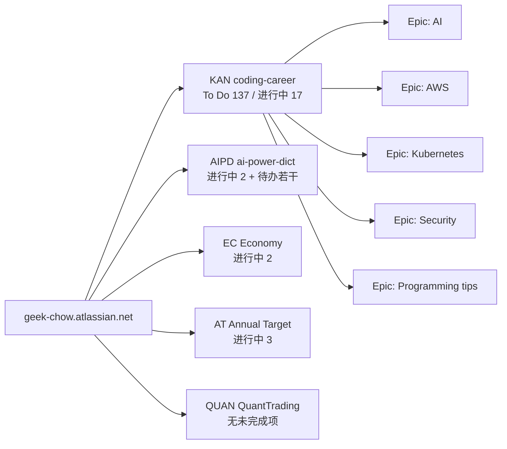

# Jira 待办梳理与 Top 5 建议（2026-09-09）

站点：<https://geek-chow.atlassian.net>　账号：Geek Chow

---

## 缩写对照表

| 缩写 | 英文全称 | 中文 |
|---|---|---|
| JQL | Jira Query Language | Jira 查询语言 |
| RAG | Retrieval-Augmented Generation | 检索增强生成 |
| RSA | Rivest–Shamir–Adleman (public-key cryptosystem) | RSA 公钥密码算法 |
| AWS | Amazon Web Services | 亚马逊云服务 |
| EKS | Elastic Kubernetes Service | AWS 托管 Kubernetes 服务 |
| VPC | Virtual Private Cloud | 虚拟私有云 |
| RBAC | Role-Based Access Control | 基于角色的访问控制 |
| KEDA | Kubernetes Event-Driven Autoscaling | Kubernetes 事件驱动自动伸缩 |
| HPA | Horizontal Pod Autoscaler | 水平 Pod 自动伸缩器 |
| DNS | Domain Name System | 域名系统 |
| SSL | Secure Sockets Layer | 安全套接层（证书/加密） |
| IAM | Identity and Access Management | 身份与访问管理 |
| uv | （Astral 出品的 Python 包/环境管理器，非缩写） | Python 包管理器 |
| pnpm | performant npm | 高性能 npm（Node.js 包管理器） |

---

## 一、项目全景

| Key | 项目名 | 类型 | 说明 |
|---|---|---|---|
| `KAN` | coding-career | software | **主力项目**，技术学习/知识沉淀主战场 |
| `AIPD` | ai-power-dict | software | 会意典 App 的产品缺陷与功能项 |
| `EC` | Economy | business | 投资/经济主题 |
| `AT` | Annual Target | software | 年度目标（含羽毛球等非技术项） |
| `QUAN` | QuantTrading | software | 量化交易（当前无未完成项） |

### 状态分布（未解决的工作项）

- **To Do：146 项**，其中 `KAN` 占 **137 项**（94%）
- **In Progress：23 项**（`KAN` 17、`AT` 3、`AIPD` 2、`EC` 2）

> 关键观察：**146 个待办全部是 Medium 优先级**，Jira 的 priority 字段完全没有区分度；同时有 23 项同时挂在 In Progress，属于典型的「在制品过多」。所以下面的 Top 5 不是按 priority 排出来的，而是按「排期意图 + 与当前实际工作的相关性」判断的。

---

## 二、Top 5 待办清单（推荐执行顺序）

排序依据：创建时间最新（代表最近的关注点）+ 所属 Epic 与当前知识库工作方向的契合度。

| # | Key | 标题 | 所属 Epic | 创建时间 | 推荐理由 |
|---|---|---|---|---|---|
| 1 | [KAN-153](https://geek-chow.atlassian.net/browse/KAN-153) | **uv** | Programming tips | 2026-09-04 | 最新加入的三连之一；Python 工具链现代化，落地成本低、复用率高 |
| 2 | [KAN-154](https://geek-chow.atlassian.net/browse/KAN-154) | **pnpm** | Programming tips | 2026-09-04 | 与 uv 同批；已有 Bun 文章打底，可组成「现代包管理器」小系列 |
| 3 | [KAN-155](https://geek-chow.atlassian.net/browse/KAN-155) | **bun** | Programming tips | 2026-09-04 | **注意：知识库中 Bun 文章（中英双语）已于 2026-09-03 完成**，此项可直接关单或改为「补充 v1.4 新特性」 |
| 4 | [KAN-147](https://geek-chow.atlassian.net/browse/KAN-147) | **RAG LinkedIn course** | AI | 2026-07-01 | 有明确材料（LinkedIn Learning 课程 + GitHub 仓库）；与进行中的 KAN-137 LightRAG 直接互补 |
| 5 | [KAN-146](https://geek-chow.atlassian.net/browse/KAN-146) | **StepFunction - StateMachine** | AWS | 2026-06-29 | 知识库已有 `cloud/aws/step-functions/` 目录，可直接补齐状态机部分 |

### 明细

**1. KAN-153 — uv**
- Epic：Programming tips（`KAN-8`）｜负责人：Geek Chow｜无描述、无截止日期
- 建议产出：`languages/python/uv.md`，对标已有的 Bun 文章结构

**2. KAN-154 — pnpm**
- Epic：Programming tips（`KAN-8`）｜无描述
- 建议产出：`languages/javascript/pnpm.md`，与 Bun 文章交叉引用

**3. KAN-155 — bun**
- Epic：Programming tips（`KAN-8`）｜无描述
- **状态存疑**：本知识库已有 Bun v1.4 中英双语文档（2026-09-03 提交并推送）。要么关单，要么把范围缩小为「Bun 与 pnpm/npm 的实测对比」

**4. KAN-147 — RAG LinkedIn course**
- Epic：AI（`KAN-1`）｜已附材料：
  - <https://github.com/LinkedInLearning/rag-models-from-scratch-with-open-source-3980304>
  - LinkedIn Learning：Local AI - Build a RAG Model from Scratch with Open Source Tools
- 关联：`KAN-137 LightRAG`（进行中）、`KAN-130 RAG Sample`、`KAN-129 RAG Definition`（均待办）
- 建议：把 129/130/137/147 合并成一个 RAG 系列一次性推进

**5. KAN-146 — StepFunction - StateMachine**
- Epic：AWS（`KAN-34`）｜已附材料：<https://medium.com/@leocherian/aws-step-function-state-machines-c7ab2e598aff>
- 建议产出：补入 `cloud/aws/step-functions/`

---

## 三、备选（第 6–8 位）

| Key | 标题 | Epic | 创建时间 |
|---|---|---|---|
| [KAN-145](https://geek-chow.atlassian.net/browse/KAN-145) | RSA Sign and Verification | Security | 2026-06-16 |
| [KAN-143](https://geek-chow.atlassian.net/browse/KAN-143) | Skills（Claude Skills 组织方式调研） | AI | 2026-05-25 |
| [KAN-142](https://geek-chow.atlassian.net/browse/KAN-142) | Load balancer（目标组属性） | AWS | 2026-04-08 |

`AIPD` 项目另有两个明确的产品缺陷，若以产品为先应优先于上述学习类条目：

- [AIPD-9](https://geek-chow.atlassian.net/browse/AIPD-9) — 单词本搜索失效（2026-03-30）
- [AIPD-8](https://geek-chow.atlassian.net/browse/AIPD-8) — 同账号跨设备单词本不同步（2026-03-26）

---

## 四、结论与改进建议

1. **Top 5 = KAN-153 / KAN-154 / KAN-155 / KAN-147 / KAN-146**，前三项可作为一个「现代包管理器」批次一次做完。
2. **KAN-155（bun）大概率已完成**，建议先核对再决定关单，避免重复劳动。
3. **优先级字段形同虚设**：146 个待办清一色 Medium。建议至少把「产品缺陷（AIPD）」提到 High，把两年前的存量学习条目降到 Low，这样 `ORDER BY priority` 才有意义。
4. **在制品（In Progress）23 项过多**，且最老的 `KAN-7`（Latest AI tooling catchup）自 2024-03 起就没动过。建议做一次清理：要么关单，要么退回 To Do。
5. **RAG 相关条目分散在 4 个工作项中**（KAN-129 / 130 / 137 / 147），建议合并为一个 Epic 下的连续系列推进。

---

*数据采集时间：2026-09-09，通过 Atlassian Jira 的 JQL（Jira Query Language，Jira 查询语言）接口查询 `statusCategory = "To Do" AND resolution = Unresolved`。*
