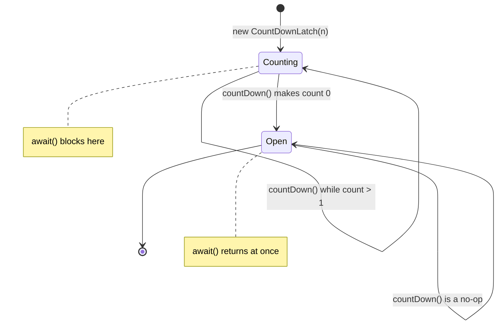
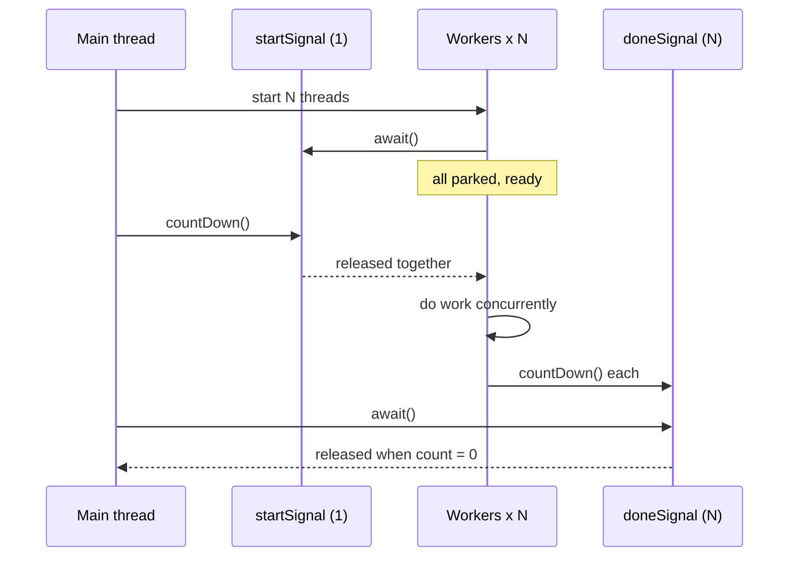

# CountDownLatch in Java

> Source: Jira KAN-159 and KAN-160, both titled "CountDownLatch in Java" (duplicates, handled as one article).
> KAN-159 points to Baeldung's
> [Guide to CountDownLatch in Java](https://www.baeldung.com/java-countdown-latch#usage-in-concurrent-programming).

## Abbreviations

| Abbreviation | Full name |
| --- | --- |
| JUC | `java.util.concurrent` package |
| AQS | `AbstractQueuedSynchronizer` |
| JDK | Java Development Kit |
| CAS | Compare-And-Swap |
| API | Application Programming Interface |

## What it is

`java.util.concurrent.CountDownLatch` (in JUC since JDK 5) is a synchronizer that lets one or more threads wait
until a set of operations performed by other threads has completed. Think of it as a counter that only goes down:

| Method | Behaviour |
| --- | --- |
| `new CountDownLatch(int count)` | Starts at `count`; a negative value throws `IllegalArgumentException` |
| `void countDown()` | Decrements the count; when it reaches 0, releases every waiting thread. No-op at 0 |
| `void await()` | Blocks until the count is 0 (or the thread is interrupted) |
| `boolean await(long timeout, TimeUnit unit)` | As above, but returns `false` if the timeout elapses first |
| `long getCount()` | Current count, for diagnostics |

Two properties shape how it is used:

- **It is one-shot.** Once the count hits zero it cannot be reset; later `await()` calls return immediately.
  Need a reusable barrier? Use `CyclicBarrier` or `Semaphore`.
- **Anyone can count down.** There is no ownership (unlike a lock), so the thread that calls `countDown()` does
  not have to be the one that will be waited on.

Internally it is a thin wrapper over AQS (`AbstractQueuedSynchronizer`) in *shared* mode: the AQS state is the
count, `countDown()` decrements it with CAS (Compare-And-Swap), and reaching zero releases all queued waiters at
once.



## Pattern 1 — wait for N tasks to finish

The main thread creates a latch with the number of tasks, each worker counts down when it finishes, and the
main thread awaits.

```java
public class Worker implements Runnable {
    private final List<String> output;
    private final CountDownLatch done;

    Worker(List<String> output, CountDownLatch done) {
        this.output = output;
        this.done = done;
    }

    @Override
    public void run() {
        try {
            doSomeWork();
            output.add("Counted down");
        } finally {
            done.countDown();   // always, even if the work throws
        }
    }
}
```

```java
@Test
void whenParallelProcessing_thenMainThreadWillBlockUntilCompletion() throws InterruptedException {
    List<String> output = Collections.synchronizedList(new ArrayList<>());
    CountDownLatch done = new CountDownLatch(5);

    List<Thread> workers = Stream.generate(() -> new Thread(new Worker(output, done)))
            .limit(5)
            .toList();
    workers.forEach(Thread::start);

    done.await();                       // main thread blocks here
    output.add("Latch released");

    assertThat(output).containsExactly(
            "Counted down", "Counted down", "Counted down", "Counted down", "Counted down",
            "Latch released");
}
```

## Pattern 2 — start N threads at the same moment

Flip the roles: a latch of **1** acts as a starting gun. Every worker awaits it, and the main thread releases them
all at once. Combine it with a second latch to also wait for completion.



```java
CountDownLatch startSignal = new CountDownLatch(1);
CountDownLatch doneSignal  = new CountDownLatch(N);

for (int i = 0; i < N; i++) {
    new Thread(() -> {
        try {
            startSignal.await();      // wait for the gun
            hitTheService();
        } catch (InterruptedException e) {
            Thread.currentThread().interrupt();
        } finally {
            doneSignal.countDown();
        }
    }).start();
}

startSignal.countDown();              // everyone goes now
doneSignal.await();
```

This is the classic way to provoke race conditions in a test: without the start gun, threads start one by one and
rarely overlap.

## Pattern 3 — do not wait forever

If a worker dies before counting down, a plain `await()` blocks forever. Production code should use the timed
variant and decide what a timeout means.

```java
boolean completed = done.await(3, TimeUnit.SECONDS);
if (!completed) {
    throw new IllegalStateException("Timed out; " + done.getCount() + " task(s) still running");
}
```

## A realistic use: parallel warm-up during Spring Boot startup

An `ApplicationRunner` runs after Tomcat has started but before the application reports ready (see
[Spring Boot Startup Lifecycle](./springboot/2026-09-17-springboot-startup-lifecycle.md)). Warming caches there in
parallel, and failing startup if they don't finish in time, keeps a half-warm pod out of the load balancer.

```java
@Component
public class CacheWarmUpRunner implements ApplicationRunner {

    private final List<CacheLoader> loaders;

    public CacheWarmUpRunner(List<CacheLoader> loaders) {
        this.loaders = loaders;
    }

    @Override
    public void run(ApplicationArguments args) throws InterruptedException {
        CountDownLatch latch = new CountDownLatch(loaders.size());
        try (ExecutorService pool = Executors.newVirtualThreadPerTaskExecutor()) {   // Java 21+
            for (CacheLoader loader : loaders) {
                pool.submit(() -> {
                    try {
                        loader.load();
                    } finally {
                        latch.countDown();
                    }
                });
            }
            if (!latch.await(30, TimeUnit.SECONDS)) {
                pool.shutdownNow();   // interrupt stragglers, otherwise close() would wait for them
                throw new IllegalStateException("Cache warm-up timed out, remaining=" + latch.getCount());
            }
        }
    }
}
```

`ExecutorService.close()` (Java 19+) waits for submitted tasks to finish, so the timeout path must interrupt them
first — and the loaders must respond to interruption for the timeout to be real.

Note that the latch only reports *completion*, not *success*: a loader that throws still counts down. If failures
matter, collect them (e.g. in a `ConcurrentLinkedQueue`) or use `Future`s — see the comparison below.

## Pitfalls

| Pitfall | Consequence | Fix |
| --- | --- | --- |
| `countDown()` not in `finally` | An exception leaves the count above 0; `await()` hangs | Always count down in `finally` |
| Untimed `await()` in production | A lost worker hangs the caller forever | `await(timeout, unit)` and handle `false` |
| Count does not match the number of tasks | Too high: hang. Too low: caller proceeds early | Derive the count from the task list |
| Swallowing `InterruptedException` | Cancellation is lost | Restore with `Thread.currentThread().interrupt()` or propagate |
| Treating completion as success | Failed tasks look done | Collect errors or use `Future`/`CompletableFuture` |
| Trying to reuse the latch | Second round never blocks | Create a new latch, or use `CyclicBarrier` |
| `Thread.sleep` in tests instead of a latch | Slow and flaky tests | Count down from the async callback and `await` with a timeout |

## Choosing a tool

| Tool | Semantics | Reusable | Carries results/errors |
| --- | --- | --- | --- |
| `CountDownLatch` | Wait until count reaches 0 | No | No |
| `CyclicBarrier` | N parties wait for each other, then all proceed | Yes (resets) | No |
| `Semaphore` | At most N concurrent permits | Yes | No |
| `Phaser` | Like a barrier with dynamic party registration and phases | Yes | No |
| `ExecutorService.invokeAll` | Submit and wait for a batch of `Callable`s | n/a | Yes (`Future`) |
| `CompletableFuture.allOf` | Compose async results | n/a | Yes |

Rule of thumb: use `CountDownLatch` when you need a simple "wait for these N events" signal that crosses thread
boundaries you do not control (callbacks, listeners, test hooks). When you own the tasks, `invokeAll` or
`CompletableFuture.allOf` also give you their results and exceptions.

Related notes:

- The same permit concept in Python: [threading.Semaphore](../python/python-threading-semaphore.md).
- For reactive code, compose publishers (`Flux.merge(...).then()`) instead of blocking:
  [Mono vs Flux](./mono-flux/mono-vs-flux.md).

## Conclusion

`CountDownLatch` is the smallest useful coordination primitive in JUC: a one-shot, ownerless countdown that
releases all waiters at zero. Two patterns cover almost every use — *wait for N to finish* and *start N at once* —
and three habits make it safe: count down in `finally`, await with a timeout, and never mistake completion for
success.

## References

- Jira KAN-159, KAN-160 (geek-chow.atlassian.net)
- [Baeldung — Guide to CountDownLatch in Java](https://www.baeldung.com/java-countdown-latch)
- [Javadoc — `CountDownLatch` (Java 21)](https://docs.oracle.com/en/java/javase/21/docs/api/java.base/java/util/concurrent/CountDownLatch.html)
- Brian Goetz et al., *Java Concurrency in Practice*, §5.5 Synchronizers
