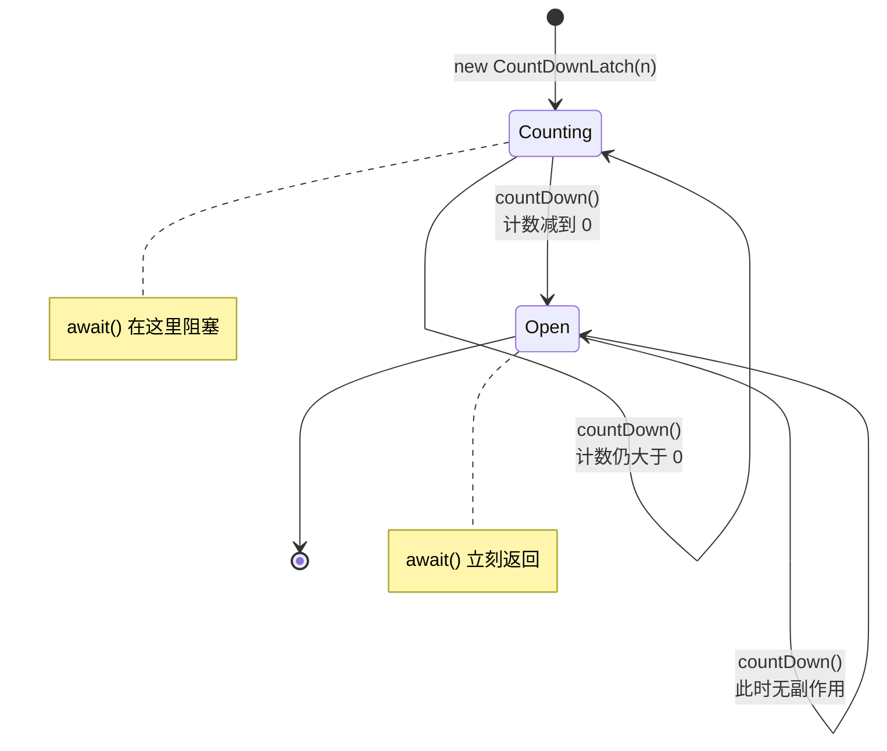
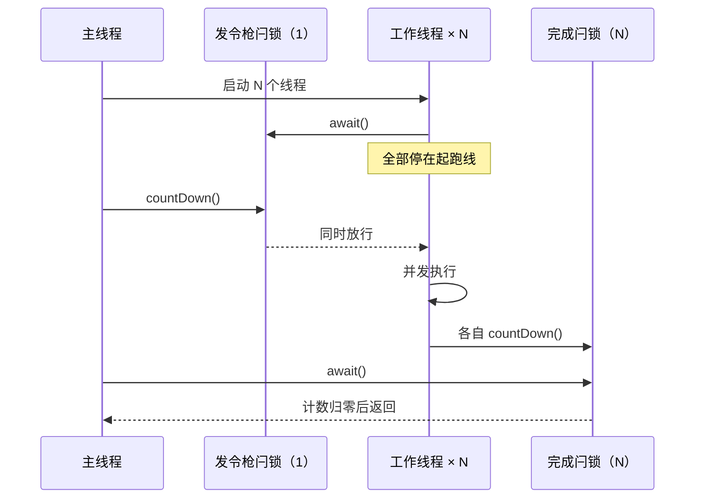

# CountDownLatch：Java 里最小的那个协调原语

## 缩写对照表

| 缩写 | 英文全称 | 中文 |
|---|---|---|
| JUC | `java.util.concurrent` package | Java 并发工具包 |
| AQS | `AbstractQueuedSynchronizer` | 抽象队列同步器 |
| JDK | Java Development Kit | Java 开发工具包 |
| CAS | Compare-And-Swap | 比较并交换 |
| API | Application Programming Interface | 应用程序编程接口 |

## 一、它是什么

`java.util.concurrent.CountDownLatch`（JDK 5 起进入 JUC）解决一件很具体的事：**让一个或多个线程等到另一批线程干完活再继续**。

把它想成一个**只减不增的计数器**：

| 方法 | 行为 |
|---|---|
| `new CountDownLatch(int count)` | 初始计数；传负数抛 `IllegalArgumentException` |
| `void countDown()` | 计数减一；减到 0 时**一次性**释放所有等待线程。已经是 0 时调用无副作用 |
| `void await()` | 阻塞直到计数归零（或线程被中断） |
| `boolean await(long timeout, TimeUnit unit)` | 同上，但超时未归零返回 `false` |
| `long getCount()` | 当前计数，用于排查问题 |

两个性质决定了它的全部用法：

- **一次性，不可重置。** 计数归零之后就永久打开了，后续的 `await()` 立刻返回。需要可重复使用的栅栏，请用 `CyclicBarrier` 或 `Semaphore`。
- **没有归属权。** 不像锁那样"谁加锁谁解锁"，**任何线程都可以调 `countDown()`**——这正是它能跨越回调、监听器这些你控制不了的线程边界的原因。

内部实现是 AQS（`AbstractQueuedSynchronizer`，抽象队列同步器）**共享模式**的一层薄封装：AQS 的 state 就是那个计数，`countDown()` 用 CAS（Compare-And-Swap，比较并交换）把它减一，减到 0 时把等待队列里的线程全部唤醒。



*这张图回答：闩锁的生命周期只有两个状态，且不可逆。*

## 二、模式一：等 N 个任务干完

最常见的用法。主线程按任务数建闩锁，每个工作线程干完减一，主线程在 `await()` 上等。

```java
public class Worker implements Runnable {
    private final List<String> output;
    private final CountDownLatch done;

    Worker(List<String> output, CountDownLatch done) {
        this.output = output;
        this.done = done;
    }

    @Override
    public void run() {
        try {
            doSomeWork();
            output.add("Counted down");
        } finally {
            done.countDown();   // 放 finally：哪怕业务抛异常也要减
        }
    }
}
```

```java
@Test
void whenParallelProcessing_thenMainThreadWillBlockUntilCompletion() throws InterruptedException {
    List<String> output = Collections.synchronizedList(new ArrayList<>());
    CountDownLatch done = new CountDownLatch(5);

    List<Thread> workers = Stream.generate(() -> new Thread(new Worker(output, done)))
            .limit(5)
            .toList();
    workers.forEach(Thread::start);

    done.await();                       // 主线程阻塞在这里
    output.add("Latch released");

    assertThat(output).containsExactly(
            "Counted down", "Counted down", "Counted down", "Counted down", "Counted down",
            "Latch released");
}
```

`countDown()` 必须写在 `finally` 里——这不是风格问题。业务代码抛异常而计数没减，`await()` 就会**永远等下去**。

## 三、模式二：让 N 个线程同时起跑

把角色反过来：一个**计数为 1** 的闩锁当发令枪。所有工作线程先 `await()` 停在起跑线上，主线程一声令下全部放行。再配一个计数为 N 的闩锁等它们跑完。



*这张图回答：两个闩锁如何一前一后卡住并发窗口的两端。*

```java
CountDownLatch startSignal = new CountDownLatch(1);
CountDownLatch doneSignal  = new CountDownLatch(N);

for (int i = 0; i < N; i++) {
    new Thread(() -> {
        try {
            startSignal.await();      // 等发令枪
            hitTheService();
        } catch (InterruptedException e) {
            Thread.currentThread().interrupt();
        } finally {
            doneSignal.countDown();
        }
    }).start();
}

startSignal.countDown();              // 全部同时出发
doneSignal.await();
```

**这是测试里复现竞态条件的标准手法。** 不用发令枪，线程是一个接一个启动的，真正重叠的时间窗口很窄，并发 bug 往往测不出来。

## 四、模式三：不要无限期等下去

如果某个工作线程在减计数之前就死了，裸的 `await()` 会永远阻塞。生产代码应该用带超时的版本，并且**明确定义超时意味着什么**。

```java
boolean completed = done.await(3, TimeUnit.SECONDS);
if (!completed) {
    throw new IllegalStateException("超时，仍有 " + done.getCount() + " 个任务未完成");
}
```

## 五、一个真实场景：Spring Boot 启动时并行预热

`ApplicationRunner` 在 Tomcat 已经启动、但应用还没对外宣告就绪之前执行（详见 [Spring Boot 启动生命周期](./springboot/springboot-startup-lifecycle.zh.md)）。在这里并行预热缓存，并且**预热不完就让启动失败**，可以避免一个"半热"的 Pod 被挂进负载均衡。

```java
@Component
public class CacheWarmUpRunner implements ApplicationRunner {

    private final List<CacheLoader> loaders;

    public CacheWarmUpRunner(List<CacheLoader> loaders) {
        this.loaders = loaders;
    }

    @Override
    public void run(ApplicationArguments args) throws InterruptedException {
        CountDownLatch latch = new CountDownLatch(loaders.size());
        try (ExecutorService pool = Executors.newVirtualThreadPerTaskExecutor()) {   // Java 21+
            for (CacheLoader loader : loaders) {
                pool.submit(() -> {
                    try {
                        loader.load();
                    } finally {
                        latch.countDown();
                    }
                });
            }
            if (!latch.await(30, TimeUnit.SECONDS)) {
                pool.shutdownNow();   // 打断没跑完的，否则 close() 会一直等它们
                throw new IllegalStateException("缓存预热超时，剩余=" + latch.getCount());
            }
        }
    }
}
```

两个容易被忽略的细节：

- `ExecutorService.close()`（Java 19+）会等待已提交的任务结束，所以**超时分支必须先 `shutdownNow()` 打断它们**，否则你设的 30 秒超时形同虚设。而且 loader 自己要响应中断，超时才是真的。
- **闩锁只报告"完成"，不报告"成功"。** 一个抛了异常的 loader 同样会把计数减掉。如果失败与否很重要，就把异常收集起来（比如放进 `ConcurrentLinkedQueue`），或者改用 `Future`——见下面的选型表。

## 六、七个坑

| 坑 | 后果 | 解法 |
|---|---|---|
| `countDown()` 没放在 `finally` | 异常路径上计数不归零，`await()` 永久挂起 | 一律写在 `finally` |
| 生产代码用无超时的 `await()` | 一个线程丢失就拖死调用方 | 用 `await(timeout, unit)` 并处理 `false` |
| 计数和任务数对不上 | 多了：挂起；少了：调用方提前往下走 | 计数直接从任务集合推导 |
| 吞掉 `InterruptedException` | 取消信号丢失 | `Thread.currentThread().interrupt()` 恢复，或向上抛 |
| 把"完成"当成"成功" | 失败的任务看起来也是完成 | 收集异常，或改用 `Future`/`CompletableFuture` |
| 想复用同一个闩锁 | 第二轮根本不阻塞 | 新建一个，或改用 `CyclicBarrier` |
| 测试里用 `Thread.sleep` 代替闩锁 | 又慢又不稳定 | 在异步回调里 `countDown()`，测试端带超时 `await()` |

## 七、怎么选工具

| 工具 | 语义 | 可复用 | 能带回结果/异常 |
|---|---|---|---|
| `CountDownLatch` | 等计数归零 | 否 | 否 |
| `CyclicBarrier` | N 方互相等待，然后一起走 | 是（自动重置） | 否 |
| `Semaphore` | 最多 N 个并发许可 | 是 | 否 |
| `Phaser` | 可动态增减参与方的多阶段栅栏 | 是 | 否 |
| `ExecutorService.invokeAll` | 提交一批 `Callable` 并等待 | 不适用 | 是（`Future`） |
| `CompletableFuture.allOf` | 组合异步结果 | 不适用 | 是 |

一条经验判断：**当你需要跨越自己控制不了的线程边界**（回调、监听器、测试钩子）去等"这 N 件事发生了"，用 `CountDownLatch`；**当这些任务本来就是你提交的**，`invokeAll` 或 `CompletableFuture.allOf` 更合适——它们还顺带把结果和异常带回来了。

相关笔记：

- Python 里的同一套许可概念：[threading.Semaphore](../python/python-threading-semaphore.md)。
- 响应式代码里不要阻塞，改成组合发布者（`Flux.merge(...).then()`）：[Mono vs Flux](./mono-flux/mono-vs-flux.md)。

## 八、小结

`CountDownLatch` 是 JUC 里最小的有用协调原语：**一次性、无归属、归零即全放**。

两个模式覆盖几乎所有场景——*等 N 个干完*、*让 N 个同时起跑*；三个习惯保证它安全——**`finally` 里减计数、带超时地等、永远不要把完成当成成功**。

## 参考资料

- [Baeldung — Guide to CountDownLatch in Java](https://www.baeldung.com/java-countdown-latch)
- [Javadoc — `CountDownLatch` (Java 21)](https://docs.oracle.com/en/java/javase/21/docs/api/java.base/java/util/concurrent/CountDownLatch.html)
- Brian Goetz 等，《Java Concurrency in Practice》§5.5 Synchronizers
