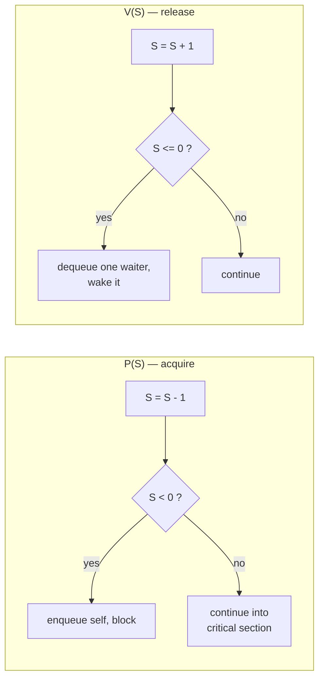
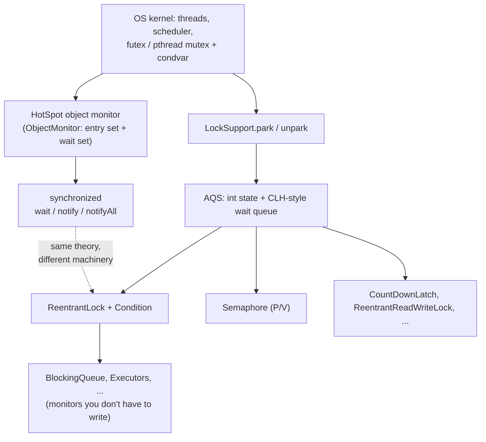
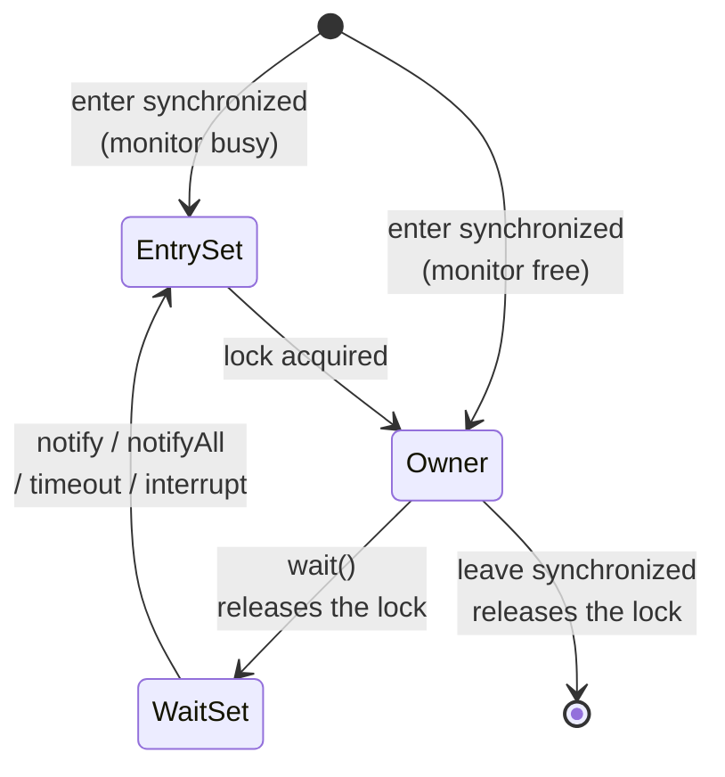
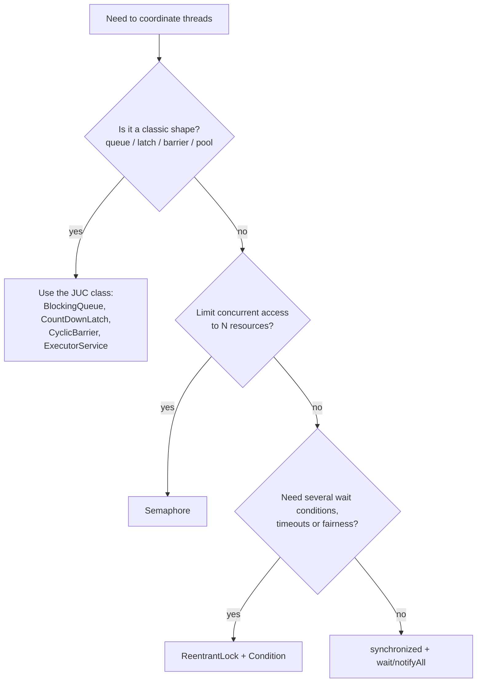

# From PV Operations and Monitors to Modern Java Concurrency

## Abbreviations

| Abbreviation | Full name | Meaning |
|---|---|---|
| OS | Operating System | — |
| P / V | *Proberen* / *Verhogen* (Dutch: "try" / "increase") | Dijkstra's wait / signal on a semaphore |
| JVM | Java Virtual Machine | — |
| JDK | Java Development Kit | — |
| JUC | `java.util.concurrent` | Java's concurrency library |
| AQS | `AbstractQueuedSynchronizer` | The queueing core under most JUC synchronizers |
| CLH | Craig, Landin and Hagersten (queue lock) | The wait-queue design AQS adapts |
| CAS | Compare-And-Swap | Atomic CPU instruction |
| JEP | JDK Enhancement Proposal | — |
| futex | Fast Userspace muTEX | Linux blocking primitive |

## Why this is worth an hour

Every OS textbook has a chapter on **PV operations** and **monitors**. Most Java developers learned them once, passed an exam, and then met `synchronized`, `wait()`, `Semaphore` and `Condition` years later without noticing they were the same ideas wearing different clothes.

They are not merely *similar*. Java's concurrency model is a direct descendant:

- **Every Java object is a monitor.** `synchronized` and `wait/notify` are Hoare's and Brinch Hansen's 1970s monitor, built into the language.
- **`java.util.concurrent.Semaphore` is Dijkstra's 1965 semaphore,** with `acquire()` as P and `release()` as V.
- **`ReentrantLock` + `Condition` is the monitor made explicit,** with multiple named condition variables exactly like the textbook version.

Knowing the theory explains the rules that otherwise look like folklore: *why* `wait()` must sit in a `while` loop, *why* `notifyAll()` is the safe default, *why* acquiring two semaphores in the wrong order deadlocks.

## Part 1 — PV operations (semaphores)

### The definition

Edsger Dijkstra introduced the semaphore in 1965: an integer `S` that can only be touched by two **atomic** operations.

- **P(S)** — "try to pass". Decrement; if no resource is left, block.
- **V(S)** — "release". Increment; if someone is blocked, wake one.

The common textbook form (the *record semaphore*, which keeps a wait queue and lets the value go negative):

```text
P(S):  S.value = S.value - 1
       if S.value < 0:  add this process to S.queue; block()

V(S):  S.value = S.value + 1
       if S.value <= 0: remove a process from S.queue; wakeup(it)
```

When `S.value` is negative, its magnitude is the number of blocked processes. The atomicity of P and V themselves is the OS's job — historically by disabling interrupts on one CPU, today by atomic instructions such as CAS.



*This diagram answers: what exactly do P and V do to the counter and the queue?*

### Three jobs, one primitive

The same primitive does three different jobs depending only on its initial value:

| Initial value | Job | Pattern |
|---|---|---|
| `S = 1` | **Mutual exclusion** (binary semaphore) | `P(mutex); critical section; V(mutex)` |
| `S = 0` | **Ordering / synchronisation** | Thread A does `V(s)` after step 1; thread B does `P(s)` before step 2 |
| `S = N` | **Counting a pool of resources** | N connections, N buffer slots, N permits |

### The classic: bounded producer–consumer

A buffer of `N` slots needs all three jobs at once:

```text
semaphore empty = N   // free slots
semaphore full  = 0   // filled slots
semaphore mutex = 1   // protects the buffer itself

producer:  P(empty); P(mutex); put(item); V(mutex); V(full)
consumer:  P(full);  P(mutex); item = take(); V(mutex); V(empty)
```

### The weakness that motivated monitors

Semaphores are powerful but **unstructured**. The correctness of the program is spread across every P and V call site, and a single swap breaks it:

```text
producer (WRONG):  P(mutex); P(empty); ...
```

If the buffer is full, the producer now holds `mutex` while sleeping on `empty`. The consumer cannot get `mutex` to free a slot. **Deadlock.** Forget one V and a resource leaks forever; add an extra V and the invariant silently breaks. Nothing in the language helps you.

## Part 2 — Monitors

### The definition

C. A. R. Hoare (1974) and Per Brinch Hansen (1973–75) proposed a **language-level** structure instead: the *monitor*.

A monitor bundles:

1. **Shared data**, private to the monitor.
2. **Procedures**, the only way to touch that data.
3. **Implicit mutual exclusion** — at most one thread is active inside the monitor at any time. The compiler inserts the locking; the programmer cannot forget it.
4. **Condition variables** for waiting *inside* the monitor: `wait(c)` releases the monitor and sleeps on `c`; `signal(c)` wakes one sleeper on `c`.

The mutual-exclusion half of the semaphore's job becomes automatic. Only the *ordering* half — "wait until the buffer is not full" — remains explicit, and it is written as a condition rather than as a counter.

### Hoare vs. Mesa semantics — the detail that matters for Java

When thread T1 signals condition `c` and T2 is waiting on it, two threads now want to run inside the monitor. Who goes first?

| | Hoare semantics (signal-and-wait) | Mesa semantics (signal-and-continue) |
|---|---|---|
| After `signal` | T2 runs **immediately**; T1 waits | T1 **keeps running**; T2 moves to the entry queue |
| When T2 resumes | The condition is **guaranteed** true | The condition **may be false again** — someone else may have run first |
| How T2 must wait | `if (!cond) wait(c)` is enough | `while (!cond) wait(c)` is required |
| Used by | Hoare's paper, many textbooks | Mesa (Xerox PARC, 1980), pthreads, **Java** |

Mesa semantics is cheaper to implement (no forced context switch on every signal) and tolerant of spurious wake-ups, which is why practically every real system chose it. Its price is the `while` loop.

## Part 3 — How Java implements both



*This diagram answers: which layer of Java corresponds to which OS concept, and what does each build on?*

### 3.1 Every object is a monitor: `synchronized`, `wait`, `notify`

Java took the monitor idea and attached it to **every object**:

| Monitor concept | Java |
|---|---|
| Implicit mutual exclusion on entry | `synchronized` method or block → `monitorenter` / `monitorexit` bytecodes |
| Entry queue | The monitor's **entry set** (threads blocked trying to enter) |
| `wait(c)` | `obj.wait()` — releases the monitor, joins the **wait set** |
| `signal(c)` | `obj.notify()` — moves one thread from the wait set back towards the entry set |
| `broadcast(c)` | `obj.notifyAll()` |
| Signalling semantics | **Mesa**: the notifier keeps the lock; the woken thread must re-acquire it and re-check |



*This diagram answers: where is a thread, and does it hold the lock, at each step of the wait/notify protocol?*

The same producer–consumer, as a Java monitor:

```java
class MonitorBuffer<T> {
    private final Deque<T> items = new ArrayDeque<>();
    private final int capacity;

    MonitorBuffer(int capacity) { this.capacity = capacity; }

    public synchronized void put(T x) throws InterruptedException {
        while (items.size() == capacity) wait();   // while, never if
        items.addLast(x);
        notifyAll();                               // one wait set, so wake everyone
    }

    public synchronized T take() throws InterruptedException {
        while (items.isEmpty()) wait();
        T x = items.removeFirst();
        notifyAll();
        return x;
    }
}
```

Two rules fall straight out of the theory:

- **`while`, not `if`** — Mesa semantics, plus the Java Language Specification explicitly allows *spurious wake-ups*.
- **`notifyAll`, not `notify`** — a Java built-in monitor has **only one** condition variable. Producers waiting for "not full" and consumers waiting for "not empty" share the same wait set, so `notify()` may wake a thread of the wrong kind, which re-checks, waits again, and the signal is lost.

Where Java departs from the pure monitor: encapsulation is **not enforced**. Fields can be read outside `synchronized`, and any outside code can `synchronized (yourObject)` and interfere. Brinch Hansen himself criticised this in *Java's Insecure Parallelism* (1999). The discipline the compiler would have enforced is now yours: keep the guarded state `private`, and prefer a private lock object over `this` for public classes.

Under the hood, HotSpot keeps lock state in the object header and only "inflates" to a full `ObjectMonitor` (backed by OS blocking) under contention; uncontended locking is a CAS. (Biased locking, the old fast-path for single-thread ownership, was deprecated and disabled by default in JDK 15 via JEP 374.)

### 3.2 The explicit monitor: `ReentrantLock` + `Condition`

`java.util.concurrent.locks` (JDK 5) gives back what the built-in monitor dropped: **multiple named condition variables per lock**, just like Hoare's paper.

```java
class ConditionBuffer<T> {
    private final Deque<T> items = new ArrayDeque<>();
    private final int capacity;
    private final ReentrantLock lock = new ReentrantLock();
    private final Condition notFull  = lock.newCondition();
    private final Condition notEmpty = lock.newCondition();

    ConditionBuffer(int capacity) { this.capacity = capacity; }

    public void put(T x) throws InterruptedException {
        lock.lock();
        try {
            while (items.size() == capacity) notFull.await();
            items.addLast(x);
            notEmpty.signal();           // wake exactly one consumer
        } finally {
            lock.unlock();
        }
    }

    public T take() throws InterruptedException {
        lock.lock();
        try {
            while (items.isEmpty()) notEmpty.await();
            T x = items.removeFirst();
            notFull.signal();            // wake exactly one producer
            return x;
        } finally {
            lock.unlock();
        }
    }
}
```

Because producers and consumers wait on different conditions, `signal()` (one thread) is now safe and avoids the thundering herd of `notifyAll()`. Semantics is still Mesa, so the `while` stays. This is almost exactly how `java.util.concurrent.ArrayBlockingQueue` is written.

What you gain over `synchronized`: timed and interruptible lock acquisition (`tryLock`, `lockInterruptibly`), optional fairness, multiple conditions. What you lose: the compiler no longer releases the lock for you — `unlock()` must be in `finally`. The explicit monitor gives back some of the semaphore's foot-guns in exchange for flexibility.

### 3.3 The semaphore itself: `java.util.concurrent.Semaphore`

| PV | Java |
|---|---|
| `P(S)` | `acquire()` (also `acquire(n)`, `tryAcquire(timeout)`, `acquireUninterruptibly()`) |
| `V(S)` | `release()` (also `release(n)`) |
| Initial value | `new Semaphore(permits)`; `new Semaphore(permits, true)` for FIFO fairness |

The textbook producer–consumer translates line for line:

```java
class SemaphoreBuffer<T> {
    private final Deque<T> items = new ArrayDeque<>();
    private final Semaphore empty;                      // free slots,  starts at N
    private final Semaphore full  = new Semaphore(0);   // filled slots, starts at 0
    private final Semaphore mutex = new Semaphore(1);   // binary semaphore guarding items

    SemaphoreBuffer(int capacity) { empty = new Semaphore(capacity); }

    public void put(T x) throws InterruptedException {
        empty.acquire();                 // P(empty)
        mutex.acquire();                 // P(mutex)
        try { items.addLast(x); }
        finally { mutex.release(); }     // V(mutex)
        full.release();                  // V(full)
    }

    public T take() throws InterruptedException {
        full.acquire();                  // P(full)
        mutex.acquire();                 // P(mutex)
        T x;
        try { x = items.removeFirst(); }
        finally { mutex.release(); }     // V(mutex)
        empty.release();                 // V(empty)
        return x;
    }
}
```

In real code you would not write this — the third job (resource counting) is where `Semaphore` earns its place:

```java
class RateLimitedClient {
    private final Semaphore permits = new Semaphore(3, true);   // at most 3 in flight

    String call(String req) throws InterruptedException {
        permits.acquire();               // P
        try {
            return remoteCall(req);
        } finally {
            permits.release();           // V — in finally, or permits leak
        }
    }
}
```

Two properties are inherited directly from Dijkstra's definition and surprise people:

- **No ownership.** Any thread may `release()`, including one that never acquired. That is what makes the S = 0 "signal another thread" pattern work — and why a binary semaphore is *not* a mutex: a mutex (`ReentrantLock`) checks that the unlocking thread is the owner and supports re-entry; a semaphore does neither.
- **No upper bound.** A stray extra `release()` silently raises the permit count above the initial value.

### 3.4 The common engine: AQS

`Semaphore`, `ReentrantLock`, `CountDownLatch` and `ReentrantReadWriteLock` are all thin wrappers over `AbstractQueuedSynchronizer`, which is essentially **a record semaphore done properly**:

| Record semaphore | AQS |
|---|---|
| `S.value` | `volatile int state` |
| Atomic P/V | CAS on `state` |
| `S.queue` | A CLH-style FIFO queue of waiting threads |
| `block()` / `wakeup()` | `LockSupport.park()` / `unpark()` → OS primitives (futex on Linux) |

Each synchronizer only decides what `state` means: permits (`Semaphore`), hold count (`ReentrantLock`), remaining count (`CountDownLatch` — see [CountDownLatch in Java](./countdownlatch-in-java.en.md)). The queueing, parking and wake-up logic is written once.

### 3.5 Threads all the way down — and virtual threads

A classic HotSpot platform thread is 1:1 with an OS thread, so a blocked `acquire()` or `wait()` really is the OS scheduler parking a kernel thread — the same `block()` from the textbook.

Virtual threads (JDK 21, JEP 444) add a layer: blocking a virtual thread on a JUC lock **unmounts** it from its carrier OS thread instead of blocking the carrier. In JDK 21–23, blocking inside `synchronized` *pinned* the carrier, a well-known reason to prefer `ReentrantLock` in virtual-thread code; JEP 491 (JDK 24) removed that limitation for `synchronized`. The PV/monitor theory is unchanged — only who implements `block()` moved from the kernel to the JVM.

### 3.6 The monitors you don't have to write

The best practical consequence of all this: most application code should not touch any of it directly. JUC packages the classic problems as ready-made monitors:

| OS textbook problem | JUC answer |
|---|---|
| Bounded producer–consumer | `ArrayBlockingQueue`, `LinkedBlockingQueue` |
| Readers–writers | `ReentrantReadWriteLock`, `StampedLock` |
| Limited resource pool | `Semaphore` |
| "Wait for N events" | `CountDownLatch`, `Phaser` |
| Barrier synchronisation | `CyclicBarrier` |
| Thread pool with work queue | `ExecutorService` |

With `ArrayBlockingQueue`, the entire producer–consumer above becomes `queue.put(x)` and `queue.take()`.

## Part 4 — The complete mapping

| OS concept | Java construct | Notes |
|---|---|---|
| Semaphore, P, V | `Semaphore.acquire()` / `release()` | No ownership, no upper bound |
| Binary semaphore as mutex | `synchronized`, `ReentrantLock` | Java locks add ownership and re-entrancy |
| Monitor | Any object with `synchronized` methods | Encapsulation is by convention only |
| Monitor entry queue | Entry set / AQS queue | |
| Condition variable | `wait/notify` (one per object) or `Condition` (many per lock) | |
| Mesa semantics | Both of the above | Always `while (!cond) wait/await` |
| Record semaphore internals | AQS `state` + queue + `park/unpark` | |
| Process blocking/wake-up | `LockSupport.park/unpark` → futex | Virtual threads: JVM unmounts instead |
| Producer–consumer | `BlockingQueue` | |
| Readers–writers | `ReentrantReadWriteLock` | |

## Part 5 — Pitfalls, each traceable to the theory

| Pitfall | Root cause in theory | Fix |
|---|---|---|
| `if (!cond) wait();` | Mesa semantics + spurious wake-ups | `while (!cond) wait();` |
| `notify()` hangs the program | Single condition variable shared by different waiters | `notifyAll()`, or `Condition` per predicate |
| Deadlock in semaphore code | Wrong P order (`P(mutex)` before `P(empty)`) | Acquire the counting semaphore before the mutex; prefer a monitor |
| Permits slowly leak or grow | Unmatched P/V | `release()` in `finally`; never release what you did not acquire |
| `IllegalMonitorStateException` | `wait/notify` outside the monitor | Call them only while holding that object's lock |
| Lock never released | Explicit monitor, no compiler help | `lock(); try { … } finally { unlock(); }` |
| Outsider locks your object | Java does not enforce monitor encapsulation | Use a `private final Object lock` |

## Part 6 — Choosing a tool



*This diagram answers: given a coordination problem, which Java construct should I reach for first?*

## Conclusion

- **PV operations** are a counter plus a wait queue with two atomic operations. Java ships them unchanged as `Semaphore`, and reuses the same structure internally in AQS.
- **Monitors** move mutual exclusion into the language and leave only condition waiting to the programmer. Java made *every object* a monitor (`synchronized` + `wait/notify`) and later added an explicit version with multiple conditions (`ReentrantLock` + `Condition`).
- Java chose **Mesa semantics**, which is the single reason for the `while` loop around every wait.
- The everyday rules — `while` not `if`, `notifyAll` by default, `release/unlock` in `finally`, acquire counting semaphores before mutexes — are not style tips. Each one is a theorem from a 1970s OS course.
- In practice, reach for the packaged monitors in `java.util.concurrent` first; understand the theory so you know what they are doing and when a hand-rolled one is justified.

## References

- E. W. Dijkstra, *Cooperating Sequential Processes* (EWD 123), 1965.
- C. A. R. Hoare, "Monitors: An Operating System Structuring Concept", *Communications of the ACM*, 1974.
- P. Brinch Hansen, *Operating System Principles*, 1973; "Java's Insecure Parallelism", *ACM SIGPLAN Notices*, 1999.
- B. Lampson, D. Redell, "Experience with Processes and Monitors in Mesa", *Communications of the ACM*, 1980.
- The Java Language Specification, §17.1 (Synchronization) and §17.2 (Wait Sets and Notification).
- Doug Lea, "The java.util.concurrent Synchronizer Framework", 2004.
- JEP 374 (Deprecate and Disable Biased Locking), JEP 444 (Virtual Threads), JEP 491 (Synchronize Virtual Threads without Pinning).
- Sibling article: [CountDownLatch in Java](./countdownlatch-in-java.en.md).
