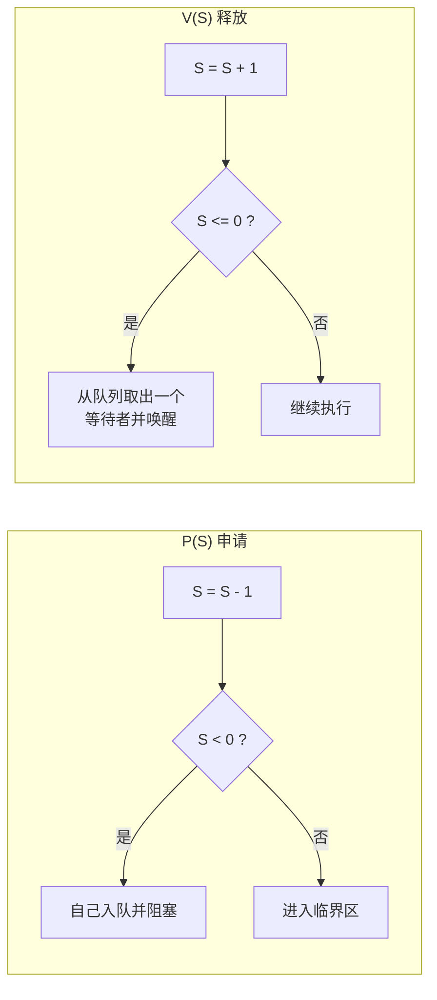
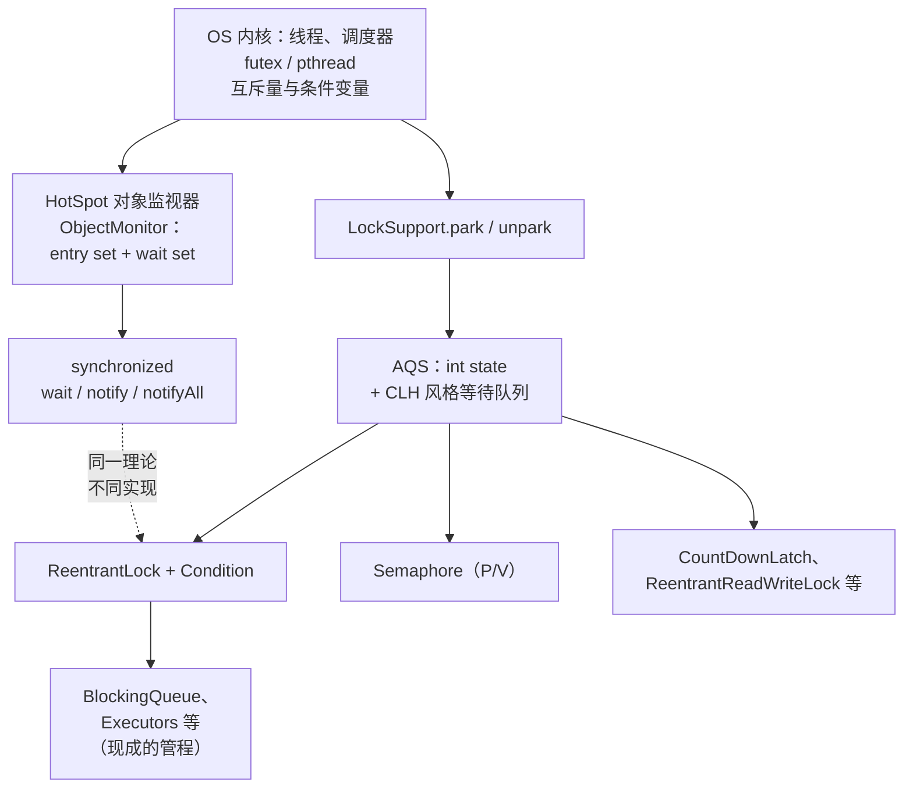
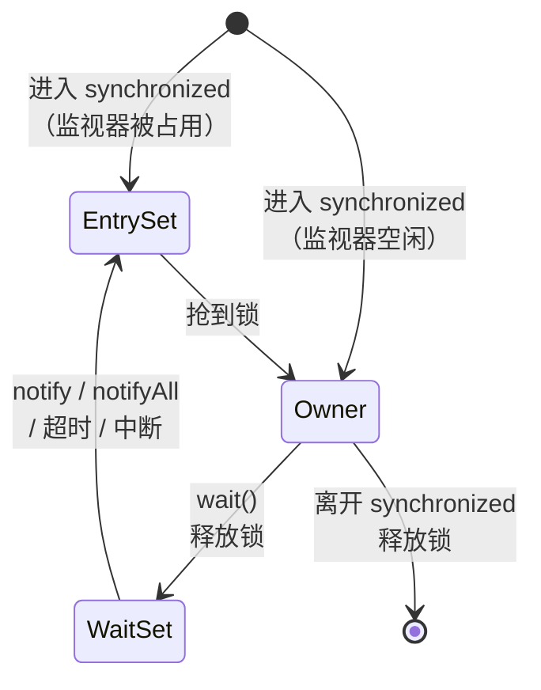
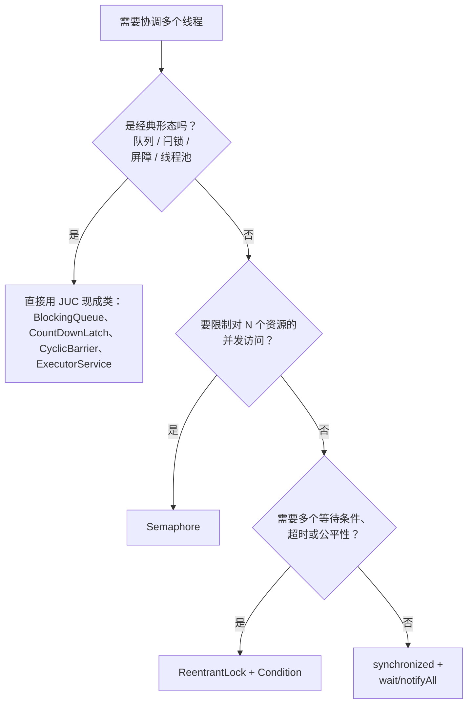

# 从 PV 操作、管程到现代 Java 并发

## 缩写对照表

| 缩写 | 英文全称 | 中文 |
|---|---|---|
| OS | Operating System | 操作系统 |
| P / V | *Proberen* / *Verhogen*（荷兰语："尝试" / "增加"） | 信号量的等待 / 释放操作 |
| JVM | Java Virtual Machine | Java 虚拟机 |
| JDK | Java Development Kit | Java 开发工具包 |
| JUC | `java.util.concurrent` | Java 并发工具包 |
| AQS | `AbstractQueuedSynchronizer` | 抽象队列同步器 |
| CLH | Craig, Landin and Hagersten（queue lock） | CLH 队列锁 |
| CAS | Compare-And-Swap | 比较并交换 |
| JEP | JDK Enhancement Proposal | JDK 增强提案 |
| JLS | Java Language Specification | Java 语言规范 |
| futex | Fast Userspace muTEX | Linux 快速用户态互斥量 |

## 为什么值得花一小时重温

每本 OS（Operating System，操作系统）教材都有一章讲 **PV 操作**和**管程（Monitor）**。大多数 Java 开发者当年为了考试背过一遍，几年后在代码里遇到 `synchronized`、`wait()`、`Semaphore`、`Condition`，却没意识到这是同一批思想换了身衣服。

它们不只是"像"，而是一脉相承：

- **每个 Java 对象都是一个管程。** `synchronized` + `wait/notify` 就是 Hoare 和 Brinch Hansen 在 1970 年代提出的管程，被直接做进了语言。
- **`java.util.concurrent.Semaphore` 就是 Dijkstra 1965 年的信号量**：`acquire()` 是 P，`release()` 是 V。
- **`ReentrantLock` + `Condition` 是"显式管程"**，一把锁配多个具名条件变量，和教科书里的写法几乎一一对应。

懂了原理，那些看似"江湖规矩"的写法就都有了出处：为什么 `wait()` 必须放在 `while` 里？为什么默认用 `notifyAll()`？为什么两个信号量的 P 顺序写反了会死锁？

## 第一部分：PV 操作（信号量）

### 定义

1965 年 Edsger Dijkstra 提出信号量：一个整数 `S`，只能通过两个**原子**操作访问。

- **P(S)**（荷兰语 *Proberen*，"尝试"）—— 申请资源。减一；没有资源了就阻塞。
- **V(S)**（荷兰语 *Verhogen*，"增加"）—— 释放资源。加一；有人在等就唤醒一个。

国内教材常用的是**记录型信号量**，带一个等待队列，值允许为负：

```text
P(S):  S.value = S.value - 1
       if S.value < 0:  把当前进程挂到 S.queue；block()

V(S):  S.value = S.value + 1
       if S.value <= 0: 从 S.queue 取出一个进程；wakeup(它)
```

`S.value` 为负时，它的绝对值就是正在阻塞的进程数。P、V 自身的原子性由 OS 保证——早年单核靠关中断，今天靠 CAS（Compare-And-Swap，比较并交换）这类原子指令。



*这张图回答：P 和 V 分别对计数器和等待队列做了什么？*

### 一个原语，三种用途

同一个原语，仅凭初值不同就承担三种完全不同的职责：

| 初值 | 用途 | 写法 |
|---|---|---|
| `S = 1` | **互斥**（二元信号量） | `P(mutex); 临界区; V(mutex)` |
| `S = 0` | **同步 / 先后顺序** | 线程 A 完成第 1 步后 `V(s)`；线程 B 在第 2 步前 `P(s)` |
| `S = N` | **资源计数** | N 个连接、N 个缓冲槽、N 个许可 |

### 经典问题：有界缓冲区的生产者—消费者

`N` 个槽位的缓冲区，三种用途一次全用上：

```text
semaphore empty = N   // 空槽数
semaphore full  = 0   // 满槽数
semaphore mutex = 1   // 保护缓冲区本身

生产者:  P(empty); P(mutex); put(item); V(mutex); V(full)
消费者:  P(full);  P(mutex); item = take(); V(mutex); V(empty)
```

### 信号量的软肋——也是管程诞生的原因

信号量能力很强，但**缺乏结构**。程序的正确性散落在每一处 P、V 调用上，换一下顺序就出事：

```text
生产者（错误写法）:  P(mutex); P(empty); ...
```

缓冲区满时，生产者拿着 `mutex` 睡在 `empty` 上；消费者拿不到 `mutex`，没法腾出空位。**死锁。** 少写一个 V，资源永久泄漏；多写一个 V，不变式悄悄被破坏。语言本身帮不上任何忙。

## 第二部分：管程

### 定义

C. A. R. Hoare（1974）和 Per Brinch Hansen（1973–75）提出了一种**语言层面**的结构——管程。一个管程包含：

1. **共享数据**，对外私有。
2. **过程（方法）**，访问这些数据的唯一入口。
3. **隐式互斥**——任一时刻最多一个线程在管程内活动。加锁由编译器插入，程序员想忘都忘不了。
4. **条件变量**，用于在管程*内部*等待：`wait(c)` 释放管程并睡在 `c` 上；`signal(c)` 唤醒 `c` 上的一个等待者。

信号量的"互斥"那一半职责变成了自动的；只剩"同步"那一半——"等到缓冲区不满"——需要显式写出，而且写成的是**条件**，不再是计数器。

### Hoare 语义 vs. Mesa 语义——对 Java 至关重要的细节

线程 T1 对条件 `c` 执行 signal，T2 正在 `c` 上等待。此刻两个线程都想在管程内运行，谁先？

| | Hoare 语义（signal-and-wait） | Mesa 语义（signal-and-continue） |
|---|---|---|
| signal 之后 | T2 **立即**运行，T1 让出等待 | T1 **继续运行**，T2 转入入口队列 |
| T2 恢复时 | 条件**保证**成立 | 条件**可能又不成立了**——别的线程可能先进来过 |
| T2 的等待写法 | `if (!cond) wait(c)` 即可 | 必须 `while (!cond) wait(c)` |
| 采用者 | Hoare 原论文、多数教材 | Mesa（Xerox PARC，1980）、pthreads、**Java** |

Mesa 语义实现成本低（不用每次 signal 都强制切换线程），还能容忍虚假唤醒，所以几乎所有真实系统都选了它。代价就是那个 `while` 循环。

## 第三部分：Java 如何实现这两套思想



*这张图回答：Java 的哪一层对应 OS 的哪个概念，各自又建立在什么之上？*

### 3.1 每个对象都是管程：`synchronized`、`wait`、`notify`

Java 把管程挂到了**每一个对象**上：

| 管程概念 | Java |
|---|---|
| 入口处的隐式互斥 | `synchronized` 方法或代码块 → 字节码 `monitorenter` / `monitorexit` |
| 入口队列 | 监视器的 **entry set**（等着进入的线程） |
| `wait(c)` | `obj.wait()`——释放监视器，进入 **wait set** |
| `signal(c)` | `obj.notify()`——把 wait set 里的一个线程移回去竞争锁 |
| `broadcast(c)` | `obj.notifyAll()` |
| 唤醒语义 | **Mesa**：通知者继续持锁；被唤醒者需重新抢锁并重新检查条件 |



*这张图回答：wait/notify 协议的每一步，线程处在哪个集合、是否持有锁？*

同样的生产者—消费者，用 Java 内置管程写：

```java
class MonitorBuffer<T> {
    private final Deque<T> items = new ArrayDeque<>();
    private final int capacity;

    MonitorBuffer(int capacity) { this.capacity = capacity; }

    public synchronized void put(T x) throws InterruptedException {
        while (items.size() == capacity) wait();   // 用 while，绝不用 if
        items.addLast(x);
        notifyAll();                               // 只有一个 wait set，只能全叫醒
    }

    public synchronized T take() throws InterruptedException {
        while (items.isEmpty()) wait();
        T x = items.removeFirst();
        notifyAll();
        return x;
    }
}
```

两条规矩直接从理论推出来：

- **用 `while`，不用 `if`**——Mesa 语义，加上 JLS（Java Language Specification，Java 语言规范）明确允许*虚假唤醒*。
- **用 `notifyAll`，慎用 `notify`**——Java 内置管程**只有一个**条件变量。等"不满"的生产者和等"不空"的消费者挤在同一个 wait set 里，`notify()` 可能叫醒了同类线程，它检查条件不满足又睡回去，这次通知就丢了，程序可能就此挂住。

Java 偏离纯粹管程的地方：**封装不是强制的**。字段可以在 `synchronized` 之外被读写，任何外部代码都可以 `synchronized (yourObject)` 来插一脚。Brinch Hansen 本人在 1999 年的文章 *Java's Insecure Parallelism* 里专门批评过这一点。编译器本该替你守的纪律，现在得自己守：被保护的状态一律 `private`，公共类优先用私有锁对象而不是 `this`。

在 JVM（Java Virtual Machine，Java 虚拟机）底层，HotSpot 把锁状态放在对象头里，只有发生竞争时才"膨胀"为完整的 `ObjectMonitor`（由 OS 阻塞原语支撑）；无竞争时加锁只是一次 CAS。（老的单线程快速路径"偏向锁"已由 JEP 374 在 JDK 15 中废弃并默认关闭。）

### 3.2 显式管程：`ReentrantLock` + `Condition`

JDK 5 引入的 `java.util.concurrent.locks` 把内置管程丢掉的东西补了回来：**一把锁可以有多个具名条件变量**，和 Hoare 论文一模一样。

```java
class ConditionBuffer<T> {
    private final Deque<T> items = new ArrayDeque<>();
    private final int capacity;
    private final ReentrantLock lock = new ReentrantLock();
    private final Condition notFull  = lock.newCondition();
    private final Condition notEmpty = lock.newCondition();

    ConditionBuffer(int capacity) { this.capacity = capacity; }

    public void put(T x) throws InterruptedException {
        lock.lock();
        try {
            while (items.size() == capacity) notFull.await();
            items.addLast(x);
            notEmpty.signal();           // 精确唤醒一个消费者
        } finally {
            lock.unlock();
        }
    }

    public T take() throws InterruptedException {
        lock.lock();
        try {
            while (items.isEmpty()) notEmpty.await();
            T x = items.removeFirst();
            notFull.signal();            // 精确唤醒一个生产者
            return x;
        } finally {
            lock.unlock();
        }
    }
}
```

生产者和消费者等在不同的条件上，于是 `signal()`（只唤醒一个）变得安全，避免了 `notifyAll()` 的"惊群"。语义仍是 Mesa，所以 `while` 保留。`java.util.concurrent.ArrayBlockingQueue` 内部几乎就是这么写的。

相比 `synchronized`，得到的是：可超时、可中断的加锁（`tryLock`、`lockInterruptibly`），可选公平性，多个条件。失去的是：编译器不再替你释放锁——`unlock()` 必须写在 `finally` 里。显式管程用灵活性换回了一部分信号量式的"自伤风险"。

### 3.3 信号量本尊：`java.util.concurrent.Semaphore`

| PV | Java |
|---|---|
| `P(S)` | `acquire()`（以及 `acquire(n)`、`tryAcquire(timeout)`、`acquireUninterruptibly()`） |
| `V(S)` | `release()`（以及 `release(n)`） |
| 初值 | `new Semaphore(permits)`；`new Semaphore(permits, true)` 为 FIFO 公平模式 |

教科书上的生产者—消费者可以逐行翻译：

```java
class SemaphoreBuffer<T> {
    private final Deque<T> items = new ArrayDeque<>();
    private final Semaphore empty;                      // 空槽，初值 N
    private final Semaphore full  = new Semaphore(0);   // 满槽，初值 0
    private final Semaphore mutex = new Semaphore(1);   // 二元信号量，保护 items

    SemaphoreBuffer(int capacity) { empty = new Semaphore(capacity); }

    public void put(T x) throws InterruptedException {
        empty.acquire();                 // P(empty)
        mutex.acquire();                 // P(mutex)
        try { items.addLast(x); }
        finally { mutex.release(); }     // V(mutex)
        full.release();                  // V(full)
    }

    public T take() throws InterruptedException {
        full.acquire();                  // P(full)
        mutex.acquire();                 // P(mutex)
        T x;
        try { x = items.removeFirst(); }
        finally { mutex.release(); }     // V(mutex)
        empty.release();                 // V(empty)
        return x;
    }
}
```

真实项目里没人这么写缓冲区——`Semaphore` 真正的用武之地是第三种用途，资源计数：

```java
class RateLimitedClient {
    private final Semaphore permits = new Semaphore(3, true);   // 最多 3 个并发调用

    String call(String req) throws InterruptedException {
        permits.acquire();               // P
        try {
            return remoteCall(req);
        } finally {
            permits.release();           // V —— 必须在 finally 里，否则许可泄漏
        }
    }
}
```

有两个性质直接继承自 Dijkstra 的定义，常让人意外：

- **没有归属权。** 任何线程都能 `release()`，哪怕它从没 `acquire()` 过。初值为 0 的"线程间通知"正是靠这一点工作的——这也是**二元信号量不等于互斥锁**的原因：互斥锁（`ReentrantLock`）会检查解锁者是不是持有者，并支持重入；信号量两样都不做。
- **没有上限。** 多出来的一次 `release()` 会悄悄让许可数超过初值。

### 3.4 共同的引擎：AQS

`Semaphore`、`ReentrantLock`、`CountDownLatch`、`ReentrantReadWriteLock` 都是 AQS（`AbstractQueuedSynchronizer`，抽象队列同步器）上的一层薄封装。AQS 本质上就是**一个工程化的记录型信号量**：

| 记录型信号量 | AQS |
|---|---|
| `S.value` | `volatile int state` |
| P/V 的原子性 | 对 `state` 做 CAS |
| `S.queue` | CLH（Craig, Landin and Hagersten）风格的 FIFO 等待队列 |
| `block()` / `wakeup()` | `LockSupport.park()` / `unpark()` → OS 原语（Linux 上是 futex） |

每个同步器只需定义 `state` 的含义：许可数（`Semaphore`）、重入次数（`ReentrantLock`）、剩余计数（`CountDownLatch`，见 [CountDownLatch：Java 里最小的那个协调原语](./countdownlatch-in-java.zh.md)）。排队、挂起、唤醒的逻辑只写一次。

### 3.5 一路通到 OS 线程——以及虚拟线程

HotSpot 的平台线程与 OS 线程是 1:1 的，所以 `acquire()` 或 `wait()` 阻塞时，真的是 OS 调度器挂起了一个内核线程——正是教科书里的 `block()`。

虚拟线程（JDK 21，JEP 444）多加了一层：虚拟线程在 JUC 锁上阻塞时，会从承载它的 OS 线程上**卸载（unmount）**，而不是把承载线程一起堵住。在 JDK 21–23 中，在 `synchronized` 里阻塞会把承载线程**钉住（pinning）**，这是当时虚拟线程代码偏好 `ReentrantLock` 的常见理由；JEP 491（JDK 24）为 `synchronized` 去掉了这一限制。PV / 管程的理论没有变，变的只是 `block()` 由谁来实现——从内核挪到了 JVM。

### 3.6 不用自己写的管程

这一切最实际的结论是：大多数业务代码根本不该直接碰这些原语。JUC 已经把经典问题打包成现成的管程：

| OS 教材经典问题 | JUC 现成方案 |
|---|---|
| 有界缓冲区生产者—消费者 | `ArrayBlockingQueue`、`LinkedBlockingQueue` |
| 读者—写者 | `ReentrantReadWriteLock`、`StampedLock` |
| 有限资源池 | `Semaphore` |
| "等 N 个事件发生" | `CountDownLatch`、`Phaser` |
| 屏障同步 | `CyclicBarrier` |
| 带任务队列的线程池 | `ExecutorService` |

用 `ArrayBlockingQueue`，上面整套生产者—消费者就只剩 `queue.put(x)` 和 `queue.take()` 两行。

## 第四部分：完整对照表

| OS 概念 | Java 对应 | 备注 |
|---|---|---|
| 信号量、P、V | `Semaphore.acquire()` / `release()` | 无归属权、无上限 |
| 用作互斥的二元信号量 | `synchronized`、`ReentrantLock` | Java 锁额外提供归属权与可重入 |
| 管程 | 带 `synchronized` 方法的任意对象 | 封装仅靠约定 |
| 管程入口队列 | entry set / AQS 队列 | |
| 条件变量 | `wait/notify`（每对象一个）或 `Condition`（每锁多个） | |
| Mesa 语义 | 以上两者 | 永远写 `while (!cond) wait/await` |
| 记录型信号量的内部结构 | AQS `state` + 队列 + `park/unpark` | |
| 进程阻塞 / 唤醒 | `LockSupport.park/unpark` → futex | 虚拟线程改为由 JVM 卸载 |
| 生产者—消费者 | `BlockingQueue` | |
| 读者—写者 | `ReentrantReadWriteLock` | |

## 第五部分：常见坑，每一个都能追溯到理论

| 坑 | 理论根源 | 解法 |
|---|---|---|
| `if (!cond) wait();` | Mesa 语义 + 虚假唤醒 | `while (!cond) wait();` |
| 用 `notify()` 导致程序挂住 | 不同类等待者共用一个条件变量 | `notifyAll()`，或每个谓词一个 `Condition` |
| 信号量代码死锁 | P 的顺序写反（先 `P(mutex)` 后 `P(empty)`） | 先申请计数信号量再申请互斥量；能用管程就用管程 |
| 许可数慢慢泄漏或膨胀 | P/V 不配对 | `release()` 放进 `finally`；不释放自己没申请的许可 |
| `IllegalMonitorStateException` | 在管程外调用 `wait/notify` | 只在持有该对象锁时调用 |
| 锁永远不释放 | 显式管程没有编译器兜底 | `lock(); try { … } finally { unlock(); }` |
| 外部代码锁住了你的对象 | Java 不强制管程封装 | 使用 `private final Object lock` |

## 第六部分：如何选型



*这张图回答：面对一个线程协调问题，应该先考虑哪个 Java 构件？*

## 结论

- **PV 操作**就是"计数器 + 等待队列 + 两个原子操作"。Java 把它原样交付为 `Semaphore`，并在 AQS 内部复用了同一结构。
- **管程**把互斥交给语言，只把条件等待留给程序员。Java 让*每个对象*都成了管程（`synchronized` + `wait/notify`），后来又补上了支持多条件的显式版本（`ReentrantLock` + `Condition`）。
- Java 选择了 **Mesa 语义**——这就是每个 wait 外面都要套 `while` 的唯一原因。
- 日常那些规矩——用 `while` 不用 `if`、默认 `notifyAll`、`release/unlock` 放 `finally`、先申请计数信号量再申请互斥量——不是编码风格建议，而是 1970 年代 OS 课程里的定理。
- 实践中优先使用 `java.util.concurrent` 里打包好的管程；理解底层理论，是为了知道它们在做什么，以及什么时候才值得自己手写一个。

## 参考资料

- E. W. Dijkstra, *Cooperating Sequential Processes*（EWD 123），1965。
- C. A. R. Hoare, "Monitors: An Operating System Structuring Concept", *Communications of the ACM*, 1974。
- P. Brinch Hansen, *Operating System Principles*, 1973；"Java's Insecure Parallelism", *ACM SIGPLAN Notices*, 1999。
- B. Lampson, D. Redell, "Experience with Processes and Monitors in Mesa", *Communications of the ACM*, 1980。
- The Java Language Specification，§17.1（Synchronization）与 §17.2（Wait Sets and Notification）。
- Doug Lea, "The java.util.concurrent Synchronizer Framework", 2004。
- JEP 374（废弃并禁用偏向锁）、JEP 444（虚拟线程）、JEP 491（虚拟线程同步不再钉住）。
- 姊妹篇：[CountDownLatch：Java 里最小的那个协调原语](./countdownlatch-in-java.zh.md)。
