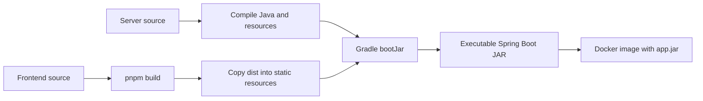
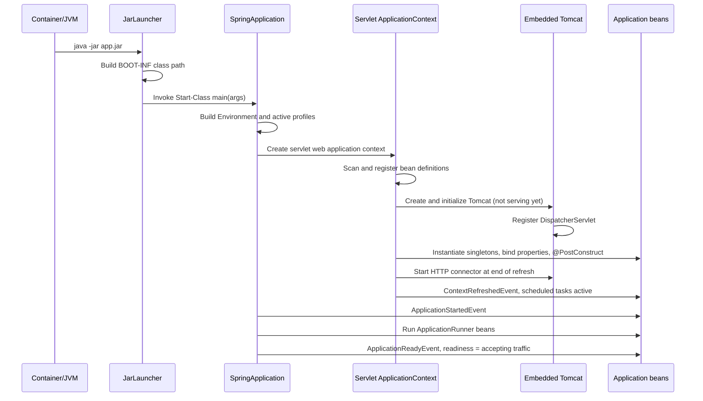
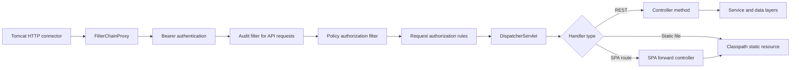
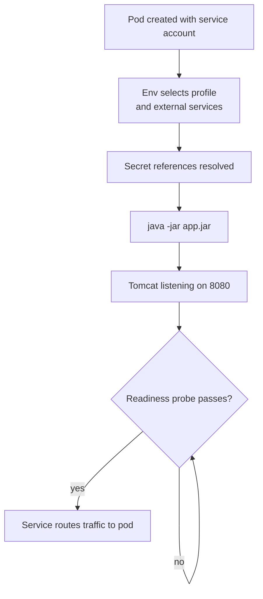
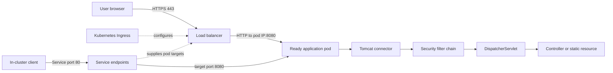

# Spring Boot Startup Lifecycle: Hosting an Application With Embedded Tomcat

## Abbreviations

| Abbreviation | Full name |
| --- | --- |
| JVM | Java Virtual Machine |
| JAR | Java ARchive |
| WAR | Web Application aRchive |
| MVC | Model-View-Controller |
| SPA | Single-Page Application |
| CI/CD | Continuous Integration / Continuous Delivery |
| JWT | JSON Web Token |
| CSRF | Cross-Site Request Forgery |
| TLS | Transport Layer Security |
| ALB | (AWS) Application Load Balancer |
| K8s | Kubernetes |

## Purpose

This article follows a typical Spring Boot web application from the Gradle build, through Spring Boot startup
and embedded Tomcat initialization, to Spring MVC (Model-View-Controller) request dispatch, Docker packaging and
Kubernetes ingress routing.

The central point:

> A Spring Boot web application is usually **not** a WAR (Web Application aRchive) copied into a separately
> installed Tomcat. With `spring-boot-starter-web` it is packaged as an executable JAR (Java ARchive) that contains
> the application, optional web assets, Spring Boot's launcher and the embedded Tomcat libraries.
> `java -jar app.jar` starts the JVM (Java Virtual Machine), Spring Boot and Tomcat **in the same process**.

For the reactive (WebFlux/Netty) stack, which does not use a servlet container, see
[Reactive Programming with Spring](./00Reactive-with-spring.md) and
[Async with WebFlux](../webflux/00-async-with-webflux.md).

## Runtime stack

| Layer | Implementation |
| --- | --- |
| Java | A supported toolchain, e.g. Java 17 |
| Application framework | Spring Boot 3.x |
| Web framework | Spring MVC |
| Servlet container | Embedded Apache Tomcat 10.1.x |
| Servlet API namespace | Jakarta Servlet (Spring Boot 3 / Tomcat 10) |
| Packaging | Executable Spring Boot JAR |
| Container command | `java -jar app.jar` |
| Pod listener | HTTP 8080 |
| Kubernetes Service | `ClusterIP`, port 80 → target port 8080 |
| External entry point | Load balancer / ingress, usually HTTPS 443 |

Tomcat arrives transitively through `spring-boot-starter-web` (and `spring-boot-starter-websocket` adds Tomcat's
WebSocket module). Spring Boot's dependency management keeps the embedded Tomcat modules on a compatible version.
Unless the application defines its own `TomcatServletWebServerFactory`, `ServletWebServerFactory` or
`WebServerFactoryCustomizer`, Spring Boot's auto-configuration owns server creation.

## Build and packaging

### One artifact for frontend and backend

A common Gradle build, when no prebuilt client path is supplied:

1. Fetches the configured frontend source and branch.
2. Installs frontend dependencies and builds the frontend distribution.
3. Copies the frontend `dist` directory into `src/main/resources/static`.
4. Compiles Java classes and processes resources.
5. Runs `bootJar` to produce the executable JAR.

With a client-path option the build instead assumes `<clientPath>/dist` exists and only copies it. A CI/CD
(Continuous Integration / Continuous Delivery) pipeline can build both halves independently and call `bootJar`
with the resolved version. See [CI/CD](../../../devops/cicd/CICD.md) for the wider pipeline picture.



### Executable JAR layout

```text
META-INF/MANIFEST.MF
BOOT-INF/classes/com/example/Application.class
BOOT-INF/classes/static/index.html
BOOT-INF/lib/tomcat-embed-core-10.1.x.jar
BOOT-INF/lib/tomcat-embed-el-10.1.x.jar
BOOT-INF/lib/tomcat-embed-websocket-10.1.x.jar
```

```text
Main-Class: org.springframework.boot.loader.launch.JarLauncher
Start-Class: com.example.Application
Spring-Boot-Classes: BOOT-INF/classes/
Spring-Boot-Lib: BOOT-INF/lib/
Build-Jdk-Spec: 17
```

- `Main-Class` is Spring Boot's launcher; `Start-Class` is the application's own entry point.
- Application classes and resources live under `BOOT-INF/classes`; dependency JARs (Tomcat included) are nested under `BOOT-INF/lib`.
- The JDK's standard class loader cannot load nested JARs, so `JarLauncher` builds a class path over the archive first and then invokes `Start-Class`.

## How the process is started

### Production

The image copies the JAR to `/apps/app.jar`, switches to a non-root user and uses an exec-form entry point:

```dockerfile
ENTRYPOINT ["java", "-jar", "app.jar"]
```

Exec form makes Java PID 1 instead of a shell, so container signals reach the JVM directly. The JVM is the container's main process, so the container lives
exactly as long as it does (see [Why some containers exit immediately](../../../tools/docker/docker-container-exit-immediately.md)).

### Local

```bash
./gradlew bootRun --args="--spring.profiles.active=local --app.skip-auth-for-local=true"
```

`bootRun` does **not** run the packaged JAR. Gradle assembles an expanded class path and calls the same `main`.
Spring-level behaviour is the same; class loading differs:

| Mode | Class loading |
| --- | --- |
| Local `bootRun` | Expanded build classes/resources + Gradle dependency class path |
| Production `java -jar` | `JarLauncher`, `BOOT-INF/classes`, nested `BOOT-INF/lib` JARs |

## Spring Boot startup sequence

The entry class typically carries `@SpringBootApplication`, `@ConfigurationPropertiesScan` and
`@EnableScheduling`, and its `main` calls `SpringApplication.run(Application.class, args)`.



### 1. The launcher starts the application class

`java -jar` reads the manifest, starts `JarLauncher`, which exposes the nested libraries and calls `main`.

### 2. Spring decides this is a servlet web application

Spring MVC and servlet classes on the class path make Spring Boot choose a `ServletWebServerApplicationContext`,
which owns both the bean container and the embedded server lifecycle.

### 3. Environment and configuration are assembled

Sources include `application.yaml`, profile files (`application-prod.yaml`, `application-local.yaml`),
environment variables (e.g. injected by Helm, typically `SPRING_PROFILES_ACTIVE`), command-line arguments and
imported classpath files. `@ConfigurationPropertiesScan` finds typed configuration classes, which are bound before
their dependants are created; a validation failure here aborts startup.

### 4. Component scanning registers bean definitions

`@SpringBootApplication` scans from the root package and registers `@Configuration`, `@Service`/`@Component`,
`@Controller`/`@RestController`, `@RestControllerAdvice`, security chains, filters, data clients and schedulers.
Definitions are registered first; objects are constructed later in the refresh.

### 5. Embedded Tomcat is created — but not yet started

During refresh, web-server auto-configuration creates a `TomcatServletWebServerFactory`, which builds a Tomcat
`Server` and `Service`, an HTTP `Connector`, and a root web context at `/` wired to the Spring context.

Spring then instantiates the remaining singletons, binds configuration and runs `@PostConstruct` callbacks
(key loading, resolver registration, store initialization, …). **Any exception here aborts the refresh and Tomcat
never reaches "started".** Only near the end of refresh does Spring start the connector. That is why the log shows:

```text
Tomcat initialized with port 8080 (http)
Root WebApplicationContext: initialization completed
Tomcat started on port 8080 (http) with context path '/'
Started Application
```

With no `server.port`, the default is 8080.

### 6. Spring MVC registers the dispatcher

`DispatcherServlet` is mapped at `/`. Tomcat passes each request through the servlet filter chain, then the
dispatcher selects a handler. One Tomcat process can serve both `/api/**` and the bundled frontend
(`/index.html`, `/assets/**`); an SPA (Single-Page Application) forwarding controller sends unknown non-API routes
to `/index.html` so deep links work.

### 7. Security filters are installed

A typical setup has two `SecurityFilterChain` beans: a highest-precedence one for authorization-server protocol
endpoints, and a general one with stateless sessions, OAuth2 resource-server JWT (JSON Web Token) processing
(bearer header first, cookie fallback), audit and policy filters, public static/health endpoints, and CSRF
(Cross-Site Request Forgery) exemptions for selected stateless endpoints. Local-only auth shortcuts must be disabled
in deployed profiles.



Static and public requests still pass through `FilterChainProxy`; the rules simply permit them and the custom
filters skip their work.

### 8. Startup runners execute

After refresh (Tomcat already started, `ContextRefreshedEvent` published), Spring Boot publishes
`ApplicationStartedEvent` and runs `ApplicationRunner`/`CommandLineRunner` beans — loading metadata, reconciling an
external catalog, and so on. `ApplicationReadyEvent` has **not** been published yet, so readiness is still
"refusing traffic". A runner exception fails startup and closes the context, Tomcat included.

Runners are a natural place to fan out warm-up work in parallel and wait for all of it; see
[CountDownLatch in Java](../2026-09-17-countdownlatch-in-java.en.md).

### 9. Scheduled jobs become active

`@EnableScheduling` activates `@Scheduled` methods when refresh completes — **before** runners and before
`ApplicationReadyEvent`. A zero-delay scheduled task can therefore run concurrently with runners. Scheduling
threads belong to Spring, not Tomcat.

## Tomcat vs Spring responsibilities

| Concern | Owner |
| --- | --- |
| TCP listener, HTTP protocol | Embedded Tomcat |
| Servlet lifecycle, request/response objects | Embedded Tomcat |
| WebSocket container | Tomcat + Spring WebSocket |
| URL-to-controller mapping | Spring MVC `DispatcherServlet` |
| Authentication and authorization | Spring Security filter chain |
| JSON serialization | Spring MVC + Jackson |
| Business logic | Application services |
| Scheduled work | Spring scheduling |
| Static frontend assets | Spring static resource handling on Tomcat |
| Client-side route fallback | SPA forward controller |

Tomcat never discovers controllers; it hosts the servlet environment and Spring MVC does the rest.

## Production container lifecycle

### Image construction

A pipeline checks out server and client, verifies and builds both, packages the combined JAR, builds the image
from the app Dockerfile, pushes it to a registry, tags it for the target environment and deploys it via a Helm
chart or similar. Use a suitable runtime base image and a non-root user.

### Pod startup



The readiness group can combine Spring's readiness state with checks on required dependencies, so a pod can have
a listening connector yet still be kept out of the Service. The liveness probe starts after a longer delay;
repeated failure restarts the container.

## Production network path



- TLS (Transport Layer Security) often terminates at the load balancer; the backend hop is HTTP.
- The Ingress resource configures the load-balancer controller; it is not necessarily a runtime proxy hop.
- In IP target mode, the load balancer registers ready pod IPs and sends traffic straight to port 8080.
- In-cluster callers use the Service port, which forwards to the container port.
- Blue/green switches the active Service selector without touching the process.

For a concrete AWS EKS deployment with observability wired in, see
[Splunk O11y on EKS Fargate (Java)](../../../devops/observability/splunk-o11y-eks-fargate-java-architecture.md).

## Availability, health and shutdown

Each replica is its own JVM with its own Tomcat; in-memory state is replica-local, so shared coordination needs an
external store. Horizontal scaling can use CPU, memory or custom metrics.

| Probe | Path | Initial delay | Period | Timeout | Failure threshold |
| --- | --- | ---: | ---: | ---: | ---: |
| Readiness | `/actuator/health/readiness` | 20 s | 15 s | 3 s | 3 |
| Liveness | `/actuator/health/liveness` | 300 s | 15 s | 3 s | 3 |

- **Readiness** — should this pod receive traffic?
- **Liveness** — should Kubernetes restart the container?
- **Load-balancer health** (e.g. ALB (Application Load Balancer) on `/actuator/health`) — should the target receive external traffic?

On termination the signal reaches the JVM; context close stops lifecycle beans (Tomcat included) and then runs
destruction callbacks. For graceful draining, set `server.shutdown=graceful`, a `preStop` hook and a suitable
termination grace period. Distributed locks protect shared tasks across replicas, but an interrupted in-process
operation still needs its own retry or recovery.

## Local vs production

| Concern | Local | Production |
| --- | --- | --- |
| Start command | `gradle bootRun` | `java -jar app.jar` |
| Profile | `local` | `prod` |
| Tomcat | Embedded | Embedded |
| HTTP port | 8080 | 8080 inside the pod |
| Authentication | Synthetic identity when skip-auth is on | OAuth2/JWT + policy authorization |
| External services | Emulators / containers | Managed or self-hosted |
| Access | `localhost` | Load balancer, Ingress, Service |
| Frontend | Separate Vite dev server | Bundled into the JAR |

## Common misconceptions

- **"The app is deployed to Tomcat."** No external Tomcat receives a WAR; the JAR starts and owns Tomcat.
- **"Tomcat is a separate container."** It is a set of libraries inside the same Java process.
- **"Port 80 is Tomcat's port."** Tomcat listens on 8080; Service port 80 maps to it.
- **"The frontend needs its own production web server."** Not here — it is served from static resources by the same Tomcat.
- **"Tomcat runs scheduled jobs."** Spring's scheduler does, in the same JVM.

## Diagnostic checklist

When the application does not become available, check in this order:

1. **Process** — is `java -jar app.jar` running?
2. **Spring log** — bean construction, binding or `@PostConstruct` failures (read the deepest `Caused by`).
3. `Tomcat initialized with port 8080`
4. `Root WebApplicationContext: initialization completed`
5. `Tomcat started on port 8080`
6. `Started Application`
7. **Readiness** — query `/actuator/health/readiness` and look for the unhealthy contributor.
8. **Service** — does the selector match the expected pods and revision?
9. **Ingress / load balancer** — routing, target health, network policy, host rules.

If Tomcat started but the app is not ready, suspect dependency health or a runner, not port binding.
If the process exits before "Tomcat started", the answer is in the deepest `Caused by` of the startup log.

## Conclusion

The startup lifecycle has three distinct milestones that are easy to conflate: **Tomcat initialized** (object
built), **Tomcat started** (connector listening, end of refresh) and **application ready** (runners done,
`ApplicationReadyEvent`, readiness probe green). Knowing which component owns each step — launcher, Spring
context, Tomcat, Spring MVC, Kubernetes — turns "the app won't come up" into a short, ordered checklist.

## References

- [Spring Boot — Embedded Web Servers](https://docs.spring.io/spring-boot/reference/web/servlet.html)
- [Spring Boot — The Executable Jar Format](https://docs.spring.io/spring-boot/specification/executable-jar/index.html)
- [Spring Boot — Application Availability](https://docs.spring.io/spring-boot/reference/features/spring-application.html#features.spring-application.application-availability)
- [Kubernetes — Liveness, Readiness and Startup Probes](https://kubernetes.io/docs/tasks/configure-pod-container/configure-liveness-readiness-startup-probes/)
