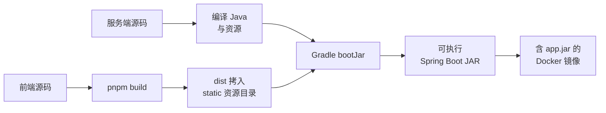
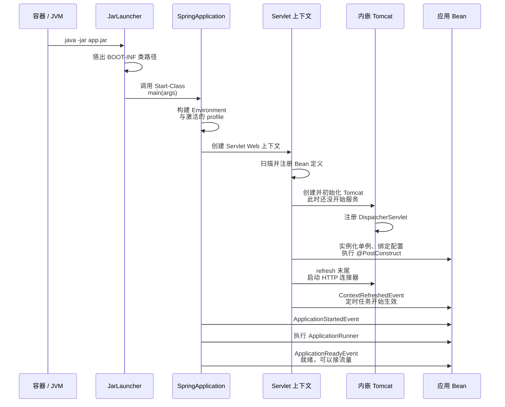
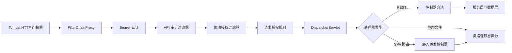
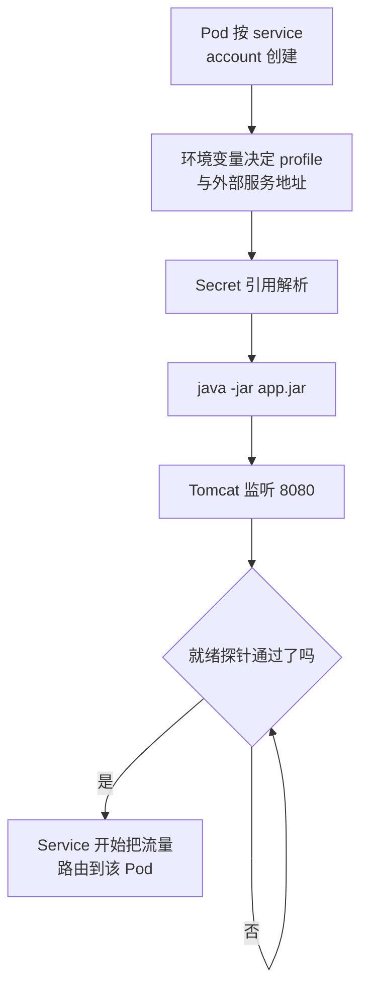
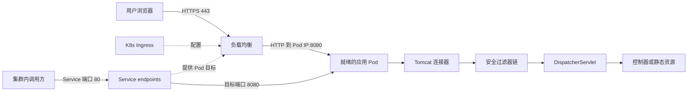

# Spring Boot 启动生命周期：内嵌 Tomcat 到底是怎么跑起来的

## 缩写对照表

| 缩写 | 英文全称 | 中文 |
|---|---|---|
| JVM | Java Virtual Machine | Java 虚拟机 |
| JAR | Java ARchive | Java 归档包 |
| WAR | Web Application aRchive | Web 应用归档包 |
| MVC | Model-View-Controller | 模型-视图-控制器 |
| SPA | Single-Page Application | 单页应用 |
| CI/CD | Continuous Integration / Continuous Delivery | 持续集成 / 持续交付 |
| JWT | JSON Web Token | JSON 网络令牌 |
| CSRF | Cross-Site Request Forgery | 跨站请求伪造 |
| TLS | Transport Layer Security | 传输层安全协议 |
| ALB | (AWS) Application Load Balancer | 应用负载均衡器 |
| K8s | Kubernetes | 容器编排平台 |

## 一、先说结论：三个被混为一谈的里程碑

排查"应用起不来"时，大部分时间浪费在一个误解上——**把三件不同的事当成了一件**：

| 里程碑 | 日志长什么样 | 真实含义 |
|---|---|---|
| **Tomcat 已初始化** | `Tomcat initialized with port 8080` | 对象建好了，**还没在听** |
| **Tomcat 已启动** | `Tomcat started on port 8080` | 连接器在监听了，refresh 接近尾声 |
| **应用已就绪** | `ApplicationReadyEvent` / 就绪探针变绿 | runner 跑完了，**现在才该接流量** |

端口通了 ≠ 可以接流量。这篇文章就是把这三步之间发生的事全部摊开。

另一个必须先纠正的认知：

> Spring Boot Web 应用通常**不是**一个 WAR（Web Application aRchive，Web 应用归档包）丢进独立安装的 Tomcat。用了 `spring-boot-starter-web` 之后，它被打成一个**可执行 JAR**，里面装着应用、前端静态资源、Spring Boot 的启动器，以及**内嵌的 Tomcat 依赖库**。
> `java -jar app.jar` 在**同一个进程**里同时启动 JVM、Spring Boot 和 Tomcat。

响应式（WebFlux/Netty）栈不走 Servlet 容器，另见 [Reactive Programming with Spring](./00Reactive-with-spring.md) 与 [Async with WebFlux](../webflux/00-async-with-webflux.md)。

## 二、运行时栈

| 层 | 实现 |
|---|---|
| Java | 受支持的工具链，例如 Java 17 |
| 应用框架 | Spring Boot 3.x |
| Web 框架 | Spring MVC |
| Servlet 容器 | 内嵌 Apache Tomcat 10.1.x |
| Servlet API 命名空间 | Jakarta Servlet（Spring Boot 3 / Tomcat 10） |
| 打包方式 | 可执行 Spring Boot JAR |
| 容器启动命令 | `java -jar app.jar` |
| Pod 监听端口 | HTTP 8080 |
| K8s Service | `ClusterIP`，80 → 目标端口 8080 |
| 外部入口 | 负载均衡 / Ingress，通常 HTTPS 443 |

Tomcat 是通过 `spring-boot-starter-web` **传递依赖**进来的（`spring-boot-starter-websocket` 再补上 Tomcat 的 WebSocket 模块）。只要应用没有自己定义 `TomcatServletWebServerFactory`、`ServletWebServerFactory` 或 `WebServerFactoryCustomizer`，服务器的创建权就归 Spring Boot 的自动配置。

## 三、构建与打包

### 前后端合成一个产物

典型的 Gradle 构建（未提供预构建前端路径时）：

1. 拉取指定的前端源码与分支；
2. 安装前端依赖并构建产物；
3. 把前端 `dist` 目录拷进 `src/main/resources/static`；
4. 编译 Java 类、处理资源；
5. 执行 `bootJar` 产出可执行 JAR。

如果传入了 client-path，构建就假定 `<clientPath>/dist` 已存在，只做拷贝。CI/CD 流水线可以把两边独立构建，再用解析出的版本号调用 `bootJar`。整体流水线视角见 [CI/CD](../../../devops/cicd/CICD.md)。



*这张图回答：两套源码如何汇成一个可执行产物。*

### 可执行 JAR 的内部结构

```text
META-INF/MANIFEST.MF
BOOT-INF/classes/com/example/Application.class
BOOT-INF/classes/static/index.html
BOOT-INF/lib/tomcat-embed-core-10.1.x.jar
BOOT-INF/lib/tomcat-embed-el-10.1.x.jar
BOOT-INF/lib/tomcat-embed-websocket-10.1.x.jar
```

```text
Main-Class: org.springframework.boot.loader.launch.JarLauncher
Start-Class: com.example.Application
Spring-Boot-Classes: BOOT-INF/classes/
Spring-Boot-Lib: BOOT-INF/lib/
Build-Jdk-Spec: 17
```

- `Main-Class` 是 Spring Boot 的启动器，`Start-Class` 才是应用自己的入口。
- 应用类和资源在 `BOOT-INF/classes`，依赖 JAR（含 Tomcat）嵌在 `BOOT-INF/lib`。
- **JDK 标准类加载器加载不了嵌套 JAR**，所以 `JarLauncher` 必须先在归档之上搭出一条类路径，再去调 `Start-Class`。这就是为什么 `Main-Class` 不直接写你的类。

## 四、进程是怎么被拉起来的

### 生产环境

镜像把 JAR 拷到 `/apps/app.jar`，切到非 root 用户，用 exec 形式的入口：

```dockerfile
ENTRYPOINT ["java", "-jar", "app.jar"]
```

**exec 形式让 Java 成为 PID 1 而不是 shell**，容器信号才能直接送到 JVM。JVM 是容器主进程，容器的寿命就等于它的寿命（参见 [Why some containers exit immediately](../../../tools/docker/docker-container-exit-immediately.md)）。

### 本地

```bash
./gradlew bootRun --args="--spring.profiles.active=local --app.skip-auth-for-local=true"
```

`bootRun` **并不运行打好的 JAR**。Gradle 摊平出一条类路径，调用同一个 `main`。Spring 层面的行为一致，差别只在类加载：

| 模式 | 类加载方式 |
|---|---|
| 本地 `bootRun` | 展开的 build 类/资源 + Gradle 依赖类路径 |
| 生产 `java -jar` | `JarLauncher` + `BOOT-INF/classes` + 嵌套 `BOOT-INF/lib` |

这个差别偶尔会咬人：依赖顺序或资源查找在两种模式下可能不同，"本地好好的，打包就挂"多半出在这里。

## 五、启动时序

入口类通常挂着 `@SpringBootApplication`、`@ConfigurationPropertiesScan` 和 `@EnableScheduling`，`main` 里调用 `SpringApplication.run(Application.class, args)`。



*这张图回答：从敲下 `java -jar` 到"可以接流量"，谁在什么时候做了什么。*

### 1. 启动器拉起应用类

`java -jar` 读 manifest，启动 `JarLauncher`，由它暴露嵌套依赖并调用 `main`。

### 2. Spring 判定这是一个 Servlet Web 应用

类路径上有 Spring MVC 和 Servlet 类，于是 Spring Boot 选择 `ServletWebServerApplicationContext`——**它同时掌管 Bean 容器和内嵌服务器的生命周期**。

### 3. 组装 Environment 与配置

来源包括 `application.yaml`、profile 文件（`application-prod.yaml`、`application-local.yaml`）、环境变量（例如 Helm 注入的 `SPRING_PROFILES_ACTIVE`）、命令行参数、导入的类路径文件。`@ConfigurationPropertiesScan` 找到强类型配置类，**它们会先于依赖方被绑定**；这里校验失败会直接中止启动。

### 4. 组件扫描注册 Bean 定义

`@SpringBootApplication` 从根包开始扫，注册 `@Configuration`、`@Service`/`@Component`、`@Controller`/`@RestController`、`@RestControllerAdvice`、安全链、过滤器、数据客户端、调度器。**注意：这一步只登记定义，真正的对象要到 refresh 后段才构造。**

### 5. 内嵌 Tomcat 被创建——但还没启动

refresh 过程中，Web 服务器自动配置创建 `TomcatServletWebServerFactory`，进而建出 Tomcat 的 `Server`、`Service`、HTTP `Connector`，以及挂在 `/` 上、连着 Spring 上下文的根 Web 上下文。

随后 Spring 实例化剩余单例、绑定配置、执行 `@PostConstruct`（加载密钥、注册解析器、初始化存储……）。**这里任何一个异常都会中止 refresh，Tomcat 永远走不到"started"。** 只有在 refresh 快结束时，Spring 才会启动连接器。所以日志一定是这个顺序：

```text
Tomcat initialized with port 8080 (http)
Root WebApplicationContext: initialization completed
Tomcat started on port 8080 (http) with context path '/'
Started Application
```

没配 `server.port` 时默认就是 8080。

### 6. Spring MVC 注册分发器

`DispatcherServlet` 映射在 `/`。Tomcat 把请求先过 Servlet 过滤器链，再由分发器挑处理器。**一个 Tomcat 进程同时服务 `/api/**` 和打包进来的前端**（`/index.html`、`/assets/**`）；SPA（Single-Page Application，单页应用）转发控制器把未知的非 API 路由转到 `/index.html`，深链才不会 404。

### 7. 装上安全过滤器

典型配置是两条 `SecurityFilterChain`：一条最高优先级处理授权服务器协议端点，一条通用链负责无状态会话、OAuth2 资源服务器的 JWT（JSON Web Token）处理（先看 bearer 头，回落到 cookie）、审计与策略过滤、放行静态与健康端点，以及对若干无状态端点的 CSRF（Cross-Site Request Forgery，跨站请求伪造）豁免。**本地用的免认证开关必须在部署 profile 里关掉。**



*这张图回答：一个请求从连接器到控制器要穿过哪些关卡。*

静态和公开请求**同样要过 `FilterChainProxy`**——只是规则放行、自定义过滤器跳过自己的活。这点常被误解成"静态资源不走安全链"。

### 8. 启动 runner 执行

refresh 完成后（Tomcat 已启动、`ContextRefreshedEvent` 已发布），Spring Boot 发布 `ApplicationStartedEvent`，然后执行 `ApplicationRunner`/`CommandLineRunner`——加载元数据、对账外部目录等等。

**此时 `ApplicationReadyEvent` 还没发布，就绪状态仍是"拒绝流量"。** runner 抛异常会导致启动失败并关闭上下文，Tomcat 一起关。

runner 天然适合并行预热再统一等待，见 [CountDownLatch：Java 里最小的那个协调原语](../countdownlatch-in-java.zh.md)。

### 9. 定时任务开始生效

`@EnableScheduling` 在 refresh 完成时就激活 `@Scheduled` 方法——**早于 runner，也早于 `ApplicationReadyEvent`**。所以一个零延迟的定时任务可能和 runner 并发跑。调度线程属于 Spring，不属于 Tomcat。

这是一个真实的竞态来源：定时任务读到了 runner 还没初始化完的数据。

## 六、Tomcat 与 Spring 的职责边界

| 关注点 | 归谁 |
|---|---|
| TCP 监听、HTTP 协议 | 内嵌 Tomcat |
| Servlet 生命周期、请求/响应对象 | 内嵌 Tomcat |
| WebSocket 容器 | Tomcat + Spring WebSocket |
| URL 到控制器的映射 | Spring MVC `DispatcherServlet` |
| 认证与授权 | Spring Security 过滤器链 |
| JSON 序列化 | Spring MVC + Jackson |
| 业务逻辑 | 应用服务层 |
| 定时任务 | Spring 调度 |
| 前端静态资源 | Spring 静态资源处理（跑在 Tomcat 上） |
| 客户端路由兜底 | SPA 转发控制器 |

**Tomcat 从来不知道控制器的存在**，它只提供 Servlet 环境，剩下全是 Spring MVC 的事。

## 七、生产环境的容器生命周期

### 镜像构建

流水线检出服务端与客户端、各自校验构建、打出合并 JAR、按 Dockerfile 构建镜像、推到镜像仓库、按环境打 tag，再通过 Helm chart 之类部署。基础镜像要选合适的运行时镜像，并使用非 root 用户。

### Pod 启动



*这张图回答：为什么"进程起来了"和"开始接流量"之间还隔着一道门。*

就绪分组可以把 Spring 的就绪状态和依赖检查组合起来，**于是一个连接器已经在监听的 Pod 仍然可以被挡在 Service 之外**。存活探针的初始延迟要长得多；连续失败会重启容器。

## 八、生产网络路径



*这张图回答：一个外部请求到底经过几跳才碰到你的控制器。*

- TLS（Transport Layer Security，传输层安全协议）通常在负载均衡处终结，到后端那一跳是 HTTP。
- **Ingress 资源是用来配置负载均衡控制器的，它本身不一定是运行时的一跳代理。** 这是最常见的误解之一。
- IP 目标模式下，负载均衡直接注册就绪 Pod 的 IP，流量直达 8080。
- 集群内调用方走 Service 端口，再转发到容器端口。
- 蓝绿发布只是切换 Service 的 selector，进程本身不动。

AWS EKS 上带可观测性的具体落地，见 [Splunk O11y on EKS Fargate (Java)](../../../devops/observability/splunk-o11y-eks-fargate-java-architecture.md)。

## 九、可用性、健康检查与关停

每个副本都是独立 JVM、独立 Tomcat，**内存态是副本私有的**，需要共享协调就得上外部存储。水平扩缩可以基于 CPU、内存或自定义指标。

| 探针 | 路径 | 初始延迟 | 周期 | 超时 | 失败阈值 |
|---|---|---:|---:|---:|---:|
| 就绪 | `/actuator/health/readiness` | 20 s | 15 s | 3 s | 3 |
| 存活 | `/actuator/health/liveness` | 300 s | 15 s | 3 s | 3 |

三种健康检查要分清楚：

- **就绪（Readiness）**——这个 Pod 该不该收流量？
- **存活（Liveness）**——K8s 该不该重启这个容器？
- **负载均衡健康检查**（如 ALB（Application Load Balancer，应用负载均衡器）打 `/actuator/health`）——这个目标该不该收外部流量？

关停时信号送到 JVM，上下文关闭会停掉生命周期 Bean（含 Tomcat），再执行销毁回调。要优雅排空，配 `server.shutdown=graceful`、`preStop` 钩子和足够的终止宽限期。分布式锁能保护跨副本的共享任务，但**被打断的进程内操作仍然需要自己的重试或补偿**。

## 十、本地 vs 生产

| 关注点 | 本地 | 生产 |
|---|---|---|
| 启动命令 | `gradle bootRun` | `java -jar app.jar` |
| profile | `local` | `prod` |
| Tomcat | 内嵌 | 内嵌 |
| HTTP 端口 | 8080 | Pod 内 8080 |
| 认证 | 免认证时用合成身份 | OAuth2/JWT + 策略授权 |
| 外部服务 | 模拟器 / 容器 | 托管或自建 |
| 访问方式 | `localhost` | 负载均衡、Ingress、Service |
| 前端 | 独立的 Vite dev server | 打进 JAR |

## 十一、五个常见误解

- **"应用部署到 Tomcat 上了。"** 没有外部 Tomcat 接收 WAR；是 JAR 启动后自己持有 Tomcat。
- **"Tomcat 是另一个容器。"** 它是同一个 Java 进程里的一组库。
- **"80 是 Tomcat 的端口。"** Tomcat 听 8080，Service 的 80 映射过去。
- **"前端需要独立的生产 Web 服务器。"** 这里不需要——同一个 Tomcat 从静态资源里发出去。
- **"定时任务由 Tomcat 跑。"** 是 Spring 的调度器在同一个 JVM 里跑。

## 十二、排障清单

应用起不来时，**按这个顺序**查：

1. **进程**——`java -jar app.jar` 还在吗？
2. **Spring 日志**——Bean 构造、配置绑定或 `@PostConstruct` 失败（**读最深的那个 `Caused by`**）。
3. `Tomcat initialized with port 8080`
4. `Root WebApplicationContext: initialization completed`
5. `Tomcat started on port 8080`
6. `Started Application`
7. **就绪**——打 `/actuator/health/readiness`，找出不健康的那个 contributor。
8. **Service**——selector 是否匹配到预期的 Pod 和版本？
9. **Ingress / 负载均衡**——路由、目标健康、网络策略、host 规则。

两条快速判据：

- **Tomcat 起来了但应用不就绪** → 怀疑依赖健康或某个 runner，不是端口绑定。
- **进程在 "Tomcat started" 之前就退出** → 答案在启动日志最深的 `Caused by` 里。

## 十三、小结

启动生命周期有三个极易混淆的里程碑：**Tomcat 已初始化**（对象建好）、**Tomcat 已启动**（连接器在听，refresh 末尾）、**应用已就绪**（runner 跑完，`ApplicationReadyEvent`，探针变绿）。

把每一步归属到具体组件——启动器、Spring 上下文、Tomcat、Spring MVC、Kubernetes——"应用起不来"就从玄学变成一份有序的排查清单。

## 参考资料

- [Spring Boot — Embedded Web Servers](https://docs.spring.io/spring-boot/reference/web/servlet.html)
- [Spring Boot — The Executable Jar Format](https://docs.spring.io/spring-boot/specification/executable-jar/index.html)
- [Spring Boot — Application Availability](https://docs.spring.io/spring-boot/reference/features/spring-application.html#features.spring-application.application-availability)
- [Kubernetes — Liveness, Readiness and Startup Probes](https://kubernetes.io/docs/tasks/configure-pod-container/configure-liveness-readiness-startup-probes/)
