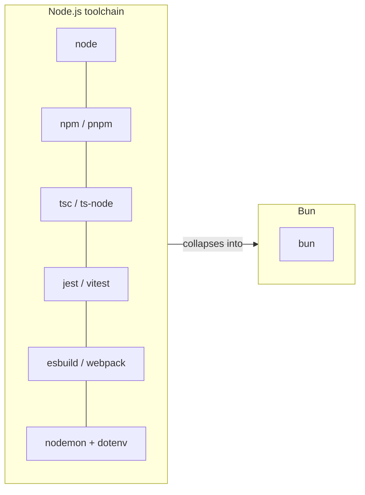

# Bun: The All-in-One JavaScript Runtime and Toolkit

> A normal Node.js project needs `node` to run, `npm` to install, `tsc` or `ts-node` to handle TypeScript, `jest` or `vitest` to test, `esbuild` or `webpack` to bundle, `nodemon` to watch, and `dotenv` to read `.env`. Seven tools, seven configs, seven upgrade paths — and none of them were designed together.
>
> Bun's pitch is that all of that is one binary called `bun`, and it is much faster. This note covers what Bun actually is, what it replaces, where it is genuinely production-ready, and where it still bites.
>
> Chinese version: [bun-runtime-and-toolkit.zh.md](./bun-runtime-and-toolkit.zh.md)

Reference version: **Bun v1.4** (released August 2026). Official site: <https://bun.sh>

---

## 1. What Bun Is

Bun is a **single executable** that plays four roles at once:

| Role | Command | Replaces |
|---|---|---|
| Runtime | `bun run app.ts` | `node`, `ts-node`, `nodemon` |
| Package manager | `bun install` | `npm`, `yarn`, `pnpm` |
| Test runner | `bun test` | `jest`, `vitest` |
| Bundler | `bun build` | `esbuild`, `webpack`, `rollup` |

Two design decisions drive everything else:

- **It uses JavaScriptCore, not V8.** JSC is Safari's engine, tuned for fast startup rather than long-running peak throughput. This is why `bun` boots in single-digit milliseconds where `node` takes tens.
- **The core is native code, not JavaScript.** npm's resolver, jest's runner and webpack's graph walker are all themselves JS programs. Bun's equivalents are compiled. As of v1.4 that core is **written in Rust** — Bun was originally written in Zig and [rewrote to Rust for v1.4](https://bun.sh/blog/bun-v1.4).



---

## 2. The Runtime: TypeScript With No Build Step

Bun executes `.ts`, `.tsx` and `.jsx` directly. There is no compile step, no `tsconfig` gymnastics, no `ts-node/esm` loader flag:

```bash
bun run server.ts        # just works
bun --watch server.ts    # built-in file watching, no nodemon
bun --hot server.ts      # hot reload, preserving process state
```

Things that need a package in Node and are built in here:

- **`.env` is loaded automatically** — no `dotenv` import.
- **ESM and CommonJS interoperate freely.** You can `require()` an ESM module and `import` a CJS one in the same file. This alone removes a large class of Node migration pain.
- **Web standard APIs are global**: `fetch`, `WebSocket`, `ReadableStream`, `Headers`, `URL`, `FormData`, `AbortController`.

Note that Bun **strips** TypeScript types rather than type-checking them. It will happily run code that `tsc` would reject. Keep `tsc --noEmit` in CI — Bun is a runtime, not a type checker.

---

## 3. The Package Manager: The Easiest Win

`bun install` is a drop-in replacement for `npm install`. It reads the same `package.json`, resolves from the same npm registry, and writes into the same `node_modules/`.

Vendor-published numbers for a warm-cache install ([bun.sh](https://bun.sh)):

| Tool | Install time |
|---|---|
| **bun** | **210 ms** |
| pnpm | ~1.76 s |
| yarn | ~1.92 s |
| npm | 4.45 s |

**This is the single highest-value, lowest-risk way to adopt Bun.** You can run `bun install` in a project that is otherwise 100% Node.js, deployed on Node.js, tested with jest. Nothing about your runtime changes — you only swapped the installer. If it goes wrong, delete `bun.lock` and run `npm install` again.

v1.4 also rounds out the maintenance commands that used to force you back to npm:

```bash
bun audit fix        # patch vulnerable transitive deps
bun dedupe           # collapse duplicate versions
bun prune            # drop unused packages
bun pm licenses      # dependency licence report
```

---

## 4. The Test Runner

`bun test` implements the Jest API — `describe`, `it`, `expect`, `beforeEach`, snapshots, mocks:

```ts
import { test, expect } from "bun:test";

test("adds", () => {
  expect(1 + 1).toBe(2);
});
```

```bash
bun test                    # TypeScript, no transform config
bun test --watch
bun test --parallel         # worker processes (v1.4)
bun test --coverage
```

The practical difference is startup. Jest pays a transform-and-boot cost on every run that is measured in seconds; `bun test` starts in milliseconds. On a suite you run constantly during TDD, that changes how you work.

Migration is usually a matter of changing the import from `@jest/globals` to `bun:test`. Where it breaks: heavy `jest.mock()` module-factory patterns and Jest-ecosystem plugins.

---

## 5. The Bundler and Single-File Executables

```bash
bun build ./src/index.tsx --outdir ./dist --minify
bun build ./src/index.tsx --react-compiler        # built-in React Compiler
```

The more interesting mode compiles your app **and the runtime** into one self-contained binary:

```bash
bun build ./cli.ts --compile --outfile mycli
./mycli          # no node, no node_modules, no install
```

For internal CLIs and small services this removes the entire "is the right Node version on the box" problem. You ship one file.

---

## 6. Batteries Included

Bun ships a standard library that in Node would be a dozen dependencies:

```ts
// HTTP server — no express needed
Bun.serve({
  port: 3000,
  fetch(req) { return new Response("hello"); },
});

// SQLite driver, built in
import { Database } from "bun:sqlite";
const db = new Database("app.db");

// Shell scripting, cross-platform, no zx
import { $ } from "bun";
await $`ls -la | grep .ts`;

// Password hashing — argon2 built in
const hash = await Bun.password.hash(pw);
```

Also built in: Postgres and Redis clients, an S3 client, `Bun.file()` I/O, `Bun.Glob`, semver, hashing, `HTMLRewriter`, and TOML/YAML/JSON5 parsing. v1.4 added `Bun.Image`, `Bun.markdown`, `Bun.cron()`, `Bun.Terminal` and `Bun.WebView`.

The tradeoff is worth naming: these are **Bun-specific APIs**. `Bun.serve` does not run on Node. Every one you adopt is a step away from portability — a fine trade for an internal service, a bad one for a published library.

---

## 7. Node.js Compatibility: The Honest Version

Bun targets drop-in compatibility with Node, implementing `node:fs`, `node:path`, `node:http`, `process`, `Buffer` and friends, plus Node-API for native addons. v1.4 alone passes ~1,500 more tests from Node's own suite than v1.3.

In practice: **Express, Hono, Fastify, Prisma, Drizzle and most of the mainstream ecosystem work.** What still causes trouble:

- Some **native (N-API) addons**, especially ones doing unusual V8-specific things.
- **V8-specific internals** — anything touching `v8` module internals, heap snapshots, or `--inspect` protocol edge cases.
- Rarely-used corners of `node:cluster`, `node:vm`, and some stream edge-case semantics.
- **Windows** support is real but has had the least mileage of the three platforms.

The engine swap also means V8-specific performance intuitions do not carry over. Bun wins decisively on startup and I/O; on long-running CPU-bound number crunching, V8's JIT is often still ahead.

---

## 8. Published Benchmarks

From [bun.sh](https://bun.sh), Bun v1.4 vs Node.js and Deno. These are **vendor-run numbers on vendor-chosen workloads** — treat them as a directional claim, not a measurement of your app:

| Workload | Bun | Node.js | Deno |
|---|---|---|---|
| Express req/sec | 48,243 | 25,181 | 19,243 |
| Postgres queries/sec | 20,243 | 10,000 | 10,406 |
| WebSocket msg/sec | 4.17 M | 123 K | 124 K |
| Memory, Express | 105 MB | 142 MB | 176 MB |

The WebSocket figure is the eye-catching one and reflects a genuinely different implementation strategy, not a 34× improvement in general JavaScript speed. Benchmark your own workload before quoting any of this in a design doc.

---

## 9. Adoption Path

Adopt in stages; each stage is independently reversible.

1. **`bun install` only.** Keep running on Node. Pure CI speedup, near-zero risk.
2. **`bun run` for scripts.** Replace `ts-node`/`nodemon` in dev scripts. Production still Node.
3. **`bun test`.** Migrate the suite once the imports are switched.
4. **Bun as the production runtime.** Only after 1–3 are stable and you have load-tested it.
5. **Bun-native APIs** (`Bun.serve`, `bun:sqlite`). Last, and only where lock-in is acceptable.

Docker pattern:

```dockerfile
FROM oven/bun:1.4
WORKDIR /app
COPY package.json bun.lock ./
RUN bun install --frozen-lockfile
COPY . .
CMD ["bun", "run", "src/index.ts"]
```

---

## 10. When to Use Bun

**Strong fit:**

- CI pipelines where install time dominates
- Internal CLIs and tools — `--compile` is a genuine differentiator
- New greenfield services with no legacy native-addon baggage
- TypeScript-heavy projects tired of build-step configuration
- Anything where cold-start latency matters (serverless, short-lived jobs)

**Think twice:**

- Published npm libraries — you must stay Node-portable anyway
- Apps leaning on unusual native addons or V8 internals
- Conservative production environments where Node's operational track record is the point
- CPU-bound long-running workloads, where V8's JIT may still win
- Teams with no appetite for being an early adopter on the runtime layer

---

## Summary

| Aspect | Assessment |
|---|---|
| Package manager | Excellent, and safe to adopt today in isolation |
| TypeScript DX | Excellent — the no-build-step workflow is the real draw |
| Test runner | Very good, migration usually cheap |
| Single-file executables | Genuinely differentiating for CLIs |
| Node compatibility | Good and improving; verify native addons yourself |
| Production runtime | Viable, but a deliberate decision — not a free swap |

The honest summary: **Bun's package manager and TypeScript ergonomics are worth adopting now; Bun as your production runtime is a real migration that deserves a real evaluation.** The two decisions are separable, which is exactly what makes Bun easy to try.

---

## References

- Bun homepage — <https://bun.sh>
- Bun documentation — <https://bun.sh/docs>
- Bun v1.4 release notes — <https://bun.sh/blog/bun-v1.4>
- Node.js compatibility matrix — <https://bun.sh/docs/runtime/nodejs-apis>
- See also: [Why Use uv for Python](../python/Why-Use-uv-for-Python.md) — the same consolidate-the-toolchain pattern in the Python ecosystem
