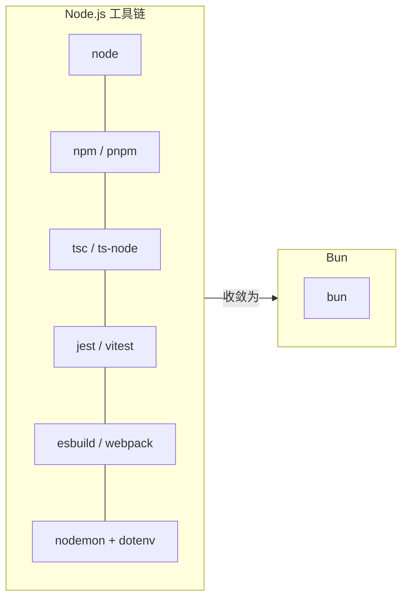

# Bun：把 JavaScript 工具链压缩成一个二进制

> 一个正常的 Node.js 项目要跑起来，需要 `node` 执行、`npm` 装包、`tsc` 或 `ts-node` 处理 TypeScript、`jest` 跑测试、`webpack` 或 `esbuild` 打包、`nodemon` 监听文件、`dotenv` 读环境变量。七个工具、七份配置、七条升级路线——而且它们彼此之间从来没有被一起设计过。
>
> Bun 的主张是：这些全部收敛成一个叫 `bun` 的二进制，并且快一个数量级。这篇讲清楚 Bun 到底是什么、替代了什么、哪些部分今天就能放心用、哪些地方仍然会咬人。
>
> 英文版：[bun-runtime-and-toolkit.en.md](./bun-runtime-and-toolkit.en.md)

参考版本：**Bun v1.4**（2026 年 8 月发布）。官网：<https://bun.sh>

## 缩写对照表

| 缩写 | 英文全称 | 中文 |
|------|----------|------|
| JSC | JavaScriptCore | Safari 的 JavaScript 引擎 |
| TS | TypeScript | 带类型的 JavaScript 超集 |
| ESM | ECMAScript Modules | ES 模块（`import` 语法） |
| CJS | CommonJS | Node 传统模块（`require` 语法） |
| N-API | Node-API | Node 原生插件的稳定 ABI 接口 |
| JIT | Just-In-Time compilation | 即时编译 |
| HMR | Hot Module Replacement | 模块热替换 |
| FFI | Foreign Function Interface | 外部函数接口（调用 C 库） |
| DX | Developer Experience | 开发体验 |
| CI/CD | Continuous Integration / Delivery | 持续集成 / 持续交付 |

---

## 一、Bun 是什么

Bun 是**一个可执行文件**，同时扮演四个角色：

| 角色 | 命令 | 替代掉 |
|---|---|---|
| 运行时 | `bun run app.ts` | `node`、`ts-node`、`nodemon` |
| 包管理器 | `bun install` | `npm`、`yarn`、`pnpm` |
| 测试运行器 | `bun test` | `jest`、`vitest` |
| 打包器 | `bun build` | `esbuild`、`webpack`、`rollup` |

两个底层决策决定了其余的一切：

- **它用 JavaScriptCore，不是 V8。** JSC 是 Safari 的引擎，优化方向偏向**快速启动**而不是长时间运行后的峰值吞吐。这就是 `bun` 能在个位数毫秒内启动、而 `node` 要几十毫秒的原因。
- **核心是原生代码，不是 JavaScript 写的。** npm 的依赖求解器、jest 的调度器、webpack 的依赖图遍历，本身都是 JS 程序；Bun 的对应实现是编译型的。从 v1.4 起这部分核心**用 Rust 编写**——Bun 最初是 Zig 写的，在 [v1.4 完成了到 Rust 的重写](https://bun.sh/blog/bun-v1.4)。



---

## 二、运行时：TypeScript 不需要构建步骤

Bun 直接执行 `.ts`、`.tsx`、`.jsx`，没有编译步骤，不用配 `tsconfig` 的各种兼容项，也不需要 `ts-node/esm` 这类 loader 参数：

```bash
bun run server.ts        # 直接跑
bun --watch server.ts    # 内置文件监听，不需要 nodemon
bun --hot server.ts      # 热重载，且保留进程内状态
```

在 Node 里需要装包、在这里是内置的东西：

- **`.env` 自动加载**——不需要 `import "dotenv/config"`。
- **ESM 与 CJS 可以自由互操作。** 同一个文件里既能 `require()` 一个 ESM 模块，也能 `import` 一个 CJS 模块。仅这一条就消掉了 Node 迁移中很大一类痛苦。
- **Web 标准 API 是全局的**：`fetch`、`WebSocket`、`ReadableStream`、`Headers`、`URL`、`FormData`、`AbortController`。

有一个容易踩的点：Bun 是**擦除**类型，不是**检查**类型。`tsc` 会拒绝的代码，Bun 照跑不误。所以 CI 里仍然要保留 `tsc --noEmit`——Bun 是运行时，不是类型检查器。

---

## 三、包管理器：最容易落地的一步

`bun install` 是 `npm install` 的直接替代品。它读同一份 `package.json`，从同一个 npm registry 解析，装进同一个 `node_modules/`。

官方公布的热缓存安装数据（来自 [bun.sh](https://bun.sh)）：

| 工具 | 安装耗时 |
|---|---|
| **bun** | **210 ms** |
| pnpm | 约 1.76 s |
| yarn | 约 1.92 s |
| npm | 4.45 s |

**这是收益最高、风险最低的 Bun 落地方式。** 你可以在一个 100% 跑在 Node 上、用 jest 测试、部署在 Node 上的项目里直接执行 `bun install`——运行时什么都没变，你只是换了个装包工具。万一出问题，删掉 `bun.lock` 重新 `npm install` 就回去了。

v1.4 补齐了过去必须切回 npm 才能做的维护命令：

```bash
bun audit fix        # 修复有漏洞的传递依赖
bun dedupe           # 合并重复版本
bun prune            # 清理未使用的包
bun pm licenses      # 依赖许可证报告
```

---

## 四、测试运行器

`bun test` 实现了 Jest 的 API——`describe`、`it`、`expect`、`beforeEach`、快照、mock：

```ts
import { test, expect } from "bun:test";

test("adds", () => {
  expect(1 + 1).toBe(2);
});
```

```bash
bun test                    # 直接吃 TypeScript，无需 transform 配置
bun test --watch
bun test --parallel         # 多进程并行（v1.4）
bun test --coverage
```

真正的差别在**启动开销**。Jest 每次运行都要付一次"转译 + 启动"的成本，量级是秒；`bun test` 是毫秒。对一个你在 TDD 过程中反复跑的测试套件来说，这会改变你的工作方式——快到可以一直开着。

迁移通常就是把 `@jest/globals` 的 import 换成 `bun:test`。会卡住的地方：重度依赖 `jest.mock()` 工厂函数的用法，以及 Jest 生态的插件。

---

## 五、打包器与单文件可执行程序

```bash
bun build ./src/index.tsx --outdir ./dist --minify
bun build ./src/index.tsx --react-compiler        # 内置 React Compiler
```

更有意思的是另一种模式——把**应用和运行时一起**编译成一个自包含的二进制：

```bash
bun build ./cli.ts --compile --outfile mycli
./mycli          # 不需要 node，不需要 node_modules，不需要安装
```

对内部 CLI 工具和小型服务来说，这直接消灭了"目标机器上有没有装对版本的 Node"这整类问题。你交付的就是一个文件。

---

## 六、内置电池

Bun 自带的标准库，在 Node 里对应着十几个依赖：

```ts
// HTTP 服务——不需要 express
Bun.serve({
  port: 3000,
  fetch(req) { return new Response("hello"); },
});

// 内置 SQLite 驱动
import { Database } from "bun:sqlite";
const db = new Database("app.db");

// Shell 脚本，跨平台，不需要 zx
import { $ } from "bun";
await $`ls -la | grep .ts`;

// 密码哈希——内置 argon2
const hash = await Bun.password.hash(pw);
```

此外还内置了：Postgres 与 Redis 客户端、S3 客户端、`Bun.file()` 文件 I/O、`Bun.Glob`、semver、各类哈希、`HTMLRewriter`，以及 TOML / YAML / JSON5 解析。v1.4 新增了 `Bun.Image`、`Bun.markdown`、`Bun.cron()`、`Bun.Terminal` 和 `Bun.WebView`。

代价必须说清楚：这些都是 **Bun 专有 API**。`Bun.serve` 在 Node 上跑不了。你每用一个，就离可移植性远一步——对内部服务这笔交易很划算，对要发布到 npm 的库则是明确的坏主意。

---

## 七、Node.js 兼容性：诚实的版本

Bun 的目标是成为 Node 的直接替代品，实现了 `node:fs`、`node:path`、`node:http`、`process`、`Buffer` 等模块，也支持 N-API 原生插件。仅 v1.4 一个版本就比 v1.3 多通过了约 1500 个 Node 官方测试套件用例。

实际情况是：**Express、Hono、Fastify、Prisma、Drizzle 以及主流生态基本都能跑。** 仍然容易出问题的地方：

- 部分**原生（N-API）插件**，尤其是做了 V8 特定操作的那些。
- **V8 专有内部接口**——凡是碰 `v8` 模块内部、堆快照、或 `--inspect` 协议边角的代码。
- `node:cluster`、`node:vm` 的冷门用法，以及少数 stream 边界语义。
- **Windows** 支持是真实可用的，但三个平台里它跑的里程数最少。

引擎替换还有一个推论：**V8 时代积累的性能直觉不能直接迁移。** Bun 在启动速度和 I/O 上赢得干脆；但在长时间运行的 CPU 密集计算上，V8 的 JIT 往往仍然更快。

---

## 八、官方基准数据

来自 [bun.sh](https://bun.sh) 的 Bun v1.4 对比数据。请注意这是**厂商自己在自己选定的负载上跑出来的数字**，当作方向性结论看，不要当作你的应用的实测值：

| 场景 | Bun | Node.js | Deno |
|---|---|---|---|
| Express 请求数/秒 | 48,243 | 25,181 | 19,243 |
| Postgres 查询数/秒 | 20,243 | 10,000 | 10,406 |
| WebSocket 消息数/秒 | 4.17 M | 123 K | 124 K |
| 内存占用（Express） | 105 MB | 142 MB | 176 MB |

其中 WebSocket 那一行最扎眼，但它反映的是一套**实现策略上的根本差异**，不是"JavaScript 整体快了 34 倍"。在把这些数字写进任何设计文档之前，先用你自己的负载压一遍。

---

## 九、渐进式落地路径

分阶段推进，每一步都可以独立回滚。

1. **只用 `bun install`。** 运行时仍然是 Node。纯粹的 CI 提速，近乎零风险。
2. **`bun run` 跑脚本。** 替掉开发脚本里的 `ts-node` / `nodemon`。生产仍然是 Node。
3. **`bun test`。** 改完 import 之后迁移测试套件。
4. **把 Bun 作为生产运行时。** 只有在 1–3 稳定运行、且完成压测之后再做。
5. **使用 Bun 专有 API**（`Bun.serve`、`bun:sqlite`）。放在最后，且只在可以接受锁定的地方用。

Docker 写法：

```dockerfile
FROM oven/bun:1.4
WORKDIR /app
COPY package.json bun.lock ./
RUN bun install --frozen-lockfile
COPY . .
CMD ["bun", "run", "src/index.ts"]
```

---

## 十、什么时候该用，什么时候别用

**明确适合：**

- 安装耗时占大头的 CI 流水线
- 内部 CLI 与工具——`--compile` 是真正拉开差距的能力
- 没有历史原生插件包袱的全新服务
- 被构建步骤配置折磨的 TypeScript 重度项目
- 冷启动延迟敏感的场景（Serverless、短生命周期任务）

**需要谨慎：**

- 要发布到 npm 的库——你本来就必须保持 Node 可移植
- 依赖冷门原生插件或 V8 内部接口的应用
- 保守的生产环境，其中"Node 有十几年运维记录"本身就是选型理由
- CPU 密集的长时运行负载，V8 的 JIT 可能仍然更快
- 团队没有意愿在**运行时**这一层当早期采用者

---

## 小结

| 维度 | 判断 |
|---|---|
| 包管理器 | 优秀，且今天就可以单独采用 |
| TypeScript 开发体验 | 优秀——免构建步骤是真正的卖点 |
| 测试运行器 | 很好，迁移成本通常很低 |
| 单文件可执行程序 | 对 CLI 场景具有独特价值 |
| Node 兼容性 | 良好且在改善；原生插件请自行验证 |
| 生产运行时 | 可行，但这是一个需要评估的决策，不是免费替换 |

一句话总结：**Bun 的包管理器和 TypeScript 开发体验现在就值得用；把 Bun 当生产运行时则是一次真正的迁移，值得一次真正的评估。** 这两个决策是可以拆开的——而这恰恰是 Bun 容易上手的原因。

---

## 参考资料

- Bun 官网 —— <https://bun.sh>
- Bun 文档 —— <https://bun.sh/docs>
- Bun v1.4 发布说明 —— <https://bun.sh/blog/bun-v1.4>
- Node.js 兼容性矩阵 —— <https://bun.sh/docs/runtime/nodejs-apis>
- 相关笔记：[Why Use uv for Python](../python/Why-Use-uv-for-Python.md) —— Python 生态里同样的"工具链收敛"模式
