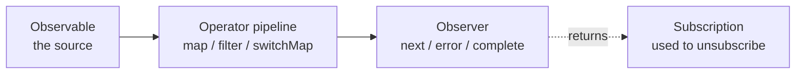

# Reactive Programming with RxJS: Async as a Stream You Can Operate On

> The usual first reaction to RxJS is "isn't this just Promises with extra jargon?" It isn't. A Promise represents **one** future value and cannot be cancelled once started. An Observable represents **any number of values arriving over time**, and it can be cancelled. Search-as-you-type, WebSocket pushes, drag gestures — all of these are awkward as Promises because they were never one value to begin with.
>
> This note skips the API tour (the docs do that) and covers the four things that actually decide whether an RxJS codebase is pleasant or miserable: cold vs hot Observables, choosing among the higher-order mapping operators, why unsubscribing is mandatory, and which idioms are now deprecated.
>
> Chinese version: [reactive-programming.zh.md](./reactive-programming.zh.md)

Reference version: **RxJS 7.8.2**. Note that v8 has only ever shipped prereleases and v9 is in beta — so anything described below as "removed in v8" is, in your project today, most likely **still present but deprecated**.

---

## 1. What Promises Cannot Do

JavaScript has four async primitives, and they are not equivalent:

| Approach | Values | Cancellable | Lazy |
|---|---|---|---|
| Callback | 1 | No | — |
| Promise | 1 | **No** | No (runs on creation) |
| EventEmitter / addEventListener | Many | Yes | — |
| **Observable** | **0 to ∞** | **Yes** | **Yes** |

Two differences matter in practice.

**A Promise cannot be cancelled.** A user types five characters into a search box and you fire five requests. Request 3 may resolve *after* request 5, leaving stale results on screen. That is a **race condition**, and Promises offer no mechanism against it.

**A Promise is exactly one value.** Once resolved, it is done. But "every keystroke" and "every server push" are inherently many values.

Observables make both first-class: a **cancellable stream of values over time**, composable with operators the way arrays compose with `map` and `filter`.

---

## 2. Four Core Concepts



- **Observable** — the **producer**, a stream that pushes values over time. It is **lazy**: with no subscriber, nothing happens.
- **Observer** — the **consumer**, an object with `next` / `error` / `complete`.
- **Subscription** — the handle returned by subscribing. Its only real job is `unsubscribe()`.
- **Subject** — both Observable and Observer; you can push values in with `next()`. It is the bridge from non-Rx code into an Rx pipeline.

A stream terminates in exactly three ways: `complete`, `error`, or `unsubscribe`. **Both `error` and `complete` tear down the subscription automatically** — which matters a great deal in section 6.

---

## 3. Cold vs Hot Observables

This is the trap newcomers hit most often and diagnose least easily.

**Cold**: every subscription re-executes the source. `http.get()` is cold.

```ts
const req$ = http.get('/api/user');
req$.subscribe();   // fires HTTP request #1
req$.subscribe();   // fires request #2 — the same call, twice
```

**Hot**: the source exists independently of subscribers, who all **share** it. `fromEvent(button, 'click')` is hot — a click does not happen twice because you subscribed twice.

Convert cold to hot with `share()` or `shareReplay()`:

```ts
const user$ = http.get('/api/user').pipe(shareReplay(1));
user$.subscribe();  // fires the request
user$.subscribe();  // reuses the cached result, no second request
```

**Field diagnostic**: if the network panel shows the same request N times and your template happens to use N `async` pipes, you are looking at a cold Observable. Add `shareReplay(1)`.

---

## 4. Marble Diagrams

Marble diagrams put a stream on a time axis. Letters are values, `|` is complete, `X` is error:

```
source: --1---2-----3--|
        map(x => x * 10)
result: --10--20----30-|

source: --1---2-----3--|
        filter(x => x % 2 === 1)
result: --1---------3--|
```

<https://rxmarbles.com> is interactive — you can drag the marbles and watch the output change. **For any operator you are unsure about, dragging it once beats reading the docs ten times.**

---

## 5. The Operators Worth Knowing

RxJS ships over a hundred operators. Day-to-day work uses roughly these.

### 5.1 Basics

| Operator | Purpose |
|---|---|
| `map` | Transform each value, like `Array#map` |
| `filter` | Drop values |
| `tap` | Side effects (logging, debugging); does not alter the stream |
| `take(n)` / `takeUntil(o$)` | First n values / until another stream emits |
| `debounceTime(ms)` | Emit only after ms of silence — input debouncing |
| `distinctUntilChanged()` | Drop a value identical to the previous one |
| `catchError` / `retry(n)` | Error handling / retry |

### 5.2 The Higher-Order Mapping Family (the important part)

When the mapping function **itself returns an Observable** — an HTTP call, say — you get a stream of streams. How those inner streams are flattened determines concurrency behaviour, and **this is the single easiest thing to get wrong in RxJS**:

| Operator | On a new value | Use for |
|---|---|---|
| **`switchMap`** | **Cancels** the previous inner stream, switches to the new one | Search-as-you-type, route params — only the latest matters |
| **`mergeMap`** | Runs concurrently, keeps all, order not guaranteed | Parallel uploads where order is irrelevant |
| **`concatMap`** | Queues; starts the next only after the previous completes | Sequential writes that must stay ordered |
| **`exhaustMap`** | **Ignores** new values until the current one finishes | Preventing double-submit — rapid login clicks fire once |

Mnemonic: **switch takes the new, merge takes them all, concat queues, exhaust keeps the old.**

Getting it wrong is not subtle: `mergeMap` on a search box gives you race conditions and results flickering back to stale data; `mergeMap` on a submit button means three clicks submit three times.

### 5.3 Combining Streams

| Operator | Semantics |
|---|---|
| `combineLatest` | On any emission, emit the latest from every stream |
| `forkJoin` | Wait for all to complete, emit the last of each — the `Promise.all` analogue |
| `merge` | Interleave values from several streams |
| `withLatestFrom` | Driven by the primary stream, carrying others' latest values |

---

## 6. Unsubscribing: The Classic Memory Leak

**An Observable that never completes will never be garbage collected if you do not unsubscribe.** The component is destroyed, the subscription lives on, the callback still holds a reference to the instance. This is the archetypal RxJS leak.

What needs manual teardown:

- ✅ **Needs it**: `fromEvent`, `interval`, `Subject`, WebSockets — these never complete on their own
- ❌ **Does not**: `http.get()` (completes when the response lands), anything with `take(1)` / `first()`

The recommended idiom is the `takeUntil` pattern, with one Subject governing every subscription in the component:

```ts
private destroy$ = new Subject<void>();

ngOnInit() {
  interval(1000)
    .pipe(takeUntil(this.destroy$))   // must be the LAST operator in the pipe
    .subscribe({ next: v => console.log(v) });
}

ngOnDestroy() {
  this.destroy$.next();
  this.destroy$.complete();
}
```

`takeUntil` **must come last in `pipe()`**. Placed in the middle, operators after it — particularly stream-creating ones like `switchMap` — can still spawn live subscriptions.

In Angular, prefer the `async` pipe in templates; it subscribes and unsubscribes for you, more reliably than hand-written teardown.

---

## 7. Deprecated Idioms to Stop Writing

These were deprecated in RxJS 7 but remain everywhere in older code and tutorials:

```ts
// ❌ Deprecated: positional subscribe arguments
source$.subscribe(
  value => console.log(value),
  error => console.error(error),
  () => console.log('done')
);

// ✅ Current: pass an observer object
source$.subscribe({
  next:  value => console.log(value),
  error: error => console.error(error),
  complete: () => console.log('done'),
});
```

```ts
// ❌ Deprecated: toPromise() — resolves to undefined on an empty stream
const user = await user$.toPromise();

// ✅ Current: explicit semantics, throws on empty
const user = await firstValueFrom(user$);   // first value
const last = await lastValueFrom(user$);    // wait for complete, take the last
```

`toPromise()` was not deprecated for aesthetics. It **cannot distinguish "completed with no value" from "the value was `undefined`"**. `firstValueFrom` throws `EmptyError` on an empty stream, which is an answer rather than an ambiguity.

---

## 8. Putting It Together: A Search Box

This is the best single argument for RxJS. **The Promise equivalent requires hand-managed timers, cancellation flags and race bookkeeping — roughly three times the code:**

```ts
fromEvent(searchInput, 'input').pipe(
  map(e => (e.target as HTMLInputElement).value),
  filter(q => q.length >= 2),        // too short to bother
  debounceTime(300),                 // wait for a pause in typing
  distinctUntilChanged(),            // unchanged text, no new request
  switchMap(q => http.get(`/api/search?q=${q}`)),  // new request cancels the old
  catchError(() => of([])),          // recover without killing the stream
  takeUntil(this.destroy$),
).subscribe({
  next: results => this.render(results),
});
```

Line by line: `debounceTime` collapses ten keystrokes into one request; `distinctUntilChanged` suppresses the "typed and deleted back to the same text" case; `switchMap` eliminates the race outright; `catchError` keeps one failure from killing the pipeline — **the most commonly missed detail, since an uncaught error terminates the subscription and the box silently stops responding to all further input.**

---

## 9. When Not to Use RxJS

The learning curve is real, and not every codebase earns it back.

**Not worth it:**

- Simple one-shot requests — `async/await` is plainer; do not adopt RxJS for its own sake
- An unfamiliar team on a short timeline — badly written RxJS is harder to debug than Promises
- Wanting to look modern

**Worth it:**

- Anything time-shaped: debouncing, throttling, polling, retry with backoff
- Async work that must be cancellable (search, autocomplete, aborting on navigation)
- Several async sources that must be combined, with combination logic that will change
- Already using Angular — the framework is built on RxJS, so it is unavoidable anyway

---

## Summary

| Point | Takeaway |
|---|---|
| Difference from Promises | Many values, cancellable, lazy |
| Most common trap | Cold Observables causing duplicate requests — use `shareReplay(1)` |
| Most consequential choice | The higher-order mapping family — the wrong one causes races or double-submits |
| Non-negotiable | Unsubscribe, via `takeUntil` placed last in the pipe |
| Stop writing | Positional `subscribe()` and `toPromise()` |

In one line: **RxJS earns its keep not because streams are an elegant way to write async, but because it turns cancellation, races and debouncing — problems that otherwise need hand-rolled state machines — into a single operator each.** If your project has none of those problems, it is overkill. If it has them, your hand-rolled version is almost certainly worse.

---

## References

- RxJS official docs — <https://rxjs.dev>
- Learn RxJS (examples organised by operator) — <https://www.learnrxjs.io>
- RxMarbles (interactive marble diagrams) — <https://rxmarbles.com/#mergeMap>
- subscribe argument deprecation — <https://rxjs.dev/deprecations/subscribe-arguments>
- Chinese introduction — <https://blog.techbridge.cc/2017/12/08/rxjs/>
- Personal sample repo — <https://github.com/geekchow/rxjs-sample/>
- Related note: [Reative flow (Java Mono and Flux)](../java/mono-flux/mono-vs-flux.md) — the same reactive ideas in the Java ecosystem
