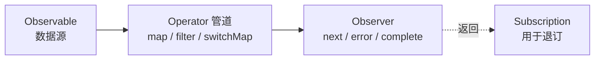

# RxJS 响应式编程：把异步当成一条可以操作的流

> 大多数人第一次看 RxJS 的反应是"这不就是加了一堆黑话的 Promise 吗"。不是。Promise 表示**一个**将来会到达的值，而且一旦发起就无法取消；Observable 表示**随时间到达的任意多个值**，而且可以取消。搜索框的联想请求、WebSocket 推送、鼠标拖拽轨迹——这些用 Promise 表达都很别扭，因为它们本质上不是"一个值"。
>
> 这篇不做 API 罗列（那是官方文档的活），只讲四件在真实项目里决定成败的事：冷热 Observable 的区别、高阶映射四兄弟怎么选、退订为什么必须做、以及哪些写法已经过时了。
>
> 英文版：[reactive-programming.en.md](./reactive-programming.en.md)

参考版本：**RxJS 7.8.2**。注意 v8 至今只有预发布版本、从未发布稳定版，v9 处于 beta——所以本文标注为"v8 中移除"的 API，在你今天的项目里大概率**仍然可用但已废弃**。

## 缩写对照表

| 缩写 | 英文全称 | 中文 |
|------|----------|------|
| RxJS | Reactive Extensions for JavaScript | JavaScript 响应式扩展库 |
| API | Application Programming Interface | 应用程序接口 |
| HTTP | HyperText Transfer Protocol | 超文本传输协议 |
| UI | User Interface | 用户界面 |
| GC | Garbage Collection | 垃圾回收 |

---

## 一、Promise 解决不了的问题

JavaScript 里处理异步有四种形态，它们的能力边界并不相同：

| 方案 | 值的个数 | 可取消 | 惰性 |
|---|---|---|---|
| 回调函数 | 1 | 否 | — |
| Promise | 1 | **否** | 否（创建即执行） |
| EventEmitter / addEventListener | 多个 | 是 | — |
| **Observable** | **0 到无限个** | **是** | **是** |

关键差别有两个：

**Promise 无法取消。** 用户在搜索框里连打五个字，你发出五个请求。第 3 个请求可能比第 5 个后返回，于是界面显示的是过时的结果——这就是**请求竞态（race condition）**。Promise 本身没有任何机制处理它。

**Promise 只代表一个值。** 一旦 resolve 就结束了。而"用户每次输入"、"服务端每次推送"天然是多个值。

Observable 把这两件事都变成一等公民：它是一条**可以被取消的、随时间产生多个值的流**，并且可以像操作数组一样用操作符组合。

---

## 二、四个核心概念



- **Observable**：数据的**生产者**，一条随时间推送值的流。它是**惰性**的——没有人订阅时，它什么都不做。
- **Observer**：数据的**消费者**，一个带 `next` / `error` / `complete` 三个方法的对象。
- **Subscription**：订阅这个动作返回的句柄，唯一的用途是 `unsubscribe()`。
- **Subject**：既是 Observable 又是 Observer，可以手动 `next()` 推值进去。它是把非 Rx 世界（比如一个普通事件）接进 Rx 管道的桥。

一条流的终止方式有且只有三种：`complete`（正常结束）、`error`（异常结束）、`unsubscribe`（主动取消）。**`error` 和 `complete` 都会自动终结订阅**，这一点后面讲退订时很关键。

---

## 三、冷 Observable 与热 Observable

这是新手最容易踩、也最难自己debug出来的坑。

**冷（cold）**：每次订阅都会**重新执行一遍**数据源。`http.get()` 就是冷的。

```ts
const req$ = http.get('/api/user');
req$.subscribe();   // 发出第 1 个 HTTP 请求
req$.subscribe();   // 又发出第 2 个！同样的请求发了两次
```

**热（hot）**：数据源独立于订阅存在，所有订阅者**共享**同一份数据。`fromEvent(button, 'click')` 是热的——按钮的点击不会因为你多订阅一次就多发生一次。

冷变热用 `share()` 或 `shareReplay()`：

```ts
const user$ = http.get('/api/user').pipe(shareReplay(1));
user$.subscribe();  // 发出请求
user$.subscribe();  // 复用上一次的结果，不再发请求
```

**实践中的判断方法**：如果你发现网络面板里同一个请求发了 N 次，而模板里恰好用了 N 次 `async` 管道——就是冷 Observable 在起作用，加 `shareReplay(1)`。

---

## 四、弹珠图：读懂操作符的唯一方法

弹珠图（marble diagram）用时间轴表示流。横轴是时间，字母是值，`|` 是 complete，`X` 是 error：

```
源:     --1---2-----3--|
        map(x => x * 10)
结果:   --10--20----30-|

源:     --1---2-----3--|
        filter(x => x % 2 === 1)
结果:   --1---------3--|
```

<https://rxmarbles.com> 是交互式的弹珠图网站，可以拖动弹珠看结果变化。**遇到不确定的操作符，去那里拖一遍比读十遍文档管用。**

---

## 五、真正需要掌握的操作符

RxJS 有一百多个操作符，但日常 90% 的场景只用得到这些。

### 5.1 基础变换

| 操作符 | 作用 |
|---|---|
| `map` | 逐个变换值，和数组的 `map` 一样 |
| `filter` | 过滤值 |
| `tap` | 副作用（打日志、调试），不改变流 |
| `take(n)` / `takeUntil(o$)` | 取前 n 个 / 直到另一条流发值就结束 |
| `debounceTime(ms)` | 停止输入 ms 毫秒后才放行——输入框防抖 |
| `distinctUntilChanged()` | 与上一个值相同就丢弃 |
| `catchError` / `retry(n)` | 错误处理 / 重试 |

### 5.2 高阶映射四兄弟（最重要的一节）

当映射函数**本身返回一个 Observable**（比如发起一个 HTTP 请求）时，就产生了"流中流"。怎么合并这些内层流，决定了并发行为——**这是 RxJS 里最容易选错、后果也最严重的地方**：

| 操作符 | 新值到达时的行为 | 典型场景 |
|---|---|---|
| **`switchMap`** | **取消**前一个内层流，切换到新的 | 搜索联想、路由参数变化——只要最新结果 |
| **`mergeMap`** | 并发执行，全部保留，顺序不保证 | 并行上传多个文件，先后无所谓 |
| **`concatMap`** | 排队，前一个 complete 后才开始下一个 | 顺序写操作，必须保证先后 |
| **`exhaustMap`** | **忽略**新值，直到当前内层流结束 | 防重复提交——连点登录按钮只发一次 |

一句话记忆：**switch 取新弃旧、merge 全都要、concat 排队、exhaust 取旧弃新。**

选错的典型后果：搜索框用了 `mergeMap` → 请求竞态，界面闪回旧结果；登录按钮用了 `mergeMap` → 用户连点三次，提交三次。

### 5.3 组合多条流

| 操作符 | 语义 |
|---|---|
| `combineLatest` | 任意一条流发值就输出所有流的最新值组合 |
| `forkJoin` | 等所有流都 complete，输出最后一个值——相当于 `Promise.all` |
| `merge` | 简单合并多条流的值 |
| `withLatestFrom` | 以主流为准，附带其他流的最新值 |

---

## 六、退订：最常见的内存泄漏

**没有 complete 的 Observable，如果不退订，就永远不会被 GC 回收。** 组件销毁了，订阅还活着，回调里还引用着组件实例——这就是 RxJS 项目里最典型的内存泄漏。

哪些需要手动退订：

- ✅ **需要**：`fromEvent`、`interval`、`Subject`、WebSocket——这些不会自己 complete
- ❌ **不需要**：`http.get()`（请求完成后自动 complete）、用了 `take(1)` / `first()` 的流

推荐写法是 `takeUntil` 模式，一个 Subject 管理组件内所有订阅：

```ts
private destroy$ = new Subject<void>();

ngOnInit() {
  interval(1000)
    .pipe(takeUntil(this.destroy$))   // 必须放在 pipe 的最后一个
    .subscribe({ next: v => console.log(v) });
}

ngOnDestroy() {
  this.destroy$.next();
  this.destroy$.complete();
}
```

注意 `takeUntil` **必须放在 `pipe()` 的最后**。放在中间的话，它后面的操作符（尤其是 `switchMap` 这类会创建新内层流的）仍然可能继续产生订阅。

在 Angular 里，模板中优先用 `async` 管道——它会自动订阅和退订，比手写可靠。

---

## 七、别再用这些废弃写法

这几个是 RxJS 7 明确废弃的 API，在老代码和老教程里仍然大量存在：

```ts
// ❌ 废弃：位置参数形式的 subscribe
source$.subscribe(
  value => console.log(value),
  error => console.error(error),
  () => console.log('done')
);

// ✅ 现在：传一个 observer 对象
source$.subscribe({
  next:  value => console.log(value),
  error: error => console.error(error),
  complete: () => console.log('done'),
});
```

```ts
// ❌ 废弃：toPromise()——流为空时会 resolve 成 undefined，语义含糊
const user = await user$.toPromise();

// ✅ 现在：语义明确，空流会抛错
const user = await firstValueFrom(user$);   // 取第一个值
const last = await lastValueFrom(user$);    // 等 complete，取最后一个值
```

`toPromise()` 被废弃的真正原因不是写法难看，而是**它无法区分"流正常结束但没有值"和"值就是 undefined"**。`firstValueFrom` 在空流时抛 `EmptyError`，语义是明确的。

---

## 八、实战：一个搜索框

把上面所有东西串起来。这段代码是 RxJS 价值的最好证明——**用 Promise 实现同样的行为需要手动管理定时器、取消标志和竞态判断，大约三倍的代码量**：

```ts
fromEvent(searchInput, 'input').pipe(
  map(e => (e.target as HTMLInputElement).value),
  filter(q => q.length >= 2),        // 太短不搜
  debounceTime(300),                 // 停止输入 300ms 才发请求
  distinctUntilChanged(),            // 内容没变就不重复发
  switchMap(q => http.get(`/api/search?q=${q}`)),  // 新请求自动取消旧请求
  catchError(() => of([])),          // 出错时返回空数组，不中断流
  takeUntil(this.destroy$),
).subscribe({
  next: results => this.render(results),
});
```

逐行的价值：`debounceTime` 把打字 10 个字符的 10 次请求压成 1 次；`distinctUntilChanged` 挡掉"输入又删除回原样"的重复请求；`switchMap` 彻底消灭请求竞态；`catchError` 保证一次失败不会让整条流死掉——**这是最容易漏的一点：未捕获的 error 会终结订阅，之后用户再输入就完全没反应了。**

---

## 九、什么时候不该用 RxJS

RxJS 的学习曲线是真实存在的，不是所有场景都值得。

**不值得引入：**

- 只有简单的一次性请求——`async/await` 更直白，别为了用而用
- 团队不熟悉，且项目周期短——写坏的 RxJS 比 Promise 更难调试
- 只是为了"看起来现代"

**值得引入：**

- 大量涉及时间的交互：防抖、节流、轮询、重试退避
- 需要取消的异步操作（搜索、自动补全、页面切换时中断请求）
- 多个异步源需要组合、且组合逻辑会变化
- 已经在 Angular 里——框架本身就构建在 RxJS 之上，无法回避

---

## 小结

| 要点 | 结论 |
|---|---|
| 与 Promise 的本质差别 | 多个值 + 可取消 + 惰性 |
| 最容易踩的坑 | 冷 Observable 导致重复请求，用 `shareReplay(1)` |
| 最重要的选择 | 高阶映射四兄弟——选错直接导致竞态或重复提交 |
| 必须做的事 | 退订，用 `takeUntil` 模式放在 pipe 最后 |
| 必须避免的事 | 位置参数 `subscribe()` 与 `toPromise()` |

一句话：**RxJS 的价值不在于"用流的方式写异步"，而在于它把取消、竞态、防抖这些原本要手写状态机的问题，变成了一行操作符。** 如果你的项目里没有这类问题，那它确实是过度设计；如果有，手写的版本几乎一定比它更糟。

---

## 参考资料

- RxJS 官方文档 —— <https://rxjs.dev>
- Learn RxJS（按操作符分类的实例） —— <https://www.learnrxjs.io>
- RxMarbles（交互式弹珠图） —— <https://rxmarbles.com/#mergeMap>
- subscribe 参数废弃说明 —— <https://rxjs.dev/deprecations/subscribe-arguments>
- 中文入门文章 —— <https://blog.techbridge.cc/2017/12/08/rxjs/>
- 个人示例仓库 —— <https://github.com/geekchow/rxjs-sample/>
- 相关笔记：[Reative flow（Java Mono 与 Flux）](../java/mono-flux/mono-vs-flux.md) —— 同一套响应式思想在 Java 生态的对应物
