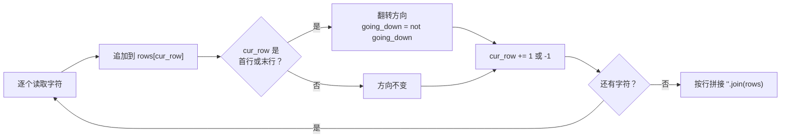
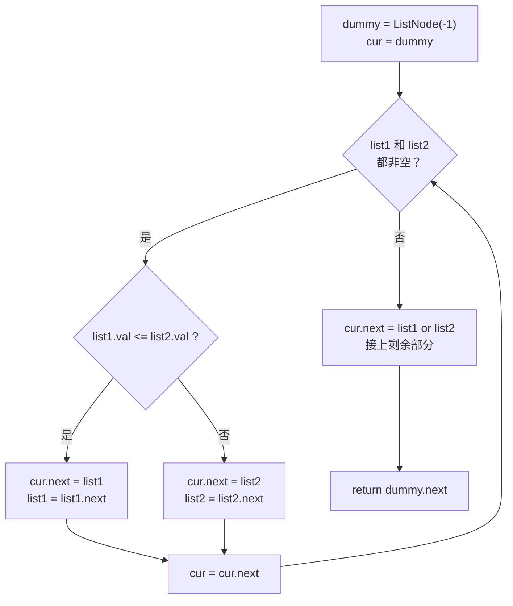

# 算法题笔记：最长回文子串、Z 字形变换与合并有序链表

> 三道 LeetCode 经典题的错误代码复盘与正确解法。每题都先剖析原始写法错在哪，再给出可运行版本
> 和复杂度分析——比直接背标准答案更能记住边界条件。

## 缩写对照表

| 缩写 | 英文全称 | 中文 |
| --- | --- | --- |
| IDE | Integrated Development Environment | 集成开发环境 |
| API | Application Programming Interface | 应用程序接口 |

---

## 一、最长回文子串（LeetCode 5）

### 原始写法的四个问题

```python
def longestPalindrome(self, s: str) -> str:
    sl = list(s)
    huiwen = ""
    window = 2
    for i in range(0, len(s), 1):
        while i + window < len(s):
            if sl[i: i + window] == sl[i: i + window].reverse():   # ❌
                if window > len(huiwen):
                    huiwen = sl[i: i + window]
            window += 1
        window = 2
    return huiwen
```

1. **`reverse()` 用法错误**：它是原地反转并返回 `None`，所以比较恒为 `False`。
   要么用切片 `[::-1]`，要么用 `reversed()`；
2. **窗口思路不对**：回文应从中心向两边扩展，固定从长度 2 起步会漏掉奇数长度的回文；
3. **窗口重置位置错误**：每轮外层循环都把 `window` 重置为 2，更长的回文永远匹配不到；
4. **边界判断错误**：`i + window < len(s)` 少覆盖了末尾一个字符。

### 解法一：中心扩展法（推荐）

每个字符、每对相邻字符都可能是回文中心，向两边扩展即可：

```python
class Solution:
    def longestPalindrome(self, s: str) -> str:
        if not s:
            return ""

        def expand_around_center(left: int, right: int) -> str:
            """从中心向两边扩展，返回能取到的最长回文"""
            while left >= 0 and right < len(s) and s[left] == s[right]:
                left -= 1
                right += 1
            return s[left + 1:right]      # 循环多退了一步，这里补回来

        longest = s[0]
        for i in range(len(s)):
            odd_pal = expand_around_center(i, i)        # 奇数长度，中心是单个字符
            if len(odd_pal) > len(longest):
                longest = odd_pal
            even_pal = expand_around_center(i, i + 1)   # 偶数长度，中心是两个字符之间
            if len(even_pal) > len(longest):
                longest = even_pal
        return longest
```

时间复杂度 O(n²)，空间复杂度 O(1)。

```python
sol = Solution()
print(sol.longestPalindrome("babad"))   # "bab" 或 "aba"
print(sol.longestPalindrome("cbbd"))    # "bb"
print(sol.longestPalindrome("a"))       # "a"
```

### 解法二：暴力枚举（仅作对照）

若坚持滑动窗口思路，修正后是这样，但复杂度退化到 O(n³)：

```python
class Solution:
    def longestPalindrome(self, s: str) -> str:
        n = len(s)
        if n < 2:
            return s
        longest = s[0]
        for i in range(n):
            for j in range(i + 1, n + 1):
                sub = s[i:j]
                if sub == sub[::-1] and len(sub) > len(longest):
                    longest = sub
        return longest
```

字符串切片本身是 O(n)，套在双层循环里就是 O(n³)，长串上明显慢于中心扩展法。

---

## 二、Z 字形变换（LeetCode 6）

### 原始写法的四个问题

1. **列数计算错误**：`numCol = int(n / numRows - 1) + 1` 与实际排布对不上；
2. **索引越界**：`row` 递增到 `numRows` 后仍访问 `matrix[row]`；
3. **回折逻辑错误**：斜向上时行、列坐标的更新顺序不对；
4. **矩阵开得过大**：列数直接用 `n`，浪费大量空间。

### 解法：按行收集，用方向标志回折

根本不需要建二维矩阵——只要知道当前字符落在第几行：

```python
class Solution:
    def convert(self, s: str, numRows: int) -> str:
        if numRows == 1 or numRows >= len(s):
            return s

        rows = [''] * numRows
        cur_row = 0
        going_down = False

        for char in s:
            rows[cur_row] += char
            # 撞到第一行或最后一行就掉头
            if cur_row == 0 or cur_row == numRows - 1:
                going_down = not going_down
            cur_row += 1 if going_down else -1

        return ''.join(rows)
```

时间复杂度 O(n)，空间复杂度 O(n)。



以 `s = "PAYPALISHIRING"`、`numRows = 3` 为例，字符落位如下：

```
P   A   H   N
A P L S I I G
Y   I   R
```

按行读出即 `"PAHNAPLSIIGYIR"`。

### 解法二：直接按下标跳跃

一个周期长度为 `2 * numRows - 2`。首行与末行只取周期起点，中间行每周期额外多一个字符：

```python
class Solution:
    def convert(self, s: str, numRows: int) -> str:
        if numRows == 1 or numRows >= len(s):
            return s

        result = []
        cycle_len = 2 * numRows - 2
        for i in range(numRows):
            for j in range(i, len(s), cycle_len):
                result.append(s[j])
                # 中间行在斜边上还有一个字符
                if i != 0 and i != numRows - 1:
                    k = j + cycle_len - 2 * i
                    if k < len(s):
                        result.append(s[k])
        return ''.join(result)
```

---

## 三、合并两个有序链表（LeetCode 21）

### 先厘清两个类型问题

**`list1` 参数是什么？** 它是指向链表**头节点的引用**，不是整个链表的拷贝。
函数内 `list1 = list1.next` 只移动了局部引用，不会影响调用方的原链表。

```python
class ListNode:
    def __init__(self, val=0, next=None):
        self.val = val        # 当前节点的值
        self.next = next      # 指向下一个节点的引用


# 链表 1 -> 2 -> 3 -> None
head = ListNode(1)
head.next = ListNode(2)
head.next.next = ListNode(3)
```

**返回类型 `Optional[ListNode]` 是什么？** 这是类型提示（Type Hinting），等价于
`Union[ListNode, None]`，也就是 Python 3.10+ 的 `ListNode | None`——
表示返回值可能是节点对象，也可能是 `None`（空链表）。

```python
# Python 3.10+ 推荐写法
def mergeTwoLists(self, list1: ListNode | None, list2: ListNode | None) -> ListNode | None:
    ...

# Python 3.9 及以前
from typing import Optional

def mergeTwoLists(self, list1: Optional[ListNode], list2: Optional[ListNode]) -> Optional[ListNode]:
    ...
```

它的价值在于让调用方和类型检查器（如 mypy）都知道**必须处理 `None` 的情况**：

```python
result = sol.mergeTwoLists(list1, list2)
if result:                # 有 Optional 提示时，IDE 会提醒这里要判空
    print(result.val)
else:
    print("结果是空链表")
```

### 原始写法错在哪

原代码试图把 `list1` 的节点逐个「插入」到 `list2` 中，指针操作是这样的：

```python
if cur1.val >= cur2.val:
    tmp1 = cur1.next
    tmp2 = cur2.next
    cur2.next = cur1
    cur1.next = tmp2      # ❌
```

问题在于 `cur1.next` 应指向 `cur2.next` 的**原始值**，但 `cur2.next` 在上一行已被改写，
`tmp2` 的语义与实际连接顺序对不上，链表会断裂或成环。
根因是「原地插入」需要同时维护前驱、后继两组指针，边界情况极多。

### 解法：虚拟头节点

用一个哑节点（dummy node）作为结果链表的起点，就不必单独处理「谁当头节点」：

```python
class Solution:
    def mergeTwoLists(self, list1: Optional[ListNode], list2: Optional[ListNode]) -> Optional[ListNode]:
        dummy = ListNode(-1)      # 虚拟头节点
        cur = dummy

        while list1 and list2:
            if list1.val <= list2.val:
                cur.next = list1
                list1 = list1.next
            else:
                cur.next = list2
                list2 = list2.next
            cur = cur.next

        cur.next = list1 or list2   # 直接接上剩余的那条
        return dummy.next           # 真正的头节点
```

时间复杂度 O(m + n)，空间复杂度 O(1)。



`cur.next = list1 or list2` 利用了 Python 的真值短路：`list1` 非空就取它，否则取 `list2`，
两者都为 `None` 时结果也是 `None`，恰好覆盖全部情况。

### 解法二：递归

写法更短，但递归深度等于链表总长，超长链表有栈溢出风险：

```python
class Solution:
    def mergeTwoLists(self, list1: Optional[ListNode], list2: Optional[ListNode]) -> Optional[ListNode]:
        if not list1:
            return list2
        if not list2:
            return list1
        if list1.val < list2.val:
            list1.next = self.mergeTwoLists(list1.next, list2)
            return list1
        else:
            list2.next = self.mergeTwoLists(list1, list2.next)
            return list2
```

### 测试用例

```python
def create_list(arr):
    dummy = ListNode(0)
    cur = dummy
    for val in arr:
        cur.next = ListNode(val)
        cur = cur.next
    return dummy.next


def to_list(node):
    result = []
    while node:
        result.append(node.val)
        node = node.next
    return result


sol = Solution()
for arr1, arr2 in [([1, 3, 5], [2, 4, 6]),   # 正常情况
                   ([], [1, 2, 3]),          # 一个为空
                   ([1, 2, 3], []),          # 另一个为空
                   ([], []),                 # 都为空
                   ([1], [2]),               # 单节点
                   ([2], [1]),               # 单节点逆序
                   ([1, 5, 7], [2, 3, 6, 8])]:   # 长度不同
    print(f"合并 {arr1} 和 {arr2}: {to_list(sol.mergeTwoLists(create_list(arr1), create_list(arr2)))}")
```

## 小结

| 题目 | 关键手法 | 时间复杂度 |
| --- | --- | --- |
| 最长回文子串 | 中心扩展，奇偶两种中心都要试 | O(n²) |
| Z 字形变换 | 按行收集 + 方向标志，不建矩阵 | O(n) |
| 合并有序链表 | 虚拟头节点，省掉头节点特判 | O(m + n) |

三道题的共同教训：**边界情况（空输入、单元素、首尾行）才是真正的考点**，
而虚拟头节点、方向标志这类小技巧的价值，正是把特判从主循环里挪走。

---

相关笔记：[Python 切片 (Slice) 详解](./slice.md) · [Python threading.Semaphore 机制详解](./python-threading-semaphore.md)
