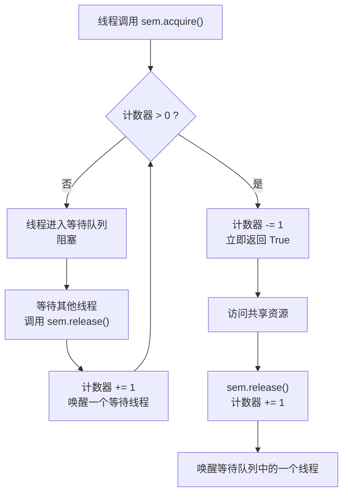
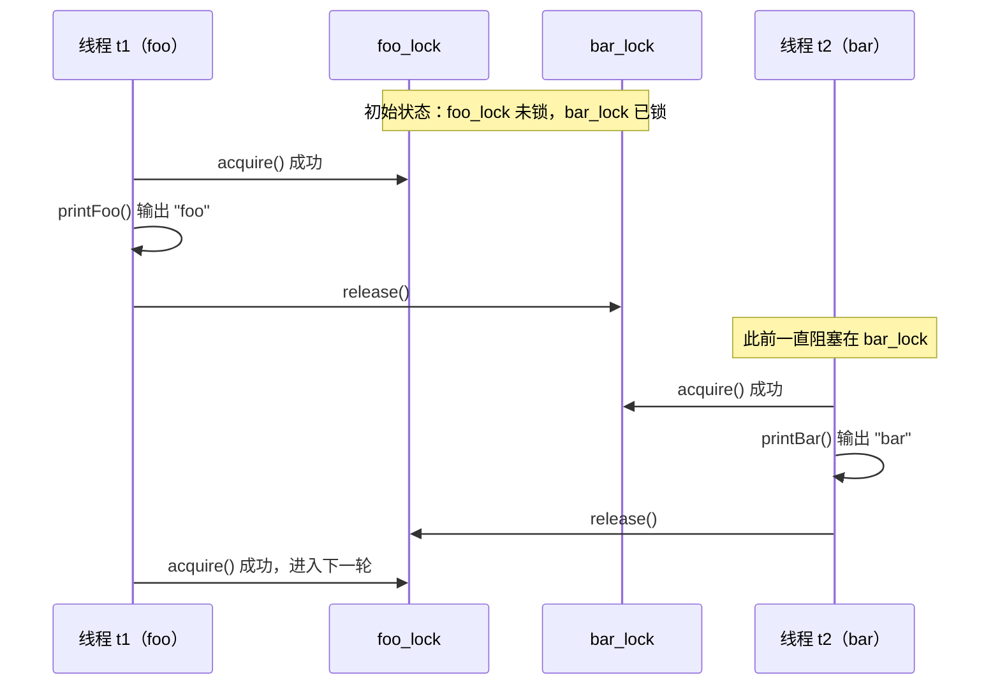

# Python threading.Semaphore 机制详解

> 本文回答四个问题：信号量到底是什么？它和 Lock / RLock 有什么区别？什么场景该用它？
> 以及新手最容易踩的三个坑分别是什么。文末附一个用两把锁让线程交替打印的完整案例。

## 缩写对照表

| 缩写 | 英文全称 | 中文 |
| --- | --- | --- |
| GIL | Global Interpreter Lock | 全局解释器锁 |
| P/V | Proberen / Verhogen（荷兰语） | 测试（减一）/ 增加（加一）操作 |
| API | Application Programming Interface | 应用程序接口 |
| OS | Operating System | 操作系统 |
| I/O | Input / Output | 输入 / 输出 |
| FIFO | First In First Out | 先进先出 |

## 一、为什么需要信号量

`threading.Lock`（互斥锁）解决的是「同一时刻只允许 1 个线程进入」的问题。但现实中大量场景需要的是
「同一时刻最多允许 N 个线程进入」：

- 数据库连接池最多 10 条连接，第 11 个请求必须排队；
- 调用第三方接口限流，每秒最多 5 个并发请求；
- 下载器最多开 3 个并发任务，避免打满带宽。

`Semaphore`（信号量，`threading.Semaphore`）就是把互斥锁的「1」推广成「N」的同步原语，
底层基于操作系统（OS）的信号量机制实现。

## 二、核心机制：一个计数器 + 两个操作

信号量内部维护一个整数计数器，初始化时设定（默认为 1），表示还能容纳多少个线程：

- **`acquire()`** —— 即 P 操作（Proberen，测试）：计数器减 1；若计数器已为 0，则线程阻塞等待；
- **`release()`** —— 即 V 操作（Verhogen，增加）：计数器加 1，并唤醒一个等待中的线程。



最小可运行示例——限制最多 3 个线程同时工作：

```python
import threading
import time

# 初始化信号量，允许最多 3 个线程同时访问
sem = threading.Semaphore(value=3)


def task():
    sem.acquire()          # 计数器 -1；若计数器为 0 则阻塞
    try:
        print(f"{threading.current_thread().name} 正在工作...")
        time.sleep(1)      # 模拟耗时的共享资源访问
    finally:
        sem.release()      # 计数器 +1，唤醒一个等待线程


threads = [threading.Thread(target=task) for _ in range(5)]
for t in threads:
    t.start()
for t in threads:
    t.join()
```

**`release()` 必须放在 `finally` 里**，否则临界区一旦抛异常，计数器永远漏掉一次归还，
后续线程会全部饿死。更省心的写法是用上下文管理器，由 `with` 保证配对：

```python
def task():
    with sem:              # 进入时 acquire()，离开时自动 release()
        print(f"{threading.current_thread().name} 正在工作...")
```

## 三、完整 API

```python
sem = threading.Semaphore(value=1)          # 初始计数器，默认 1

sem.acquire(blocking=True, timeout=None)    # 返回 bool
sem.release(n=1)                            # Python 3.9+ 支持一次归还多个
```

| 调用形式 | 行为 |
| --- | --- |
| `acquire()` | 阻塞直到拿到许可 |
| `acquire(blocking=False)` | 拿不到立即返回 `False`，绝不阻塞 |
| `acquire(timeout=5)` | 最多等 5 秒，超时返回 `False` |
| `with sem:` | 自动配对 `acquire()` / `release()` |

**返回值一定要判断**，否则超时后会带着「没拿到许可」的状态闯进临界区：

```python
if sem.acquire(timeout=5):
    try:
        do_work()
    finally:
        sem.release()
else:
    print("等待超时，本次放弃")   # 注意：这里绝不能调用 release()
```

## 四、与其他同步原语的对比

| 同步原语 | 允许并发数 | 可重入性 | 典型场景 |
| --- | --- | --- | --- |
| `Lock` | 1 | 不可重入 | 互斥访问共享变量 |
| `RLock` | 1 | 同一线程可重入 | 嵌套加锁、递归调用 |
| `Semaphore(n)` | n | 不可重入 | 连接池、并发限流 |
| `BoundedSemaphore(n)` | n | 不可重入 | 同上，且防止过度释放 |

## 五、三个常见陷阱

### 1. 过度释放会凭空放大并发数

`Semaphore` 不校验 `release()` 的次数，多释放一次，容量就永久多一个：

```python
sem = threading.Semaphore(1)
sem.release()          # 计数器变成 2，已经超出初始限制，且不会报错

# 改用 BoundedSemaphore，异常释放会立刻暴露
bounded = threading.BoundedSemaphore(1)
bounded.release()      # ValueError: Semaphore released too many times
```

**限流、连接池这类容量必须精确的场景，一律用 `BoundedSemaphore`。**
它只在 `release()` 时多做一次上界检查，其余行为完全一致。

### 2. 不可重入，同一线程二次 acquire 会自锁

```python
sem = threading.Semaphore(1)
sem.acquire()
sem.acquire()          # 死锁：计数器已为 0，而唯一能 release 的就是自己
```

需要递归加锁请用 `RLock`；信号量语义上代表「资源份数」，本就不该由同一线程重复占用。

### 3. 唤醒顺序不保证公平

等待队列的唤醒顺序依赖操作系统调度，**不保证先进先出（FIFO）**。
对顺序有要求的场景，需要自己在信号量之上再排队（例如配合 `queue.Queue`）。

另外要记住：信号量控制的是**并发线程数**，不是 CPU 并行度。
受全局解释器锁（GIL）限制，纯计算型任务开再多线程也不会更快——
信号量真正的用武之地是 I/O 密集型任务和外部资源配额。

## 六、典型应用场景

```python
# 场景一：限制并发请求数
MAX_CONCURRENCY = 5
limiter = threading.BoundedSemaphore(MAX_CONCURRENCY)


def fetch(url):
    with limiter:
        return requests.get(url)


# 场景二：固定容量的资源池
class ConnectionPool:
    def __init__(self, size):
        self._sem = threading.BoundedSemaphore(size)
        self._pool = [create_connection() for _ in range(size)]
        self._lock = threading.Lock()

    def acquire(self):
        self._sem.acquire()        # 先拿到「有空闲连接」的许可
        with self._lock:           # 再互斥地取出具体那条连接
            return self._pool.pop()

    def release(self, conn):
        with self._lock:
            self._pool.append(conn)
        self._sem.release()
```

注意场景二里两把锁的分工：**信号量负责数量，互斥锁负责数据结构本身的线程安全**，
两者职责不同，不能互相替代。

## 七、延伸案例：让两个线程交替打印

这是信号量思想的近亲——用两把初始状态相反的 `Lock` 做「接力棒」，
强制两个线程严格交替执行（LeetCode 1115 题的经典形态）。

先看一段有问题的代码：

```python
class FooBar:
    def __init__(self, n):
        self.n = n
        self.foo = threading.Lock()      # ❌ 属性名与下面的方法名冲突
        self.bar = threading.Lock()
        self.bar.acquire()

    def foo(self, printFoo) -> None:     # ❌ 被 self.foo 这个 Lock 覆盖
        for i in range(self.n):
            self.foo.acquire()
            printFoo()
            self.bar.release()

    def bar(self, printBar) -> None:
        for i in range(self.n):
            self.bar.aquire()            # ❌ 拼写错误：aquire → acquire
            printBar()
            self.foo.release()
```

运行报错 `TypeError: '_thread.lock' object is not callable`，原因有两个：

1. **属性名与方法名冲突**：`__init__` 里 `self.foo = threading.Lock()` 覆盖了同名方法，
   于是 `fb.foo` 拿到的是锁对象而不是方法，调用时自然报「不可调用」；
2. **拼写错误**：`aquire()` 应为 `acquire()`。

修正后：

```python
import threading


class FooBar:
    def __init__(self, n):
        self.n = n
        self.foo_lock = threading.Lock()   # 重命名，避开方法名
        self.bar_lock = threading.Lock()
        self.bar_lock.acquire()            # 先锁住 bar，保证 foo 先执行

    def foo(self, printFoo) -> None:
        for _ in range(self.n):
            self.foo_lock.acquire()
            printFoo()
            self.bar_lock.release()        # 把接力棒交给 bar

    def bar(self, printBar) -> None:
        for _ in range(self.n):
            self.bar_lock.acquire()
            printBar()
            self.foo_lock.release()        # 把接力棒交还 foo


fb = FooBar(3)
result = []
t1 = threading.Thread(target=fb.foo, args=[lambda: result.append("foo")])
t2 = threading.Thread(target=fb.bar, args=[lambda: result.append("bar")])
t1.start(); t2.start()
t1.join(); t2.join()
print("".join(result))     # foobarfoobarfoobar ✅
```

交替过程：



关键在于**初始时把 `bar_lock` 预先锁住**——它决定了谁先开跑。
两把锁互为对方的开关，任一时刻只有一个线程能前进，因此顺序严格交替。

## 小结

- 信号量 = 一个计数器 + `acquire()` / `release()` 两个操作，是「最多 N 个线程」的互斥锁推广；
- 容量必须精确时用 `BoundedSemaphore`，它能在过度释放的当场抛出 `ValueError`；
- `release()` 放进 `finally` 或直接用 `with sem:`，否则异常会永久吃掉许可；
- 它不可重入、不保证唤醒公平、也绕不开全局解释器锁（GIL）——真正的价值在 I/O 密集型限流与资源池。

一句话：**`Lock` 管的是「能不能进」，`Semaphore` 管的是「还能进几个」。**

---

相关笔记：[Python 切片 (Slice) 详解](./slice.md) · [算法题笔记：回文、Z 字形变换与合并有序链表](./algorithm-notes-palindrome-zigzag-merge-lists.md)
